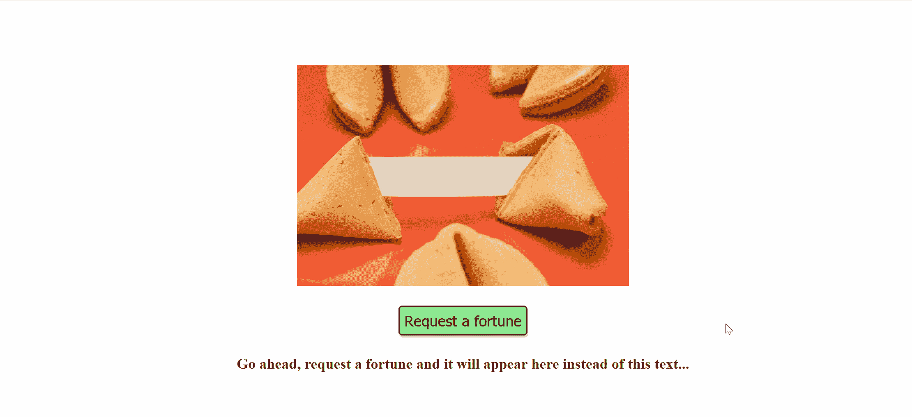
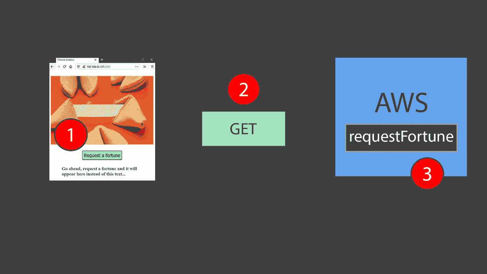
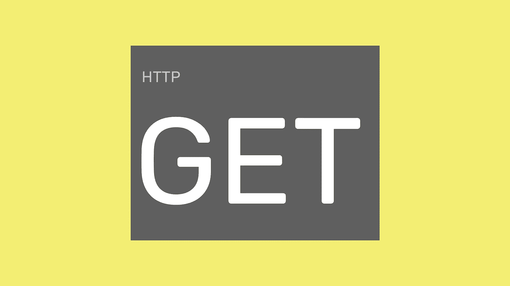
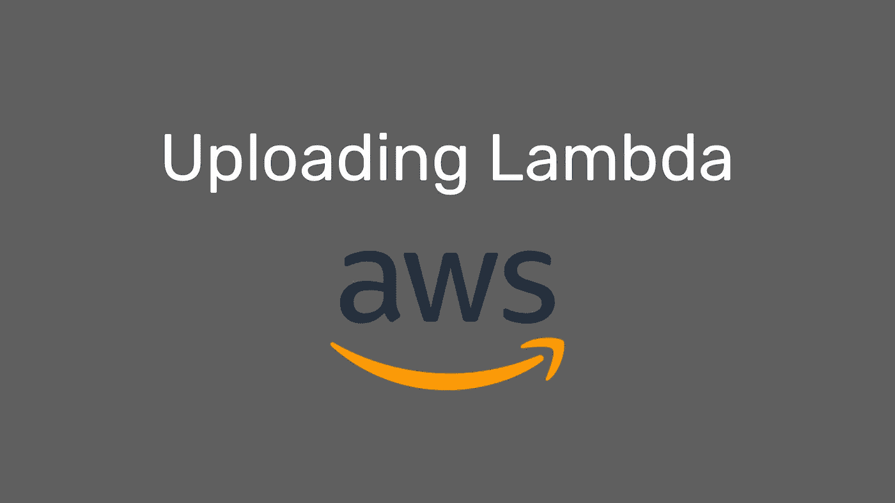
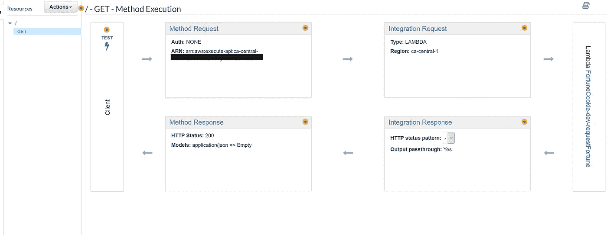
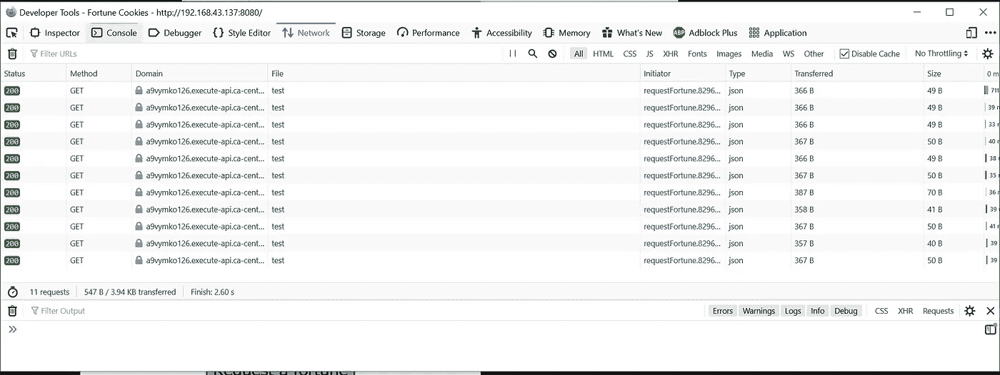

# 无服务器架构入门

> 原文：<https://javascript.plainenglish.io/getting-started-with-serverless-architectures-fortune-cookie-example-ae12071a7a79?source=collection_archive---------5----------------------->

## 幸运饼干的例子



为什么要为简单的请求租用整个服务器呢？对于大多数网站来说，传统的服务器通常 99%的时间都是空闲的，直到有人需要一些服务来执行。那么，为什么不具备只在需要时使用服务器的能力呢？这是为什么无服务器架构在最近的开发世界中被追求和推广的许多基本动机之一。

*   **按需处理:**你只需为处理你的请求的时间付费并使用服务器的资源。如果你的服务器每天只被利用了 500 毫秒，这就是你使用服务器的时间，这就是你被计费的时间。
*   **减少路由开销:**像 AWS 这样的无服务器提供商拥有 web 界面，可以非常详细地配置您的无服务器端点。这减少了您通常必须为自己设置的服务器执行的大量路由开销。
*   **强制模块化:**无服务器架构是一组可以被调用的小模块。这为您提供了一个可以很好伸缩的模块化开发架构。

了解了好处之后，让我们对我使用无服务器架构编写的幸运 cookie 示例进行案例研究。我将使用 AWS 作为无服务器架构提供商。

完成案例研究后，您应该对如何开发无服务器架构并将其连接到您的前端应用程序有了深入的了解。

*本案例研究假设您对 AWS 有所了解。我将尽力解释 AWS 无服务器架构设置的所有步骤。源代码可以在*[*http://github.com/ahmedsakr/fortune-cookie-serverless*](http://github.com/ahmedsakr/fortune-cookie-serverless)查看


# 什么是λ？

Lambdas 是无服务器架构的支柱。把 lambdas 看作是你的服务器(少)后端的独立部分。它们只是 JavaScript 程序，被执行来完成一个明确定义的任务。在我们的用例中，我为我的无服务器架构定义了 1 lambda，它在每次被调用时都会抛出不同的运气！

λ实现非常简单:它从一组预定义的运气中返回一个随机的运气。你的 lambdas 可以是执行复杂操作的非常复杂的程序:图像上传/下载、注册/登录用户、数据库操作等等。

# 整个画面



这个幸运 cookie 应用程序不仅仅显示它存储在客户端的字符串列表。它调用一个跨源 AWS lambda，请求它给它一笔财富，等待它做出响应，然后将响应显示给用户。

在深入了解所有 3 个阶段的细节之前，让我们先大致了解一下使用案例:

*   **用户点击“请求发财”。**调用 JavaScript 处理程序向 AWS API 网关端点发送 HTTP GET。
*   **API 网关调用** `**requestFortune**` **lambda(函数)**。这部分完全可以通过 AWS web 界面进行配置。
*   **Lambda 返回一笔财富给 JavaScript 处理程序。**JavaScript 处理程序接收响应体中的财富，并将其显示在页面上。

在实现无服务器架构的过程中，每一个环节都扮演着重要的角色。让我们研究一下我是如何连接每个阶段来完成无服务器架构的。



# **分派 HTTP 方法**

如果您曾经编写过与 express 服务器交互的前端应用程序，或者使用过 REST APIs，那么您应该对此很熟悉。从服务器迁移到无服务器架构时，设计方面没有任何变化。

下面是点击“请求财富”时调用的处理程序。

一个 **HTTP GET** 方法被发送到 AWS API 网关端点，该端点公开了我们前面讨论过的`requestFortune` lambda。一旦得到响应，它就用响应中收到的数据替换`fortune-text`元素！

这就完成了客户端显示运气的逻辑。现在我们需要讨论如何将 lambda 上传到 AWS，并从 API 网关执行，该网关提供一个端点，如上面的`fortune.js`所示。



# 将 lambda 上传到 AWS

我使用了`serverless` npm 包将你的 lambda 上传到 AWS。这是我用来配置幸运 cookie lambda 的 yml 文件。

这个 YAML 文件指定了指导 AWS 如何构建我的 CloudFormation 堆栈的某些配置。如果您对此不熟悉，不要担心，因为没有必要理解无服务器架构。你所要做的就是将 lambda 文件上传到 AWS 供我们调用。

# 创建和配置 API 网关

现在我们的 lambda 在 AWS 上可用了，我们希望向 API 网关端点公开它的用法，类似于上面`fortune.js`中使用的那个。

使用 API 网关接口，我创建了一个支持 GET 方法的 REST API。我链接了我新上传的 lambda，以便在 REST API 收到 GET 请求时调用。



完成后，我部署了我的 API，并收到了以下端点，HTTP GET 方法可以发送到该端点以调用 lambda:

```
[https://a9vymko126.execute-api.ca-central-1.amazonaws.com/test](https://a9vymko126.execute-api.ca-central-1.amazonaws.com/test)
```

# **就这样！我的项目现在没有服务器了！**

我的 lambda 现在是通过 API gateway 部署的，我有一个 REST API url，我可以发送 GET 请求来接收 fortune 作为响应。

有了这些设置，我现在:

*   只有当有人为了财富而调用 lambda 时才运行服务器
*   只为 lambda 执行所花费的时间付费。

这是在申请多种运气后的网络选项卡:



平均来说，我的应用程序只需要 **30 毫秒**就可以从 lambda 发送一个财富请求！这不是很棒吗？

最棒的是 AWS 每月为**提供 100 万次免费的 lambda 调用。**对于使用服务器资源的应用程序，您甚至不需要支付任何费用。