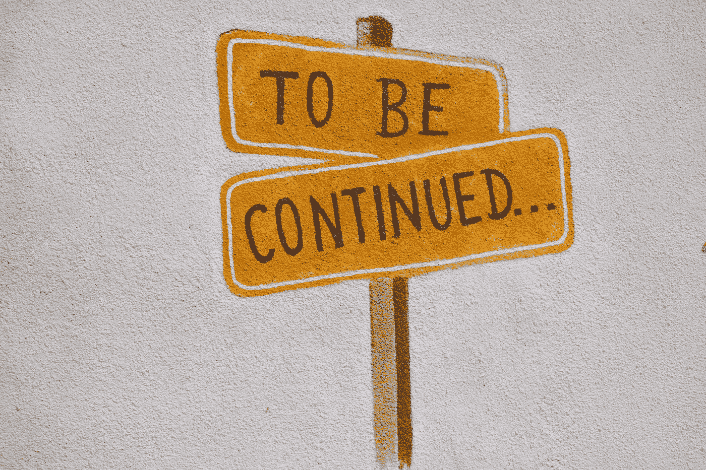

# Vue 故事书入门

> 原文：<https://javascript.plainenglish.io/getting-started-with-storybook-for-vue-3e9857cb535d?source=collection_archive---------6----------------------->



Photo by [Reuben Juarez](https://unsplash.com/@sunnystate?utm_source=medium&utm_medium=referral) on [Unsplash](https://unsplash.com?utm_source=medium&utm_medium=referral)

Storybook 是一个独立开发 UI 组件的开源工具。

它与 React、Vue、Angular 和其他框架一起工作。

在本文中，我们将看看如何将 Storybook 添加到我们的 Vue 项目中，并创建我们的组件。

# 安装故事书

为了开始使用 Storybook，我们用 Vue CLI 创建了一个新的 Vue 项目。

我们在一个空项目文件夹中运行`npx vue create .`来创建一个 Vue 项目。

然后我们按照说明来完成这个过程。

一旦我们这样做了，我们运行:

```
npx sb init
```

创建故事书项目。

一旦我们这样做了，我们运行:

```
npm run storybook
```

在我们的 Vue 项目文件夹中运行故事书。

然后，我们应该在浏览器中看到故事书屏幕。

它有一个链接到故事书组件的集合，我们可以预览它们。

# 故事

一旦我们有了故事书，我们就可以创作自己的故事了。

故事是我们可以在 Storybook 中预览的组件的集合。

预览包括可能的状态和道具，以及它们的样子。

它还包括文档。

在预览界面中，我们可以编辑道具，并在控件标签中预览它们的效果。

# 写故事

我们可以把故事放在`strotries`文件夹里。

首先，我们为我们的故事添加一个`.js`或`.ts`文件。

例如，我们可以创建一个按钮。

在`stories`文件夹中，我们添加一个`Button.vue`文件来创建我们的故事书组件:

```
<template>
  <button type="button" :class="classes" [@click](http://twitter.com/click)="onClick" :style="style">{{ label }}</button>
</template><script>
import './button.css';export default {
  name: 'my-button',props: {
    label: {
      type: String,
      required: true,
    },
    primary: {
      type: Boolean,
      default: false,
    },
    size: {
      type: String,
      default: 'medium',
      validator (value) {
        return ['small', 'medium', 'large'].includes(value);
      },
    },
    backgroundColor: {
      type: String,
    },
  }, computed: {
    classes() {
      return {
        'button': true,
        'button-primary': this.primary,
        [`button-${this.size}`]: true,
      };
    },
    style() {
      return {
        backgroundColor: this.backgroundColor,
      };
    },
  }, methods: {
    onClick() {
      this.$emit('onClick');
    },
  },
};
</script>
```

我们的组件需要一些道具来设计我们的按钮。

`label`为标签文本。

`primary`是一个用于改变按钮颜色的布尔值。

`size`是按钮的大小。

`backgroundColor`是背景色。

我们在同一个文件夹中导入了`button.css`，其中有:

```
.button {
  border-radius: 3em;
  cursor: pointer;
  display: inline-block;
}
.button-primary {
  color: white;
  background-color: lightblue;
}
.button-small {
  font-size: 12px;
}
.button-medium {
  font-size: 16px;
}
.button-large {
  font-size: 20px;
}
```

为了让它在 Storybook 中显示，我们必须添加一个包含以下代码的`Button.stories.js`文件:

```
import MyButton from './Button.vue';export default {
  title: 'Example/Button',
  component: MyButton,
  argTypes: {
    backgroundColor: { control: 'color' },
    size: { control: { type: 'select', options: ['small', 'medium', 'large'] } },
  },
};const Template = (args, { argTypes }) => ({
  props: Object.keys(argTypes),
  components: { MyButton },
  template: '<my-button @onClick="onClick" v-bind="$props" />',
});export const Primary = Template.bind({});
Primary.args = {
  primary: true,
  label: 'Button',
};export const Large = Template.bind({});
Large.args = {
  size: 'large',
  label: 'Button',
};export const Small = Template.bind({});
Small.args = {
  size: 'small',
  label: 'Button',
};
```

所有导出的项目将通过故事书显示。

默认导出有`title`、`component`和`argTypes`。

`title`是故事书里显示的标题。

`component`是我们要预览的组件。

`argTypes`定义我们可以设置来改变属性值的控件。

名称与道具名称相同。

我们还有将`props`设置为`argType`键的`Template`对象。

`components`同构件预览。

`template`为要预览的组件。

`v-bind='$props'`将所有道具传递给`my-button`组件。

然后底部的 3 个导出定义了我们想要显示按钮的预设样式。

我们传入一些`args`，它们将被设置为道具。

现在我们应该看到组件显示在侧边栏中。

# 结论

我们可以通过创建一个 Vue CLI 项目来创建一个故事书，然后向其中添加故事书代码。

然后我们可以添加我们的组件和故事。

喜欢这篇文章吗？如果有，通过 [**订阅我们的 YouTube 频道**](https://www.youtube.com/channel/UCtipWUghju290NWcn8jhyAw?sub_confirmation=true) **获取更多类似内容！**