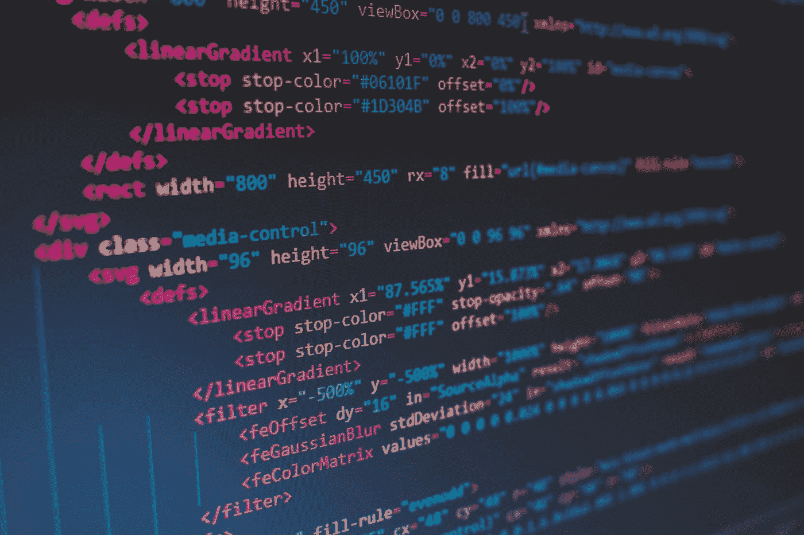

# React 中的样式化组件入门

> 原文：<https://javascript.plainenglish.io/getting-started-with-styled-components-in-react-4379cc2be39e?source=collection_archive---------5----------------------->

## 学习样式化组件的基础知识，以及如何在 React 应用程序中应用它们。



Photo by [Florian Olivo](https://unsplash.com/@florianolv?utm_source=medium&utm_medium=referral) on [Unsplash](https://unsplash.com?utm_source=medium&utm_medium=referral)

在本文中，我们将学习如何在 React 中使用样式化的组件。样式化组件是**“可视原语组件”**，它为样式化组件提供了灵活的方式。在深入这个主题之前，让我们先了解一下样式化组件，它只不过是 JS 中的一个 CSS，作为一个工具来弥合组件之间的差距，并以可重用的方式为组件提供样式化功能。

# 为什么是样式组件？

样式组件包括以下功能:

*   **自动厂商前缀**

标准的 CSS 属性和样式组件将在需要时添加供应商前缀。

*   **独特的班名**

样式化的组件相互独立，库将处理命名功能。

*   **淘汰死款式**

样式组件将自动移除未使用的样式。

# 装置

样式组件的安装很容易。你可以通过 CDN 或 NPM 安装。

```
npm i styled-components
```

# 开始

语法是样式化组件的第一件事，它在组件和样式之间架起了桥梁。它包含 JavaScript 模板。当您创建带有样式的 React 组件时，通常看起来像这样:

```
import styled from "styled-components";

// Styled component named StyledButton
const StyledButton = styled.button`
  background-color: black;
  font-size: 32px;
  color: white;
`;

function Component() {
  // Use it like any other component.
  return <StyledButton> Login </StyledButton>;
}
```

**StyledButton** 是样式化组件，用于将 HTML 按钮渲染为包含的样式。 **Styled** 是将 JavaScript 转换成 CSS 的内部方法。

```
button {
  background-color: black;
  font-size: 32px;
  color: white;
}

<button> Login </button>
```

# 基于道具的造型

样式化的组件是功能性的和动态的。让我们考虑有两种类型的按钮，一种是黑色背景，另一种是蓝色背景。我们不必创建两个单独的样式，相反，我们可以通过使用道具来设计两个样式。

```
import styled from "styled-components";

const StyledButton = styled.button`
  min-width: 200px;
  border: none;
  font-size: 18px;
  padding: 7px 10px;
  /* The resulting background color will be based on the bg props. */
  background-color: ${props => props.bg === "black" ? "black" : "blue";
`;

function Profile() {
  return (
    <div>
      <StyledButton bg="black">Button A</StyledButton>
      <StyledButton bg="blue">Button B</StyledButton>
    </div>
  )
}
```

**StyledButton** 是一个接受道具的 React 组件。我们可以使用值 **bg** prop 分配两种不同的背景颜色。

```
function Profile() {
  return (
    <>
      <StyledButton bg="black" type="button">
        Button A
      </StyledButton>
      <StyledButton bg="blue" type="submit" onClick={() => alert("clicked")}>
        Button B
      </StyledButton>
    </>
  );
}
```

属性是样式化组件的扩展语法。我们可以使用**属性构造器**来管理道具。它通常看起来像这样:

```
const StyledContainer = styled.section.attrs((props) => ({
  width: props.width || "100%",
  hasPadding: props.hasPadding || false,
}))`
  --container-padding: 20px;
  width: ${(props) => props.width}; // Falls back to 100%
  padding: ${(props) =>
    (props.hasPadding && "var(--container-padding)") || "none"};
`;
```

# 扩展样式

考虑一个构建登录页面的场景。您已经将容器设置为一定的最大宽度，以保持居中。**样式容器**看起来是这样的:

```
const StyledContainer = styled.section`
  max-width: 1024px;
  padding: 0 20px;
  margin: 0 auto;
`;
```

然后你需要添加一个小容器，两边填充 10 个像素，而不是 20 个像素，不要重复。

```
const StyledContainer = styled.section`
  max-width: 1024px;
  padding: 0 20px;
  margin: 0 auto;
`;

const StyledSmallContainer = styled.section`
  max-width: 1024px;
  padding: 0 10px;
  margin: 0 auto;
`;
```

在此之前，您需要创建一个 **StyledSmallContainer** ，并使用 spread 运算符重用带有继承属性的样式。

```
const StyledContainer = styled.section`
  max-width: 1024px;
  padding: 0 20px;
  margin: 0 auto;
`;

// Inherit StyledContainer in StyledSmallConatiner
const StyledSmallContainer = styled(StyledContainer)`
  padding: 0 10px;
`;

function Home() {
  return (
    <StyledContainer>
      <h1>The secret is to be happy</h1>
    </StyledContainer>
  );
}

function Contact() {
  return (
    <StyledSmallContainer>
      <h1>The road goes on and on</h1>
    </StyledSmallContainer>
  );
}
```

# 类 SCSS 语法

CSS 预处理器使样式化的组件支持类似 SCSS 的语法。

```
const StyledProfileCard = styled.div`
  border: 1px solid black;

  > .username {
    font-size: 20px;
    color: black;
    transition: 0.2s;

    &:hover {
      color: red;
    }

    + .dob {
      color: grey;
    }
  }
`;

function ProfileCard() {
  return (
    <StyledProfileCard>
      <h1 className="username">John Doe</h1>
      <p className="dob">
        Date: <span>12th October, 2013</span>
      </p>
      <p className="gender">Male</p>
    </StyledProfileCard>
  );
}
```

# 动画

样式组件包含有助于构建可重用组件的关键帧。主要优点是您可以在需要时导出并重复使用。

```
import styled, {keyframes} from "styled-components";

const slideIn = keyframes`
  from {
    opacity: 0;
  }

  to {
    opacity: 1;
  }
`;

const Toast = styled.div`
  animation: ${slideIn} 0.5s cubic-bezier(0.4, 0, 0.2, 1) both;
  border-radius: 5px;
  padding: 20px;
  position: fixed;
`;
```

# 全局样式

JS 中 CSS 的目标是样式的作用域。我们还可以使用全局样式来利用样式化的组件。它通常看起来像这样:

```
ReactDOM.render(
  <StyledApp>
    <App />
  </StyledApp>,
  document.getElementById("root")
);
```

我们可以使用 **createGlobalStyle** 来规范化 CSS。

```
import {createGlobalStyle} from "styled-components";

const GlobalStyle = createGlobalStyle`
    /* Your css reset here */
`;

// Use your GlobalStyle
function App() {
  return (
    <div>
      <GlobalStyle />
      <Routes />
    </div>
  );
}
```

createGlobalStyle 没有限定范围，它可以在 DOM 中的应用程序的任何位置呈现。它是一个概念，而不是一个结构。

```
import {createGlobalStyle} from "styled-components";

const GlobalStyle = createGlobalStyle`
  /* Your css reset here */

  .app-title {
    font-size: 40px;
  }
`;

const StyledNav = styled.nav`
    /* Your styles here */
`;

function Nav({children}) {
  return (
    <StyledNav>
      <GlobalStyle />
      {children}
    </StyledNav>
  );
}

function App() {
  return (
    <div>
      <Nav>
        <h1 className="app-title">STYLED COMPONENTS</h1>
      </Nav>
      <Main />
      <Footer />
    </div>
  );
}
```

**app-title** 没有被样式化，因为它是在 GlobalStyle 中设置的。它将在我们的组件渲染时注入。

# 结论

我希望你已经享受了很多，并开始知道如何使用反应风格的组件。React 和 React Native 中都提供了样式化组件。

感谢阅读！