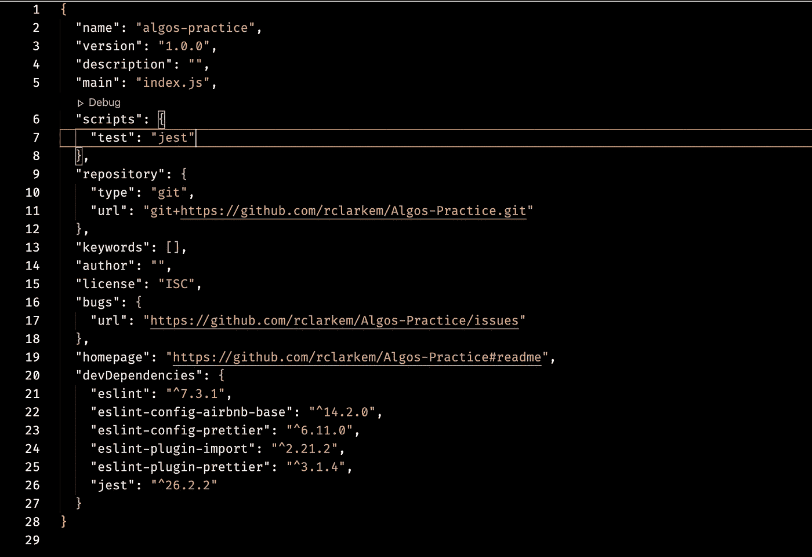
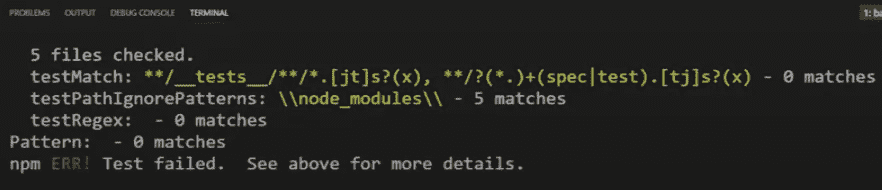
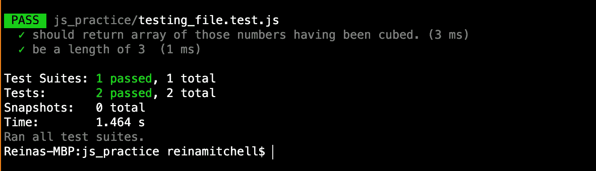
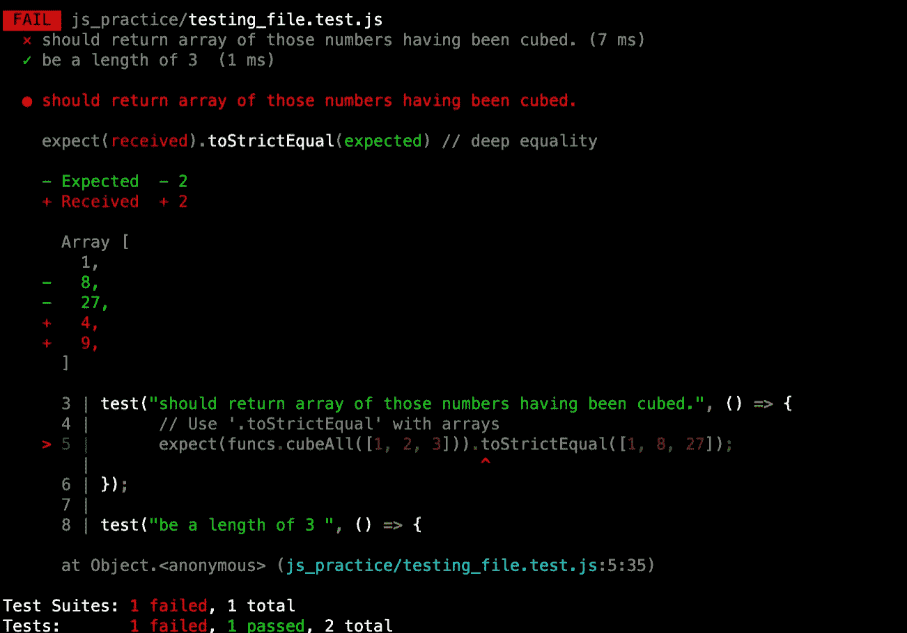

# JavaScript 测试入门

> 原文：<https://javascript.plainenglish.io/getting-started-with-testing-in-js-d7cca461740a?source=collection_archive---------12----------------------->

## 使用 Jest 库

Photo by [Rachel](https://unsplash.com/@noguidebook?utm_source=unsplash&utm_medium=referral&utm_content=creditCopyText) on [Unsplash](https://unsplash.com/s/photos/jester?utm_source=unsplash&utm_medium=referral&utm_content=creditCopyText)

# 介绍

我最近开始尝试向我的项目添加测试，以便了解它们是如何工作的，并确保我的函数返回它们应该返回的结果。在我学习如何实现测试的过程中，我发现了 Jest 测试框架。

# 入门指南

为了从 Jest 开始，您需要确保它作为一个依赖项保存在您的`package.json`中。如果您的项目还没有一个`package.json`文件，在您的终端运行:

`npm init -y`

这将用默认值初始化`package.json`。

从这里开始，我们要给我们的`package.json`添加一个笑话。在您的终端中，写下:

`npm i --save-dev jest`

我们将把它保存为 dev 依赖项，因为我们只在开发项目时使用它。

现在，进入 package.json 并在`"scripts"`下，在显示`"tests"`的地方，写入:`"jest"`。

要查看它是否工作，运行:`npm test`

您应该看到它显示“测试失败”，但这是因为我们没有编写任何测试或代码来测试。

## 让我们添加一些代码并编写我们的测试

我已经创建了一个名为`testing_file.js`的文件。在那个文件中，我有两个函数叫做`map`和`cubeAll`。

`map`是一个高阶函数。它需要两个参数:*一个数组*和一个*回调函数*。它将遍历数组中的每个元素，对每个元素应用一个回调函数。然后，它应该返回一个新数组，该数组的元素是将回调函数应用于输入数组中的每个元素的结果。

`cubeAll`取一个参数:*一个数组*。它调用内部的`map`函数。`cubeAll`将返回这些数字的立方数组。在文件的底部，我添加了导出，这样我就可以将它导入到包含我们测试的文件中。

然后我们将创建我们的测试文件。我们将名字定为`testing_file.test.js`。

我们将把函数导入到新的测试文件中。

现在我们想测试一下`cubeAll`功能是否正常工作。我们希望看到无论传入哪个数组，所有的元素都应该被立方化并产生一个新的数组。

Jest 有一个名为`test`的内置函数，它有两个参数:*测试描述*和*函数*。我们将在控制台中看到测试描述，它将让我们知道正在运行什么测试。

第二个参数是运行测试所调用的内容。在这个函数内部，我们将调用`cubeAll`函数及其参数。Jest 有一些关键字，我们将在名为`expect`和`.toStrictEqual`的函数中使用。由于我们使用的是数组，我将使用 `.toStrictEqual`，但是根据您测试的内容，这个匹配器可能会有所不同。查看 Jest 中的[文档](https://jestjs.io/)，看看你应该使用什么样的匹配器。

如果这看起来有点混乱，让我解释一下语法。

在第 3 行，第一个参数是我的字符串形式的测试描述。我的测试描述了我想让**原始数组的元素在一个新数组中返回，这些元素是**的立方。

第 5 行，我**期望**传递给参数`[1,2,3]`到**的`cubeAll`函数的结果严格等于**到`[1,8,27]`。

*(你可以输入任何你想要的参数。我只是碰巧写了* `*[1,2,3]*`)

我的第二个测试**期望**得到的数组**与**的长度为三。

现在我们将运行`npm test`。

如您所见，我的测试已经通过，我们可以在控制台中看到到底通过了哪些测试。

这个库的伟大之处在于，如果测试失败，它还会向您显示您的值。

我们可以清楚地看到哪些测试没有通过，绿色表示预期结果，红色表示实际结果。我的数组应该等于`[1,8,27]`，但是它返回了`[1,4,9]`。

# 为什么我们要写测试？

这种测试方式被称为单元测试。我们正在检查每一小段代码，原因是这样可以更容易地找到有问题的代码。最终，它使得编写更大代码库的过程更加高效。一开始可能会很耗时，但是现在有短期的痛苦总比写一堆代码然后不知道哪里出了问题要好。

例如，如果我不小心在`cubeAll`函数中写了`n * n`而不是`n ** 3`，那该怎么办？嗯，当我编写“应该返回这些数字的立方数组”的测试时，它会失败，然后我可以看到预期的结果与我实际收到的结果相比较。

现在你可能会问，难道我就不能`console.log`一下函数，看看我没有得到正确的结果吗？是的，你可以，但是如果你知道你的函数可能有多种情况呢？如果您在代码中不断地修改内容，但仍然想要相同的输出，该怎么办？换句话说，写出测试用例比必须不断地`console.log`每件事要容易得多。

此外，想想当你和其他开发人员一起工作的时候。如果我将这些代码发送给其他人，他们可以自动看到我到底在测试什么，并且每当他们对函数进行更改或添加一些东西时，测试也会在那里供他们使用。虽然你显然不能测试所有的东西，但它确实使编写更干净的代码变得更容易。

# 结论

我希望这是关于如何开始编写自己的测试的有用介绍。查看 [Jest 库](https://jestjs.io/docs/en/getting-started)了解更多信息。

## 简单英语的 JavaScript

喜欢这篇文章吗？如果有，通过 [**订阅获取更多类似内容解码，我们的 YouTube 频道**](https://www.youtube.com/channel/UCtipWUghju290NWcn8jhyAw) **！**