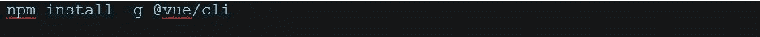
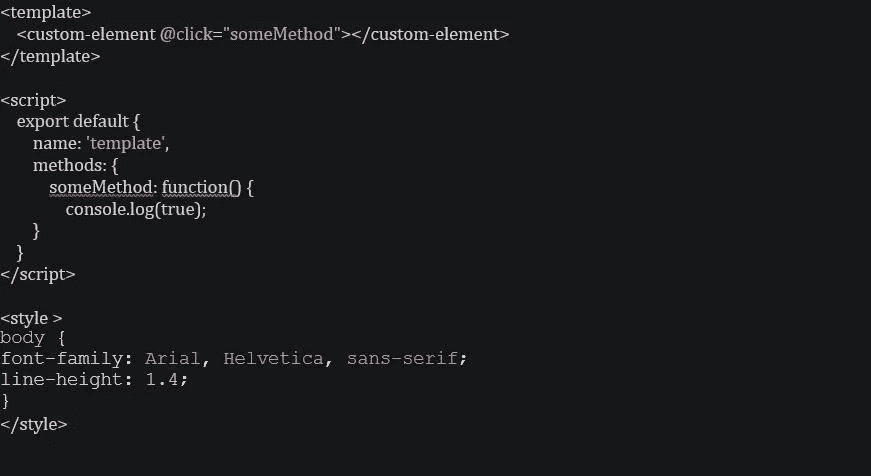
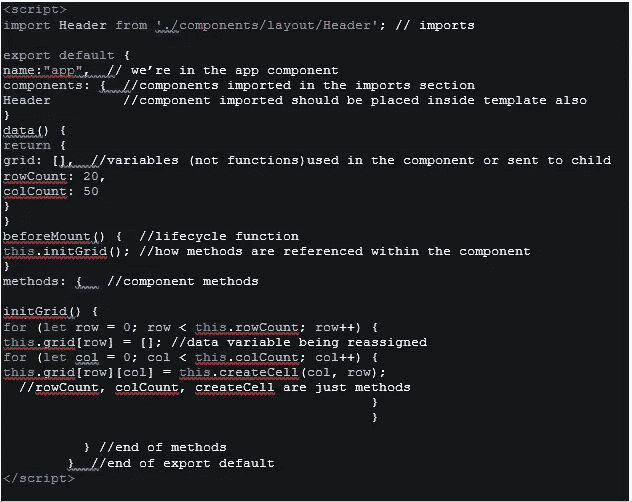
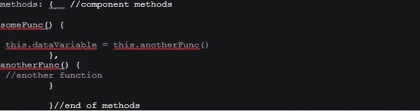
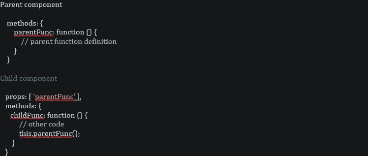
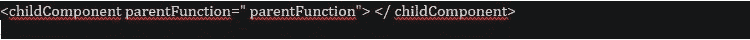
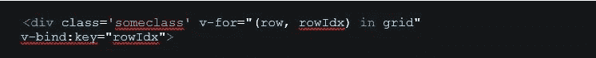
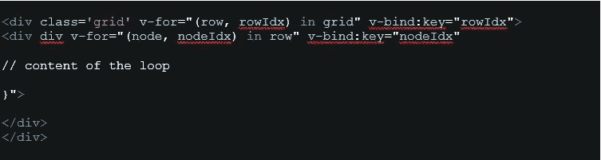
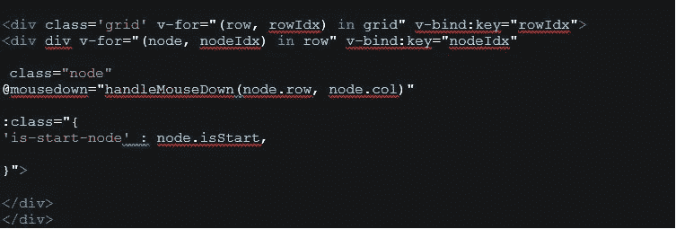
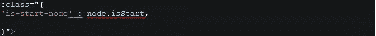

# Vue.js 入门——React 开发人员的视角

> 原文：<https://javascript.plainenglish.io/getting-started-with-vue-js-a-react-developers-perspective-e27c3d9d82d3?source=collection_archive---------3----------------------->

Photo by [Marius George Oprea](https://unsplash.com/@mariusoprea?utm_source=medium&utm_medium=referral) on [Unsplash](https://unsplash.com?utm_source=medium&utm_medium=referral)

当我在思考我应该为我在 Fullstack Academy 的 Stackathon 项目做些什么时，我意识到我已经对 Vue.js 好奇了一段时间。我在社交媒体上跟踪的几个独立的开发者指出，自从 Vue 诞生以来，它越来越受欢迎，最终，由于比 React 或 Angular 更低的学习障碍，它将主导市场。

考虑到这一点，我想亲自去看看。这似乎是一个合适的场合，也是一个尝试 Vue 为期四天的项目的好机会。由于我认为自己在 React 方面足够流利，我决定挑战自己，在四天内将 React 应用程序转换为 Vue 应用程序。事后看来，我希望我能给这个框架更多的时间来展示它真正的魔力和力量。

## **学习方法**

在进入编程世界之前，当我想学习一门外语的单词时，我会拉起一首我喜欢的歌曲的歌词，翻译成我很好奇的语言。虽然这种方法非常适合这个编码项目，但我意识到我在寻找编码解决方案，而没有对框架进行深入的探索。

通过阅读 Vue 文档和其他开发人员关于堆栈溢出的经验，我了解到，仅仅因为一个人可以编写在 Vue 组件中按预期工作的代码，并不一定意味着他正确地使用了这个框架的特性。确保代码不仅可以工作，而且是根据这个框架的特定对象的预期目的编写的，等等。，是有效使用框架的关键部分。

在 4 天内，我成功地将我的寻路算法可视化应用程序从 React 转换为 Vue，按时完成了我的 Stackathon 演示。但公平地说，我知道我没有给 Vue 一个真正的机会来赢得我，所以在这个项目结束时，我不能客观地说我更喜欢两者中的哪一个。

如果你在学习 Vue 或 React 之间犹豫不决，并且还没有开始学习任何一种语言来帮助你决定这两者之间的关系，你应该考虑在 JavaScript 和 HTML 之间你最喜欢哪种语言。React 非常依赖 JavaScript，Vue 更接近 HTML。

如果你还想进一步了解 Vue，请继续阅读。

## **设置工作环境**

为了开始使用 Vue，首先你需要下载 Vue 命令行界面。它是一个节点模块，因此您需要在计算机中安装节点。如果你没有安装 Node，你可以在这里下载。

如果您已经有了 Node，要安装 CLI，只需在终端中键入以下命令:

Vue 有一个 Chrome 扩展，类似于 React 和 Redux Dev tools 的 Chrome 扩展，它允许你很容易地看到你的 Vue 组件的结构。

此外，对于 Visual Studio 代码编辑器，我建议使用 Vetur 扩展，它将正确地突出显示 Vue 代码。

要通过 CLI 启动应用程序，请键入 **vue create【应用程序名称】**。

要运行应用程序，请在 CLI 中键入 **npm run serve** 。您的应用程序通常位于 localhost:8080 上。

项目中的所有 vue 文件都以扩展名. Vue 结尾。如果需要，JavaScript 文件或函数可以从项目的其他(非 Vue)部分导入并用于 Vue 组件。

## **单文件组件**

Vue 项目就像 React 一样，需要将文件分成 Vue 组件。Vue 组件也称为单个文件组件(SFC ),有三个部分，模板、脚本部分和样式部分，它们都在同一个组件中，如下所示:

模板部分是 React 中组件的渲染/返回部分。就像 React 一样，必须有一个 div 包装组件呈现的所有内容。

**脚本**部分由几个部分组成，它是所有 JavaScript 功能的来源。组件的脚本部分通常如下所示:

**脚本**部分总是有一个导出默认值，其中包含当前组件的名称。上例中的“ **components** ”对象，是脚本顶部导入的所有组件的列表。如示例所示，组件在脚本页面的顶部导入，并包含在模板部件的自结束组件标记中，类似于 React 组件。

## **组件数据**

包含在**数据**中的一切都由组件的状态组成。In Data 通常定义了需要传递给子组件或在同一组件内部的任何地方使用的内容。数据变量通过 **this** 关键字(this.dataVariable)在组件中的任何其他地方被引用。

因为数据部分充当组件的状态，所以应该没有函数，只有数据中的变量。如果需要通过函数获取数据，该函数将包含在**方法**中，并且数据变量在函数调用时会重新分配其值。

在 Vue 中，我们不像在 React with setState({})中那样通过特殊函数来修改状态。在 Vue 中，我们可以重新分配状态的值，就像任何其他变量的值一样。

**方法**，是组件内部为函数保留的对象，看起来是这样的:

在给定方法之外定义的其他方法，可以用 **this** 关键字在该方法内部引用。

**风格**部分是**也是**部分的组成部分。所有 CSS 或 SASS 代码都放在这里。样式可以是全局的，也可以仅限于组件。为了使样式只作用于组件，我们可以这样定义它: **<样式作用于>**

## **如何将方法作为道具传递给组件**

有几种方法可以将道具从父组件传递到子组件，如果您来自 React 背景，下面的方法会很熟悉:

同时，在父组件的模板部分我们应该有:

Vue 中的一个 for 循环是这样写的:

其中 row 和 rowId 是网格中使用的变量， **v-bind** 将变量 key 的值绑定到 rowIdx 值。

和两个嵌套循环，如下所示:

注意，for 循环是在 div 标记中定义的，就像它们是 html 的一部分一样。

在下面的例子中，我们调用组件的一个方法 **handleMouseDown** ，参数如下:“handleMouseDown(node.row，node.col)”

在下面一行中，当 node.isStart 为真时，我们有条件地给类分配名称“is-start-node”。

这就是 Vue 的快速入门。

请随意留下关于 Vue 或这篇文章的评论或反馈。

**帮助撰写本博客的链接:**

[Traversy Media Vue 速成班](https://www.youtube.com/watch?v=Wy9q22isx3U&t=1844s)

[从 React 切换到 Vue](https://dzone.com/articles/switching-from-react-to-vuejs)

[用 ES6 清理你的 Vue 代码](https://blog.logrocket.com/cleaning-up-your-vue-js-code-with-es6/)

[反应至 Vue 转换器示例](https://tools.w3cub.com/react-to-vue)