# GitHub 基础知识

> 原文：<https://javascript.plainenglish.io/github-basics-5eb93567c86d?source=collection_archive---------6----------------------->

Github 是很多开发者和公司使用的源代码控制资源。Github 允许开发人员无风险地修改他们的代码，它还允许开发人员在项目上合作。这确实是一个很好的资源，而且老实说，理解和使用 GitHub 的基础知识非常简单，尽管可能有点吓人。如果你通读了这篇文章，你就会理解 GitHub 的基础知识，包括初始化、克隆、推和拉请求。

# 初始化存储库

可以把存储库想象成 GitHub 中的一个文件夹。为了创建您的第一个存储库，您需要初始化 repo。您可以通过单击右上角的+号并单击“新建存储库”来轻松完成此操作。

之后，您将被引导到一个新页面，在那里您需要输入您的存储库名称，然后我总是建议用一个自述文件初始化存储库。在按下 Create Repository 之后，现在就可以将文件克隆到刚刚初始化的 repo 中了。

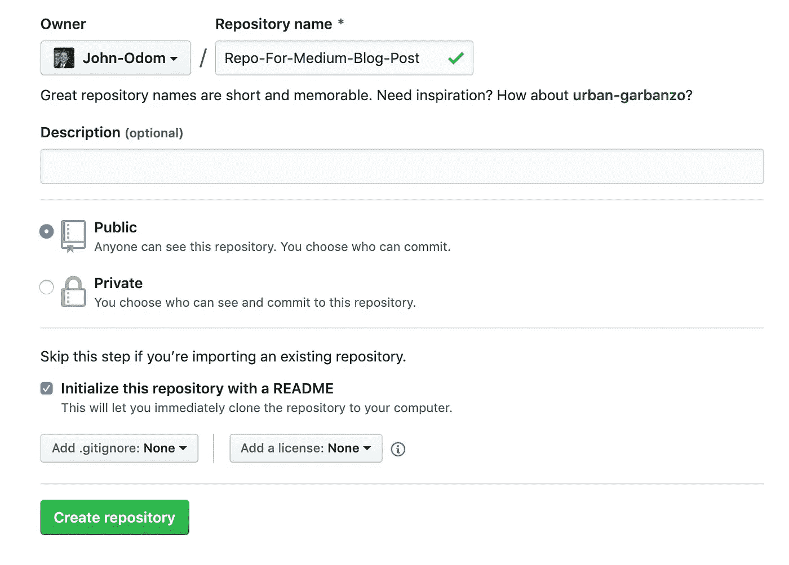

# 克隆存储库

现在您将克隆您的第一个 Repo，并且您将不得不使用可怕的命令行。我们要做的第一件事是将存储库 URL 复制到我们的命令行中。所以复制 Github 给你提供的网址。

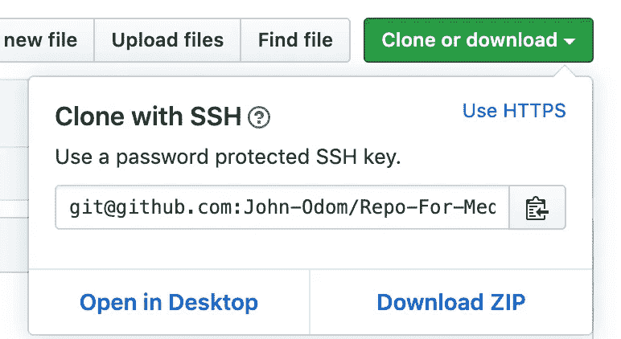

然后，在命令行中，您需要 cd 到您想要保存您的存储库的目录。然后，使用类似下图的“git clone <url github="" provides="">”命令将存储库克隆到您的计算机中。</url>

随后，您可以将刚刚克隆到计算机中的回购光盘放入计算机。记住，把 repo 想象成一个 GitHub 文件夹。这正是你所创建的，你的计算机中的一个文件夹，目前只有一个文件，自述文件，你已经初始化。

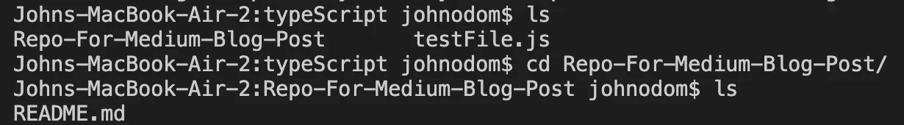

# 推送请求

现在我们可以创建一个文件，并将其添加到 GitHub！您会注意到，在上面的图像中，我有一个名为 testFile.js 的文件。我将复制该文件，并将其移动到新创建的 Repo 中。在您构建了一个或多个想要提交到 GitHub 帐户的文件之后，您需要运行几个命令:git add、git status、git commit 和 git push。

您可以做的第一件事是运行 git add <specify which="" file="" or="" files="" to="" add="">。因为我只想添加一个文件，所以我可以键入‘git add testFile.js ’,它只会将 test file . js 添加到提交队列中。我也可以输入“git add”这将把我的文件夹中的每个文件添加到提交队列中。接下来，输入“git status ”,检查您对 GitHub 库所做的更改的状态。</specify>

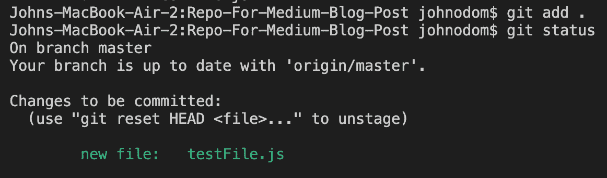

git status 命令将向您显示您当前将要提交的每个更改。接下来要做的事情是提交变更。您可以使用“git commit-m”Put a message on the changes you make " '命令轻松提交所有更改。由于这是我第一次向此 repo 添加文件，而不是自述文件，因此我将选择“git commit -m”首次提交博客演示。

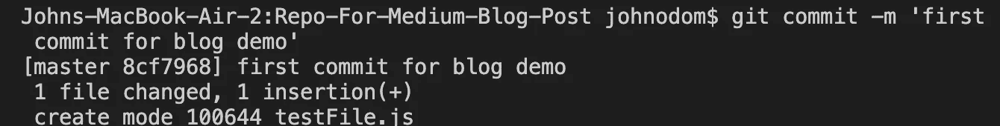

您会注意到一条消息，说我们已经用 1 个插入更改了 1 个文件。这意味着我已经添加了我的测试文件，它只有一行代码。如果您要提交大量的新文件，包含数千行代码，消息会告诉您同样多的内容。所以您已经提交了更改，但是还没有将它们推送到 GitHub。最后，您需要运行“git push”来将您的所有更改推送到 GitHub。我总是检查我的 GitHub 控制台以确保推送成功，但我有点偏执，因为收到的消息也会告诉你推送成功了。

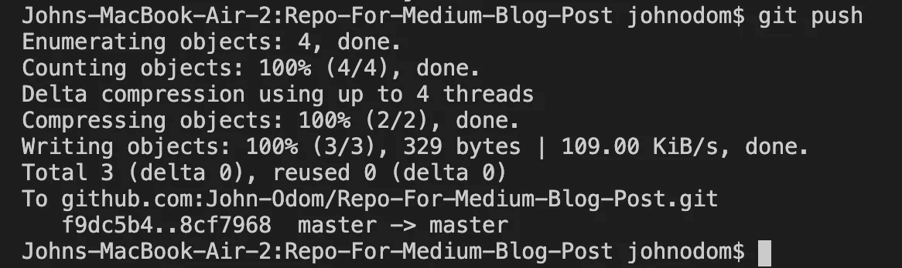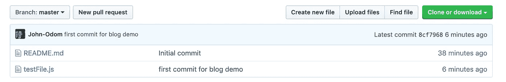

# 拉取请求

现在我们进入了 GitHub 如何让你与其他人合作的材料。在 GitHub 上与他人协作的基础是使用拉请求，对 repo 进行更新，然后将您的更改推回到主 repo。你马上就会明白我的意思。

为了发出一个拉请求，您首先需要创建一个新的分支，签出该分支，进行更改，然后将该分支添加到提交队列中。然后，一旦您对您的文件进行了更改，您将确保自从您开始处理它以来，您的合作者没有更改过主分支。最后，您可以将更改推回到主分支。我们走一遍吧！

首先，您需要创建一个分支。如下图所示，您可以通过键入“git branch <branch name="">”来完成此操作。**通常，您希望分支机构的名称能够具体说明您在该分支机构所做的工作！**如果其中一个合作者正在查看分支并看到‘分支 1’，这实际上什么也没告诉他们。如果你要在一个 JavaScript 文件中添加一个图片轮播，那么说“图片轮播”会更有效。对于这个演示，我只使用了 branch1。</branch>

接下来，您可以检查分支是否是使用‘git branch’命令创建的。

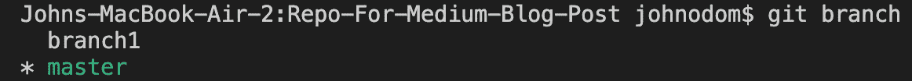

然后要切换到新的分支，只需使用‘git check out<branch name="">命令。</branch>

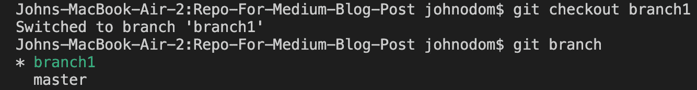

现在你可以在不影响主回购协议的情况下对回购协议进行一些修改。所以我在主分支之外的一个单独的分支上对文件做了一些小的修改。现在是时候将它们添加回主分支了。我们现在需要做的是确保我们保存文件，然后使用“git status”命令来确保我们在分支中有已更改的文件。

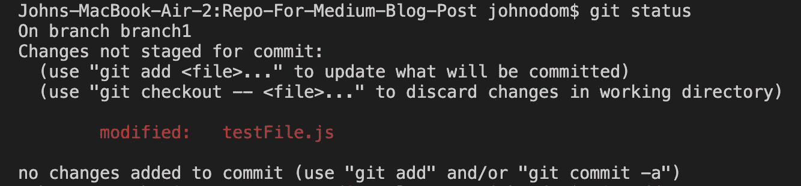

然后你可以运行‘git add<files changed="">’来添加一个被修改的文件或者‘git add’添加所有已更新的文件。</files>

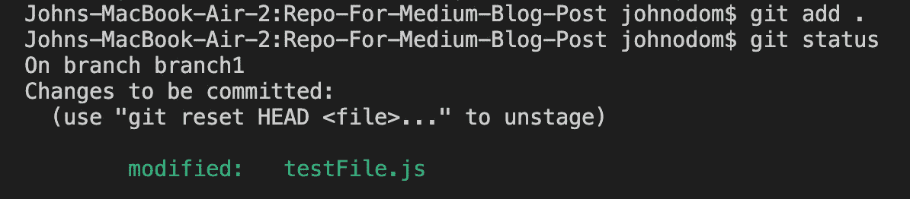

现在我们将代码提交给当前的分支。请记住，“添加额外的重要代码”不是一个好消息！**对于你更新的内容，你的 git 提交信息应该总是清晰而简洁。**在生产环境中，说一些类似“在狗展页面上添加图片轮播”的话就足够了。在 git 提交消息中说“添加了重要代码”是不够的。

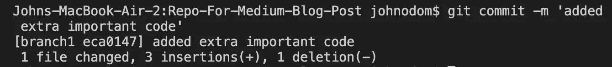

现在，您需要确保当您在另一个分支上工作时，您的合作者没有更新那个主分支。为此，您将切换回主分支(或您要合并的任何分支，因为您可以拥有分支中的分支……)并将主分支拉入您的回购中。

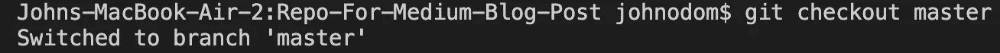

如果文件没有更改，您可以切换回您的另一个分支并推送文件。如果对文件进行了更改，您将需要进行合并冲突。我不打算详细讨论合并冲突，因为它们是“完全不同的”动物，但是如果你感兴趣，我强烈推荐你看看 Amy Dickens 的这篇中型博客。我该怎么做？解决合并冲突的三种方法

所以我们需要回到我们的工作分支，把它推向上游。由于没有任何更改，您可以或不必键入“git merge master”命令。我这样做是出于习惯，但打出来也无妨。

现在你需要把它推向上游。

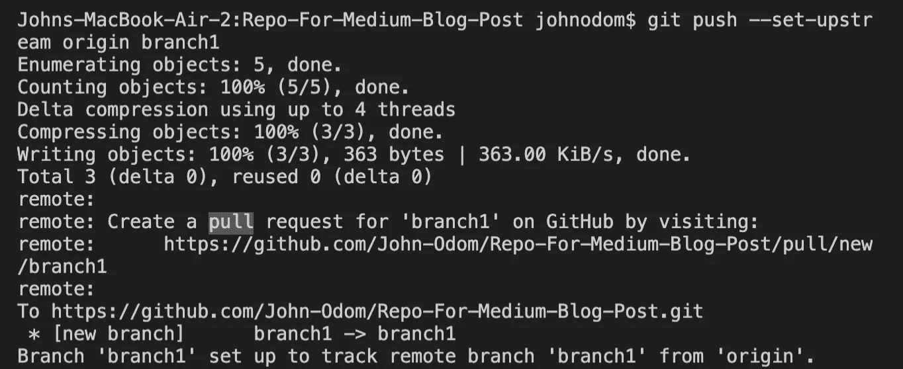

现在，您可以返回到 GitHub 页面，看到您已经创建了一个单独的分支，并将其推送到 repo。

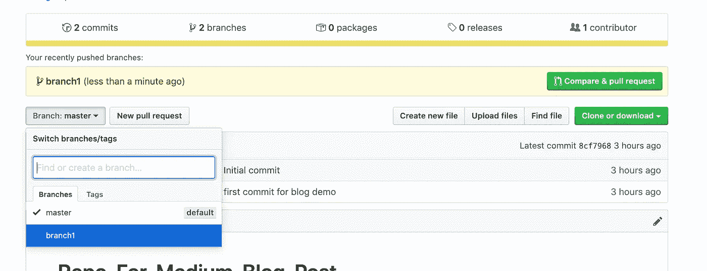

在上图中，您可以看到绿色按钮“比较和拉动请求”。要查看您所做的更改，请单击该按钮。如果您向下滚动一点，可以看到您所做的更改，然后您可以创建拉取请求。

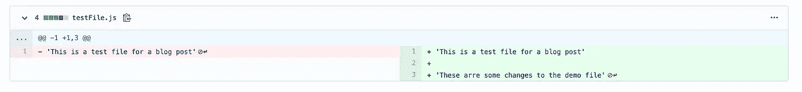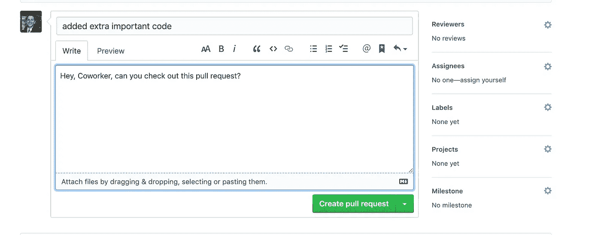

最后但并非最不重要的，你可以 marge 拉请求。如果你在一个生产环境中工作，合并你自己的拉请求通常不是一个好主意，你可能希望一个同事去做。

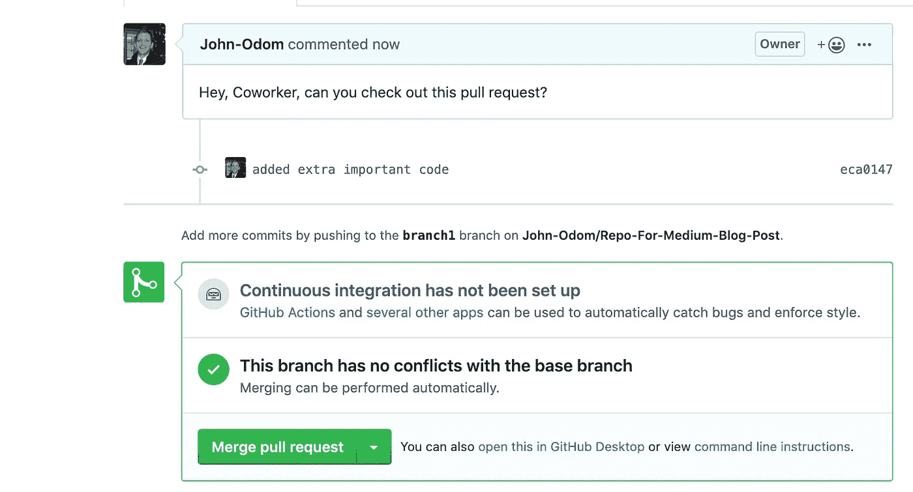

现在您可以看到我们在主分支上，对文件进行了更改。

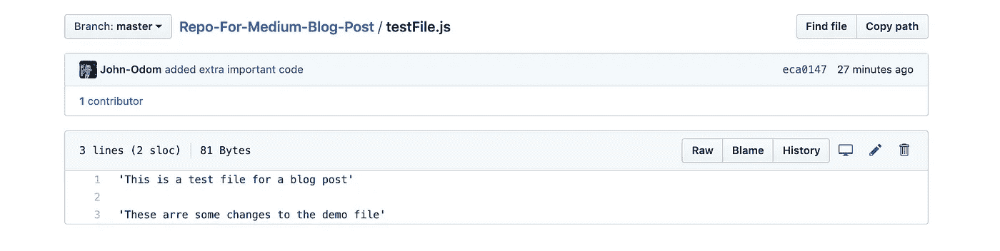

GitHub 基础到此为止！Git 是一个很棒的工具，GitHub 是我最喜欢的代码协作网站，尤其是如果你只是和朋友一起工作的话。公司会使用各种各样的源代码控制网站，有时是 GitHub，有时不是。感谢阅读！！