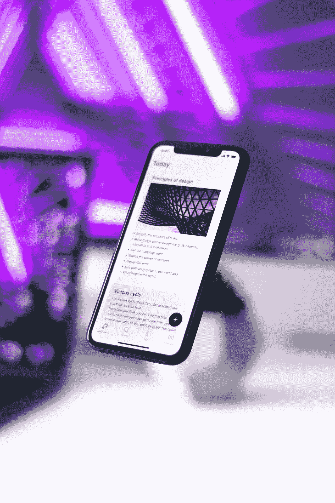
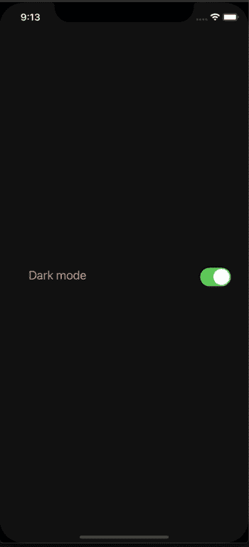

# React Native 中的全局主题化

> 原文：<https://javascript.plainenglish.io/global-theming-in-react-native-using-styled-components-redux-toolkit-typescript-7621d2bddbcb?source=collection_archive---------3----------------------->

## 使用样式化组件和 Redux 工具包—类型脚本



Photo by [Walling](https://unsplash.com/@walling?utm_source=medium&utm_medium=referral) on [Unsplash](https://unsplash.com?utm_source=medium&utm_medium=referral)

让我们面对现实吧，这些天，一个没有黑暗模式的应用程序属于一个博物馆；介于恐龙和轮子之间。作为消费者，我们希望看到酷的东西，作为开发者，我们希望构建酷的东西，黑暗模式很酷！幸运的是，有太多的图书馆可以帮助我们。在这篇文章中，我们将实现一个亮/暗模式特性，它将根据你的设备主题设置而改变。我们将用 Styled-Components 和 Redux Toolkit 在一个基本的 React 本地应用程序中构建它。

# 样式组件


Photo by [Juan Ordonez](https://unsplash.com/@nukanchik?utm_source=medium&utm_medium=referral) on [Unsplash](https://unsplash.com?utm_source=medium&utm_medium=referral)

我认为他们的主页总结了样式组件的特别之处:

“使用 ES6 和 CSS 的精华，轻松打造您的应用💅🏾”[https://styled-components.com](https://styled-components.com/)

像 RonSeal 一样，它完全按照罐头上说的做，它设计了可重用的组件！使用样式化组件，全局主题化很容易。

# Redux 工具包


Photo by [Aarón Blanco Tejedor](https://unsplash.com/@healing_photographer?utm_source=medium&utm_medium=referral) on [Unsplash](https://unsplash.com?utm_source=medium&utm_medium=referral)

如果像我一样，你讨厌样板文件，像躲避瘟疫一样躲避 Redux，并且害怕服用红色药丸；不用担心，RTK 是国家管理头痛的答案。它让你在幸福的无知中掉进兔子洞。我最喜欢 RTK 的一点就是它引擎盖下使用了 immer([**link**](https://github.com/immerjs/immer)**)**。如果你想了解更多，这里有一篇关于 RTK 的精彩文章，作者是 Ohans Emmanuel:[https://www.ohansemmanuel.com/what-is-redux-toolkit/](https://www.ohansemmanuel.com/what-is-redux-toolkit/)。

# 我们正在建造的东西

我们将从头开始构建这个项目，但是如果你愿意跟随，你可以在这里克隆我的回购。



# 我们走吧！

我们需要初始化我们的项目，并安装我们将要使用的所有包，所以从终端键入:

```
npx react-native init globalThemeExample  --template react-native-template-typescript && cd globalThemeExample && yarn add styled-components react-native-appearance @reduxjs/toolkit react-redux reselect && yarn add -D @types/react-redux @types/styled-components && npx react-native run-ios
```

这将使用 Typescript 模板创建一个新的基本 React 本机应用程序，导航到新的项目文件夹，添加依赖项和开发依赖项，然后在 iOS 模拟器上构建该应用程序。

# 1.全球主题

当我们制作一个“全球”主题时，我们需要全球背景。在项目文件夹中，创建一个名为 constants 的新文件夹，然后在新文件夹中创建一个名为 Theme.ts 的文件，并添加以下代码:

**常量/主题. ts**

```
export const dark = {
  background: '#121212',
  text: '#F5AD93',
};export const light = {
  background: '#ECF0F3',
  text: '#A40000',
};type Theme = {
  background: typeof dark.background | typeof light.background;
  text: typeof dark.text | typeof light.text;
};export interface CustomThemeProps {
  theme?: Theme;
}
```

如果你的屏幕是一块画布，那么这个文件就是调色板上的所有颜色，所有样式组件都可以访问它(一旦我们完成)。你可以随意扩展这个文件，但是对于这个例子，我们只需要一个背景和一个文本颜色。对于我们的文本，我们将选择一个漂亮的深糖果苹果红。请注意，黑暗模式的文本颜色有不同的十六进制代码；这是一种较浅的红色(去饱和)，使其更清晰，更容易阅读。

我们用深灰色作为背景色，因为你不应该用黑色作为黑暗模式。如果你想了解更多关于黑暗主题设计的信息，请查看材质界面[https://material.io/design/color/dark-theme.html](https://material.io/design/color/dark-theme.html)。此外，Eva 设计系统是寻找语义颜色的一个很好的资源，所以也值得一提——我用它来为我们的黑暗模式获得去饱和的文本颜色:【https://colors.eva.design/?utm_campaign=eva_colors】T2——主页——Eva _ Design 网站&UTM _ source = Eva _ Design&UTM _ medium = referral&UTM _ content = Eva _ website _ menu。

现在我们已经定义了我们的主题，让我们使用它。创建一个文件夹并将其命名为 components，在 components 中创建一个文件并将其命名为 ThemeManager.tsx，然后添加以下内容:

**components/theme manager . tsx**

```
import React from 'react';
import {StatusBar} from 'react-native';
import styled, {ThemeProvider} from 'styled-components/native';import {CustomThemeProps, light} from '../../constants/theme';const StyledThemeContainer = styled.KeyboardAvoidingView<CustomThemeProps>`
  flex: 1;
  align-items: center;
  justify-content: center;
  background: ${(props) => props.theme.background};
`;export const ThemeManager = ({children}: {
  children: React.reactNode
}) => {
  return (
    <ThemeProvider theme={light}>
      <StatusBar barStyle={'light-content'} />
      <StyledThemeContainer>{children}</StyledThemeContainer>
    </ThemeProvider>
  );
};
```

ThemeProvider 是向所有子组件提供主题设置的组件。由于我们提供了灯光主题，所有子组件都将呈现灯光主题的颜色。

要在整个应用程序中使用主题，我们需要将新的 ThemeManager 组件添加到 App.tsx 文件中:

**App.tsx**

```
import React from 'react';
import {SafeAreaView, Text} from 'react-native';
import {ThemeManager} from './components/ThemeManager';const App = () => {
  return (
      <ThemeManager>
        <SafeAreaView>
          <Text>Hello world</Text>
        </SafeAreaView>
      </ThemeManager>
  );
};export default App;
```

# 2.Redux 工具包

在项目文件夹中，创建一个名为“state”的文件夹，并添加以下两个文件:

**state/themeMode.slice.ts**

```
import {Appearance} from 'react-native';
import {createSlice} from '@reduxjs/toolkit';export enum ThemeModeEnum {
  LIGHT = 'light',
  DARK = 'dark',
}export const defaultMode = Appearance.getColorScheme() || ThemeModeEnum.LIGHT;const themeModeSlice = createSlice({
  name: 'themeMode',
  initialState: {
    themeMode: defaultMode as ThemeModeEnum,
  },
  reducers: {
    setThemeMode: (state, action: {payload: ThemeModeEnum}) => {
      state.themeMode = action.payload;
    },
  },
});export const {setThemeMode} = themeModeSlice.actions;export default themeModeSlice.reducer;
```

我们使用“外观”来获取设备当前的主题设置，稍后当我们编辑主题管理器文件时需要用到它。

**状态/索引. ts**

```
import {configureStore} from '@reduxjs/toolkit';
import themeModeReducer from './themeMode.slice';export const store = configureStore({
  reducer: {
    themeMode: themeModeReducer,
  },
});export type AppDispatch = typeof store.dispatch;
export type RootState = ReturnType<typeof store.getState>;
```

这是我们将减速器添加到商店的地方，在我们的例子中，只是 themeModeReducer。要改变我们主题的状态，我们需要知道我们从什么地方改变它(当前状态)。为此，我们将使用来自重新选择的 createSelector:

**选择器/getThemeMode.ts**

```
import {createSelector} from 'reselect';
import {RootState} from '../state';export const getThemeMode = createSelector(
  (state: RootState) => state,
  (state) => state.themeMode,
);
```

现在我们可以检索主题的当前状态，但是我们还需要更新状态。为此，我们将创建自己的定制调度挂钩:

**Utils/use app dispatch . ts**

```
import {useDispatch} from 'react-redux';
import {AppDispatch} from '../state';export const useAppDispatch = () => useDispatch<AppDispatch>();
```

最后，我们需要将我们的 reducer 添加到 App 文件中:

**App.tsx**

```
import React from 'react';
import {SafeAreaView, Text} from 'react-native';
import {Provider} from 'react-redux';import {ThemeManager} from './components/ThemeManager';
import {store} from './state';const App = () => (
  <Provider store={store}>
    <ThemeManager>
      <SafeAreaView>
        <Text>Hello world</Text>
      </SafeAreaView>
    </ThemeManager>
  </Provider>
);export default App;
```

# 3.主题模式开关

为了让我们的开关组件可以控制主题，我们需要返回到我们的主题管理器文件，并将其更改为:

**components/theme manager . tsx**

```
import React from 'react';
import {StatusBar} from 'react-native';
import styled, {ThemeProvider} from 'styled-components/native';
import {useSelector} from 'react-redux';import {CustomThemeProps, light, dark} from '../../constants/theme';
import {getThemeMode} from '../../selectors/getThemeMode';
import {ThemeModeEnum} from '../../state/themeMode.slice';const StyledThemeContainer = styled.KeyboardAvoidingView<CustomThemeProps>`
  flex: 1;
  align-items: center;
  justify-content: center;
  background: ${(props) => props.theme.background};
`;const {DARK, LIGHT} = ThemeModeEnum;export const ThemeManager = ({children}: {children: React.ReactNode}) => {const {themeMode} = useSelector(getThemeMode);const providedTheme = () => {
    if (themeMode === DARK) {
      return dark;
    }
    if (themeMode === LIGHT) {
      return light;
    }
  };
  return (
    <ThemeProvider theme={providedTheme}>
      <StatusBar
        barStyle={themeMode === DARK ? 'light-content' : 'dark-content'}
      />
      <StyledThemeContainer>{children}</StyledThemeContainer>
    </ThemeProvider>
  );
```

现在是时候构建我们的交换机了:

**components/theme mode switch . tsx**

```
import React from 'react';
import {Switch} from 'react-native';
import {useSelector} from 'react-redux';import {getThemeMode} from '../../selectors/getThemeMode';
import {useAppDispatch} from '../../utils/useAppDispatch';
import {ThemeModeEnum, setThemeMode} from '../../state/themeMode.slice';
import {
  StyledSwitchWrapper,
  StyledThemeContainer,
  StyledToggleText,
} from './ThemeModeSwitch.styles';const {LIGHT, DARK} = ThemeModeEnum;export const ThemeModeSwitch = () => {
  const {themeMode} = useSelector(getThemeMode);
  const dispatch = useAppDispatch();return (
    <StyledThemeContainer>
      <StyledSwitchWrapper>
        <StyledToggleText>Dark mode</StyledToggleText>
        <Switch
          value={themeMode === DARK}
          onValueChange={(value) => {
            dispatch(setThemeMode(value ? DARK : LIGHT));
          }}
        />
      </StyledSwitchWrapper>
    </StyledThemeContainer>
  );
};
```

**components/thememodeswitch . styles . ts**

```
import styled from 'styled-components/native';
import {CustomThemeProps} from '../../constants/theme';export const StyledThemeContainer = styled.View`
  flex: 1;
  flex-direction: row;
  align-items: center;
  justify-content: center;
  width: 90%;
  padding: 30px 0;
`;export const StyledSwitchWrapper = styled.View`
  flex-direction: row;
  justify-content: space-between;
  width: 90%;
`;export const StyledToggleText = styled.Text<CustomThemeProps>`
  color: ${(props) => props.theme.text};
  font-size: 20px;
```

让我们将新的开关添加到我们的应用程序文件中，并进行测试！

**App.tsx**

```
import React from 'react';
import {SafeAreaView} from 'react-native';
import {Provider} from 'react-redux';import {ThemeManager} from './components/ThemeManager';
import {store} from './state';
import {ThemeModeSwitch} from './components/ThemeModeSwitch';const App = () => (
  <Provider store={store}>
    <ThemeManager>
      <SafeAreaView>
        <ThemeModeSwitch />
      </SafeAreaView>
    </ThemeManager>
  </Provider>
);export default App;
```

# 4.响应主题

现在剩下要做的就是让我们的主题响应设备的主题设置。

**ThemeManager.tsx**

```
import React, {useEffect} from 'react';
import {StatusBar, Appearance} from 'react-native';
import styled, {ThemeProvider} from 'styled-components/native';
import {useSelector} from 'react-redux';import {CustomThemeProps, light, dark} from '../../constants/theme';
import {getThemeMode} from '../../selectors/getThemeMode';
import {ThemeModeEnum, setThemeMode} from '../../state/themeMode.slice';
import {useAppDispatch} from '../../utils/useAppDispatch';const StyledThemeContainer = styled.KeyboardAvoidingView<CustomThemeProps>`
  flex: 1;
  align-items: center;
  justify-content: center;
  background: ${(props) => props.theme.background};
`;const {DARK, LIGHT} = ThemeModeEnum;export const ThemeManager = ({children}: {children: React.ReactNode}) => {const {themeMode} = useSelector(getThemeMode);
  const dispatch = useAppDispatch();const providedTheme = () => {
    if (themeMode === DARK) {
      return dark;
    }
    if (themeMode === LIGHT) {
      return light;
    }
  };useEffect(() => {
    const subscription = Appearance.addChangeListener(({colorScheme}) => {
      dispatch(setThemeMode(colorScheme as ThemeModeEnum));
    });
    return () => subscription.remove();
  }, [dispatch]);
  return (
    <ThemeProvider theme={providedTheme}>
      <StatusBar
        barStyle={themeMode === DARK ? 'light-content' : 'dark-content'}
      />
      <StyledThemeContainer>{children}</StyledThemeContainer>
    </ThemeProvider>
  );
};
```

瞧啊。关闭你的应用程序，更改你的设备主题设置，回到你的应用程序，惊叹你的才华！