# 在 JavaScript 中用模数兜圈子

> 原文：<https://javascript.plainenglish.io/going-around-in-circles-with-modulus-in-javascript-9e4534ac47b1?source=collection_archive---------1----------------------->

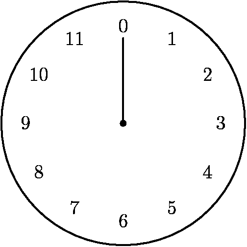

今天我们将通过一个小例子简要讨论代数和编码之间的关系。具体来说，我将抱怨 JavaScript 中的模数运算，并试图让您相信这个小家伙的默认行为:

> %

毫无意义，并告诉你如何才能避开它的怪异。

但是首先，一个非常简短的，非常随意的代数介绍。你可以认为代数是数系的研究。小学代数通常涉及通过检查数字运算( **+、-、*、/** 等)的性质来求解未知值的方程。大多数学生看几个有不同运算的数系，尽管学生经常在不同种类的数系之间跳来跳去，却没有真正意识到这一点。

让我们区分两个，一个我们将使用，一个用于对比。第一个我们称之为整数运算。它拥有我们所知道和喜爱的所有整数——所有自然数、自然数的负数和零。它也有一些运算，即加法、乘法和除法。我们要看的第二个是有理数系统，它有所有的整数和所有的整数比，还有和以前一样的加法和乘法。

它们是非常不同的系统，因为我们正在处理的基本数字组具有非常不同的属性。请注意，在这两个系统中，我都没有包括减法，也没有在理性算术中包括除法。那是因为我们并不真的需要它们。在这两个系统中，加法是*可逆的*——对于我们系统中的任何一个数，都有另一个数(它的负数)，我们可以把它加到零上。从另一个整数或有理数中减去任何一个整数或有理数与将前者的倒数加到后者上是相同的运算，总有办法将减法重新表述为加法。

(这些是更一般的结构的例子，称为双半群(自然数)、环(整数)和域(有理数)。这些例子抓住了一些核心思想，但是如果你感兴趣的话，你可以看看这篇文章的底部，以便进一步阅读！)

请注意，在自然数的算术中，情况并非如此，减法与加法确实不同，因为你可以将任意两个自然数相加并获得另一个自然数，但是像**1–2**这样的表达式是未定义的，因为没有任何小于零的自然数。

同理，整数运算有除法，但有理数没有。忽略零，对于任何一个有理数，你都可以用另一个有理数乘以它得到一(零和一分别扮演加法和乘法的类似角色)。如上所述，您可以将有理数中的任何除法重写为一个数乘以另一个数的乘法倒数。你*不能*在整数算术中这样做，一个整数乘以另一个整数永远是一个整数，但是像 **5/2** 这样的表达式在这个系统中是没有定义的。

像自然数的减法和整数的除法这样的运算扩展了一个更简单的系统。你可以想象它们根本不是真正的运算，它们是包含未知数的繁琐表达式的简写。在自然语言中，如果你真的很严格，你不会写出像**3–2**这样的表达式，你会写出像 **2+x=3** 这样的未知数的方程。同样，整数运算表达式 **6/2** 实际上意味着类似于 **2*x=6** 的东西，但是我们通常省略这些东西。

# 定义模数

模数是一种运算，它扩展了整数运算，允许我们在任何地方一致地定义除法。你不能仅仅用它们的倒数来替换操作数，或者用一个未知数来得出一个方程，以理解整数中的表达式，比如 **5/2** 。如果没有其他的工具，这个表达式就是不确定的。

为了给这个表达式一个一致的定义，我们求助于两个未知数*中的一个等式，我们称之为*商* ( **q** ) 和*余数* ( **r** ) *。*如果我们有两个整数， **a** 和 **b** ，并且我们想讨论用 **a** 除以 **b** 的问题，我们将在本文中使用中心方程。是这样的:*

> **b*q + r = a**

这值得稍微分解一下。我们要赋值的表达式是 **a/b** 。也就是 a 分成 b 很多部分。假设 r 是零。那么这个方程就是 **b*q = a** 。这是乘法的逆运算，我们可以除以两边得到 **q = a/b** 。现在，假设 **b** 没有平分 **a** 。那么没有整数 **q** 可以解方程 **b*q = a** 。但是，我们可以选择一个 **q** 尽可能接近 **a** ，再多加一点来弥补差额。我们将把表达式 **a/b** 的值赋给 **q** 。那么模数 a%b 就是值 r。

这个问题是，我们对 q 和 r 有很多解。例如，如果我们想计算 5/2，我们可以得到 **q=1，r=3** 或 **q=2，r=1** 或 **q=60，r=-115** 。这不是一个特别有用的答案，因为我们的运算符号并不评估任何具体的东西，它也没有反映出除法的思想，即把 a 分成 b 部分。事实上，我们可以为 q 选择任何我们想要的答案，并找到满足我们想要求解的方程的 r。

为了解决这个问题，我们添加了一个额外的约束。我们希望商接近于理性除法所能给出的值(以反映除法应该是什么的想法)，所以我们不允许 **r** 大于 **b** ，排除像上面第一个这样愚蠢的答案。我们还说 **r** 不能小于零，不包括上面更傻的第三个答案。这两个约束足以保证我们的**"/**"**"**对于任何一个 **a** 和 **b** (只要 **b** 不为零，那就是另一天的话题)都会评估为恰好一个答案。

霍雷。现在我们可以对整数进行除法运算，而不必担心处理有理数。这一点非常重要，因为无论如何计算机只能处理整数。

# JavaScript 中的模数

好极了，世界上一切都很好，我们可以安全地计算工作，只有在整数！

要在 JavaScript 中做到这一点，我们可以使用**" "**求模数，使用“Math.floor”求整数除法。看看吧！

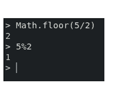

酷！

酷！

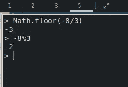

…

为什么是 JavaScript，为什么。

让我们看看这里的 **3*-3** ，也就是 **-9** 。非常接近，比目标数字少，这就说得通了。但是 **-9 + -2** …那就是 **-11** ！WTH。好吧，也许我们可以把这个标志放下，然后，9 + 2 = -7。没有。

这下全坏了！我们有一个很好的一致的处理整数的系统。

这是怎么回事？

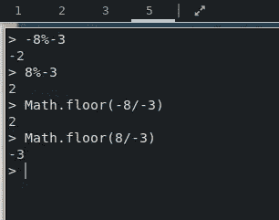

…

等等什么？

JavaScript 太疯狂了。它保留了左边的符号。这没有任何意义。

你现在可能会想，“得了吧，伙计，这完全是学究气”，虽然有点，但不是真的。这是一个实际问题，我现在就来说明。

假设你有一个未知长度的数组，但是你想像循环一样移动它。你可以初始化一个指针，然后像往常一样移动它，当你想指向某个东西的时候，就用数组长度来修改你的指针。假设你有这样一个音阶的音符:

> const Scale = ["C "，" D "，" E "，" F "，" G "，" A "，" B "]；

现在我们想程序化地产生一段旋律。我们可以通过给指针加上整数值来移动指针。现在，指针的模数告诉我们在音阶中的哪个音，商告诉我们在哪个八度！非常酷，非常一致，非常有用的结构。

现在，让我们用这个音阶做一个随机的旋律。我们将把所有的东西放在一个文件中，当我们运行它时，它将会弹出随机生成的旋律！

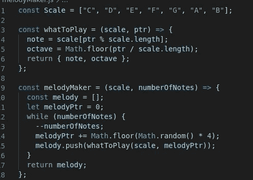

让我们试一个简单音阶中的 12 音符旋律。

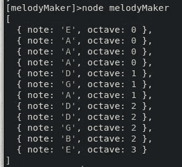

整洁！

但这只是提升！如果我们希望能够上下移动标尺呢？

让我们做一些改变

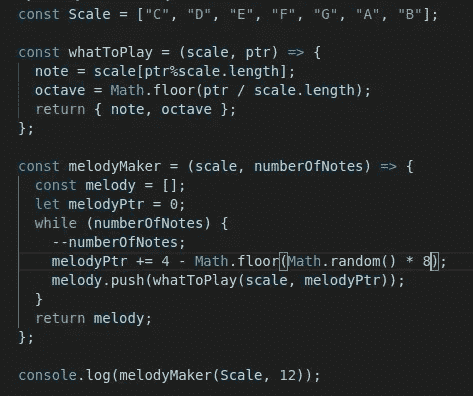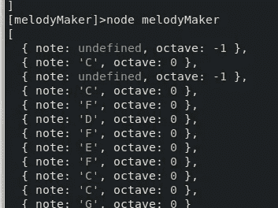

哼。那没用。哦耶！因为负数不会在数组中给我们一个条目！我们可以只计算绝对值，就像这样:

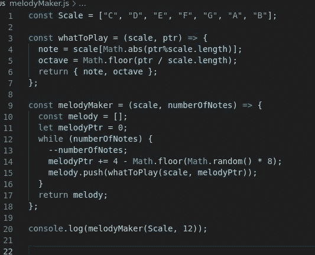

但是我们还有一个问题！我们设置的程序一次最多只能移动 4 个音调。这个向下跳了一个八度！当我们从八度 0 移动到八度-1 时，我们以一种意想不到的方式跳过数组。

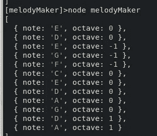

在这个例子中，这是一个非常轻微的错误行为，但是程序没有产生预期的行为。由模数 is JavaScript 产生的负值使得推理我们的程序和预测它将要做什么变得更加困难。当然，我们可以使 0 倍频程成为允许的最低倍频程，并禁止我们的指针低于零，但在更复杂的应用程序中，这可能是不可行的，我们可能不想或不能固定绝对零点。更糟糕的是，如果我们没有提前考虑这一点，我们可能会引入非常恼人的错误，这些错误非常难以追踪，因为 JavaScript 是如何滥用模运算的。

幸运的是，解决这个问题并不太难。我们就做一个小小的辅助函数。

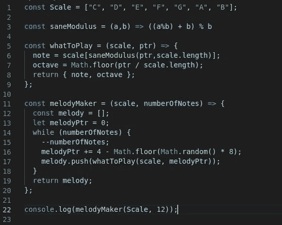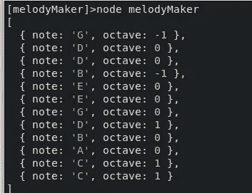

毒品。它工作了。原因如下。

我们在这里做的第一件事是采用默认的 JavaScript“模数”有两种情况发生——要么我们得到一个正数，要么得到一个负数。如果是正的，那么加上 b，再用 b 修改，不会产生任何变化。如果我们有一个负数，加 b 会更有趣一点。

这里有一个全新的数字系统，模运算。不涉及太多细节，模运算是有限整数集上的运算。以时钟为例。实际时间只能是 1 到 12 之间的数字。如果你给一个时间加上几个小时，它仍然需要在这个范围内，答案才有意义。所以，7 点后 6 小时就是 1 点。加法正常工作，除了当我们到达 12 时，我们“绕回”到 1。有趣的是，乘法也可以。如果我们从 7 点开始等 6 个街区，5 个小时，现在是几点？这是 30 小时，mod 12 是 6 小时加 7 是 1 点。

与整数和有理数版本的算术一样，在这个系统中总是存在加法逆运算。任意两个数之和为 **b** ，在模 b 运算中为 0，所以，如果 **a +c = b** ，那么在模 **b** land 中，我们可以说 **c = -a** 。因为 JavaScript 给我们的是正确模数的倒数，所以加上 **b** 就得到我们想要的数字！当我们再次用 **b** 进行 mod 时，没有任何变化，因为我们要寻找的数字已经小于 **b** 。

所以你走吧！JavaScript 模数的大问题以及如何修复它！

延伸阅读:

[半群](https://en.wikipedia.org/wiki/Semigroup)、[环](https://en.wikipedia.org/wiki/Ring_(mathematics))和[域](https://en.wikipedia.org/wiki/Field_(mathematics))

请实现 LaTeX 支持 k thx。