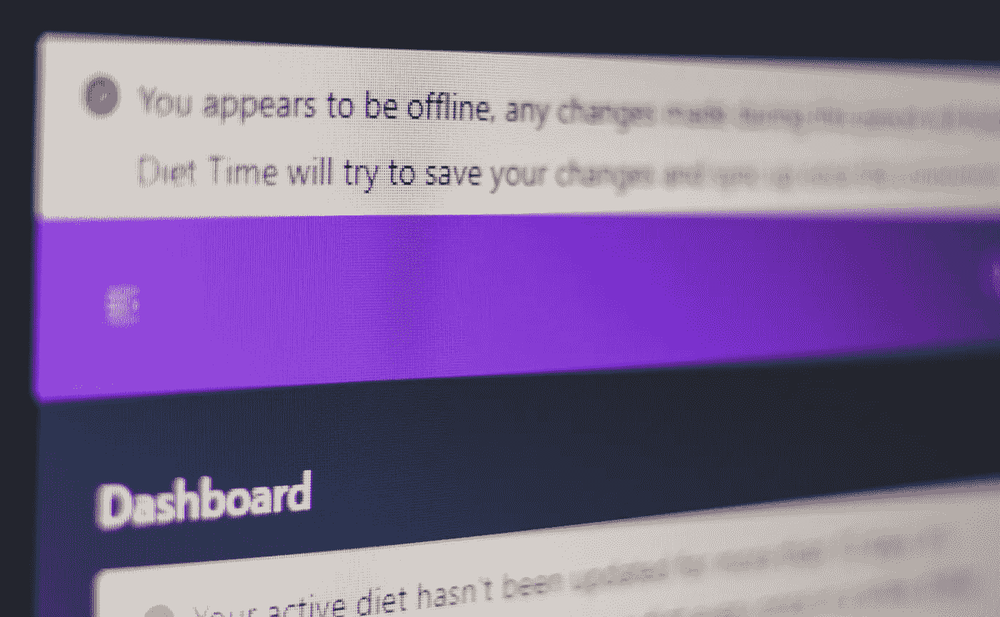
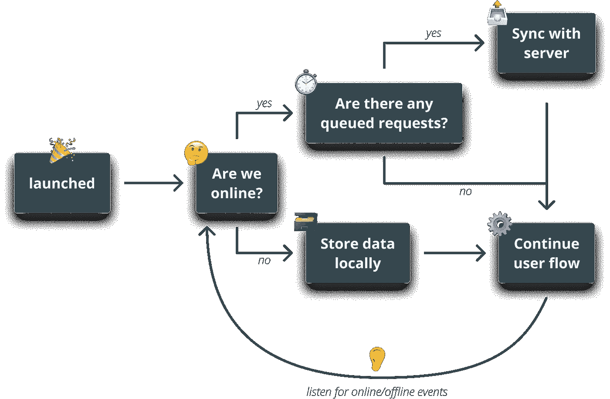
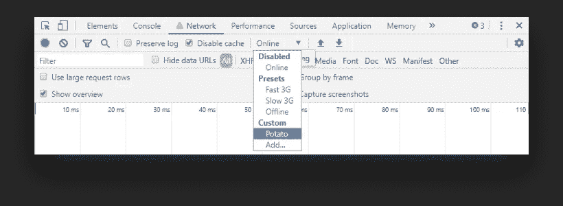

# 与服务人员离线

> 原文：<https://javascript.plainenglish.io/going-offline-with-service-workers-44ecb46d9f?source=collection_archive---------1----------------------->

## 当连接不存在时联系用户

全球平均网速正逐年加快，但速度较慢的 3G 用户仍有数百万。移动互联网用户的数量正在增长，很久以前，全球范围内的移动互联网用户数量已经[超过了](https://techcrunch.com/2016/11/01/mobile-internet-use-passes-desktop-for-the-first-time-study-finds/)。这些用户的互联网连接可能不可靠，有时甚至不存在。通常，他们可能想在旅途中访问你的内容，如果你想提供无缝的用户体验——*考虑到这些人*——你必须考虑离线。

# 离线应用

离线应用试图通过引入一些巧妙的技术解决方案来解决这些连接问题，例如

## **检测**离线**状态**

要使您的 web 应用程序离线工作，您首先需要确定您的用户的连接状态。这可以通过`online`和`offline` [事件](https://developer.mozilla.org/en-US/docs/Web/API/NavigatorOnLine/Online_and_offline_events)以及`navigator.onLine`的帮助来完成。

## **离线存储数据和资产**

这是一个服务人员可以大放异彩的地方。您希望将静态资产存储在本地缓存中，这样即使互联网连接中断，您的应用程序也可以加载。它还可以帮助您的站点更快地加载，因为它从缓存中请求资源，而不是发出网络请求。

对于在本地存储数据，有几个选项，但是您最好的选择是使用`[localStorage](https://developer.mozilla.org/en-US/docs/Web/API/Window/localStorage)`。您还可以使用它在脱机时对请求进行排队，并在用户重新联机时调用它们。

## **与服务器同步**

连接恢复后，您可以与服务器同步，并将离线状态下排队的数据保存回来。

# 先决条件

在使用服务人员时，必须满足一些先决条件。首先，我们必须指出，它仍然可以被认为是一个实验性的功能，因此在您使用它之前，您必须了解浏览器的支持。然而它在不断增长，目前只有 IE 不受支持。如需全面覆盖，您可以参考位于[caniuse.com](https://caniuse.com/#search=service%20work)的兼容性表

另一个要求是，你的网站必须通过 HTTPS 服务。这是出于安全原因，因为服务人员充当代理，可以改变您的回答。因此，确保服务人员没有被篡改是至关重要的。然而，在开发过程中，您仍然可以在本地使用它们。

# 生命周期

服务人员的生命周期独立于您的应用程序。它运行在一个不同的线程上，因此重要的是要提到，您将无法访问 dom 并做您在日常 JavaScript 文件中通常会做的事情，但服务人员无论如何都不打算这样做。

## **注册**

要为应用程序添加服务人员，首先需要在一个 JavaScript 文件中注册它。注册后，它将使浏览器在后台开始下一步，即:

## **安装**

在安装过程中，您通常希望在站点上缓存静态资产。如果一切顺利，所有文件都成功下载，那么服务人员就可以安装了。如果这些文件中的任何一个由于某种原因下载失败，那么这个步骤将会失败，服务工作者将不会被安装。在这种情况下，它下次会再试一次。

## **激活**

安装步骤完成后，服务人员被激活。在这一步中，您通常希望更新您的 worker 删除或更新旧的缓存文件。

## **获取**

一旦激活，您的服务人员就可以监听 fetch 事件，只要有网络请求，就会触发这些事件。在此期间，您可以拦截这些请求并返回缓存版本(如果有),或者继续处理网络请求(如果没有)。

## **终止**

不再使用时，服务人员将被终止以节省内存，并且仅在下次需要时才可用。

这些是我们在实现过程中需要经历的步骤，所以我们先从注册开始吧。

# 注册服务人员

注册可以在一行中完成:

其中`sw.js`是 JavaScript 文件的位置，它保存了服务人员需要执行的功能。一个常见的约定是在项目的根目录下创建服务人员的 JavaScript 文件，但是它可以位于任何地方，因为您可以将路径传递给 register 方法。

如前所述，还不是所有的浏览器都支持它们，所以检查`serviceWorker`对象是否存在于`navigator`上是个好习惯。可以通过以下方式检查支持:

# 装置

在 service worker 文件内部，可以用`self`关键字引用对象本身。回顾生命周期，我们可以看到我们需要采取的第一步是安装它。幸运的是，我们有方便的事件，可以为其附加事件侦听器。要安装一个服务工作者，我们必须将一个监听器连接到`install`事件，如下所示:

每当服务人员第一次安装时，回调函数中的所有内容都会被执行。这是您想要将文件添加到缓存的位置。为此，我们可以用下面的代码扩展`install`事件:

从内向外开始，`cache.addAll`接受一个我们想要缓存的文件数组。一个很好的经验法则是只缓存很少改变的静态资产，比如字体和图像。

我们把它返回给`caches.open`，它接受一连串的承诺，然后`cache.addAll`返回。`sw-cache`字符串是要使用的缓存的名称，也可以是其他名称。

然后我们把所有东西都包在`event.waitUntil`里面。它包含一个承诺，用于了解安装需要多长时间。如果`cache.addAll`中的任何文件下载失败，安装步骤将失败。

# 返回缓存

剩下要做的就是拦截请求并返回它们的缓存版本。为此，我们可以监听`fetch`事件。

每当用户导航到安装了服务工作者的页面时，它将开始接收来自每个请求的`fetch`事件。这里我们使用`event.respondWith`并传入一个承诺:`caches.match`，它查看请求，如果发现匹配，它返回由服务工作者创建的缓存。否则，它使用`fetch`函数通过网络请求资源，并从函数调用中返回值。这相当于说:

剩下要做的就是测试它。你可以在 Chrome 中打开 DevTools，在 network 选项卡内将`Online`状态改为`Offline`状态。刷新页面，欣赏你的网站如何加载仍然没有问题。

这也是一个很好的时间来验证，在缓慢连接的情况下，它仍然应该在微风中加载。🐌

