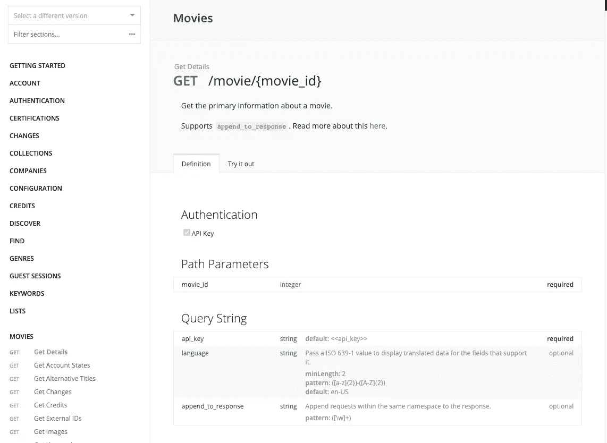
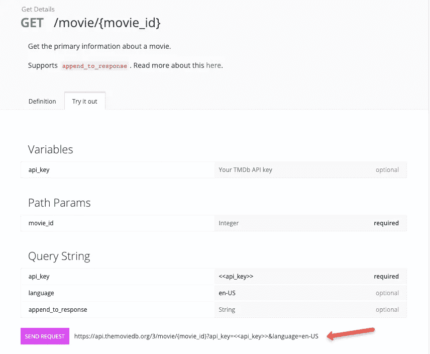
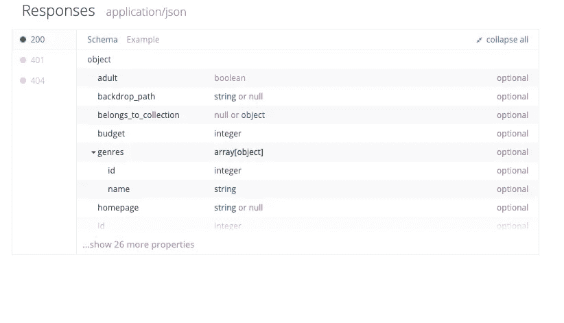
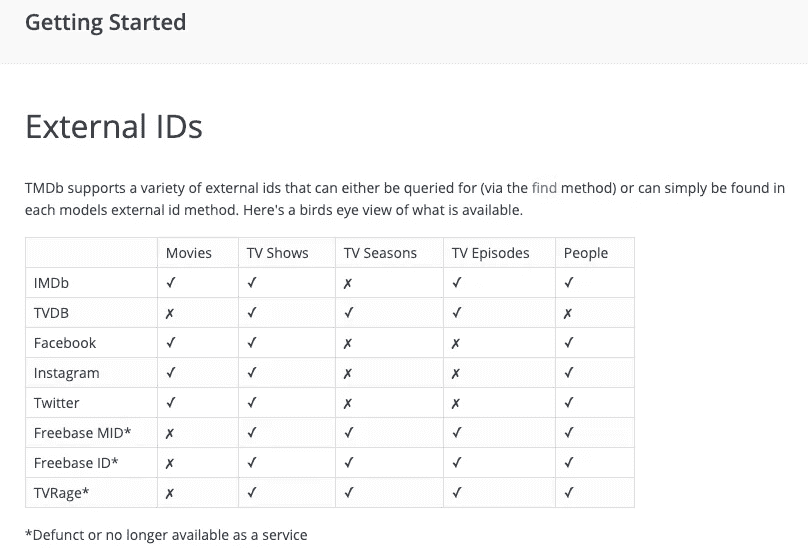
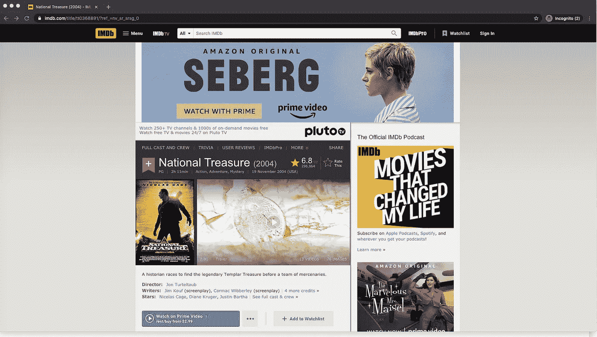
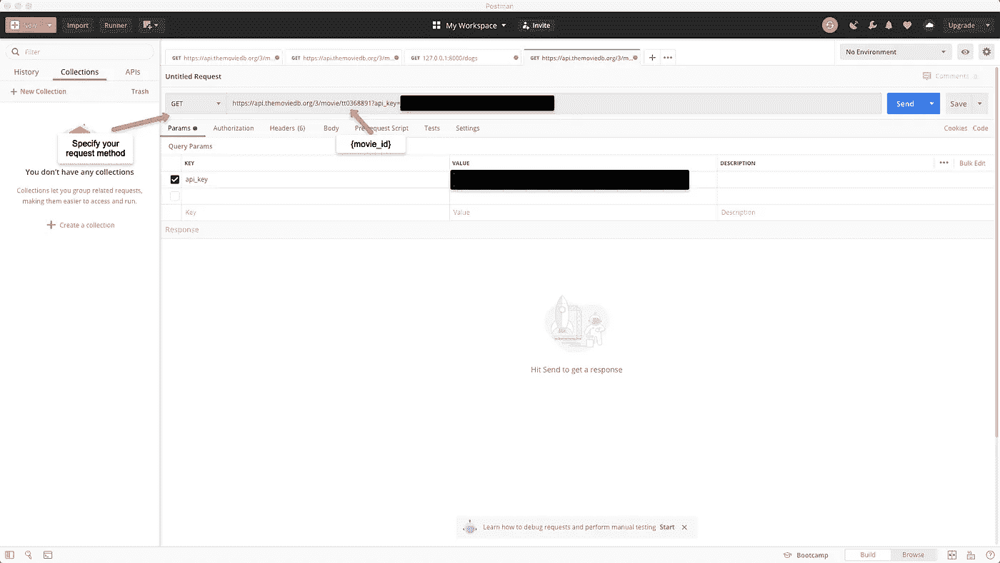
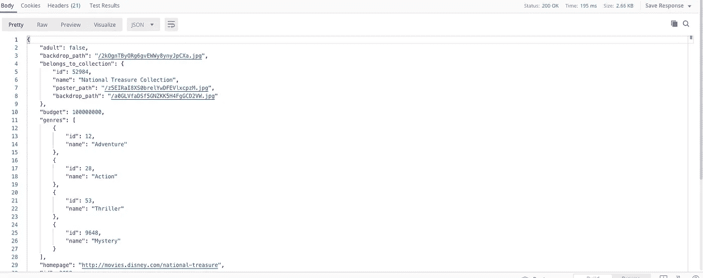

# 简单英语的 HTTP 请求和 API

> 原文：<https://javascript.plainenglish.io/going-postal-with-postman-http-requests-apis-in-plain-english-802b8a573335?source=collection_archive---------6----------------------->

## 和邮递员一起去邮局

各位编码员、朋友和其他人好！

今天，我们将学习 HTTP 请求、API，以及如何使用 Postman 来处理服务器。

在深入探讨之前，让我们先用简单的英语了解一下基础知识。

# 什么是 HTTP 请求？

**超文本传输协议(HTTP)** —允许客户端(比如笔记本电脑、智能手机、平板电脑等。)和一个服务器(您没有与之进行物理交互的计算设备)进行通信。

HTTP 请求允许网站和应用程序从客户端到服务器检索、存储和修改数据。

你点击链接找到这篇文章了吗？恭喜你，你发出了 HTTP 请求！

## **HTTP 请求有各种** [**方法**](https://developer.mozilla.org/en-US/docs/Web/HTTP/Methods)

最常见的有:

**获取** —用于检索数据。

**POST** —用于创建或修改数据。

点击这个博客的链接就是一个 GET 请求的例子。

创建这篇博客文章是文章请求的一个例子。

当客户端向服务器发出请求时会发生什么？

当你在餐馆向服务员点餐时也会发生同样的事情。

服务器响应。

就像你在餐馆的服务员可能会回答“马上就来”，或者“我们现在没有了”，或者“对不起，厨房着火了，请尽快回来”，网络上的服务员也会做出反应。

除此之外，它们首先响应一个[状态码](https://developer.mozilla.org/en-US/docs/Web/HTTP/Status)

## **不同的状态代码有特定的含义**

**200 级**响应意味着服务器有你要找的东西

—例如:200 —好的—您的订单已经在路上了

**400 级**响应表示错误在客户端。

—例如:404 —未找到—即我们没有您要订购的食物

500 级表示服务器有问题

— Ex: 500 —内部服务器错误—你的服务器在给你送牧场 90 面的时候摔倒了，摔断了他们的股骨。几分钟后再试一次，别人会把你点的菜送来。否则他们会像金刚狼一样痊愈，很快就会来找你。

在服务器发送一个状态代码后，他们会用剩余的数据进行响应。这可能是一个网页，它可能是纯文本，它可能是一个可爱的猫视频。这是互联网，这里没有边界。

# 什么是 API？

**API** —应用编程接口。

这个定义太短了。简单…而且含糊不清。

API 是软件之间的中介。通常，它是应用程序(或几个应用程序)和数据库之间的中介。

## 为什么这很重要？

**模块化—** 将应用程序从数据库中分离出来，使应用程序和数据库更加灵活。如果应用程序被重构(更改)，应用程序开发人员不需要考虑更改数据的接收方式，只需要考虑数据的可见性。同样，更改数据库中的模式并不意味着应用程序需要立即重构。这意味着 API 可能需要重构。如果几个应用程序使用同一个数据库，那么更新一个 API，然后更新几个应用程序会简单得多。

**安全性—** 因为应用程序和数据库是分离的，所以更容易控制访问。根据需要添加、修改或撤销。

网络上有无数的 API。许多人有非常有用的信息。这就把我们带到了当前的问题…

# 我如何探索 API 的？

有几种方法可以探索一个 API。一些公司选择有允许直接通过他们的网站探索的应用程序。否则，你可以使用 curl，或者使用 Postman 之类的工具。

提示:这将是安装[邮递员](https://www.postman.com/)的好时机(不，他们不会给我钱)

*给邮递员的秘密纸条:*悄悄话*付钱给我*

Postman 比 curl 在视觉上更吸引人，也更容易使用。

*旁注:你将总是(或者足够接近)需要一个 API 键来探索一个 API。它们通常很容易获得，而且通常是免费的，但是有一个请求数量的限制。就像冰淇淋店一样，你可能会有一些免费的样品。*

对于我们的例子，我们将探索电影数据库 api -

注册一个 API 密钥—[https://www.themoviedb.org/documentation/api](https://www.themoviedb.org/documentation/api)

入门—[https://developers . themoviedb . org/3/入门/简介](https://developers.themoviedb.org/3/getting-started/introduction)

当你第一次看任何 API 的文档时，你可能会感到不知所措。这很正常。

## 保持简单。只是 HTTP 请求。

**含义:**按照他们要求的方式创建一个 URL，你就会收到你正在寻找的数据。

对于这个例子，我们将查找有史以来最伟大的电影《国家宝藏》的信息。

Ya you are.

为此，我们将使用这个端点—[https://developers . themoviedb . org/3/movies/get-movie-details](https://developers.themoviedb.org/3/movies/get-movie-details)

请注意，这是一个 GET 请求

请注意，如果您选择顶部的“试用”标签，您甚至可以看到 URL 需要的格式示例。

注意:{movie_id}是一个可变参数(即，将其设置为您需要的任何值)

回头看看“Definition”选项卡并向下滚动，我们可以看到每个返回的数据的响应代码和模式。

通过观察这些我们现在知道了什么？

1.  我们将使用 GET 请求
2.  端点(URL)是[https://api.themoviedb.org/3/movie/{movie_id}/?api_key={api_key}](https://api.themoviedb.org/3/movie/{movie_id}/?api_key={api_key})
3.  {movie_id}是必需的参数
4.  api_key 也是必需的。
5.  将返回的数据的框架

不知道的是 movie_id 应该是什么…嗯嗯…翻阅文档，有一节叫[外部 id 的](https://developers.themoviedb.org/3/getting-started/external-ids)。下表显示了在哪里可以找到这些 ID 以及如何使用它们。

我们去 IMDb 找国宝的 ID 吧

它会在哪里…让我们思考一下这个问题。IMDb 是一个网站。我在一台电脑上(一个客户端)，我从 IMDb 的服务器上请求数据，它返回了这个网页。
IMDb 有很多电影，所以我的客户一定指定要找国宝。我可以去哪里找？(提示:考虑 HTTP 请求)。

让我们试试网址

hmmmmm

这里的一些东西很可能指定拉起国家宝藏，除非 IMDb 只是爱随机数和字母，这是一个很好的猜测，id 是正确的标题后:tt0368891。

该开门了邮递员。

在 Postman 中，我们指定我们的请求方法(GET、POST 等。)

我们包括任何查询参数(可以随意在查询参数中添加这些参数，由于 Postman 格式化链接的方式，我没有在该部分包括 movie_id)。

并确保包含您的 api_key。抱歉，各位，出于安全原因，我的钥匙被修改了。

当一切看起来正常的时候。单击发送。

瞧啊。我们现在有数据了！

你对这些数据做什么或不做什么，取决于你自己。只要记住…

## **用简单英语写的便条**

你知道我们有四份出版物和一个 YouTube 频道吗？你可以在我们的主页 [**plainenglish.io**](https://plainenglish.io/) 找到所有这些内容——关注我们的出版物并 [**订阅我们的 YouTube 频道**](https://www.youtube.com/channel/UCtipWUghju290NWcn8jhyAw) **来表达你的爱吧！**