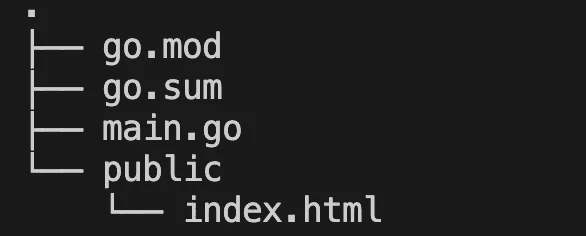

# 光纤简介，Express.js 的替代方案

> 原文：<https://javascript.plainenglish.io/golang-fiber-426f52185fc4?source=collection_archive---------4----------------------->

## Golang 的 performant Express.js 替代比较


Source: The author

Golang 是趋势。随着编程语言的兴起，用于编程语言的库和框架不断涌现。对于谷歌的 Golang，甚至有一个 web 框架，它非常类似于 express . js——但它声称是一个性能更好的替代方案。

在本文中，我们将了解 Fiber 的基础知识，以及它与 Express.js 有多相似。我们还将进行性能比较，看看哪个框架更快。

对于这篇文章，你不需要太多关于 Golang 的知识——如果你还想上一点 Golang 速成班，这里有一个。

# 我们走吧

首先，你需要安装 Golang 你可以在这里做[https://golang.org/](https://golang.org/)。

在您的终端中，您可以简单地输入`go version`来测试安装是否有效。现在我们已经可以开始安装光纤了。

为此，首先使用 Go-CLI 创建一个新项目。这有点像我们从 npm init 开始的节点世界。所以我们为我们的项目创建了一个 *package.json* 。在 Go 中，这个文件就是 *go.mod* 。

```
go mod init
```

之后，我们可以为我们的项目安装光纤框架。我们使用下面的命令来实现这一点，它的工作方式类似于 npm install。

```
go get -u github.com/gofiber/fiber/v2
```

现在我们可以用光纤实现一个 hello world。为此，我们在与我们的 *go.mod* 相同的文件夹中创建一个 *main.go* 。我们在这里编写所有的代码。

```
package mainimport "github.com/gofiber/fiber/v2"func main() {
  app := fiber.New() app.Get("/", func(c *fiber.Ctx) error {
    *return* c.SendString("Hello, World :)")
  }) app.Listen(":8080")
}
```

使用`go run main.go`我们可以运行 main . go。
如果您现在在浏览器中打开 localhost:8080，您应该会看到我们的第一页。

这里已经可以看出和 Express.js.
是多么的相似，在 Golang 中，我们总是要定义一个包；在它下面，我们用 Express 导入纤维框架。

与 JavaScript 不同，Go 依赖于一个自动执行的**主函数**——这就是我们在这里定义代码的原因。和在 Express 中一样，我们首先必须创建一个实例，为我们的 web 服务器奠定基础。

*app.get* 函数我们应该也很熟悉。第一个参数是路线；第二个是处理请求的函数。 *Ctx* 代表上下文，包含所有重要信息。我们可以用变量 ***c*** 来访问上下文。类似于 Express.js 中的 ***res*** 。

*c.SendString()* 因此可以理解为类似于 *res.send()。*

例如，我们可以使用上下文变量输出基本 URL 如下:`fmt.Println(c.BaseURL())`。

下面是另一个例子，它展示了上下文变量像 Express 中的 res 一样工作。所以我们可以为我们的响应设置一个 HTTP 状态:

```
app.Get("/", func(c *fiber.Ctx) error {
  *return* c.SendStatus(404)
  *// "Status for Not Found"* })
```

一旦我们的 web 服务器启动并运行，我们就可以使用 nodemon 进行实时重载。不，我没有打错——**nodemon**；我们也可以用它来下围棋。
它是这样工作的:

```
nodemon — exec go run main.go — signal SIGTERM
```

很实用，不是吗？如果我们修改了代码，服务器会自动重启。

# URL 参数

我们不能回避这个原则——URL 参数非常方便，允许我们的服务器动态响应请求。在 Express.js 中，我们只需要在 GET route 中使用一个特殊的语法来表示我们需要一个参数。这是它在 Express 中的样子:

```
app.get("/user/:name", (req, res) => {
  res.send("Hi user " + req.params.name)
})
```

令人惊讶的是，这就是它在纤维中的样子:

```
app.Get("/user/:name", func(c *fiber.Ctx) error {
  *return* c.SendString("Hi User "+ c.Params("name"))
})
```

如果我们调用 localhost:8080/user/max，我们会看到以下输出:


这就是我们通过 URL 传递参数有多容易——几乎与 Express.js 中的一模一样。

# 提供静态文件

静态文件是服务器不再修改的文件——我们交付给用户的 CSS 或 JavaScript 文件就是很好的例子。
为了在 Express.js 中交付静态文件，我们使用了中间件函数 *express.static* 。在使用中，它看起来像这样:

```
app.use('/app', express.static('public'));
```

因此，当用户调用路由“app”时，我们将传递文件夹“public”的内容。
在 Golang 的纤维里，这个看起来也很像。

```
app.Static("/app", "./public")
```

这同样适用于这里。当有人调用/app 时，直接在我们目录中的文件夹“public”的内容就会发送给他。例如，典型的结构如下。



到目前为止，一切顺利。我们看到 Fiber Express.js 极其相似。但它也提供了真正的优势吗？是的，尤其是性能是纤维的强项。

为了证明这一点，我实现了一个基准。利用这两种技术，我实现了同一个应用程序。公平地说，我还将两种情况下的响应头调整为相同的大小。

以下是光纤应用程序的代码:

```
app.Get("/user/:name", func(c *fiber.Ctx) error {
  c.Set("Connection", "keep-alive")
  c.Set("Content-Type", "text/html; charset=utf-8")
  *return* c.SendString("Hi User "+ c.Params("name"))
})
```

这是 Express 中同一应用程序的代码:

```
app.disable("etag");
  app.disable("x-powered-by");
  app.get("/user/:name", (req, res) => {
  res.send("Hi user "+ req.params.name)
})
```

Express 应用程序简单地用`node server.js`Fiber 应用程序执行，因为 Go 是一种编译语言，用`go build main.go`编译，用`./main`执行。

```
wrk -t12 -c400 -d10s http://localhost:8080/user/max
```

基准的工具叫做 ***wrk*** 。12 是我们将使用的线程数，400 是并发连接数。负载运行 10 秒钟。

结果是惊人的。当然，我已经运行了几次，但这里是平均结果。

**纤维:**

```
Thread Stats Avg Stdev Max +/- Stdev
 Latency 2.57ms 698.98us 50.72ms 90.95%
 Req/Sec 12.70k 2.10k 38.18k 96.43%
 1521782 requests in 10.10s, 219.14MB read
 Socket errors: connect 0, read 364, write 0, timeout 0
Requests/sec: 150603.89
Transfer/sec: 21.69MB
```

**Express.js:**

```
Running 10s test @ [http://localhost:8080/user/max](http://localhost:8080/user/max)
 12 threads and 400 connections
 Thread Stats Avg Stdev Max +/- Stdev
 Latency 38.54ms 8.55ms 171.39ms 93.07%
 Req/Sec 0.85k 151.82 1.00k 89.32%
 102078 requests in 10.02s, 16.94MB read
 Socket errors: connect 0, read 610, write 0, timeout 0
Requests/sec: 10189.99
Transfer/sec: 1.69MB
```

**Express.js 与 PM2:**

```
Running 10s test @ [http://localhost:8080/user/max](http://localhost:8080/user/max)
 12 threads and 400 connections
 Thread Stats Avg Stdev Max +/- Stdev
 Latency 19.77ms 25.89ms 503.95ms 93.01%
 Req/Sec 2.11k 299.31 5.39k 88.73%
 252083 requests in 10.03s, 41.83MB read
 Socket errors: connect 0, read 151, write 0, timeout 0
Requests/sec: 25135.86
Transfer/sec: 4.17MB
```

我仍然使用 PM2，因为它对应用程序的生产版本非常有用。默认情况下，Node.js 即使在负载下也只会使用一个 CPU 核；PM2 有助于其集群模式发挥其全部潜力。然而，结果是清楚的。

值得注意的是，这只是一个单一的测试——基于 URL 参数的比较。但是有太多其他的事情属于真正的 web 应用程序，通常性能不取决于后端框架而是其他因素。此外，尽管 fiber 的性能更高，但是如此多的并发请求在现实世界中是不现实的。

# 总结

尝试新技术，惊叹性能总是很有趣。

问题只是它到底还剩下什么。正如已经提到的，人们不应该过分强调基准的结果。在现实中，将现有的 Express.js 应用程序完全转换为 Fiber 没有太大的意义——尤其是如果你对 Golang 没有很好的了解。毕竟，每种编程语言都有自己的问题和挑战。

我可以向任何已经了解 Golang 或希望用另一种语言实现几个项目的人推荐 Fiber——Fiber 和 Express 之间关系的巨大优势是，您可以沉浸在新技术中，而不会完全意识不到它。

光纤的一个特别优势是它比 Golang 自己的 *net/http* 模块更快。Fiber 完全基于另一个针对 Go 的性能优化的 HTTP 引擎。所以如果你想用 Golang 实现一个 web 服务器，最好直接用 Fiber。

在 Express.js 的情况下，这就不能说了。[正如这个实验所示，在没有任何框架或库的情况下，Express 并不比 Node.js 中的基本 HTTP 服务器](https://medium.com/javascript-in-plain-english/i-built-the-same-api-with-without-express-here-are-the-differences-83bbeb7ddad)更快。尤其是较小的应用程序可以也应该不用 Express.js 来实现——至少从性能的角度来看是这样。