# 在 Node.js 中使用 OAuth2.0 和 Passport.js 的 Google API 认证

> 原文：<https://javascript.plainenglish.io/google-api-authentication-using-oauth2-0-and-passport-js-in-nodejs-7b2d9b73c513?source=collection_archive---------7----------------------->


Let’s buzzzz!

# 什么是 OAuth？

OAuth 是一种授权协议，代表开放授权。包括 Medium 在内的许多网站使用它直接登录另一个第三方应用程序，无需填写单独的表格。现在，用户不需要为不同的应用程序分别记住密码。在 OAuth 的帮助下，用户可以使用主帐户的帐户详细信息登录到多个站点。就像这里，我们将使用谷歌帐户。

# 什么是护照？我们为什么需要它？

Passport 是[节点](http://nodejs.org/)的认证中间件。需要它来处理请求的身份验证。它是一个与 Express 框架一起使用的身份验证模块，有助于 web 开发。

# 先决条件

**安装 Node.js:**

在 cmd/终端中运行这些命令。

```
sudo apt-get install curlcurl -sL [https://deb.nodesource.com/setup_12.x](https://deb.nodesource.com/setup_12.x) | sudo -E bash -sudo apt-get install -y nodejs
```

**安装 npm:**

如果您有最新版本的 Nodejs，就不需要单独安装 npm，否则要全局安装最新版本的 npm，请在 cmd/terminal 中运行此命令。

```
sudo npm install npm@latest -g
```

**快装:**

如果您的 npm 是最新版本，您不需要提及——保存。

```
npm install ejs express — save
```

**安装护照和护照策略，通过谷歌应用编程接口进行认证:**

```
npm install passport passport-google-oauth20
```

**代码片段:**


Passport-setup.js

此处使用的 **clientID** 、 **clientSecret** 均取自[https://console.developers.google.com](https://console.developers.google.com/)。

请记住这些钥匙是保密的，因此我把它们放在了一个单独的文件中。

确保您已经有了一个**谷歌**账户。

用它登录。

这是谷歌开发者控制台的仪表板。

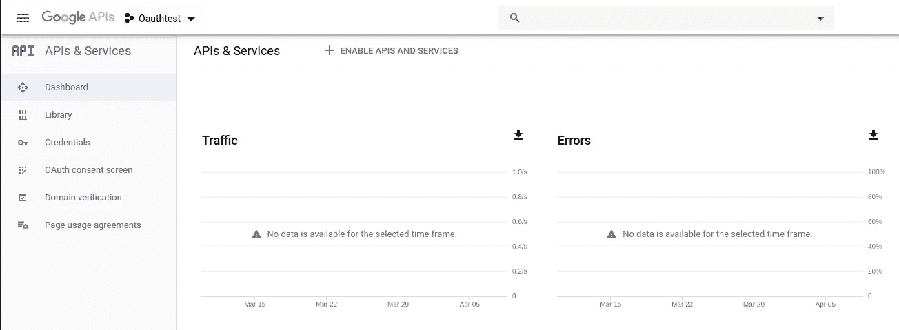

Google Developer console’s Dashboard

如果您想创建一个新项目，请单击 Oauthtest 旁边的箭头。

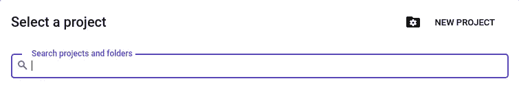

Adding a new project

点击**新项目**。

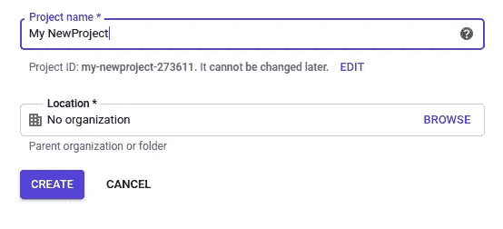

Adding Project Name

之后点击**创建**按钮。

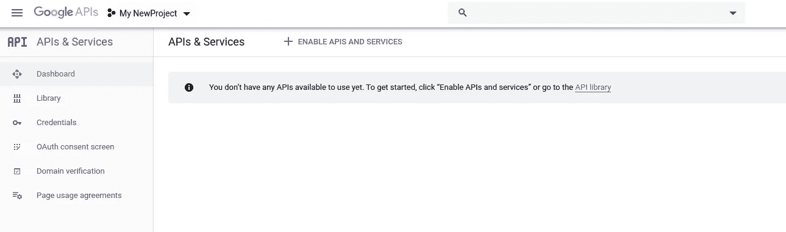

Dashboard

现在，您将看到仪表板。

您需要启用 API 和服务来访问客户端 ID 和客户端密钥。

点击**启用 API 和服务。**

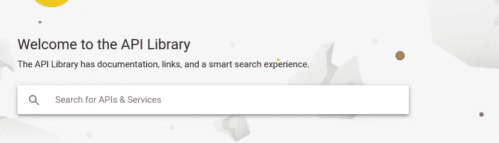

Searching for the API

搜索 **Google+ API** 。

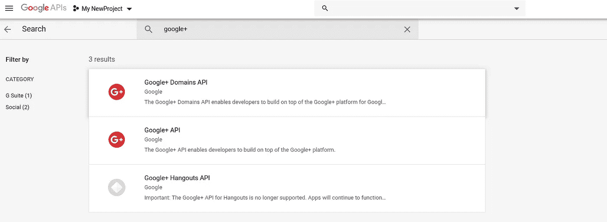

Selecting API

根据我的列表选择第二个，即 Google+ API。

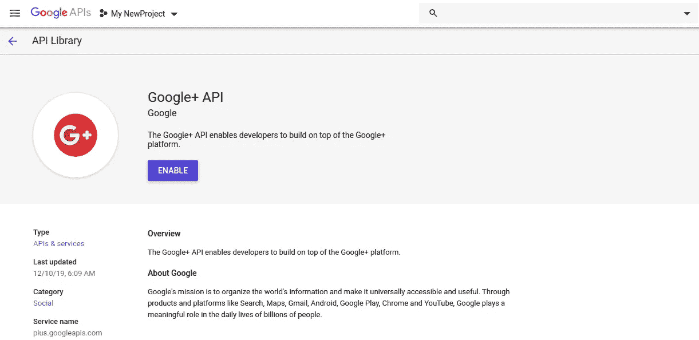

Enabling API

点击**使能**按钮，启用 Google+ API。

从左窗格中选择**凭证**。


Creating Credentials

点击**创建凭证**。

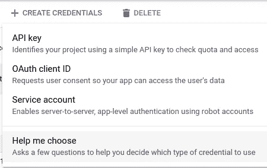

Creating Credentials

选择 **OAuth 客户端 ID** 。


Creating OAuth client ID

点击**配置同意屏幕**。

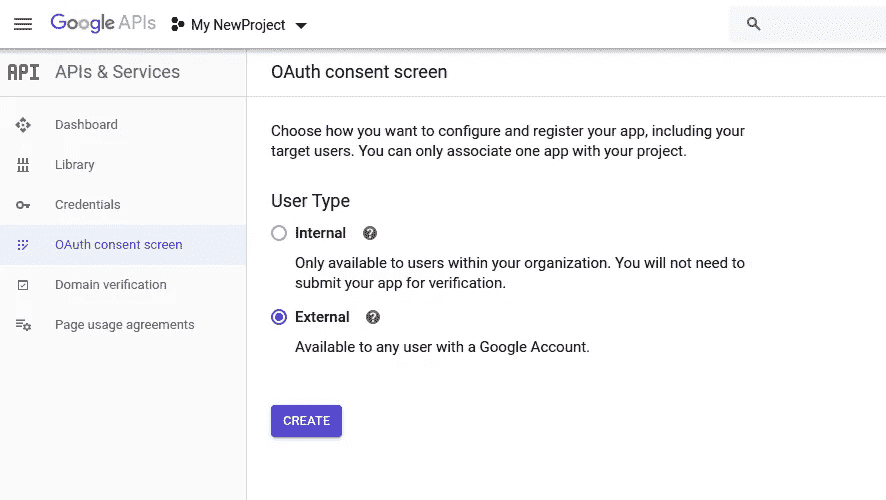

Creating OAuth client ID

选择**外部**并点击**创建**按钮。

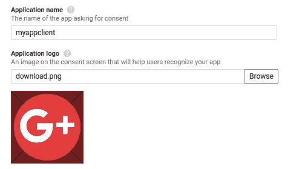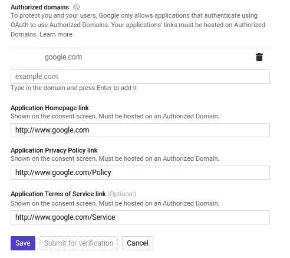

Creating OAuth client ID

进入**申请名称**:

上传**标志**的图片。

**支持电子邮件**将是您默认输入的 Gmail 帐户。

在**授权域**，进入你的网站，你可以输入任何我将要进入的【google.com】的。

在**应用主页链接**，进入[http://www.google.com](http://www.google.com)

在**应用隐私政策链接**中，输入[http://www.google.com/Policy](http://www.google.com/Policy)

在**服务链接申请条款**中，输入[http://www.google.com/Service](http://www.google.com/Service)

点击**保存**按钮。

再次转到**凭证>创建凭证> OAuth 客户端 ID** 。

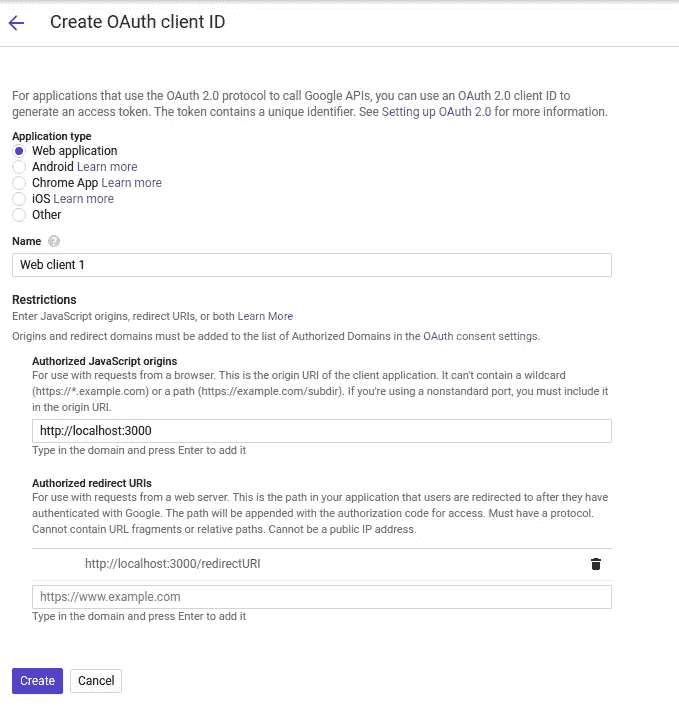

Creating OAuth client ID

选择您需要的**应用类型**。我们正在开发一个网络应用，所以我会选择**网络应用**。

如上图所示，填写**名称**和**限制**。

然后点击**创建**按钮。

> **授权 Javascript Origins** 是你的应用程序运行的 URL，这样 Google 就可以知道应用程序将在哪里运行。
> 
> **授权重定向 URIs** 是用户授予从 Google 帐户访问信息的权限后，应用程序将被重定向到的链接。

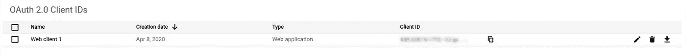

OAuth Client ID created

点击**网络客户端 1** 访问 ClientID 和 ClientSecret 密钥。

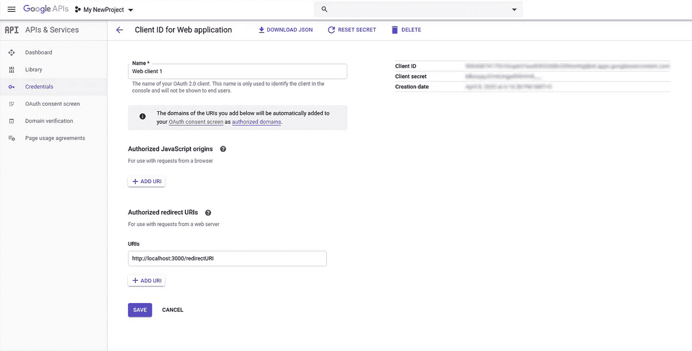

OAuth Client ID created

将这些**客户端 ID** 和**客户端秘密**密钥复制到您的代码中。

这使得 OAuth2.0 适用于您的应用程序。

# 结论:

这是我的第一个博客，希望你喜欢。

要了解更多，你可以阅读 https://console.developers.google.com 的。你也可以从 [Nodejs 官方文档](https://nodejs.org/en/docs/)、 [Express 官方文档](https://expressjs.com/)和 [Passport 官方文档](http://www.passportjs.org/)中阅读来增强你的学习。

对于任何建议或改进，您可以写在下面的回复部分。你也可以在 [LinkedIn](https://www.linkedin.com/in/ishu-khanchi-66577313b/) 、 [Twitter](http://www.twitter.com/ishukhanchi) 和 [GitHub](http://www.github.com/ishukhanchi) 上与我联系。感谢您花时间阅读本文。祝你好运！

*更多内容请看*[***plain English . io***](http://plainenglish.io/)