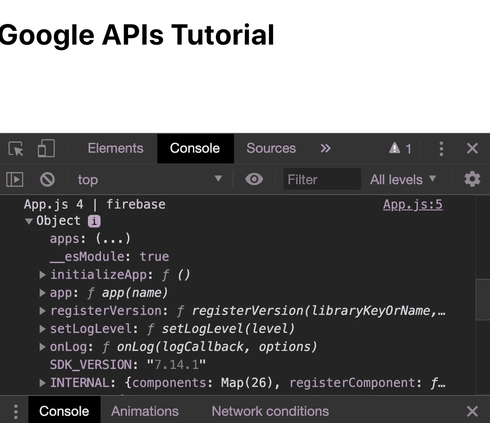
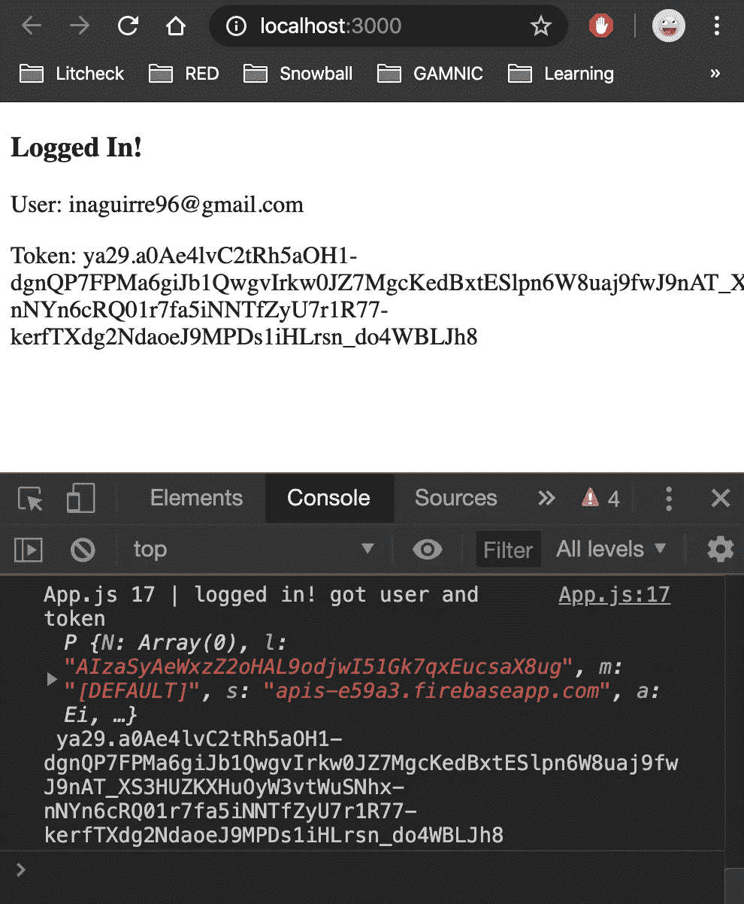
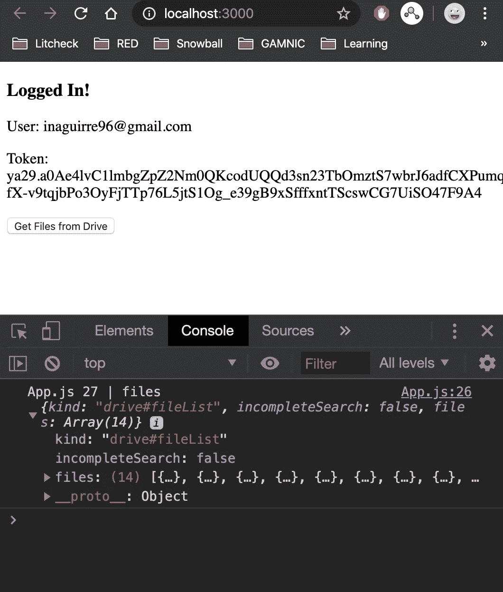
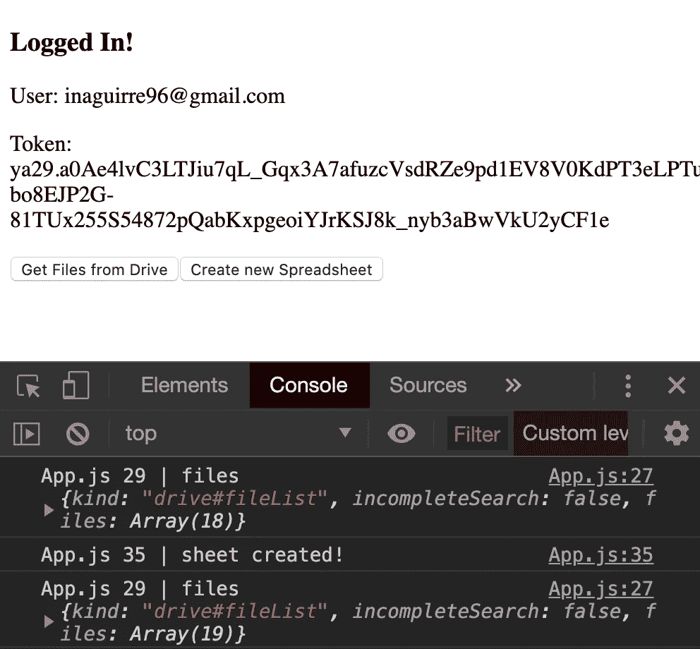
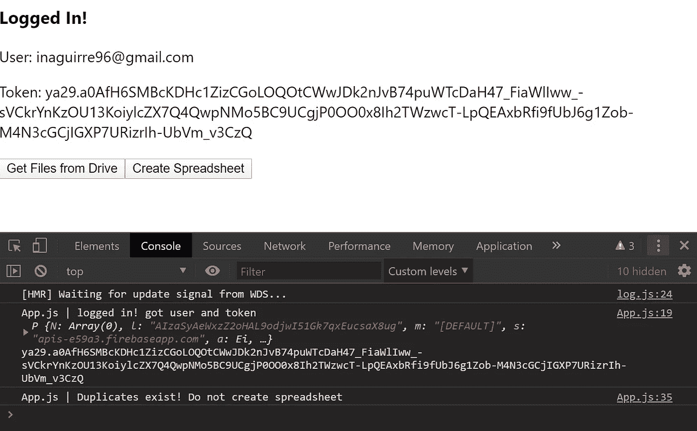
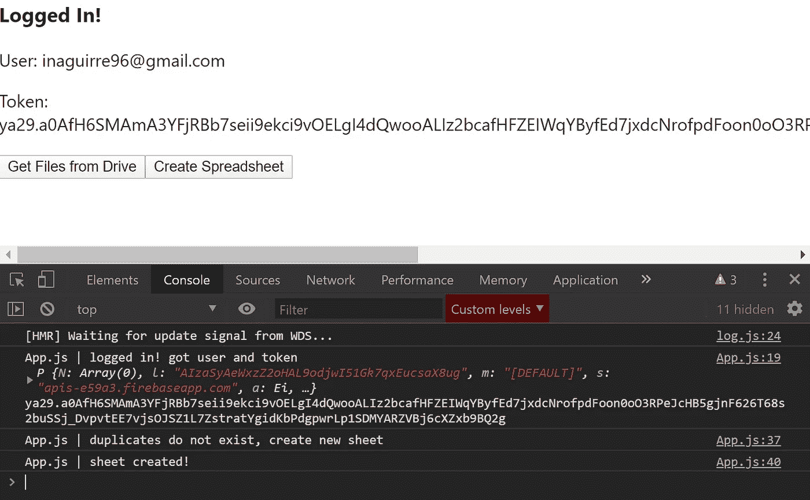
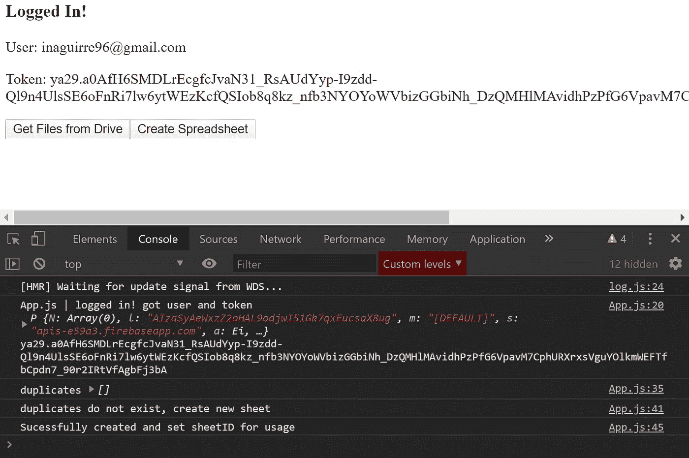
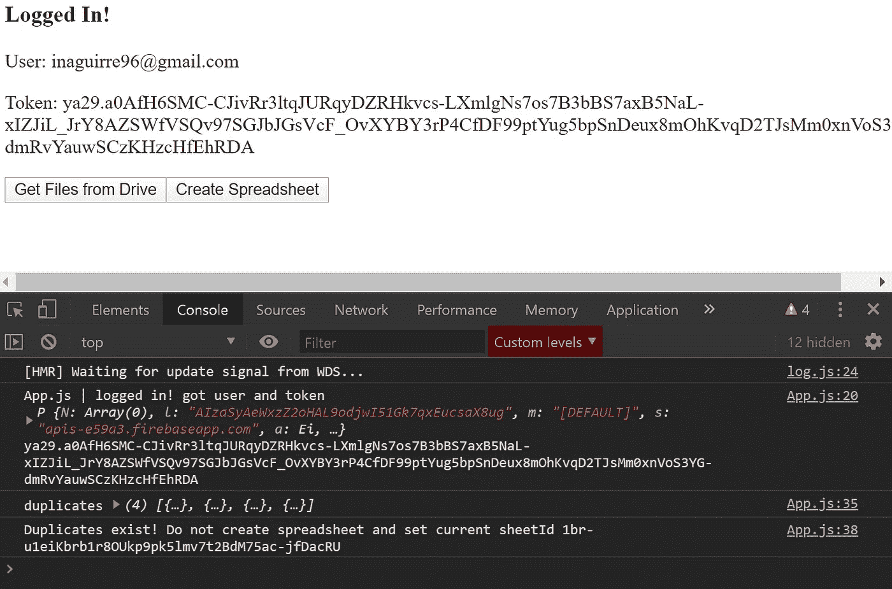

# 带 JavaScript 的 Google APIs:完整教程

> 原文：<https://javascript.plainenglish.io/google-apis-with-javascript-complete-guide-9679d687250e?source=collection_archive---------9----------------------->

## 如何登录 Google 并通过 JavaScript、Firebase 和 React 使用多个 Google APIs

今天，我将向您展示使用两个流行的 Google APIs 的完整编码流程。从使用特定的作用域对用户进行身份验证、取回令牌，到使用该令牌操作多个 API。

到目前为止，这是我最复杂的文章，所以请提供反馈！我很乐意帮助你在这方面比我做得更容易，如果你遇到困难，我会回答个别问题(给我发电子邮件！).

这也是我自己搭建 app 时需要的教程。有些事情只有你自己去尝试和解释，才会被简化！

## 你会学到什么

1.  React 中使用 Firebase 的 Google 登录
2.  如何传入范围来访问特定的 Google APIs
3.  操控谷歌**驱动 API**
4.  操纵谷歌**表单 API**

对于这个例子，我们将使用 **Google Drive** 和**Google Sheets API**。为什么是这两个？因为我想演示一个我在创建自己的网站时不得不处理的具体流程:雪球财经教育(www . snowballmifiests . com)。

## 要求:

1.  基本 JavaScript
2.  Node.js 已安装
3.  基本反应(reactjs.org)
4.  一个 Firebase 项目设置:www.firebase.com(**登录**，**进入控制台**，**添加项目+ )**

我将提供完整的代码示例！

## 教程概述

1.  反应项目设置
2.  Firebase 设置
3.  使用 API 范围的 Google 登录
4.  驱动 API 使用
5.  工作表 API 用法

# 1.设置新的 React 项目

让我们从 React 开始我们的项目

`npx create-react-app google-apis`

`cd google-apis`

用你最喜欢的文本编辑器打开它(我用 VSCode)

# 2.在 React 中设置 Firebase 项目

*去****www.firebase.com****开始一个新项目。浏览设置，直到您进入项目概述。*

如果您知道如何用 React 项目配置 Firebase，那么可以跳过这一步。

## 从 Firebase 获取 API 密钥

1.  在项目概述(你看到的第一页)上，应该有一条消息说**“***通过将 Firebase 添加到你的应用* **”开始。点击网络图标。**
2.  给你的应用取一个昵称。我把它叫做**Google-API**。你完成了这一步，只需点击下一步，直到你返回到主 firebase 项目屏幕。
3.  在你的项目总览上，进入项目设置:点击**“项目总览”旁边的**齿轮图标**，**点击**项目设置**选项。
4.  找到 **Firebase SDK 片段**(页面底部)点击**配置**圆圈。您应该会看到这样的代码。

太好了。您将在接下来的步骤中将其添加到您的应用程序中。

## 在 React 应用程序上初始化 Firebase

转到项目的根目录。安装 firebase，并在 src 目录中添加一个名为 firebase.js 的 firebase 配置文件:

`npm i firebase`

`touch src/firebase.js`

firebase 安装后，在 firebase.js 中导入 firebase，粘贴 SDK 配置，并用我们之前找到的配置初始化 firebase。使用下面的代码并粘贴您自己的凭据。

现在测试 firebase 是否在您的项目中。转到 App.js 并打印出 firebase 实例。为了简单起见，我删除了 App.js 的所有内容，并替换为以下代码:

现在做`npm start`，你会看到这个窗口。打开控制台。您应该在 localhost 上获得以下内容:3000

Application with Firebase working

**恭喜你，Firebase 已经安装完毕，可以开始运行了！**

# 3.使用 API 范围的 Google 登录

现在是有趣的部分。您将在 firebase 后端启用 Google。然后，您将设置带有自定义作用域的代码，以获得一个令牌，使您能够使用 Sheets 和 Drive API。

## 在 Firebase 中启用 Google

1.  再次转到 Firebase，并进入项目概述左侧的**身份验证**选项卡。
2.  新闻设置登录方法
3.  按下谷歌，并启用它(小开关变成蓝色)
4.  按下**保存**。

## 从 React 登录 Google

让我们创建登录函数。这一部分非常简单。为了保持有序，在 **src** 中创建一个 **auth.js** 文件。现在用 Drive API 作用域设置 Google firebase 登录函数。

`touch src/auth.js`

就是这样。这个函数让您登录 Google，并为您提供正确的令牌来访问您的 Google APIs。现在你只需要**从 App.js 中正确调用函数**。

让我们将函数导入 App.js，调用函数，获取用户信息和令牌，最后将它们设置为**状态。**我还添加了简单的渲染逻辑，以显示注销时的“使用 Google 登录”按钮，以及登录时的用户电子邮件和令牌。

> **警告 1:** 您可能会收到一条消息，提示“应用程序未经验证”。你可以点击**“高级”**按钮，然后点击底部的链接。你可以点击此链接查看如何验证你的应用:[https://support.google.com/googleapi/answer/7454865?hl=en](https://support.google.com/googleapi/answer/7454865?hl=en)
> 
> 令牌在 1 小时后过期，这意味着它们对 API 的访问也过期了。你需要重新加载你的应用并再次登录。否则你会得到认证错误

如果你做的一切都是正确的，你应该看到这个。

Application successfully got token after login

如你所见，我的电子邮件在图片上。如果到目前为止您有任何问题，请告诉我！*(附上你的 github 回购链接并描述问题)*

**妙极了。**现在您已经有了一个准备使用 Drive API 的登录用户。所以还是用起来吧！

# 4.驱动 API

为了充分使用 API，您必须首先在 Google 控制台上启用它。一旦启用，您就可以使用令牌来访问 API。

## 在 Google 控制台上启用 Drive

谷歌阻止你直接访问 API，除非你已经在他们的控制台上启用了它们。如果您从未这样做过，请遵循以下步骤。

1.  转到[https://console.developers.google.com/](https://console.developers.google.com/)
2.  在顶部，单击选择项目。
3.  如果在“最近”选项卡上没有看到您的项目，请选择“全部”。找到后，点击它。
4.  单击“启用 API 和服务”
5.  搜索“Google Drive API”。一旦它出现，选择它。
6.  最后，点击“启用”。

你都准备好了。现在您已经启用了**API**，并且您拥有了一个**令牌**来访问 API。是的，一旦你在 **auth.js** 中添加了作用域“https://www . Google APIs . com/auth/drive ”,你就把它与你的 **google 控制台**连接起来，现在它就启用了！

## 访问驱动器 API 文件

关键时刻；使用 API。

我们将使用 JavaScript 的**获取**来访问 API。首先，创建一个新文件来保持 src 的有序。

`**touch src/drive.js**`

现在我们将设置 url，然后用请求中的令牌构建对服务器的 GET 请求，最后返回信息。

在 **drive.js** 上，用 fetch 调用 API 并使用授权头中的令牌:

仔细观察获取请求的结构。谷歌要求你在**授权头中传递一个**不记名令牌**。**我花了 3 个月才学会这个，所以如果一开始没多大意义也不要太难受。

我们已经准备好使用这段代码了。将函数添加到 App.js，并传入登录后获得的令牌。我添加了一个简单的按钮和一个调用 API 的函数；*见*第 25 行&第 44 行。

如果你做的一切都是正确的，你应该在按下“从驱动器获取文件”按钮后得到这个。

Application successfully getting data from the Drive API

这真是太棒了！您现在可以访问所有驱动器文件。我们现在将扩展功能。

# 5.谷歌工作表 API

让我们创建一个新的谷歌表！

## 在控制台上授权工作表 API

1.  遵循第 4 部分的相同步骤:**在控制台上启用驱动**
2.  启用**谷歌工作表 API**

现在你已经准备好使用它了！

***重要:*******Google Drive API****作用域***https://www.googleapis.com/auth/drive****【auth . js****中的“还可以访问工作表 API。这就是为什么我们* ***不*** *非得编辑我们的****auth . js****文件添加一个新的特定的电子表格范围。这适用于这个特定的 API。您应该看看每个 API 的文档，看看它需要什么范围！你可以在这里阅读更多关于工作表 API 的作用域:*[*https://developers.google.com/sheets/api/guides/authorizing*](https://developers.google.com/sheets/api/guides/authorizing)*(向下滚动，你会看到作用域)。***

## **创建您的第一个电子表格**

**在 src 中添加一个名为 **sheets.js** 的文件，并用您的令牌创建一个对[https://sheets.googleapis.com/v4/spreadsheets](https://sheets.googleapis.com/v4/spreadsheets)的 POST 请求，以及一个指定标题的主体。**

**`touch scr/sheets.js`**

**您可以在 Sheets API v4 docs 中查看主体的属性:[https://developers . Google . com/Sheets/API/reference/rest/v4/spreadsheets # Spreadsheet](https://developers.google.com/sheets/api/reference/rest/v4/spreadsheets#Spreadsheet)**

**现在让我们将函数添加到我们的 **App.js** 文件*(第 32 行)***

**点击创建新的电子表格按钮。您应该看到一个日志，上面写着“工作表已创建！”几秒钟后。您可以通过按“从驱动器获取文件”按钮来检查您的文件是否已创建。回来的**阵**应该是加了**一个**。试试吧！从驱动器中获取文件，创建电子表格，现在再次从驱动器中获取文件，您应该会看到更多！**

****

****localhost:3000** App successfully getting and adding files to the Drive and Sheets APIs**

## **检查重复项**

**如果你多次按下“创建新的电子表格”按钮，然后打开谷歌硬盘，你会发现有多个文件同名。假设您希望您的应用程序检查是否有副本，以避免创建多个副本。让我们解决这个问题。**

**驱动程序 API 支持对其 API GET 请求的查询。**

**我们将使用"**名称"**查询参数。因此，在 **drive.js** 上创建一个新函数，通过名称获取文件。我们将其命名为 getFilesByName，并添加一个自定义 url 来添加查询。**

***你可以在这里阅读更多 API 查询参数:*[*https://developers . Google . com/drive/API/v3/reference/query-ref # fn1*](https://developers.google.com/drive/api/v3/reference/query-ref#fn1)**

**现在让我们用 App.js 中的这个函数来检查数组是否大于 0(也就是上面有没有文件)。检查第 32 行和第 48 行的函数。我添加了一个简单的方法来检查文件长度，如果有名为“My Sheet 1”(我们最初创建的工作表)的文件，那么就不要创建新的文件。否则，创建一个新文件。**

**检查它是否存在后，根据它创建它或不创建它。**

****如果文件存在，下面是截图:****

****

****以下是文件不存在时的截图(将名称从“我的工作表 1”更改为“我的工作表 2”或任何其他名称！):****

****

**现在，您可以创建一个具有特定名称的电子表格，而不会得到双精度。**

## **获取和设置 SheetId**

**现在让我们编辑您刚刚创建的电子表格中的一个单元格，名为“MySheet 2”。为此，我们将更改复制函数，返回找到的文件的 spreadsheetId。**

**我们想要的如下:如果它找到一个副本，使用该副本的 sheetId 来更新该电子表格。如果没有找到，就创建一个新的电子表格，并将 id 设置为该电子表格。我修改了我们的 checkDuplicates(第 54 行)来返回文件，并将 createSheet 函数改为 createOrSetSheet(第 33 行)。如果有什么不工作，我建议将这段代码粘贴到您已经拥有的代码之上！**

**太好了！应该可以了。现在您正在创建一个电子表格，并设置它是否存在。**

**如果工作表不存在，控制台上应该是这样的。**

****

**如果它确实存在，这应该是它的样子**

****

**希望这足够清楚！现在，最后一部分，实际上是更新电子表格。**

## **更新电子表格数据**

**我们将从 API 中使用 **RepeatCellRequest 端点**。你可以在这里了解更多信息:**

** [## 请求|工作表 API | Google 开发人员

### 发送反馈将区域中的所有单元格更新为给定单元格对象中的值。只有在…中列出的字段

developers.google.com](https://developers.google.com/sheets/api/reference/rest/v4/spreadsheets/request#RepeatCellRequest) 

基于 **src/sheets.js 文档中的参数构建获取请求。如果你问我，这是最难创造的。一旦你看到了我的代码，去看看文档，看看如何扩展功能(给单元格添加颜色，改变文本大小，添加公式等)。**

对这个功能做一点解释不会有什么坏处，特别是对身体。Sheets API 期望一个**请求**对象数组(第 25 行)。 **repeatCell** 对象是一种改变特定单元格或单元格范围的请求。您必须指定三个主要内容来生成更新:

1.  **Range** :给定索引值:startColumnIndex: 0，endColumnIndex: 1，startRowIndex:0，endRowIndex:1 指定函数将在电子表格上的何处执行。 **SheetId 不是 spreadsheetId。**您的电子表格可能有多个入口点，您必须指定创建的第一个表格。在这种情况下，0。
2.  **单元格**:您要编辑的单元格的具体内容。您可以更改字体、颜色、值等。
3.  **字段:**您可以限制请求可以编辑的内容。f **字段:“*”**表示您可以编辑单元格的每个方面。

希望这有意义！

**现在导入 App.js 中使用！**

就是这样！去 sheets.google.com 看看你的档案(“我的第三页”)或者随便你怎么称呼它。您应该会在单元格 A1 中看到一个 **2000** ！通过查看上面的 **RepeatCellRequest** 链接，尝试更改其他属性。

就是这样！希望你学会了这些 API 的完整流程，现在可以使用这个结构来使用/探索其他 Google APIs 了！

## 以下是你学到的东西:

1.  在 React 项目中设置 Firebase
2.  使用 Google 认证用户并授权特定范围。
3.  使用令牌来使用 Google Sheets 和 Google Drive APIs
4.  已检查驱动器 API 中的现有文件
5.  创建电子表格并更新电子表格值

希望这对你有帮助！如果你遇到困难或者有什么事情不适合你，请告诉我。以下是完整的回购协议:

 [## Ignacio 1996/Google-API-教程

### 在 GitHub 上创建一个帐户，为 Ignacio 1996/Google-APIs-tutorial 开发做贡献。

github.com](https://github.com/Ignacio1996/google-apis-tutorial.git) 

如果你看到我的 firebase 证书，别担心。我已经删除了原项目，所以都是安全的。记得用你的证件！

一如既往，

## 编码快乐！**