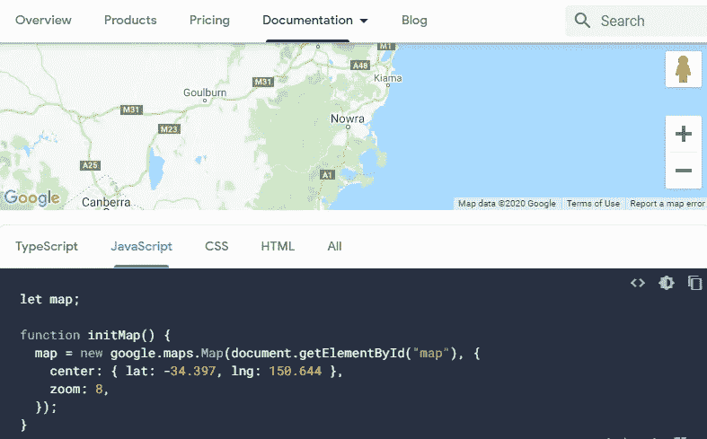

# 使用普通 JavaScript 嵌入谷歌地图 API

> 原文：<https://javascript.plainenglish.io/google-map-api-vanilla-javascript-f2984094f48f?source=collection_archive---------3----------------------->

I had no better images for the cover image. So I just captured to the Docs page 😆

这篇文章将指导你一步一步地做到以下几点

1.  在你的网站中嵌入谷歌地图(咄！).
2.  在您的谷歌地图中创建标记。
3.  更改标记的图标。
4.  点击获取该位置的坐标。

# 在你的网站中嵌入谷歌地图

在你的网站上嵌入谷歌地图。你的 HTML 和 js 代码应该是这样的。

我刚刚使用了谷歌地图提供的 API。如果您想了解更多关于此代码的信息，请访问此处。

# 在您的谷歌地图中创建标记。

要在谷歌地图中创建一个标记，你需要实例化
***标记*** 类，在 ***谷歌地图*** 名称空间下。

## 创建标记

上面的代码只会创建一个标记。您需要调用标记上的 ***setMap*** 函数。

在 **setMap** 函数中，需要 Map 的实例。

## 创建多个标记

要创建多个标记，只需创建标记类的多个实例，并简单地嵌入它，如下面的代码所示。

## 在地图标记中使用自定义图标

使用自定义图标与嵌入普通标记没有什么不同。只是对代码做了一点小小的改动。

您只需要在 Marker 的构造函数中的对象中添加 icon 属性。将***new-image.png***替换为您想要保留为自定义图标的图像 URL。

# 单击以获取地图中该位置的坐标

这是主要部分。我写这篇文章的主要动机是让我不断地参考获取地图上某个位置的坐标的代码。

我在这篇文章中加入加分项，只是作为谷歌地图 API 的一个用例

# 奖励:动态标记位置

您只需要使用***addListener*** 函数在地图中添加一个点击事件。

如上面的代码所示， ***e*** 对象带有 latLng 属性，该属性是一个对象，包含 ***lat*** 和***LNG****方法，该方法返回鼠标点击位置的经纬度。简单吗？*

*好了，我希望你学会了谷歌地图 api 函数，在你的网站上嵌入一个基本的交互式谷歌地图。*

*如果你在我上面的代码中发现任何错误。请务必提供反馈。我真的很感激。*

*谷歌地图 API 的一些有用链接:*

* [## 概述|地图 JavaScript API | Google 开发者

### 开始之前:在您开始使用 Maps JavaScript API 之前，您需要一个带有计费帐户和…

developers.google.com](https://developers.google.com/maps/documentation/javascript/overview#maps_map_simple-javascript)  [## 从点击事件中获取纬度/Lng |地图 JavaScript API

### 这个例子监听点击事件，从…

developers.google.com](https://developers.google.com/maps/documentation/javascript/examples/event-click-latlng)  [## 自定义谷歌地图:自定义标记|地图 JavaScript API

### 发送反馈本教程教你如何改变谷歌地图标记的图标。了解…是有益的

developers.google.com](https://developers.google.com/maps/documentation/javascript/custom-markers) 

*更多内容请看*[***plain English . io***](https://plainenglish.io/)*。报名参加我们的* [***免费周报***](http://newsletter.plainenglish.io/) *。关注我们关于*[***Twitter***](https://twitter.com/inPlainEngHQ)*和*[***LinkedIn***](https://www.linkedin.com/company/inplainenglish/)*。加入我们的* [***社区不和谐***](https://discord.gg/GtDtUAvyhW) *。**