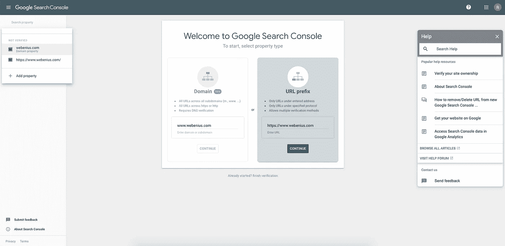
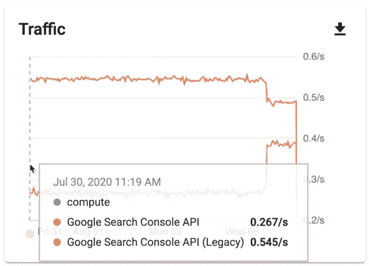
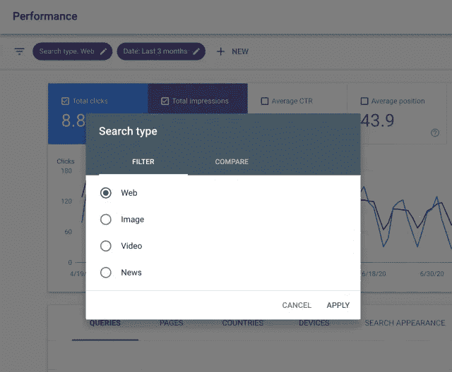
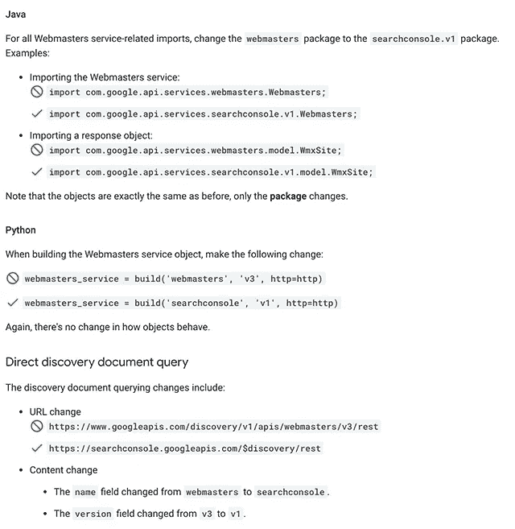

# Google 搜索控制台 API 更新

> 原文：<https://javascript.plainenglish.io/google-search-console-api-8b13128da267?source=collection_archive---------13----------------------->

## [软件工程](https://rakiabensassi.medium.com/list/software-engineering-7a179a23ebfd)

## 更新的数据、新闻过滤器和对 Sitemaps API 域属性的支持



Google Search Console (image by [author](https://medium.com/@rakia.bensassi))

谷歌的搜索控制台 API 本月收到了一个更新。此外，为了给我们更快更新鲜的数据和基于新闻过滤器过滤数据的可能性，现在在 Sitemaps API 中有对域属性的支持和对网站管理员发现文档的支持。

> “搜索控制台是一项免费服务，使您能够在谷歌搜索中监控您网站的性能，以确保谷歌能够正确搜索您的网站或应用程序，并测试给定页面的有效性和性能。”— [谷歌](https://developers.google.com/webmaster-tools)

搜索控制台 API 是一个为您提供各种评估和统计的界面，帮助您监控和管理您在 Google 搜索结果中的页面。



Google Search Console (image [source](https://developers.google.com/search/blog/2020/08/search-console-api-announcements))

# 新的数据和新闻过滤器

搜索控制台 API 已经扩展到包括新的数据和新闻过滤器。性能报告已经支持不到一天的数据。有了更新，开发人员现在可以选择通过 API 访问这些数据，方法是传递带有值`all`的请求参数`dataState`。返回的值还包含尚未最终确定的数据。如果您只想接收最终数据，可以用值`final`传递参数。另一方面，没有必要传输值，因为开发人员在默认情况下只接收最终的数据。

此次更新还为 API 引入了新的搜索类型过滤新闻。这使得在谷歌搜索中分析来自新闻的流量成为可能。开发人员可以通过将请求中的`searchType`参数的值设置为`news`来访问它。



Google Search Console: News Search Type (image [source](https://twitter.com/googlesearchc/status/1285559587576467456))

# 站点地图 API 中的域属性支持

域属性允许将搜索控制台中的多个属性合并为一个属性，以获得数据的聚合视图。Sitemaps API 现在支持域属性，就像其他搜索控制台 API 已经支持的那样。通过类似下面的请求，可以在域属性上查询、添加和删除您的站点地图:

```
GET [https://www.googleapis.com/webmasters/v3/sites/sc-domain:mywebsite.com/sitemaps](https://www.googleapis.com/webmasters/v3/sites/sc-domain:example.com/sitemaps)
```

# 发现文档迁移

搜索控制台 API 的开发团队将放弃对 Google 网站管理员发现文档的支持。使用外部 API 库查询搜索控制台 API 或直接查询文档的网站管理员应更新其 API 请求，以反映 API 库的以下更改:



Webmaster Discovery document — image [source](https://developers.google.com/search/blog/2020/12/search-console-api-updates)

有关谷歌搜索控制台 API 更新的更多信息，可以查看[谷歌搜索中心博客](https://developers.google.com/search/blog/2020/12/search-console-api-updates)。

🧠💡我为一群聪明、好奇的人写关于工程、技术和领导力的文章。 [**加入我的免费电子邮件简讯，独家获取**](https://rakiabensassi.substack.com/) 或在此注册 Medium [。](https://rakiabensassi.medium.com/membership)

*你可以在 Udemy 上查看我的* ***视频课程****:*[*如何识别、诊断、修复 Web Apps 中的内存泄漏*](https://www.udemy.com/course/identify-and-fix-javascript-memory-leaks/) *。*

[](https://medium.com/better-programming/javascript-history-and-future-71b0ceb737aa) [## JavaScript 的 25 年

### 从简单的脚本语言到每个现代 web 应用程序的基础

medium.com](https://medium.com/better-programming/javascript-history-and-future-71b0ceb737aa) [](https://medium.com/better-programming/build-me-an-angular-app-with-memory-leaks-please-36302184e658) [## 如何使用 Chrome DevTools 创建和修复内存泄漏

### 准备好提高您的 web 性能了吗？

medium.com](https://medium.com/better-programming/build-me-an-angular-app-with-memory-leaks-please-36302184e658)