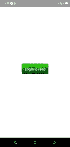
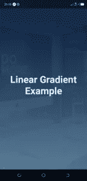
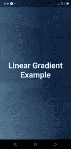

# React Native 中的渐变

> 原文：<https://javascript.plainenglish.io/gradients-in-react-native-cad860a65f3b?source=collection_archive---------4----------------------->


渐变在我们的应用中带来了丰富多彩的味道。因此，了解如何以及何时在您的移动应用程序中使用它们非常重要。在 React Native 中，渐变非常容易集成，在本文中，我们将详细描述如何实现它们。在 React Native 和 CSS 中主要有两种类型的线性渐变:线性和径向渐变

React Native 中用于生成渐变的两个最常用的 JavaScript 库是

```
expo-linear-gradient  and react-native-linear-gradient
```

它们非常相似，对于这篇关于 React Native 中渐变的文章，我们将使用 *expo-linear-gradient* 。


**安装:**

1.世博会:`expo install expo-linear-gradient`

2.对于裸项目:

*   安装和配置[单模块](https://github.com/unimodules/react-native-unimodules#-installation)
*   `expo install expo-linear-gradient`
*   *cd ios & & pod 安装*

渐变的第一个用例是让按钮看起来很坚固:



```
import React from "react";
import { StyleSheet, Text, View, Button } from "react-native";
import { LinearGradient } from "expo-linear-gradient";

function GradientExampleOne() {
  return (
    <View style={styles.container}>
      <LinearGradient
        colors={["#48F10E", "#078716", "#093203"]}
        style={styles.buttonContainer}
      >
        <Text
          style={styles.buttonText}
        >
          Login to read
        </Text>
      </LinearGradient>
    </View>
  );
}

const styles = StyleSheet.create({
  container: {
    flex: 1,
    backgroundColor: "#fff",
    alignItems: "center",
    justifyContent: "center",
  },
  buttonContainer: { 
    padding: 15, 
    alignItems: "center", 
    borderRadius: 5 
  },
  buttonText: {
    fontWeight: "bold",
    fontSize: 18,
    color: "#fff",
  }
});
```

颜色属性接受以线性渐变显示的颜色数组。

让我们用渐变做另一件好事:我们将结合一个图像与渐变，如下例所示:



现在，这是怎么回事？我们在图像背景上叠加一个渐变，一个反应原生组件，然后降低渐变的不透明度。然后我们将文本放在***linear gradient***的中心。

```
import React from "react";
import { StyleSheet, Text, View, ImageBackground } from "react-native";
import { LinearGradient } from "expo-linear-gradient";

function GradientExampleOne({ navigation }) {
  return (
    <View style={styles.container}>
      <ImageBackground source={require('./assets/workspace.jpg')} style={styles.imgBackground}>
        <LinearGradient
          colors={["#09203f", "#537895"]}
          start={[0.1, 0.1]}
          style={styles.linearGradient}
        >
          <Text style={styles.text} >Linear Gradient Example</Text>
        </LinearGradient>
      </ImageBackground>
    </View>
  );
}

const styles = StyleSheet.create({
  container: {
    flex: 1,
    backgroundColor: "#fff",
    alignItems: "center",
    justifyContent: "center",
  },
  imgBackground: {
    flex: 1,
    width: "100%",
    alignItems: "center",
  },
  linearGradient: {
    width: '100%',
    height: '100%',
    opacity: 0.95,
    justifyContent: 'center',
    alignItems: 'center'
  },
  text: {
    color: '#fff',
    fontSize: 40,
    fontWeight: 'bold',
    textAlign: 'center'
  }
});
```

我引入了一个道具 *start* ，这个 *start* 道具是一个数组，告诉渐变从哪里开始。第一个元素水平定位渐变(x 轴)，而第二个元素垂直定位渐变。

> *例如，* `*[0.1, 0.2]*` *表示渐变将从左侧开始 10%，从顶部开始 20%*

让我们看一些直观的例子:



这是一个从*开始* [0.9，0.9]的渐变的样子。

React Native 中的***linear gradient***易于无缝实现。我们用它们来使我们的按钮有一个坚实的外观和感觉。我们已经为我们的文本制作了一个清晰的 UI 背景，并查看了开始道具。

这就是你如何在 React Native 中实现渐变。如你所见，这非常简单。

*原载于 2020 年 5 月 3 日*[*https://www . insta mobile . io*](https://www.instamobile.io/mobile-development/gradients-react-native/)*。*