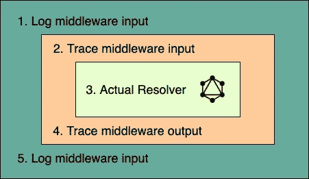

# GraphQL 最佳实践:将 graphql 中间件用于横切关注点

> 原文：<https://javascript.plainenglish.io/graphql-best-practices-use-graphql-middleware-for-cross-cutting-concerns-57de2aafbb7b?source=collection_archive---------4----------------------->

## 使用 graphql 日志记录中间件来委托日志记录，避免增加维护成本并保持代码模块化


Photo by [Evan Dvorkin](https://unsplash.com/@evphotocinema?utm_source=unsplash&utm_medium=referral&utm_content=creditCopyText) on [Unsplash](https://unsplash.com/s/photos/assembly-line?utm_source=unsplash&utm_medium=referral&utm_content=creditCopyText)

敏捷方法的信条之一强调快速迭代，包括交付和重构。大多数开发团队往往忽略的是导致大量杂乱代码的重构部分，这使得应用程序难以管理，GraphQL 服务器也不例外。

[交叉问题](https://en.wikipedia.org/wiki/Cross-cutting_concern)如果处理不好，会严重加剧这个问题，而且随着时间的推移，这些问题会变得更加严重

## 问题:

横切关注点，如日志、度量、跟踪、缓存、国际化和本地化等。如果没有在应用程序的架构和设计阶段进行规划，就开始逐渐进入代码库。应用程序可能很快开始让这种横切关注点的意大利面条式代码遍布整个代码库，导致 ***代码模块性的丧失和维护成本的增加***

## 解决方案:

使用 ***中间件*** 可以很好地封装横切关注点，由于其基于*洋葱原则*的行为，中间件是 web 应用服务器中广泛采用的模式。

> [GraphQL 中间件](https://github.com/prisma-labs/graphql-middleware#overview)是一个模式包装器，它允许你跨多个解析器有效地管理额外的功能。它们被应用于请求路径的向内指向的同心环和响应路径的向外指向的同心环。

```
const schema = applyMiddleware(originalSchema, logMiddleware, tracingMiddleware)
```

对于具有如上配置的日志和跟踪中间件的 GraphQL 服务器模式，解析器流程如图 1 所示



1\. Middlewares applied to a GraphQL resolver

## 日志中间件

应用程序最广泛使用的横切关注点是它的工具。我们将看到如何使用`graphql-pino-middleware`从 graphql 服务器中提取日志问题，并在 Graphql 解析器`context`上公开一个`pino`日志记录器，并避免与在应用程序的每一层配置日志记录器相关的样板文件

[](https://github.com/addityasingh/graphql-pino-middleware) [## 附加软件/图形输入中间件

### GraphQL 中间件，用于使用 pino 记录器检测解析器。该中间件旨在消除横切关注点…

github.com](https://github.com/addityasingh/graphql-pino-middleware) 

首先安装`graphql-pino-middleware`和`graphql-middleware`包并导入，实例化`pino`中间件

```
yarn add graphql-pino-middleware graphql-middleware// server.ts
import graphqlPinoMiddleware from "graphql-pino-middleware";
import { applyMiddleware } from "graphql-middleware";const pinoMiddleware = graphqlPinoMiddleware();
```

使用`typedefs`和`resolvers`创建模式，并应用`graphql-pino-middleware`创建支持登录解析器上下文的模式

```
import { makeExecutableSchema } from "graphql-tools";// Construct a schema, using GraphQL schema language
const typeDefs = `
  type Query {
    hello(name: String): String
  }
`;const resolvers = {
  Query: {
    hello: (parent, args, context) => {
      return `Hello ${args.name ? args.name : "world"}!`;
    }
  }
};const schema = makeExecutableSchema({ typeDefs, resolvers });// apply the middleware to the schema
const schemaWithLogger = applyMiddleware(
  schema,
  pinoMiddleware
);// Use the schema in your graphql server
const app = express();
app.use("/graphql", graphqlExpressHttp({
    schema: schema,
    rootValue: resolvers,
    graphiql: true
  })
);app.listen(4001, () => {
  console.log('Graphql server running at port 4001')
})
```

有了这个设置，现在`logger`出现在解算器的`context`上，可以用于记录。我们将更新`Query.name`字段的解析器，如下所示，以记录结果

```
const resolvers = {
  Query: {
    hello: (parent, args, context) => {
      const result = `Hello ${args.name ? args.name : "world"}!`;
      context.logger.info("Result for field hello is "+ result);
      return result;
    }
  }
};
```

这种中间件的设置现在允许我们从解析器、模型和连接器使用 GraphQL 服务器应用程序的每一层上的记录器。这避免了在应用程序的每一层初始化日志记录器的需要，从而产生模块化的应用程序特定代码，并控制维护成本。

与`graphql-pino-middleware`类似，您也可以使用`graphql-lightstep-middleware`通过`lightstep`跟踪为您的解析器提供工具，以便打开跟踪

[](https://github.com/addityasingh/graphql-lightstep-middleware) [## addit as Singh/graph QL-light step-中间件

### GraphQL 中间件使用 open tracing traces for light step collector 来检测解析器

github.com](https://github.com/addityasingh/graphql-lightstep-middleware) 

## 参考

1.  [Prisma GraphQL 中间件](https://github.com/prisma-labs/graphql-middleware)
2.  [软件横切关注点](https://en.wikipedia.org/wiki/Cross-cutting_concern)