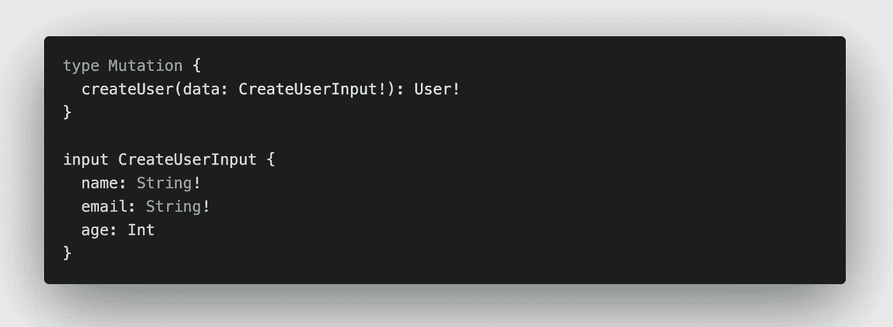
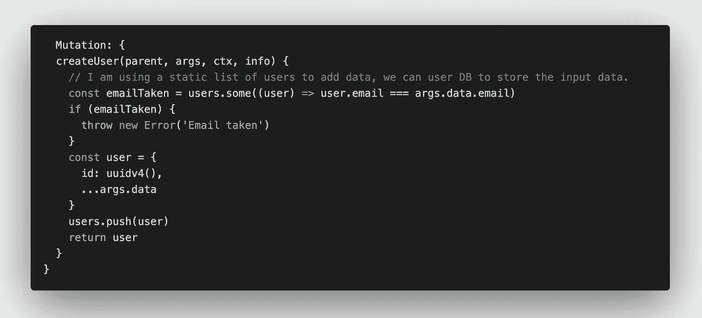
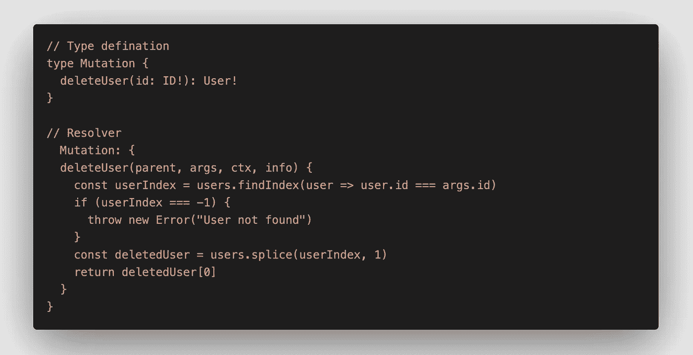
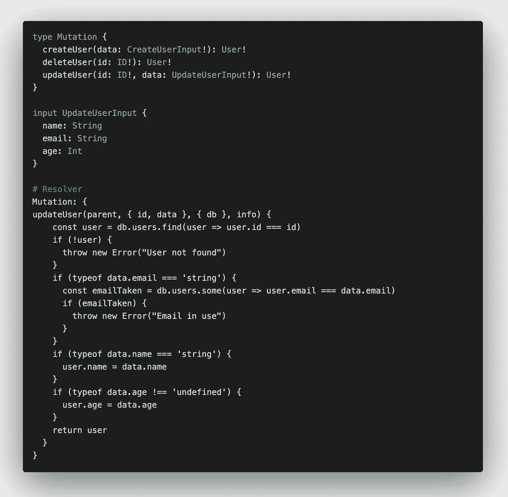
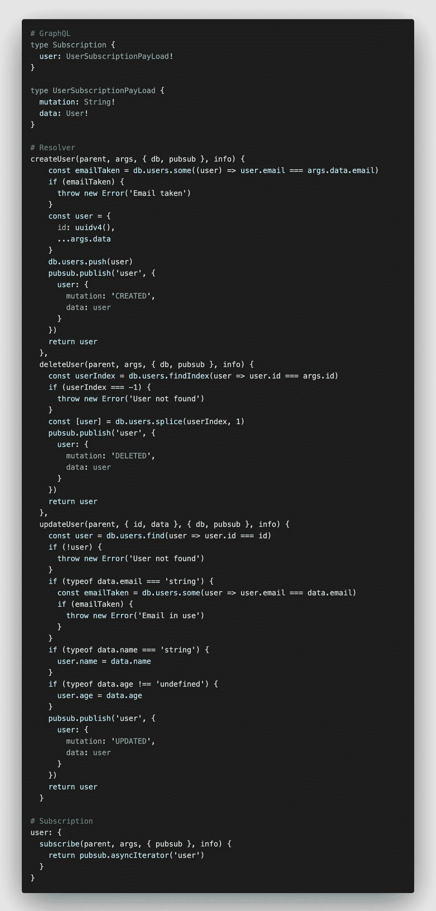

# GraphQL 变异和订阅

> 原文：<https://javascript.plainenglish.io/graphql-mutation-subscription-4f9b6f086d9d?source=collection_archive---------9----------------------->

## 理解 GraphQL 的基本和高级概念

> **GraphQL** 通俗地说就是一种带有运行时的查询语言，使用 API 来查询现有数据，客户端有权力询问到底需要什么。这使得 API 随着时间的推移而进化。更多可以在这里了解到。

在本文中，我们将讨论如何使用**突变**和**订阅**类型来操作和观察数据的变化。

## 变化

在使用 GraphQL 时，我们需要通过编辑、删除和添加数据来更改数据，这可以使用 mutation 来完成。处理 **CUD** 操作是 GraphQL 的核心特性。下面的代码用来给**添加**数据。

所有的变异都将在**类型变异**下定义，就像查询在**类型查询下定义一样。**客户端将向用户发送不可为空的数据，数据保存后将接收一个新用户。类型**输入**是构造操作参数的一种高级方法。请记住，自定义类型不能成为变异中参数列表的一部分。

接下来，定义一个**解析器**方法作为变异，就像我们在**查询**中定义解析器一样，然后实现这个方法。

对于**删除** a 数据，我们必须遵循在类型**变异**中定义方法并在解析器中实现它的相同过程。我们可以相应地修改删除代码，因为我使用了一个静态用户列表来存储数据。

对于**更新**数据，我们必须遵循相同的步骤，即在类型**变异**中定义方法，并在**解析器**中实现方法。对于这个例子，我修改了代码并使用 GraphQL 上下文来传递数据的静态列表( **db** )，使用了输入类型 **UpdateUserInput** ，它不应该为 null，因为用户可以更新一些或所有参数，并使用了析构运算符。看看吧:)

## 捐款

顾名思义，我们可以订阅数据更改，这允许我们与客户端和服务器进行实时通信。假设我们必须创建一个用户，为此我们将触发一个 **createUser API** 并创建用户，但是当将来这个用户数据被修改或删除时会发生什么，没有办法得到通知。我们必须启动相同的 **getUser** **API** 查询来获取更新的数据。**订阅**是为了拯救，它在后台使用 web sockets，使用客户端和服务器之间的开放通信通道，这可以用于聊天应用程序、实时订购应用程序等等。在本例中，我们必须订阅用户，因此当与任何用户相关的数据发生变化时，服务器会向所有订阅的客户端发送一条消息，该消息可以在 UI 中呈现。让我们看看它的运行情况；)

> 在这个例子中，我使用全功能的 GraphQL 服务器 [**GraphQL-Yoga**](https://github.com/prisma-labs/graphql-yoga) 。我将使用[**graph QL-Subscription**](https://github.com/apollographql/graphql-subscriptions)库，帮助使用 publibsubutility 的整个应用程序进行通信。这可以通过在应用程序的上下文中重新注册 PubSub 对象来完成。

## 代码解释

用户方法有一个只有一个方法的对象。每次客户端订阅用户时，这个 subscribe 方法都会运行。这个方法将保持所有前面的 4 个属性作为变异解析器方法。因为我们已经在 GraphQL 上下文中绑定了 pubsub 方法，所以我们可以析构它并使用它的 **asyncIterator** 方法，该方法只有一个参数通道名。一旦订阅，它将开始监听发布的数据。通道名必须是唯一的，我们可以从数据已经改变的突变方法中发布它，如 **createUser** 、 **deleteUser** 和 **updateUser** 。publish 方法将通道名称和要发布的对象作为属性。我们在发布的数据上增加了一个**突变**属性，用于跟踪 CUD 操作类型，并增加了**数据**属性，用于发送修改后的数据。

我在本文中使用了 GraphQL 节点客户端，而 [uuid](https://www.npmjs.com/package/uuid) 是获取唯一 id 的节点插件。请在这里填写自由玩代码

不断学习，不断探索。
快乐编码，尽情享受！

## **用简单英语写的 JavaScript 笔记**

我们已经推出了三种新的出版物！请关注我们的新出版物:[**AI in Plain English**](https://medium.com/ai-in-plain-english)[**UX in Plain English**](https://medium.com/ux-in-plain-english)[**Python in Plain English**](https://medium.com/python-in-plain-english)**——谢谢，继续学习！**

**我们也一直有兴趣帮助推广高质量的内容。如果您有一篇文章想要提交给我们的任何出版物，请发送电子邮件至[**submissions @ plain English . io**](mailto:submissions@plainenglish.io)**，并附上您的 Medium 用户名，我们会将您添加为作者。此外，请让我们知道您想加入哪个/哪些出版物。****