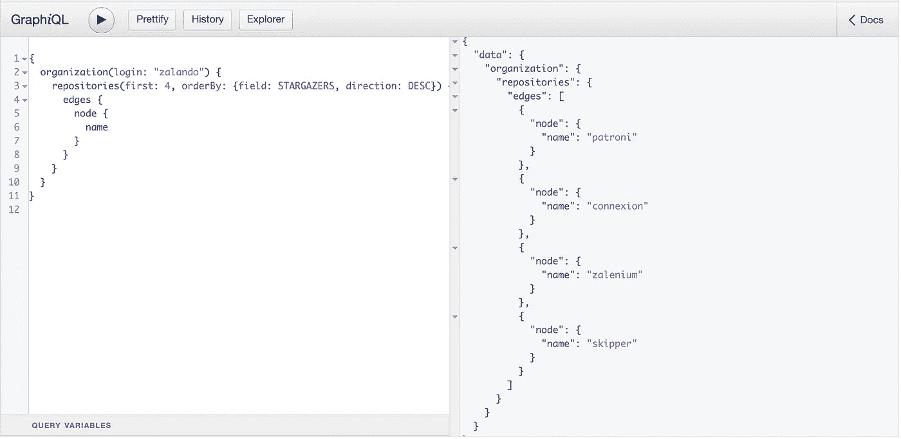
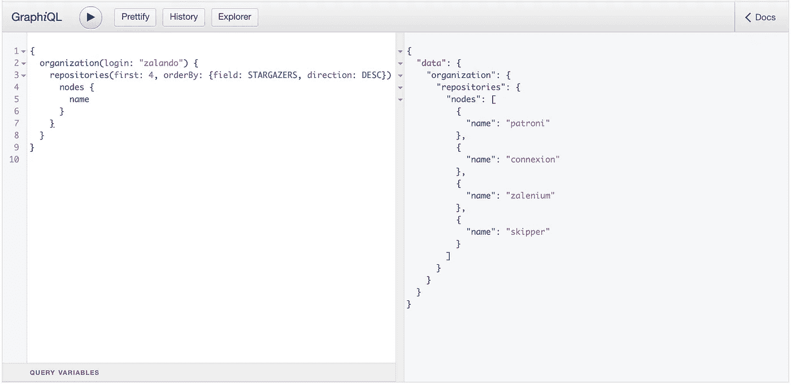

# GraphQL 分页最佳实践:在连接中使用边和节点

> 原文：<https://javascript.plainenglish.io/graphql-pagination-using-edges-vs-nodes-in-connections-f2ddb8edffa0?source=collection_archive---------1----------------------->


Photo by [Sam Erwin](https://unsplash.com/@s_erwin?utm_source=unsplash&utm_medium=referral&utm_content=creditCopyText) on [Unsplash](https://unsplash.com/s/photos/web?utm_source=unsplash&utm_medium=referral&utm_content=creditCopyText)

在技术上没有放之四海而皆准的解决方案，每一个选择都需要权衡。了解我们工具的注意事项有助于我们选择问题的最佳解决方案。GraphQL 连接也是如此。尽管 graphql connections 为我们提供了许多有用的[好处](https://graphql.org/learn/pagination/#complete-connection-model)，但为生产就绪的 graphql API 设计它们仍然很麻烦。

GraphQL 中分页的当前前景受到连接的[中继规范](https://facebook.github.io/relay/graphql/connections.htm)的巨大影响。GraphQL 连接使用基于光标的分页，与基于偏移量的分页相比，它非常适合大型数据集(查看这篇关于此主题的优秀文章[和](https://slack.engineering/evolving-api-pagination-at-slack-1c1f644f8e12))。自从脸书创建了 GraphQL，推荐的连接中继规范就被采纳为 GraphQL 分页的事实上的标准。

GraphQL 旨在让前端开发人员更容易使用 API，Relay 规范的部分内容与此相矛盾。来自 GraphQL 规范:

> [**以产品为中心的** : GraphQL 是由视图和编写视图的前端工程师的需求驱动的。](https://graphql.github.io/graphql-spec/draft/#sel-EADRDDAAACBvDgrB)

## 问题:

我们发现我们组织中 GraphQL API 的消费者一直感到困惑的事情之一是**在使用** `**connection.**`时对中间 `**edges**` **的需求，因为我们在 API 中使用 Relay spec 进行连接，所以我们以前从未考虑过这个问题。连接的继电器规范建议**

> 连接类型必须具有名为`edges`和`pageInfo.`的字段，边缘类型必须具有名为`node`和`cursor`的字段。

假设我们必须为`organization.repositories`设计 Github 的 GraphQL 模式。这种模式的模式定义语言(SDL)模式如下所示:

```
type Query {
    organization(name: String): Organization
}type Organization {
   repositories(
      first: Int
      after: Int
      last: Int
      before: Int
   ): RepositoriesConnection
}type RepositoriesConnection {
    edges: [RepositoryEdge!]!
    pageInfo: PageInfo
    totalCount: Int
}type RepositoryEdge {
    node: Repository!
    cursor: PageInfo
}type Repository {
    name
    ... other fields for repository
}
```

通常的连接查询如下所示



Query connection.edges for repository of organization Zalando

这无意中迫使大多数 GraphQL API 消费者使用这种方式访问节点上的信息，即使他们可能不需要下一页的连接上的`cursor`

```
const response = await getGraphqlResponse(query);
const repos = response.data.organization.repositories;
const repoNames = repos.edges.map(edge => edge.node.name)
```

## 解决办法

经过思考、讨论和研究，我们找到了一个从消费者的角度来看实用且语义直观的解决方案。我们决定在我们的关系上与`Connection.edges`一起支持`Connection.nodes`。这解决了我们的消费者必须在连接上访问中间`edges`的目的。连接的模式定义如下所示

```
...type RepositoriesConnection {
    edges: [RepositoryEdge!]!
    nodes: [Repository!]! ## allows to directly access Repository
    pageInfo: PageInfo
    totalCount: Int
}...
```

从连接中获取存储库名称的查询被简化了很多，如下所示



Query connection.nodes for repository of organization Zalando

并且在代码中访问它不那么麻烦

```
const response = await getGraphqlResponse(query);
const repos = response.data.organization.repositories;
const names = repos.nodes.map(node => node.name);// No `edge` needed
```

这个模型非常成功，Github 已经在他们的 GraphQL API 上支持它了。以上截图摘自 [Github 的 GraphQL v4](https://developer.github.com/v4/explorer/)

## 建议:

但是`Connection.nodes`不是银弹，也不能取代对`Connection.edges`的需求。当您需要用`cursor`对一个非常大的连接对象进行分页时，边仍然是您的 goto 解决方案。

> *"当您有一个有限的列表要使用，但不需要光标分页时，请使用* `*Nodes*` *。当你有一个大的列表并且你需要知道光标来分页时，使用* `*Edges*`

## *参考资料:*

1.  *[GraphQL 规格](https://graphql.github.io/graphql-spec/draft)*
2.  *[解释 GraphQL 连接](https://blog.apollographql.com/explaining-graphql-connections-c48b7c3d6976)*
3.  *[继电器图 QL 连接规范](https://facebook.github.io/relay/graphql/connections.htm)*
4.  *[在空闲时发展 API 分页](https://slack.engineering/evolving-api-pagination-at-slack-1c1f644f8e12)*