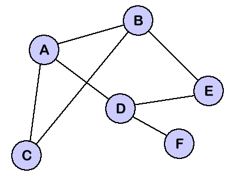
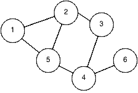

# 图表:广度优先搜索与深度优先搜索

> 原文：<https://javascript.plainenglish.io/graphs-breadth-first-search-vs-depth-first-search-d9908c560642?source=collection_archive---------0----------------------->


Photo by [Armand Khoury](https://unsplash.com/@armand_khoury?utm_source=unsplash&utm_medium=referral&utm_content=creditCopyText) on [Unsplas](https://unsplash.com/s/photos/graph?utm_source=unsplash&utm_medium=referral&utm_content=creditCopyText)

## 虽然数组和哈希完全能够处理我们的许多数据需求，但随着所需信息变得越来越复杂，它们开始出现问题。

数组对于查找数据非常有用，但是添加或删除数据的成本很高。散列很容易添加或删除，但搜索起来代价很高。两者都可以显示简单的关系，但是随着这些关系以及与之相关的数据变得更加复杂，阅读和遍历变得更加困难。

数组和散列可以用来创建数据结构，而不是 Ruby 提供给我们的类，比如链表、树和图。在这篇博文中，我们将关注图表。我们将介绍如何在 Ruby 中恰当地表示一个图，以及两种最常见的图搜索算法:广度优先搜索和深度优先搜索。

# 图表示

简单来说，计算机科学中的一个图就是一组相连的项目的集合。我们称这些项目为**节点**或**顶点**，它们由**边**连接。例如，在脸书上，两个用户各自用一个顶点来表示，他们的友谊状态用一条边来表示。这种连接允许像“你可能认识的人”这样的功能，以及与其他用户查看共同的朋友。



在左边的图中，顶点是: **A、B、C、D、E 和 f。**

边是你看到的所有连接顶点的线: **A-B，A-C，A-D，B-C，B-E，D-E，D-f。**

在这样的可视化表示中很容易看到这一点，但是我们如何以编程方式表示这个图呢？顶点可以存储在一个数组中:

```
vertices = ['A', 'B', 'C', 'D', 'E']
```

目前这是可行的，但是当我们开始遍历图形时，我们会看到我们实际上想要将数据与每个节点相关联，因此散列数组(其中每个散列代表一个节点)确实是更好的选择。

边也可以存储在数组中，但这一次，我们将使用数组的数组:

```
edges = [
    ['A', 'B'], ['A', 'C'], ['A', 'D'], ['B', 'C'], ['B', 'E'],
    ['D', 'E'], ['D', 'F']
]
```

太好了！我们现在知道如何用程序来表示我们的图表。我们可以很容易地返回一个节点的所有子节点，找出哪些节点是这个图上的顶点，等等。但我们在这里能做的肯定有限。随着这个图的缩放，当节点不相邻时，像查找两个节点之间的最短路径，以及查找是否有路径这样的事情变得更加复杂。

进入广度优先搜索和深度优先搜索，这是遍历图的两个最流行的算法。维基百科给出了计算机科学中图形遍历的如下定义:

> 在计算机科学中，**图遍历**(也称为**图**搜索)是指访问(检查和/或更新)一个**图**中每个顶点的过程。这种遍历按照顶点被访问的顺序进行分类。

每一个都代表了一种不同的方法来遍历或访问一个图的每个顶点。

# 横向优先搜索

BFS 指的是一种遍历图的方法，即先访问一个节点的所有子节点，然后再访问该子节点的子节点。你可以用层次来思考。如果根节点是第 1 层，则访问第 2 层的所有节点，然后是第 3 层的所有节点，第 4 层的所有节点，依此类推。



在上图中，给定根节点 1，我们将从标记为 1 的节点开始。节点 1 将被视为“已访问”，然后我们将访问节点 1 的每个子节点，即节点 2 和节点 5。既然我们已经访问了节点 1 的所有子节点，节点 1 将被视为“已浏览”，节点 2 和 5 将被视为“已访问”。然后，我们将访问节点 2 的未访问的子节点，这里是节点 3。现在浏览节点 2，并访问节点 3。

我们将返回节点 5，并访问节点 5 的子节点，而不是转到节点 3 的子节点。同样，我们在继续之前访问每个“级别”，这里 2 和 5 是同一级别。因此，我们访问节点 4，并将节点 5 标记为已浏览。

现在我们回到节点 3 去访问它的未被访问的子节点，但是它没有子节点，所以我们把它标记为 explored 并回到节点 4。我们找到节点 4 的唯一子节点节点 6，将其标记为已访问，并将节点 4 标记为已浏览。然后，我们看到节点 6 没有子节点，并且没有其他未访问的顶点需要浏览，因此我们将节点 6 标记为已浏览，我们的算法完成。

如果一开始觉得很困惑，没关系。当顶点被标记为 explored 时，尝试重新创建图形，您将看到我们在这里移动的模式。

# 深度优先搜索

BFS 是一层一层地走下去的，而 DFS 则是沿着一个孩子的路走下去，从根到尾，然后再回到另一个孩子的路上。


使用与上面相同的图，给定根节点 1，我们将再次从标记为 1 的节点开始，并访问节点 1 的每个子节点，节点 2 和节点 5。我们不是访问节点 2 的未访问子节点，然后再访问节点 5 的未访问子节点，而是访问节点 2 的未访问子节点，并继续探索该路径，直到到达终点，然后返回节点 5。

我们从节点 2 访问节点 3，并将节点 2 标记为已浏览。从节点 3 开始，我们访问节点 4 并将节点 3 标记为已浏览，从节点 4 开始，我们访问节点 6 并将节点 4 标记为已浏览。我们现在看到我们从节点 6 无处可去，所以我们将它标记为已浏览，并返回到节点 5。因为节点 5 的子节点已经被访问过，我们将节点 5 标记为已浏览，我们的算法完成。

# 差别

您可以看到，改变遍历方法会导致在算法的不同点浏览节点。这是一个简单的图表，因此差异很小，但下面是使用每种算法标记浏览的顶点的顺序:

```
BFS: 1, 2, 5, 3, 4, 6DFS: 1, 2, 3, 4, 6, 5
```

请注意，节点 5 从第三个被探索的顶点到最后一个。随着图形变得越来越大、越来越复杂，这些差异就变得越来越大。下周，我们将使用 Ruby 实际编写 BFS 和 DFS 算法的代码。