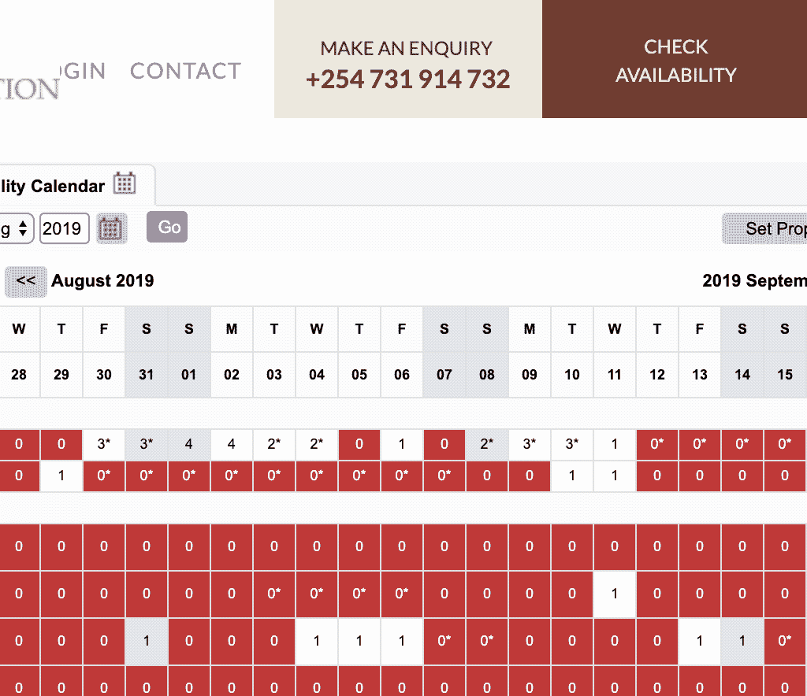

# 用 JavaScript 入侵我的蜜月🦒

> 原文：<https://javascript.plainenglish.io/hacking-my-honeymoon-with-javascript-c4c476f7584b?source=collection_archive---------1----------------------->

## 我如何使用 web scraper、cron 和 SMS 通过非传统方法预订房间

Photo by [Tobin Rogers](https://unsplash.com/@tobinrogers?utm_source=unsplash&utm_medium=referral&utm_content=creditCopyText) on [Unsplash](https://unsplash.com/search/photos/giraffe?utm_source=unsplash&utm_medium=referral&utm_content=creditCopyText)

当我妻子在 Instagram 上看到这个帖子时，她立刻就被迷住了:

我们在肯尼亚的蜜月即将来临，我们开始预订房间。咨询了年前去过肯尼亚的阿姨，她留在了这里，订票没有困难。当我们听说这个地方在一两年前就被预订一空时，我们大吃一惊。

突然流行一定是有原因的。一些调查显示这个地方最近被艾伦·T4 占领了。

该死的艾伦。

起初，我们查看他们的网站，看看我们在肯尼亚的日期是否可用，运气不好。然后我们给庄园发了电子邮件，还是没有，我们被告知我们被列入了他们的“等候名单”。很可能与候选名单上的其他人竞争，我们的旅行只有几个月了，我和我妻子的希望变得渺茫。

# 寻求解决方案

他们用来显示空房的网站是只读的，没有预订房间的功能。

电话和电子邮件是联系他们的唯一方式，这是一个缓慢而艰难的过程。我认为当约会变得空闲时，他们的网站会首先更新*和*，然后*他们会开始联系候补成员。这样，如果人们错过了，他们仍然会得到预订。*

# *假设*

*我接下来假设的是，如果我们在空房那天联系他们，我们可能会绕过等候名单。但是每小时查看网站并不有趣。*

*我穿上我的程序员裤，认为这将是一个很好的 web-scraper 的用例， *jazz hands* 。每 30 分钟访问一次网站，给我和我妻子的手机发短信，这样我们就可以给他们打电话了。这个 1990 年的肯尼亚网站不太可能有针对机器人的保护。*

*看似简单的桌子，结果却是简单的桌子:*

*这是我需要找到的，如果节点文本是`1`，它是可用的。*

*在研究了简单的 html 结构之后，我开始编写 Node.js 服务来废弃它。我偶然发现了一个 NPM 模块，[爬虫](https://www.npmjs.com/package/crawler)，它给了我开箱所需的一切。*

*这需要一点调试，但现在我有了长颈鹿庄园网站的 HTML 可以玩了。*

*接下来，我用一个叫做 [cheerio](https://www.npmjs.com/package/cheerio) 的 NPM 包搜索结果。*

*现在有趣的部分来了，当房间显示有空房时，给我妻子发短信。为此我使用了 Twilio，但是还有很多其他的服务。这需要建立一个免费账户，我知道我不会发送超过几条短信。*

*在测试了几个没有预定的日期后，它成功了！现在安排它每 5 分钟运行一次(为什么不呢？).*

*为了托管和运行代码，我选择了 Heroku，因为我有这方面的经验，并且知道免费层可以满足我的需要。我不知道他们的免费层如何支持后台服务工作，但无论如何。*

*几个星期后，(实际上我忘了它还在运行)，我妻子的手机收到了这条短信！我们马上给他们打电话，拿到了！似乎绕过了等候名单，就像我们希望的那样。她收到了一大堆短信，用光了我在 Twilio 上的免费层，因为当它找到一个可用的空间时，我没有编写 stop 方法🤣*

*我特别喜欢这样做，因为我并不经常用编码来解决生活中的问题，但我认为对于这样的图片来说这是值得的:*

**

*这是我如何用我的编程技能解决“真实”世界问题的一个例子。我很想听听你可能已经解决的问题，请在这里评论。*

*https://github.com/aleccool213/giraffe-manor-ping[的代号](https://github.com/aleccool213/giraffe-manor-ping)*