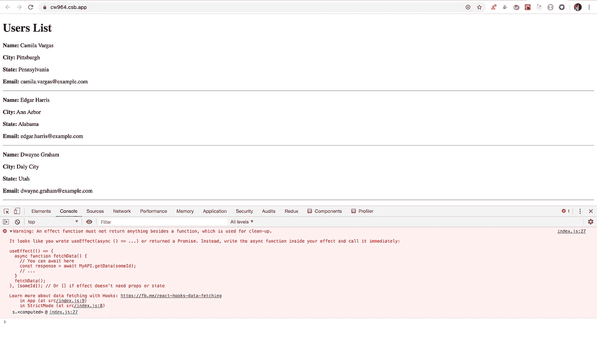

# 使用带有 useEffect 挂钩的异步 await 处理 API 调用

> 原文：<https://javascript.plainenglish.io/handling-api-calls-using-async-await-in-useeffect-hook-990fb4ae423?source=collection_archive---------0----------------------->

## 理解对 useEffect 函数直接使用 async 关键字的问题


Photo by [Clément H](https://unsplash.com/@clemhlrdt?utm_source=medium&utm_medium=referral) on [Unsplash](https://unsplash.com?utm_source=medium&utm_medium=referral)

如果您是`async await`语法的粉丝，您可以尝试在`useEffect` hook 中使用它，但是它并不像预期的那样工作。在本文中，我们将看到如何处理这个问题。

让我们先用 promises 写一些代码，然后我们将把它转换成 async-await。

我们将调用 API 来显示 10 个随机用户。

```
useEffect(() => {
 axios.get('https://randomuser.me/api/?page=1&results=10&nat=us')
  .then(response => {
   setUsers(response.data.results);
 });
}, []);
```

演示:[https://codesandbox.io/s/laughing-bhaskara-dwi0d](https://codesandbox.io/s/laughing-bhaskara-dwi0d)

在这个`useEffect`钩子中，我们提供了一个空数组`[]`作为第二个参数，这样当组件被挂载时`useEffect`中的代码将只运行一次，这是在 react 钩子中实现`componentDidMount`生命周期方法的一种方式。

现在，让我们将相同的代码转换为异步 await 语法。

```
useEffect(async () => {
  const users = await axios.get("https://randomuser.me/api/?page=1&results=10&nat=us");
  setUsers(users.data.results);
}, []);
```

演示:[https://codesandbox.io/s/lively-sound-cw964](https://codesandbox.io/s/lively-sound-cw964)

这里，我们将`useEffect`回调函数设为异步，这样我们就可以在其中使用 await 关键字。

但是，如果您运行该应用程序，您将在控制台中看到一条警告

现场演示:[https://cw964.csb.app/](https://cw964.csb.app/)



> 在 React 中，用红色显示的每个警告都应该被修复，因为它可能会影响性能或应用程序行为，或者可能是改进应用程序的建议。

*上面代码的问题是，当我们声明一个异步函数时，它会返回一个承诺*

看看下面的代码。

```
const getResults = async () => { return "Hello"; };const App = () => {
 const result = getResults();
 console.log(result);
 return null;
};
```

演示:[https://codesandbox.io/s/busy-rgb-pdqgz](https://codesandbox.io/s/busy-rgb-pdqgz)

如果您打开控制台，您会看到，打印的结果不是字符串“Hello ”,而是一个承诺。

为了获得实际值，我们需要将`then`处理程序附加到函数调用上。

```
const getResults = async () => { return "Hello"; };const App = () => {
 getResults().then(response => console.log(response));
 return null;
};
```

演示:[https://codesandbox.io/s/trusting-curran-5qorx](https://codesandbox.io/s/trusting-curran-5qorx)

现在，我们在控制台中获得了实际值“Hello”。

*但是我们不能将* `*then*` *句柄附加到* `*useEffect*` *钩子上，因为传递给 useEffect 的函数除了清理效果函数*之外不应该返回任何东西

所以有一些方法可以解决这个问题。

1.  **在 useEffect 之外创建一个单独的异步函数，并从 useEffect:** 中调用它

```
const getUsers = async () => {
 const users = await axios.get('https://randomuser.me/api/?page=1&results=10&nat=us');
 setUsers(users.data.results);
};useEffect(() => {
 getUsers();
}, []);
```

演示:【https://codesandbox.io/s/eloquent-solomon-o32gn 

2.**在 useEffect 中创建一个单独的异步函数，并从 useEffect 中调用它:**

```
useEffect(() => {
  const getUsers = async () => {
    const users = await axios.get("https://randomuser.me/api/?page=1&results=10&nat=us");
    setUsers(users.data.results);
  }; getUsers();
}, []);
```

演示:[https://codesandbox.io/s/trusting-mclaren-p77vn](https://codesandbox.io/s/trusting-mclaren-p77vn)

3.**使用 IIFE(立即调用的函数表达式):**

```
useEffect(() => {
 (async () => {
  const users = await axios.get("https://randomuser.me/api/?page=1&results=10&nat=us");
  setUsers(users.data.results);
 })();
}, []);
```

演示:[https://codesandbox.io/s/distracted-sky-d8qgn](https://codesandbox.io/s/distracted-sky-d8qgn)

今天到此为止。希望你今天学到了新东西。

**别忘了订阅我的每周简讯，里面有惊人的技巧、窍门和文章，直接在这里的收件箱里** [**。**](https://yogeshchavan.dev/)