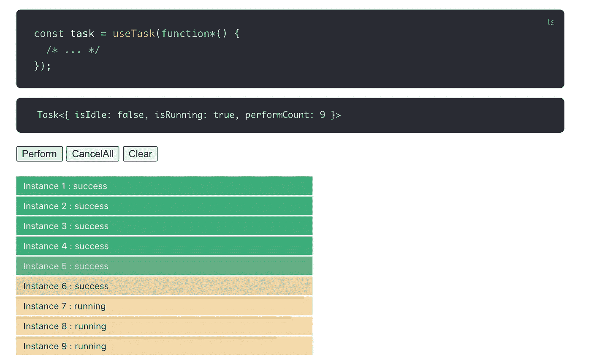

# 在 Vue 3 /组合 API 中处理异步

> 原文：<https://javascript.plainenglish.io/handling-asynchrony-in-vue-3-composition-api-part-1-managing-async-state-e993842ebf8f?source=collection_archive---------0----------------------->

## 第 1 部分:管理异步状态



Reactive state in vue-concurrency

几个月前，在工作中，我们决定全力以赴开发我们产品的新版本。

据我所知——看看新出现的插件，看看 discord 社区中的所有讨论——复合 API 变得越来越流行。不仅仅是我们。

Composition API 使许多事情变得更容易，但它也带来了一些挑战，因为有些事情需要重新考虑如何适应这个新概念，并且在建立最佳实践之前可能需要一些时间。

挑战之一是管理状态，尤其是当涉及到异步时。

我将尝试展示不同的方法，包括我创建并维护的 [vue-concurrency](https://github.com/MartinMalinda/vue-concurrency) 。

# 管理异步状态

你可能会问有什么需要管理的？组合 API 足够灵活，这应该不是问题。

最典型的异步操作是向服务器发出 AJAX 请求。在过去的几年中，AJAX 的一些一般性问题已经得到解决或缓解。回调地狱被承诺扑灭了，这些承诺后来被加入了 async/await。Async/await 非常棒，与几年前编写的原始回调 hell spaghetti 相比，代码读起来是一种享受。

但事实是，现在情况好多了，并不意味着没有改进的空间。

# 异步函数/承诺不跟踪状态

当你带着承诺工作时，有一个`promise.then`、`promise.catch`、`promise.finally`，就是这样。您无法访问`status`或某些`isPending`属性和其他国家属性。这就是为什么您经常必须自己管理这种状态，并且使用 Composition API，您的代码可能如下所示:

这里我们将类似`isLoading` `error` `data`的引用传递给模板。`getUsers`功能也被传递，以允许在出现错误的情况下重试操作。你可能认为上面的代码仍然很合理，在很多情况下，我同意你的观点。如果异步逻辑不太复杂，像这样管理状态仍然是可行的。

然而，我在上面的代码中隐藏了一个逻辑错误。你能发现它吗？

`isLoading.value = false;`仅在成功加载数据后发生，但在出现错误时不会发生。如果服务器发送错误响应，视图将永远停留在 spinner land。

这是一个微不足道的错误，但如果你一遍又一遍地重复这样的逻辑，这是一个容易犯的错误。

在这种情况下，消除样板代码也意味着消除出现逻辑错误、打字错误等的机会。让我们看看如何减少这种情况的不同方法:

## 自定义钩子:useAsync，usePromise 等等

你可以创建你自己的钩子，你自己的`use`函数来包装上面的逻辑。或者您可以从现有的 composition API 实用程序库中选择一个解决方案:

**vue-use—**[use sync state](https://vueuse.js.org/?path=/story/state--useasyncstate)

```
const { state, ready } = useAsyncState(
      axios
        .get('https://jsonplaceholder.typicode.com/todos/1')
        .then(t => t.data),
      {
        id: null,
      },
    )
```

优点:简单，接受简单的承诺。**缺点:**没办法重试。

**vue-composition-toolkit**—[useAsyncState](https://github.com/HcySunYang/vue-composition-toolkit/blob/master/src/useAsyncState.ts)

```
const { refData, refError, refState, runAsync } = useAsyncState(() => axios('https://jsonplaceholder.typicode.com/todos/1'))
```

**优点:**覆盖所有州。**缺点:**也许冗长的命名？

## **<** [**悬念**](https://v3.vuejs.org/guide/component-dynamic-async.html#using-with-suspense) **/ >**

悬念是一个新的 API，最初来自 React land，它以一种稍微不同的、相当独特的方式解决了这个问题。

如果要使用悬念，我们可以直接在设置函数中使用 async / await 来开始:

但是等等，目前为止还没有`<Suspense>`被使用！这是因为它实际上会在相对于这个组件的父组件中使用。暂停有效地观察其默认槽中的组件，并且如果任何组件承诺没有实现，则可以显示回退内容:

在这种情况下，`<Suspense>`在`<Admins />`和`<Users />`等待承诺的实现。如果任何 promise 被拒绝或者抛出了其他错误，它会在`[onErrorCaptured](https://v3.vuejs.org/api/composition-api.html#lifecycle-hooks)`钩子中被捕获并设置为 ref。

这种方法比上面概述的钩子有一些好处，因为这些钩子通过返回`ref`来工作，因此在你的`setup`函数中，你必须考虑到引用还没有被数据填充的可能性:

```
setup() {
  const { refData: response } = useAsyncState(() => ajax('/users');
  const users = computed(() => response.value
                                 && response.value.data.users);
  return { users };
} 
```

有了 TS 链接操作符，它可能就变成了`response.value?.data.users`。但是，使用`<Suspense />`你不需要处理`ref`，在这种情况下你甚至不需要`computed`！

```
const response = await ajax('/users');
const { users } = response.data;
return { users }; 
```

**优点:**

*   平原`async / await`直接在设置功能！
*   没必要用那么多`ref`和`computed`！

**缺点:**

*   按照设计，逻辑必须分成两个(或更多)组件。错误处理和加载视图必须在父组件中处理。
*   数据加载是在子组件中完成的，而加载/错误处理是在父组件中完成的，这一事实起初可能是违反直觉的
*   错误处理需要通过一些额外的样板代码`onErrorCaptured`和手动设置 ref 来完成。
*   悬念对于数据的异步呈现来说很方便，但是对于保存表单、有条件地禁用按钮等异步处理来说可能并不理想。为此需要一种不同的方法。

## vue-Promised—[<Promised/>](https://github.com/posva/vue-promised)

还有另一种通过特殊组件的方法:`<Promised />`。它以更经典的方式使用——它接受 prop 中的承诺，而不是像`<Suspense />`那样观察子组件的状态。通过命名插槽来设置错误和加载视图:

**优点:**

*   与`<Suspsense />`相比:可能将所有数据/加载/错误视图放在同一个地方。

**缺点:**

*   与`<Suspense />`相同:仅限于异步渲染，对于提交表单/按钮切换状态等其他用例不理想。
*   与`<Suspsence />`相比，您可能需要使用更多的`ref`和`computed`。

## [vue-并发—使用任务](https://github.com/MartinMalinda/vue-concurrency)

[vue-concurrency](https://github.com/MartinMalinda/vue-concurrency)——我创建这个插件是因为我想在 Vue 中体验一种新方法——借用了 [ember-concurrency](http://ember-concurrency.com/) 的一个成熟的解决方案来解决这些问题。vue-concurrency 的核心概念是一个任务对象，它封装了一个异步操作并保存了一系列派生的反应状态:

与之前的解决方案相比，这里有一些更具体的语法，比如`perform` `yield`和`isRunning`，访问`last`等等。vue 并发确实需要一点初步的学习。但应该很值得。`yield`在这种情况下的行为与`await`相同，因此它等待承诺解析。`perform()`调用底层生成器函数。

赞成者:

*   任务不限于模板。反应状态可以用在其他地方。
*   任务的反应状态可以很容易地用于禁用按钮、处理表单提交
*   该任务总是可以再次执行，这使得重试操作很容易。
*   任务实例是`PromiseLike`，因此它可以与其他解决方案一起使用，例如`<Promised />`。
*   任务可以很好地适应更复杂的情况，因为它们提供了取消和并发管理，这使得防止不必要的行为和实现去抖动、节流、轮询等技术变得容易。

**缺点:**

*   与`<Suspense />`相比，可能需要一些额外的参考和计算。
*   一个新的概念需要学习，即使是很小的。

# 结论

当我们处理异步逻辑时，我们最有可能使用某种异步函数，我们处理承诺。跟踪运行进度、错误和已解决数据的状态需要在一旁处理。

`<Suspense />`允许消除`ref`和`computed`的过度使用，允许在`setup`中直接使用`async/await`。`vue-concurrency`提出了一个任务的概念，它可以非常灵活地在模板中使用，也可以扩展到更高级的场景。

# 下一个

在下一篇文章中，我将深入探讨承诺的另一个缺点以及如何解决它:缺乏取消。我将展示`vue-concurrency`如何用生成器函数解决这个问题，以及它带来了什么好处，但是我也将概述其他替代方案。

[](https://medium.com/@martinmalinda/handling-asynchrony-with-vue-composition-api-and-vue-concurrency-part-2-canceling-throttling-4e0305c82367) [## 用 vue 组合 API 和 Vue 并发处理异步:第 2 部分——取消、节流…

### 在上一篇文章中，我谈到了承诺和处理异步状态。这篇文章将指向另一个弱点…

medium.com](https://medium.com/@martinmalinda/handling-asynchrony-with-vue-composition-api-and-vue-concurrency-part-2-canceling-throttling-4e0305c82367) 

感谢阅读！

## 在 herohero 上订阅每周编码示例、技巧和提示

嘿👋如果你觉得这些内容有帮助，[在 herohero](https://herohero.co/martin) 上订阅我，在那里我经常分享来自我日常使用 JavaScript 和 Vue 的经验的简洁而有用的编码技巧。

[](https://herohero.co/martin)