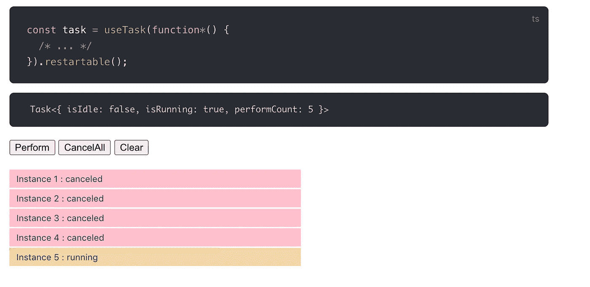

# 用 vue 组合 API 和 Vue 并发处理异步

> 原文：<https://javascript.plainenglish.io/handling-asynchrony-with-vue-composition-api-and-vue-concurrency-part-2-canceling-throttling-4e0305c82367?source=collection_archive---------7----------------------->

## 第 2 部分—取消、节流、去抖动、轮询



Visualization of a restartable task in vue-concurrency

在上一篇文章中，我谈到了承诺和处理异步状态。这篇文章将指出承诺的另一个弱点:缺乏取消。

很容易认为你没有取消的必要。矛盾的是，由于目前 JavaScript 中的默认工具很难取消，所以不经常讨论和推荐。但是确实有一些用例，取消是一个强大的工具，不仅仅是对于一些高级的用例，在一些常见的特性中也是如此，比如去抖动和轮询，或者只是为了使异步逻辑总体上更加安全。你只需要合适的工具。

承诺是不可取消的，因此你也不能取消一个异步函数。解决这个问题的一个方法是利用发电机。与异步函数一样，生成器函数也有特殊的语法。

```
function myFun * () {
  yield foo();
  return 'bar';}
```

我们用`*`代替`async`来标记函数，用`yield`代替`await`。但是生成器函数更加灵活——它们的行为在很大程度上是由传递给它们的消费者定义的。你可以创建自己的生成器函数处理程序，但通常你只能依赖第三方库。例如 [CAF —可取消的异步流](https://github.com/getify/CAF)。传递给 CAF 的生成器函数开始表现得像异步函数一样——产生对承诺解析的等待。但是最重要的是，有可能`[cancel](https://vue-concurrency.netlify.app/cancellation/#cancelation)()`并提前中止执行。

[vue-concurrency](https://github.com/MartinMalinda/vue-concurrency) 利用 CAF，将整个逻辑包装成一个方便的反应对象: [Task](https://vue-concurrency.netlify.app/task-state/) 。

# 投票

取消非常方便的一个典型用例:轮询。当你轮询时，你在一个指定的时间间隔内做一个特定的操作，或者直到一个特定的动作。最直接的方法是使用`setInterval`，但是你需要确保在正确的时间使用`clearInterval`。毕竟，你的 Vue 应用程序可能表现得像一个单页面应用程序，你不希望当用户导航到一个不同的页面时，你的轮询继续。所以，是的，你可以做一些防御检查，然后清除`[onBeforeUnmount](https://v3.vuejs.org/api/composition-api.html#lifecycle-hooks)`组合 API 挂钩中的间隔。但是有了 vue 并发，事情就简单多了:

`while (true)`在 JavaScript 中很少见。但随着取消它变得可行。轮询任务等待新数据，然后反复等待 5 秒钟。当使用该任务的组件被卸载时，该任务会自动取消。所以这段代码做起来很安全，不需要处理 setInterval。

在这个任务中，还有`[drop](https://vue-concurrency.netlify.app/managing-concurrency/#drop)()`修改器。它使事情变得更加可靠，确保任务不能同时运行多个实例。在这种情况下，这意味着轮询只能运行一次。如果任务可能需要重新开始，但是使用不同的参数，也许检查不同的端点，它可以改为设置为`[restartable](https://vue-concurrency.netlify.app/managing-concurrency/#restartable)()`。一个可重新启动的任务将取消以前的任务实例，并启动一个新的任务实例。

就是这样！如果需要，我们还可以进一步更新我们的代码，以允许手动取消和恢复:

当我们将任务传递给模板时，我们得到了通常的好处。在模板中，我们可以检查`task.isRunning`是否有效，并且我们可以弹性地显示`lastSuccessful`值(假设一些 API 调用可能失败):

# 去抖动

当用户完成输入时显示搜索结果是当今的一个普遍特征，并且提供了一个很好的 UX。直接的方法是在按键后触发计时器，如果计时器已经在运行，就重置计时器。如果你自己不写这个逻辑，你通常会把你的函数包装在一些现有的[去抖](https://lodash.com/docs/4.17.15#debounce)工具中，例如来自 [lodash](https://lodash.com/docs/4.17.15#debounce) 的工具。

有了 vue 并发和任务，操作又变得更加简单和安全。

我们可以创建一个类似于上一个任务的任务:

这里不同的是`timeout()`在任务调用的开始。我们等待 700 毫秒，然后执行一个 AJAX 请求。如果再次执行该任务(每次按键都会执行)，则取消之前的任务调用，并创建一个新的任务实例，因为该任务是`[restartable](https://vue-concurrency.netlify.app/managing-concurrency/#restartable)()`。这有效地让我们去抖。这使得事情没有使用神秘的去抖功能那么神奇，也给了你更多的灵活性。如有必要，等待时间可以是动态的(也许不等待某些键！…或者等待更长时间)。

# 节流

如果我们想在用户输入时显示搜索结果*，而不是之后，该怎么办？在这种情况下，对每一次按键执行搜索可能仍然是不可行的。我们希望以某种方式限制搜索 API 调用。这就是节流发挥作用的地方。假设我们想在用户输入时进行搜索，但是每隔 200 毫秒才进行一次。我们可以利用第一个(轮询)例子中的`[drop](https://vue-concurrency.netlify.app/managing-concurrency/#drop)()`修改器，但这并不理想。`[keepLatest](https://vue-concurrency.netlify.app/managing-concurrency/#keeplatest)()`比较好，适合。就像`[drop](https://vue-concurrency.netlify.app/managing-concurrency/#drop)()`一样，它也防止任务并行运行多个实例，但它确保最后一个实例最终被执行。这是节流的理想选择。*

是的，这里唯一的区别是传递给`timeout`的数字不同，并且使用了`[keepLatest](https://vue-concurrency.netlify.app/managing-concurrency/#keeplatest)()`而不是`[restartable](https://vue-concurrency.netlify.app/managing-concurrency/#restartable)()`！

# 下一个

虽然不是本系列的一部分，但我还有一篇文章适合这个领域:构建基本数据层:

 [## 用 Vue 和组合 API 构建数据层

### 当你在学习一个新的前端库时，比如 Vue 或者 React，你可以在 best……

medium.com](https://medium.com/@martinmalinda/building-a-data-layer-with-vue-and-composition-api-547cc9761b4c) 

## 在 herohero 上订阅每周编码示例、技巧和提示

嘿👋如果你觉得这些内容有帮助，[在 herohero](https://herohero.co/martin) 上订阅我吧，在那里我经常分享我日常使用 JavaScript 和 Vue 的经验中简洁而有用的编码技巧。

[](https://herohero.co/martin)