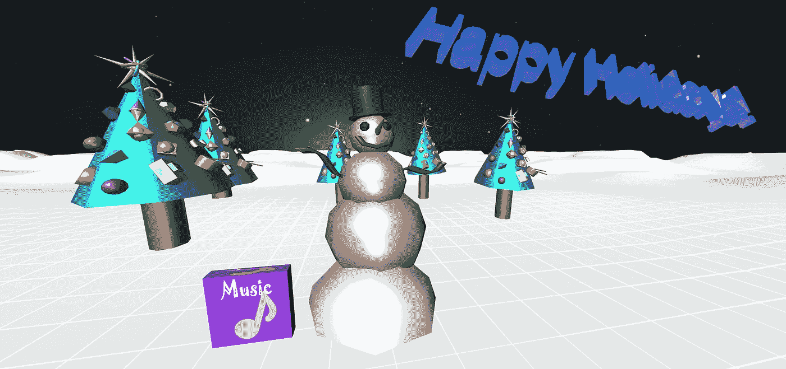
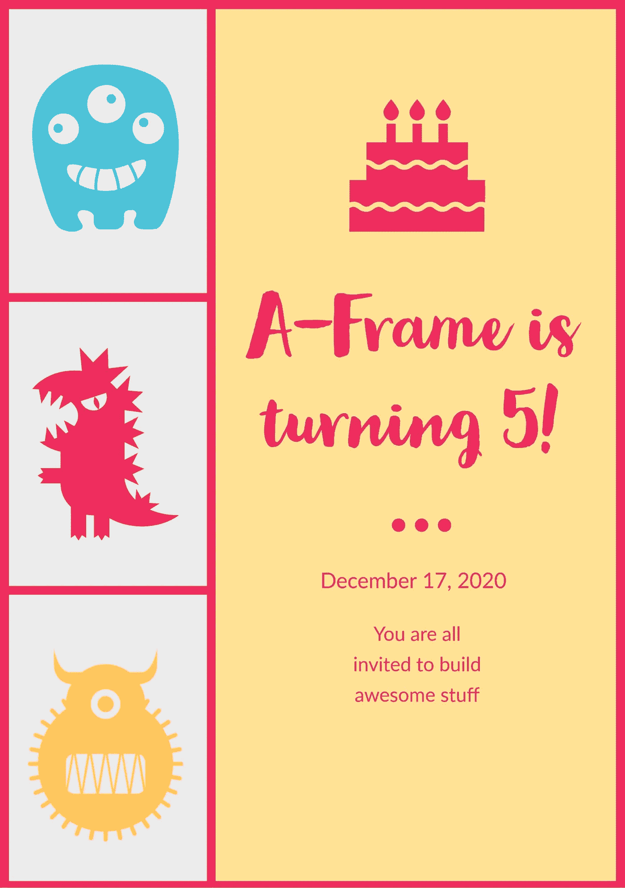

# 一次快乐的假期 VR 卡体验！

> 原文：<https://javascript.plainenglish.io/happy-holiday-vr-card-experience-1ca22c1dd66e?source=collection_archive---------10----------------------->



2021 年 12 月文章示例更新:这是我今年的节日贺卡。它超出了本文的范围，并且包括了在后面的文章中讨论的多用户功能，但是我在这里把它作为一个更新和演示包含在以后的文章中。它使用特别定制的 A 型框架。所以现在就忽略它，尽情享受吧！

[](https://funbit64.com:3025/h.html) [## 假日 VR 卡

### 节日快乐！使用 WebXR A-frame 和联网 A-frame (NAF)为多用户重新制作雪地假日虚拟现实卡…

funbit64.com](https://funbit64.com:3025/h.html) 

===

祝大家节日快乐！

我想给你一个 A 帧季节性 VR 卡体验。



我又下雪了；[现在是季节](https://www.merriam-webster.com/words-at-play/why-we-say-tis-the-season#:~:text='Tis%20the%20season%2C%20in%20which,Boughs%20of%20Holly%22%20in%20the)。将更新我的一些旧东西，包括 [Oculus Quest 2](https://www.oculus.com/quest-2/?utm_source=gg&utm_medium=a_ps&utm_campaign=11032349238&utm_term=oculus%20quest%202&utm_content=482270904675&utm_parent=quest2&utm_ad=111749073761&utm_location=9061254&utm_location2=&utm_placement=kwd-563298318914&utm_adposition=&utm_device=c&utm_matchype=e&utm_feed=&) 。

在此尝试一下:

[](https://rocketvirtual.com/aframePACKAGE/HappyHolidays.html) [## 节日快乐 VR 卡体验！

### 一季 VR 卡体验。由迈克尔·麦克纳利于 2018 年 12 月 5 日使用 A-Frame 创建。更新于 2020 年 12 月 6 日，针对…

rocketvirtual.com](https://rocketvirtual.com/aframePACKAGE/HappyHolidays.html) 

三个源文件。

HappyHolidays.html 资料来源:

```
<!DOCTYPE>
<html>
  <head>
    <meta charset="utf-8">
    <title>Happy Holiday VR Card Experience!</title>
    <meta name="description" content="A Season VR Card Experience. Created By Michael McAnally, December 5, 2018 using A-Frame.  Updated December 6, 2020 for Medium article, Happy Holiday VR Card Experience!"></meta>
    <meta name="viewport" content="width=device-width, user-scalable=no, minimum-scale=1.0, maximum-scale=1.0, shrink-to-fit=no">
    <meta name="mobile-web-app-capable" content="yes">
    <meta name="apple-mobile-web-app-capable" content="yes" />
    <meta name="apple-mobile-web-app-status-bar-style" content="gray-translucent" /><!--    <script src="[https://aframe.io/releases/1.0.4/aframe.min.js](https://aframe.io/releases/1.0.4/aframe.min.js)"></script>
    <script src="[https://cdn.jsdelivr.net/gh/feiss/aframe-environment-component@ad57b15d15e7c628e483217383dcdb2f35a3acce/dist/aframe-environment-component.min.js](https://cdn.jsdelivr.net/gh/feiss/aframe-environment-component@ad57b15d15e7c628e483217383dcdb2f35a3acce/dist/aframe-environment-component.min.js)"></script>
    <script src="[https://cdn.jsdelivr.net/gh/roskelld/aframe-particle-system-component@d6cb25548ab40435f52282393aa938b9841e1764/dist/aframe-particle-system-component.min.js](https://cdn.jsdelivr.net/gh/roskelld/aframe-particle-system-component@d6cb25548ab40435f52282393aa938b9841e1764/dist/aframe-particle-system-component.min.js)"></script>
-->
    <!-- *** CHANGE THESE TO COMPONENTS ON YOUR SERVER *** -->
    <script src="[https://rocketvirtual.com/A-Frame_WebXR/aframe-master/dist/aframe-v1.0.4.min.js](https://rocketvirtual.com/A-Frame_WebXR/aframe-master/dist/aframe-v1.0.4.min.js)"></script>
    <script src="aframe-environment-component-master/dist/aframe-environment-component.min.js"></script>
    <script src="aframe-particle-system-component-master/dist/aframe-particle-system-component.min.js"></script>
    <script src="aframe-extras-master/dist/aframe-extras.min.js"></script>
    <script src="aframe-teleport-controls-master/dist/aframe-teleport-controls.js"></script>
    <script src="superframe-master/components/thumb-controls/dist/aframe-thumb-controls-component.min.js"></script>
    <script src="superframe-master/components/text-geometry/dist/aframe-text-geometry-component.min.js"></script>
    <script src="js/info-message.js"></script><script type="text/javascript">//   Solves Google mute of audio problemAFRAME.registerComponent('audiohandler', {
  init:function() {
     let playing = false;
     let audio = document.querySelector("#playAudio");
     this.el.addEventListener('click', () => {if(!playing) {
              audio.play();
           } else {
              audio.pause();
              audio.currentTime = 0;
           }
           playing = !playing;
     });
  }
})function playSound() {//alert("Sound playing functional!!!");
        }</script></head>
<body>
    <button id="playButton" type="button">Play Music</button><audio id="playAudio" autoplay loop>
         <!-- Jingle Bells Kevin MacLeod (incompetech.com)
Licensed under Creative Commons: By Attribution 3.0 License
[http://creativecommons.org/licenses/by/3.0/](http://creativecommons.org/licenses/by/3.0/) -->
        <source src="assets/mp3/JingleBells2.mp3" type="audio/mpeg"></audio><a-scene info-message="htmlSrc: #messageText"><a-assets>
        <a-asset-item id="xmas" src="assets/gltf/xmas.glb"></a-asset-item><!-- Setup color and fonts   -->
        <!-- Our font -->
            <a-asset-item id="optimerBoldFont" src="assets/fonts/optimer_bold.typeface.json"></a-asset-item><a-asset-item id="messageText" src="blogmessage.html" response-type="text"></a-asset-item></a-assets><a-entity environment="preset: starry;
                           ground: canyon;
                           groundYScale: 5;
                           groundColor: #FFFFFF;
                           shadow: true;
                           fog: 0;"></a-entity><!-- Basic movement and teleportation  -->
      <a-entity id="cameraRig" movement-controls="constrainToNavMesh: false;" navigator="cameraRig: #cameraRig; cameraHead: #head; collisionEntities: .collision; ignoreEntities: .clickable" position="0 0 0" rotation="0 0 0" animation="property: position;
                                         dur: 15000;
                                         from: 0 32 55;
                                         to: 0 1.6 0;
                                         easing: easeInOutSine;
                                         loop: false">
        <!-- camera -->
        <a-entity id="head" camera="active: true" position="0 1.6 0" look-controls="pointerLockEnabled: true; reverseMouseDrag: true" ></a-entity>
              <!-- Left Controller -->
              <a-entity id="leftHand" hand-controls="hand: left; handModelStyle: lowPoly; color: #15ACCF" teleport-controls="cameraRig: #cameraRig; teleportOrigin: #head; button: trigger; curveShootingSpeed: 18; landingMaxAngle: 60" visible="true"></a-entity>
              <!-- Right Controller -->
              <a-entity id="rightHand" hand-controls="hand: right; handModelStyle: lowPoly; color: #15ACCF" laser-controls raycaster="showLine: true; far: 10; interval: 0; objects: .clickable, a-link;" line="color: #7cfc00; opacity: 0.5" visible="true"></a-entity>
      </a-entity><!-- It's Snowing!!! -->
 <a-entity position="0 2.25 -15" particle-system="preset: snow; particleCount: 550"></a-entity><!-- Snowman Xmas tree scene  -->
 <a-entity gltf-model="#xmas" scale="2.7 2.7 2.7" position="0 -.15 -6"></a-entity><a-entity text-geometry="value:Happy Holidays!;size:5;style:italics;bevelEnabled:true;bevelSize:0;bevelThickness:1.389;curveSegments:2.15" material="color:lavenderblush;metalness:1;roughness:0;sphericalEnvMap: #pink" position="-5.45 6.54 5.3" scale="0.25 0.25 0.25"  animation__rotate="property: rotation; dur: 20000;easing: linear; loop: true; to: 0 360 0"  animation__second="property: position; dir: alternate; dur: 12000; easing: easeInSine; loop: true; from: -5.45 6.54 5.3; to: -5.45 16.54 5.3" begin="20000"></a-entity><a-box id="playButton" class="clickable" position="-1.30 0.64 -6" material="src: #music-image_on" scale="1.25 1.25 0.25" onclick="playSound();" audiohandler="" geometry=""></a-box><a-entity light="type:spot;intensity:0.42"></a-entity><a-entity position="-1.2 2.94 3.03" light="intensity: 1.219; castShadow: true; shadowCameraLeft: -10; shadowCameraBottom: -10; shadowCameraRight: 10; shadowCameraTop: 10"></a-entity></a-scene>
<script>
//Google Code for un-audio mute
// Existing code unchanged.
window.onload = function() {
  var context = new AudioContext();
  // Setup all nodes}// One-liner to resume playback when user interacted with the page.
document.querySelector('button').addEventListener('click', function() {
  context.resume().then(() => {
    console.log('Playback resumed successfully');
  });
});</script></body>
</html>
```

blogmessage.html 源(弹出消息文本):

```
<center><p><h3>This is a browser based virtual reality card experience.  It works with most VR Headsets including the Oculus Quest 2\.  To learn more checkout my <a href="[https://rocketvirtual.com/index.html](https://rocketvirtual.com/index.html)" target="_blank">VR Blog</a> and articles on <a href="[https://michael-mcanally.medium.com/](https://michael-mcanally.medium.com/)" target="_blank">Medium</a>.  Happy Holidays!</h3></p><p><i>No VR, Desktop: Arrow keys in combination with dragging your mouse button move around. Exit by pressing ESC. Music box plays in VR only by laser pointer trigger.</i></p></center>
```

js/info-message.js source(在屏幕上显示弹出消息):

```
/* global AFRAME */
AFRAME.registerComponent('info-message', {
  schema: {
    htmlSrc: {type: 'selector'}
  },
  init: function () {
    var sceneEl = this.el.sceneEl;
    var messageEl = this.messageEl = document.createElement('div');
    messageEl.classList.add('a-info-message');
    sceneEl.setAttribute('aframe-injected', '');var closeButtonEl = this.closeButtonEl = document.createElement('button');
    closeButtonEl.innerHTML = 'X';
    closeButtonEl.classList.add('a-close-button-info');
    closeButtonEl.onclick = function () { messageEl.style.display = 'none'; };this.addStyles();
    sceneEl.appendChild(messageEl);
  },
  update: function () {
    var messageEl = this.messageEl;
    messageEl.innerHTML = this.data.htmlSrc.data;
    messageEl.appendChild(this.closeButtonEl);
  },
  addStyles: function () {
    var css =
      '.a-info-message{border-radius: 10px; position: absolute; width: 400px;' +
      'height: 250px; background-color: white; border: 3px solid rgba(0,0,0,.75);' +
      'bottom: 22px; left: 22px; color: rgb(51, 51, 51); padding: 20px 15px 0 15px;' +
      'font-size: 12pt; line-height: 20pt;}' +'.a-info-message a{border-bottom: 1px solid rgba(53,196,232,.15); color: #1497b8;' +
      'position: relative; text-decoration: none; transition: .05s ease;}' +'[@media](http://twitter.com/media) only screen and (max-width: 600px) {' +
      '.a-info-message {left: 20px; right: 20px; bottom: 60px; width: auto}}' +'.a-close-button-info{width: 25px; height: 25px; padding: 0;' +
      'top: 10px; right: 10px; position: absolute; color: white;' +
      'font-size: 12px; line-height: 12px; border: none; background-color: #ef2d5e;' +
      'border-radius: 5px; font-weight: medium}' +'.a-close-button-info:hover{background-color: #b32146; color: white}';
    var style = document.createElement('style');if (style.styleSheet) {
      style.styleSheet.cssText = css;
    } else {
      style.appendChild(document.createTextNode(css));
    }document.getElementsByTagName('head')[0].appendChild(style);
  }
});
```

下载链接假日 VR 卡资产(所有资产的 zip 文件):

[https://rocketvirtual.com/aframePACKAGE/HolidayAssets.zip](https://rocketvirtual.com/aframePACKAGE/HolidayAssets.zip)

我写过的关于在 VR 中使用 A-Frame 的其他文章(你可以找到关于这个代码如何工作的更多信息):

[](https://michael-mcanally.medium.com/where-to-begin-with-vr-in-a-browser-d818f713a8a8) [## 如何为浏览器创造虚拟现实体验

### 让我们从基础开始。A-Frame 因为它让我很容易掌握我已经知道的 HTML5 和 JavaScript…

michael-mcanally.medium.com](https://michael-mcanally.medium.com/where-to-begin-with-vr-in-a-browser-d818f713a8a8) [](https://michael-mcanally.medium.com/advanced-hello-world-for-a-frame-68738e022f07) [## A 帧的高级 Hello World

### 我以前写过一篇文章，描述了在浏览器中从哪里开始使用 VR。这采用了流行的 A 形框架…

michael-mcanally.medium.com](https://michael-mcanally.medium.com/advanced-hello-world-for-a-frame-68738e022f07) [](https://michael-mcanally.medium.com/a-parade-of-planets-in-vr-1aa5e56f39d6) [## 虚拟现实中的行星游行

### 即使在今天，你仍然可以买到一个机械太阳系模型。它们可以追溯到 1704 年，甚至更早…

michael-mcanally.medium.com](https://michael-mcanally.medium.com/a-parade-of-planets-in-vr-1aa5e56f39d6) [](https://michael-mcanally.medium.com/treasure-island-vr-with-a-frame-f69e39acacc1) [## 带 A 帧的金银岛 VR

### 伙计们，这里有宝藏！

michael-mcanally.medium.com](https://michael-mcanally.medium.com/treasure-island-vr-with-a-frame-f69e39acacc1)  [## 我的个人 a 字架之旅

### 我一直对虚拟现实感兴趣。醒着的时候可以体验的技术白日梦，逃避…

michael-mcanally.medium.com](https://michael-mcanally.medium.com/my-personal-journey-with-a-frame-757222546cdb) [](https://michael-mcanally.medium.com/a-completely-immersive-360-virtual-reality-experience-6e731a3c45ee) [## 完全沉浸式 360°虚拟现实体验

### 看看这里。

michael-mcanally.medium.com](https://michael-mcanally.medium.com/a-completely-immersive-360-virtual-reality-experience-6e731a3c45ee) 

我的 VR 博客(进一步的例子和评论):

[](https://rocketvirtual.com/index.html) [## 虚拟博客

### 如果你刚刚开始，这里有几个我最近在 Medium 上发布的关于 A-Frame 浏览器 VR 的文章的链接…

rocketvirtual.com](https://rocketvirtual.com/index.html)