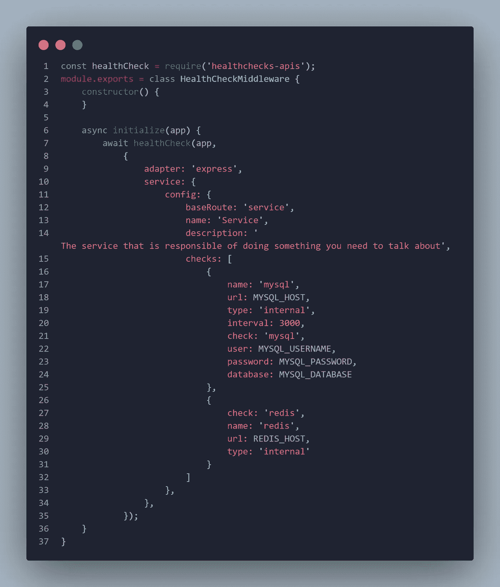
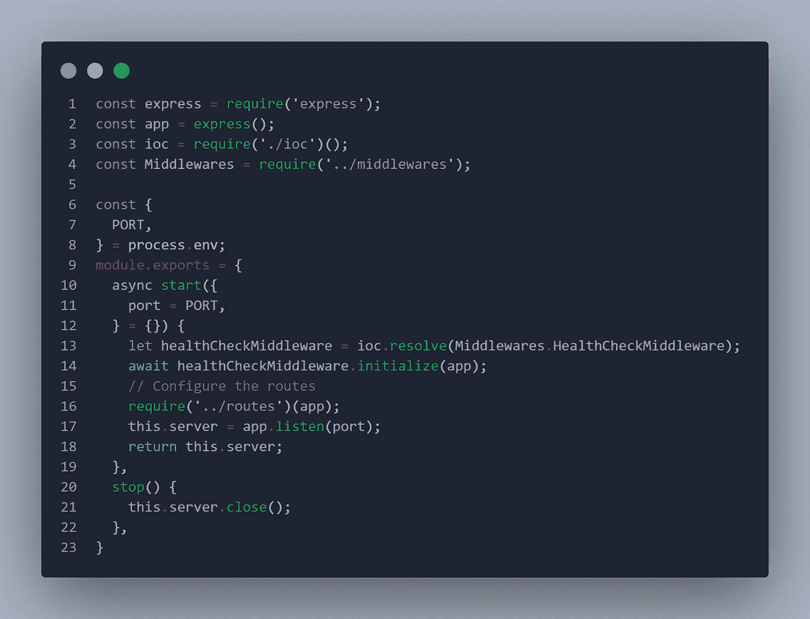

# Node.js 中的健康检查

> 原文：<https://javascript.plainenglish.io/health-checks-in-nodejs-37fb2b1cdc65?source=collection_archive---------4----------------------->

**微服务**中最重要的模式之一是健康检查，它有助于检测无法处理请求的正在运行的服务实例，强制向管理员发送警报，并可能以重启服务等操作结束。

我将在这篇文章中谈以下几点:

*   “健康检查”概念介绍
*   在 NodeJS 项目中实现健康检查
*   这是一个简单的例子，说明了如何使用社区库，并根据自己的需要对其进行定制

## 为什么我们需要健康检查

虽然软件架构已经将其应用向微服务架构和容器化发展，**健康检查的需求开始成为强制性的**。

该架构基于将业务单元划分为多个服务，并将每个服务划分为多个实例(横向扩展)，不同部分之间的通信通过网络进行**，这增加了这些服务之一出现故障的可能性**。

因此，解决方案是实施描述每个微服务运行状况的端点，自动化作业可以从集群外部调用这些端点，并相应地通知管理员，此外，一些流程编排工具可以使用这些端点来重启服务。

如今，大多数云提供商都支持这类易于配置的作业，当出现问题时，其中一些会在您的移动设备上通知您。

想要深入了解健康检查，您可以查看下一篇文章:

 [## 健康检查模式概述- DZone 微服务

### 许多开发人员已经实现了一些现有的健康检查机制，尤其是现在，在“微服务时代”…

dzone.com](https://dzone.com/articles/an-overview-of-health-check-patterns) 

## 在健康检查中我们到底应该检查什么

有些人只从健康检查端点返回 HTTP 200 成功响应，以确保微服务启动，**但我认为检查微服务正在使用的资源和依赖性会更安全**，如连接到数据库、缓存服务器、其他 HTTP 服务等。

因此，运行状况检查应该返回一个成功响应，其主体描述了每个依赖项的状态。

一些框架已经支持这样的端点，你只需要像在 Spring Boot 那样进行配置。

一些运行状况检查超出了这一范围，如**端到端运行状况检查**，它就像检查外部依赖关系，但更进一步，因此它不是进行一次调用来检查服务是否可用，而是进行真正的业务流程，如插入数据，然后检查数据是否可用。

因此，这些检查验证系统的整体行为是否正常，但这并不总是我们应该做的事情，它取决于系统的类型和业务逻辑。

## 在 NodeJS 中快速实现健康检查

我发现了一个非常有趣的库，它已经有了大量的内置检查并支持 NodeJS Express 框架，您可以在这里找到它:

 [## 鲍尔-Xcel-媒体/节点-健康检查-api

### Hootsuite 提供的健康检查 API 的 Node.js 实现。npm 安装-保存健康检查-api 启用…

github.com](https://github.com/Bauer-Xcel-Media/node-healthchecks-api) 

您可以检查 MySql DB 连接、Mongo DB 连接、Redis 连接、Elasticsearch、任何其他 Http 服务、**并轻松添加适合您需求的自定义检查**。

该库中唯一的缺点是健康检查路由是静态的，所以我需要派生该库并添加使用 config 对象定义基本路由的功能。接下来您可以找到分叉的路径(我在自述文件中做了修改，这样您就可以知道在哪里定义基本路径):

 [## AMhaish/节点健康检查-api

### Hootsuite 提供的健康检查 API 的 Node.js 实现。npm 安装-保存健康检查-api 启用…

github.com](https://github.com/AMhaish/node-healthchecks-api) 

您可以使用下一个 npm 包来安装它:

 [## 运行状况检查-API

### Hootsuite 提供的健康检查 API 的 Node.js 实现。实现应用程序/服务组合健康…

www.npmjs.com](https://www.npmjs.com/package/healthchecks-apis) 

促使我添加该功能的主要原因是需要根据微服务提供不同的健康检查路线，对于购物微服务，我需要类似/购物/健康的路线，而对于产品微服务，我需要不同的类似/产品/健康的路线。

但仍然是最后一部分的路线定义为静态的现在，也许我会使它动态的未来，但不觉得这是非常重要的现在。

**我计划很快在这个分叉的支票上添加更多的支票。**

我喜欢通过一个中间件来使用这个库，这个中间件将在启动微服务时被初始化:

正如您在这里看到的，我正在检查到 MySQL 数据库的连接和到 Redis 缓存的连接。我正在从环境变量中获取参数，**请不要忘记等待健康检查功能，否则它根本不会工作**，因为没有等待健康检查完成，服务器就直接开始忽略库内定义的健康检查路径。

然后在定义我的服务器时，我需要如下初始化这个中间件:

这是一个简单的文件，肯定你会有更多的中间件和初始化的东西。我更喜欢总是实现服务器启动和停止功能，其中启动将返回相同的服务器，这将有助于控制器的单元和集成测试。

我使用一个 IoC 容器来初始化中间件和服务，如果你感兴趣，可以看看下一个库:

 [## 瘾君子-国际奥委会

### Addict IoC 是一个轻量级的 IoC 容器，具有流畅的声明语法，方便您的开发，并简化…

www.npmjs.com](https://www.npmjs.com/package/addict-ioc) 

通常，我在中间件文件夹内的一个文件中定义所有中间件的名称，导出一个只包含中间件的键值对的对象(就像 OOP 语言中的 enum)。所以 IoC 从中间件的名字就能理解它应该初始化的实例的类型。

我希望这篇文章能够帮助您快速地在服务网格或应用程序中使用健康检查。

当我需要这一点时，我需要花费大量时间来研究如何在 NodeJS 中做到这一点，我尝试了不同的库，发现其中一个对我来说是最好的选择。所以我希望这会节省你的时间。