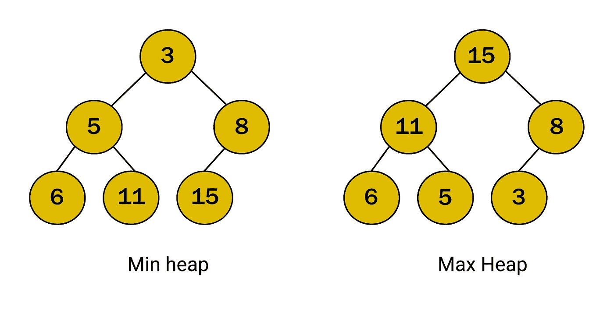

# 数据结构:代码中的堆

> 原文：<https://javascript.plainenglish.io/heaps-of-data-structures-creating-heaps-in-code-80d215dcf53d?source=collection_archive---------3----------------------->


Photo by [Olia Nayda](https://unsplash.com/@olianayda?utm_source=unsplash&utm_medium=referral&utm_content=creditCopyText) on [Unsplash](https://unsplash.com/s/photos/mound?utm_source=unsplash&utm_medium=referral&utm_content=creditCopyText)

今天我们将讨论数据结构堆，了解它们是什么，以及如何使用 JavaScript 构建它们。在软件工程之外，堆的定义是

> 一堆乱七八糟地堆在一起的东西。

这很讽刺，因为堆数据结构非常有序。如果你还记得我写的关于[二分搜索法树](https://medium.com/javascript-in-plain-english/binary-search-trees-how-they-work-9c64029eedb7)的文章，二分搜索法树是这样的树，其中根节点右边的所有节点都大于根节点，而左边的所有节点都小于根节点。堆的排序也有类似的目的，但是我们不是从左到右排序，而是上下排序。

有两种类型的堆，最大堆和最小堆。一个**最大堆**将从一个根号开始，该根号是整个树中的最大值。它的孩子会比它小，他们的每个孩子会比那个孩子小，如此等等。

正如你的直觉可能已经告诉你的，最小堆恰恰相反。在最小堆中，从一个根节点开始，它将是整个树中最低的值。它的每个孩子都会比它大，孩子的每个孩子都会比孩子大。



这些堆的例子具体是二进制堆，尽管**堆不一定是二进制的**，只要它们符合最小堆或最大堆的规则。

# JavaScript 中的堆

这与用代码构建其他类型的树没有什么不同，我们在前面的文章中已经详细讨论过了。但是让我们使用 JavaScript 构建上面的这两棵树，这样我们就可以看到它是如何工作的。

我们将从上面的最小堆结构开始。我们有节点集:

```
let nodes = [3, 5, 8, 6, 11, 15];
```

每个节点可以表示为一个 JavaScript 对象，包含根节点、右边的子节点和左边的子节点。从根节点开始，我们有:

```
let rootNode = {element: 3, rightChild: null, leftChild null};
```

我们希望为集合中的每个节点创建相同的数据结构，并让左右子节点指向其他节点。

```
let fifteen = {element: 15, rightChild: null, leftChild: null};
let eleven = {element: 11, rightChild: null, leftChild: null};
let six = {element: 6, rightChild: null, leftChild: null};
let eight = {element: 8, rightChild: null, leftChild: fifteen};
let five = {element: 5, rightChild: eleven, leftChild: six}
let rootNode = {element: 3, rightChild: eight, leftChild: five};
```

构建上面的 max-heap，我们将有类似的对象，但它们将指向本质上相反的顺序。我们将从一个 15 的根节点开始，一直到 3。

```
let three= {element: 3, rightChild: null, leftChild: null};
let five= {element: 5, rightChild: null, leftChild: null};
let six = {element: 6, rightChild: null, leftChild: null};
let eight = {element: 8, rightChild: null, leftChild: three};
let eleven = {element: 11, rightChild: five, leftChild: six}
let rootNode = {element: 15, rightChild: eight, leftChild: eleven};
```

需要认识到的一件大事是，在构建堆之前需要进行排序，这比构建二叉查找树要多得多。这些节点集从一开始就或多或少地进行了排序，这使得我们可以整齐地构建我们的堆，而不必进行搜索。但是如果我们没有一个有序的节点集呢？如果节点集看起来像这样会怎么样:

```
let nodes = [6, 5, 11, 3, 8, 15];
```

为了创建一个最小堆，我们还需要从根节点 3 开始。在二叉查找树中，我们可以从 6 开始，让 5 成为左孩子，11 成为右孩子，然后让 3 成为 5 的左孩子。在一堆我们没有这种灵活性。3 必须是最小堆的根节点，15 必须是最大堆的根节点。

这些细微差别就是为什么我们对数据结构有这么多不同的选择。每一种都有其最佳选择的情况，而每一种在其他情况下都是无法大规模维持的。了解细节对于根据不同需求选择合适的选项至关重要。