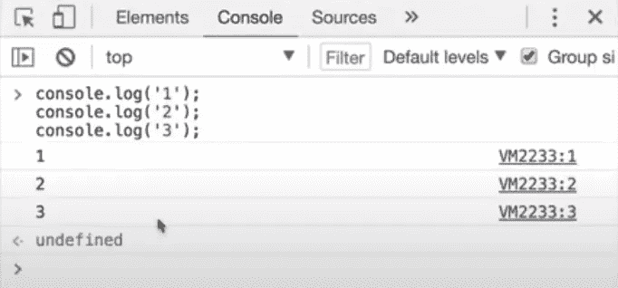
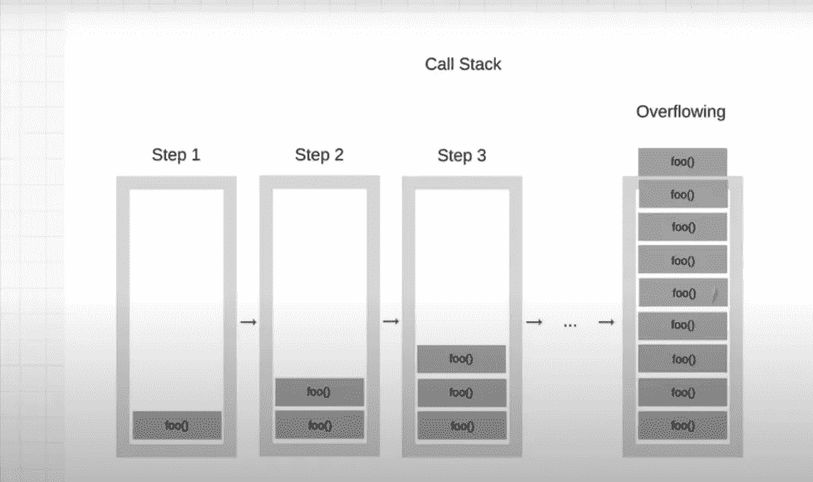
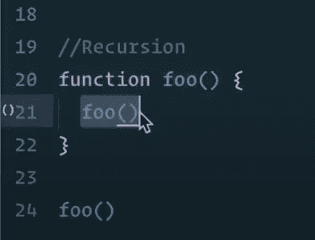
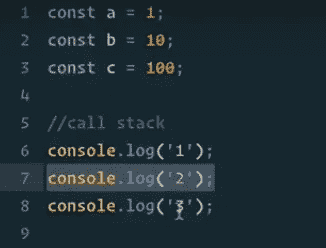
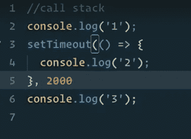
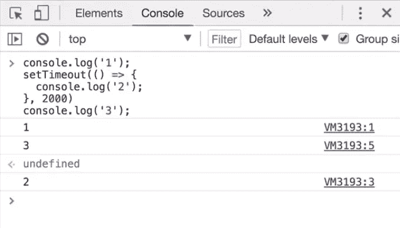
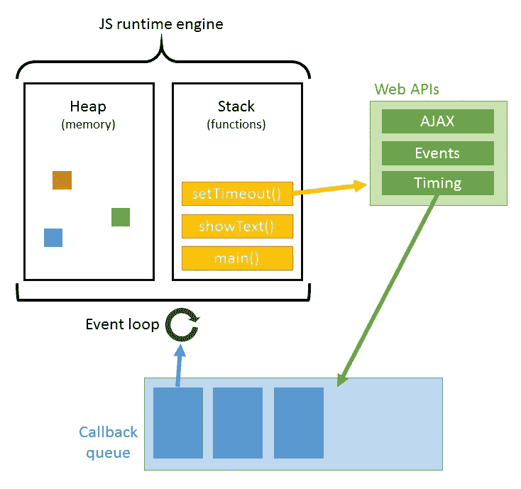
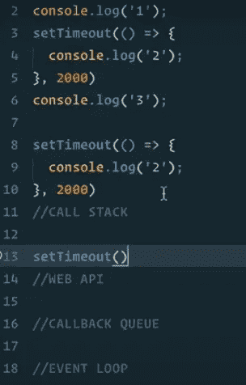
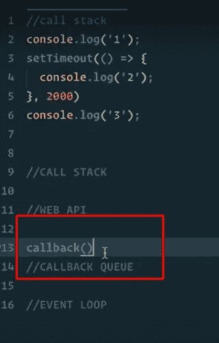

# 忙乱的 JavaScript 面试问题！

> 原文：<https://javascript.plainenglish.io/hectic-javascript-interviews-questions-8fdf7ddd0e53?source=collection_archive---------9----------------------->

## JavaScript 是异步的还是同步的？JavaScript 是如何工作的？


Photo by [Tim Gouw](https://unsplash.com/@punttim?utm_source=medium&utm_medium=referral) on [Unsplash](https://unsplash.com?utm_source=medium&utm_medium=referral)

多年来，JavaScript 发展如此之快，以至于很难归类。今天，我将深入探讨 JavaScript 是同步的还是异步的，以及幕后的工作流是什么样子的。当然，也给你面试中最常见问题的答案。让我们直接进入文章。

# JavaScript 是如何工作的？

想象一下在面试中被问到这个问题，或者解释一下 JavaScript 中**异步和同步的区别？**或者他们可能会让你解释一下**的说法:“JavaScript 是一种单线程语言，可以是非阻塞的！'【T3]别担心，我会帮助你解决本文中的问题。**

*我们不需要知道 JavaScript 如何在内部工作来编写程序。*但是**没有！**学习很重要。我看到许多做了多年开发人员的人却不知道这一点，这就像是一名飞行员不知道飞机如何飞行一样！好吧，这有点戏剧性，但你明白我的意思，所以我们先开始吧。

# 什么是程序？

一个程序必须做一些简单的事情:

分配内存分配内存必须分配内存，否则，我们的计算机上就不能有变量，甚至不能有文件。

**解析并执行** *—它还必须解析并执行脚本，这意味着读取和运行命令。*


Image Credit- [WikiPedia](https://en.wikipedia.org/wiki/V8_(JavaScript_engine))

现在，我们还知道 chrome 中有一个 JavaScript 引擎**[](https://en.wikipedia.org/wiki/V8_(JavaScript_engine))**每个浏览器都实现了这个引擎[**【V8】**](https://en.wikipedia.org/wiki/V8_(JavaScript_engine))和 [**V8 引擎**](https://en.wikipedia.org/wiki/V8_(JavaScript_engine)) 读取我们编写的 JavaScript，并将其转换成浏览器的机器可执行指令。这个引擎由两部分组成:一个 [**内存堆**](https://developer.mozilla.org/en-US/docs/Web/JavaScript/Memory_Management) 和一个[](https://developer.mozilla.org/en-US/docs/Glossary/Call_stack)****

******现在 [**内存堆**](https://developer.mozilla.org/en-US/docs/Web/JavaScript/Memory_Management) **，**这是内存分配发生的地方，然后**调用堆栈是代码被读取和执行的地方**它告诉你你在程序中的位置，所以让我们简化一下，向你展示我的意思。******

****声明变量时，JavaScript 会自动为变量分配内存。****

```
**const a = 100; //allocate memory
const b = 10;
const c = 1; //allocate memory**
```

****我们刚刚分配了内存，当我们赋值的时候，javascript 引擎会记住，哦，是的，a 的值是 100。我们刚刚用完了 [**内存堆**](https://developer.mozilla.org/en-US/docs/Web/JavaScript/Memory_Management) 我可以继续，我可以继续复制粘贴，把这些变量改成 B 和 C，我也可以改变它们的值。这是我们看到的一个问题，当你成为一名开发人员时，你会听到一种叫做 [**的内存泄漏**](https://en.wikipedia.org/wiki/Memory_leak#Reference_counting_and_cyclic_references) ，我们在这里所做的是我们已经创建了所有这些变量[**全局变量**](https://www.javatpoint.com/javascript-global-variable) ，它们都在**内存堆中。******

****想象一下，如果这一页充满了变量，而不是数字，它们就像一个很大的数组，内存泄漏就会发生。当你有未使用的内存时，比如说我们没有使用变量 A，但它是全局变量，因为有未使用的内存，它填满了内存堆，这就是为什么你可能会听到为什么 [**全局变量是坏的。**](http://wiki.c2.com/?GlobalVariablesAreBad)****

****[**全局变量是不好的**](http://wiki.c2.com/?GlobalVariablesAreBad) 因为如果我们不忘记自己清理，我们会填满这个内存堆，最终，浏览器将无法正常工作。这就是内存分配。****

********

****Memory Heap and Call Stack (Photo by- Unsplash)****

****我们先来谈谈 [**调用栈**](https://developer.mozilla.org/en-US/docs/Glossary/Call_stack) 那是什么呢再用一个调用栈我们可以有这样的东西:****

```
**//CALL STACK
console.log(“1”);
console.log(“2”);
console.log(“3”);**
```

********

****Call Stack Example****

****[**Console.log**](https://developer.mozilla.org/en-US/docs/Web/API/Window/console) 会走一个，Console.log 两个，最后 Console.log 三个。如果我在浏览器终端运行这段代码，我会得到 123。如果你记得那是**调用栈**做的事情？它读取并执行我们的脚本。****

****让我们一步一步来:****

*   ****它读取第一行 console.log，并将其放入这个调用堆栈，然后运行它并创建 1。****
*   ****然后它说好的，我正在删除第一个 console.log，因为我刚刚运行完它。我将把第二个 console.log 放入我的调用堆栈。把它加到这里，说是，执行，然后把它去掉，弹出来。****
*   ****然后获取 console.log 3 并记录 console.log 3，最后删除。****

# ****同步 JavaScript****

*****JavaScript 是一种单线程语言，可以是非阻塞的。*****

****JavaScript 是一种**单线程**语言，可以是非阻塞的。单线程意味着它只有一个**调用栈**，一个调用栈一次只做一件事意味着**同步**，正如你所看到的，调用栈是**先入后出**的，所以，调用栈顶部的先运行，然后运行到调用栈之下，再运行到调用栈之下，直到调用栈为空，现在其他语言可以有**多个调用栈**，这些被称为**多线程。******

****您还可以看到，拥有多个调用堆栈是多么有益，这样我们就不会一直等待。那么**为什么 JavaScript 被设计成单线程？******

****嗯，在单线程上运行代码可能非常容易，因为您不必处理多线程环境中出现的复杂场景。****

****现在，你可能听说过站点堆栈溢出。如果你是一名开发人员，你每天都在使用它，你有没有想过栈溢出意味着什么？堆栈溢出是这样的:****

********

****Call Stack OverFlow****

****当一个步骤溢出时，有点像我们讨论的内存泄漏和 JavaScript 引擎的内存堆如何溢出！栈溢出是指调用栈越来越大，直到没有足够的空间。****

****我们如何做到这一点？我们能重建一个堆栈溢出吗？是的，我可以很快地告诉你们，创建一个函数 foo，就像我们在这里一样，这个函数只有 foo，我们只是运行我们的 foo 函数，好吧，这看起来很混乱，但是这里发生了什么呢？这就是所谓的[**递归。**](https://www.sitepoint.com/recursion-functional-javascript/#:~:text=Recursion%20is%20a%20technique%20for,to%20looping%20is%20the%20default.)****

********

****Recursion example****

******递归**意味着一个函数调用它自己，所以如果你看看这个函数，我们运行 foo，foo 被执行。福所做的是。我们又运行了一遍，所以它只是一遍又一遍地循环，有一个递归，但看不到尽头，对吗？我们不断地将 foo 添加到调用堆栈中，我们不断地添加它，一遍又一遍，如此等等…****

****我们有一个堆栈溢出，所以如果你想玩得开心，进入你的浏览器，进入你的控制台，运行这样的东西，看看会发生什么，你会得到一个堆栈溢出。****

****好了，希望这现在有意义了 **JavaScript 引擎 V8** 和 Chrome 有一个**内存堆**和一个**调用栈**。****

****现在 JavaScript 是单线程的，一次只执行一条语句，但是有一个问题，如果 console.log 的第 2 行是一个很大的任务，我们需要做的可能是遍历一个有数百万项的数组。那里会发生什么？****

********

****Synchronous Example****

****嗯，使用**同步任务**时，如果我们有一个函数占用了大量时间，它将会阻塞生产线。****

# ****示例:****

****想象一下一个自助餐厅，如果所有人都想吃，但鲍比说，等等，伙计们，我必须继续吃，把培根放在我的盘子里，每个人都必须排队，所以，听起来我们需要一些不堵塞的东西。还记得我们在这篇文章中的第一个声明吗？ ***JavaScript 是一种单线程语言，可以是非阻塞的。理想情况下，我们不会等待那些需要时间的事情，那么我们该怎么做呢？*******

****嗯，**异步**来救援了。我们需要的不仅仅是同步任务。你在想，我们如何完成异步编程任务？****

********

****Asynchronous Example****

****嗯，我们可以通过这样做来进行**异步编程**， [**setTimeout**](https://developer.mozilla.org/en-US/docs/Web/API/WindowOrWorkerGlobalScope/setTimeout) 我们将要讨论的是浏览器中的一个函数，它允许我们创建一个 [**超时**](https://developer.mozilla.org/en-US/docs/Web/API/WindowOrWorkerGlobalScope/setTimeout) 我们可以给它第一个参数是我们想要运行的函数，然后第二个参数是我们想要等待多少秒，假设我想要等待两秒，那么 200 分钟 2000 毫秒。如果我现在这样做，让我们进入控制台，看看会发生什么。你也试试看会发生什么。****

********

****Asynchronous Example Result****

****刚刚发生了什么？我们有 console . log 1，然后是 console.log 3，然后是 console.log 2。2 秒钟后，看起来我们跳过了整个步骤，然后把它放在最后，你刚刚看到了异步编程。****

********

****JavaScript Runtime Environment****

****为了理解这一点和刚刚发生的事情，我需要带你到下一部分，这是为了让我们所知的 JavaScript 运行，让 JavaScript 引擎通过内存堆和调用栈来运行。我们需要的不仅仅是 JavaScript 引擎，我们需要所谓的 **JavaScript 运行时环境**。****

******JavaScript 运行时环境**是浏览器的一部分，它包含在浏览器的。他们有额外的东西，在引擎之上，他们有叫做**Web API、**回调队列和事件循环的东西。****

****正如你在这里看到的，**设置超时**是 **Web API** 的一部分，从技术上讲它不是 JavaScript 的一部分，对吗？这是浏览器给我们的用途，所以我们可以做**异步程序**。****

****好的，看这个图表，让我们看看我们是否能弄清楚我们的代码在做什么。****

********

****JavaScript Run Time Environment step by step Example.****

****我们可以在这里创建自己的调用堆栈，我们将有 Web API，然后我们将有一个回调队列和一个事件循环。就像我们在 **JavaScript 运行时环境**中一样，这里发生了什么:****

*   ****首先，我们将 console.log 放入调用堆栈并运行，因此我们将 console.log 记录到浏览器中。****
*   ****然后我们将 **Set Timeout** 放入我们的调用堆栈，因为我们完成了第一个任务，我们将进入第二个任务，接下来会发生什么呢？如果调用栈说好的，半设置超时，因为设置超时不是 JavaScript 的一部分，而是 Web API 的一部分，它有这个特殊的特征，它触发 Web API，说设置超时刚刚被捕获，因为我们通知了 Web API，我们可以从调用栈中弹出它。****
*   ****现在 web API 在这里启动了一个定时器，一个两秒钟的定时器，但是它知道在两秒钟内你必须做一些事情，因为调用栈是空的，JavaScript 引擎现在转到 console.log 3。并执行此操作，因此现在我们已经完成了 1 和 3，但我们仍然在 web API 中将超时设置为秒。****

********

****Callback function.****

*   ****现在，2 秒钟后，当我们的时间限制到了，Web API 会说 ok SetTimeout 应该运行，让我们看看它里面有什么，我们有 console.log，那么接下来会发生什么呢？它会说，嘿，设置超时完成了，我们有一个回调，这个回调是我们添加到回调队列中的，它说，嘿，我们必须运行一些东西，我们准备好运行它了。****
*   ****最后一部分 [**事件循环**](https://developer.mozilla.org/en-US/docs/Web/JavaScript/EventLoop) 在这里检查并说，嘿，调用堆栈是空的，它一直在检查。如果堆栈是空的，JavaScript 引擎上现在没有运行任何东西，它会说，嘿，我们有回调吗？它会检查回调队列，然后说，嗯，那里有什么东西吗，因为调用栈是空的，我们可以在那里放些东西，让它做一些工作，在我们的例子中，我们说，哦，是的，让我把它放入调用栈，现在我们把回调移到调用栈，然后我们运行回调，通过运行我们看到我们有 console.log。****
*   ****它会说 console.log，它会运行这个函数，一旦完成，它会从调用堆栈中弹出这个函数，我们再次完成了回调，所以我们移除它，就这样，我们完成了一切都是空的，我们刚刚运行了这个示例，它会遍历整个 **Web API** **回调队列、** [**事件循环**。](http://7- So it's going to say console.log, it's going to run this function and once it's done it's going to pop it out of the call stack and again we're done with the callback so we remove it and there you go, We're done everything is empty and we've just run this Example, it's gonna go through the entire Web API Callback Queue, Event loop. Wooh! There’s was a lot of information but Hopefully, that makes sense to you of Why we noticed this behavior and I want to challenge your understanding here knowing what you know and what I just taught you what happens if I change this Set Timeout to zero? that means zero seconds I'm going to give you a second to think about what will happen.? And Answer yourself.)****

****哇哦。有很多信息，但希望你能理解我们为什么会注意到这种行为，我想在这里挑战你的理解，知道你所知道的和我刚刚教你的，如果我把这个 **setTimeout** 变为零会发生什么？这意味着零秒，我给你一秒钟，让你想想会发生什么。？并回答自己。****

****最后，如果你能理解这篇文章。实际上，你会有很多人在面试中问这样的问题，你必须解释这是为什么？所以，我希望这对你有意义，你可以在下一次面试中利用这一点。****

****我举个例子让你更好地理解它。想象一下给你的老师打电话问一个问题:****

******同步方式**是你给老师打电话，你在电话上等着，直到老师接电话，问他问题，希望得到答案，所以，你让电话铃响，直到他接起电话，但在此期间你不做任何其他事情。****

******异步方式**是指你给老师发一条短信，问一个问题，然后当老师有时间的时候，他或她会回复你，给你打电话，告诉你答案，这样你就可以在这期间做其他事情。****

****所以 **JavaScript 是异步的**当你可以给它留言时，一个回电告诉你，嘿，老师先生，当你不太忙的时候，有个消息给你。这就是为什么我们称它为回调函数，在回调队列中，我们回调是为了让他们知道，这里有一些东西在等着你。****

# ****让我们回顾一下:****

****我们刚刚学到了什么？ **JavaScript 是单线程语言**可以**非阻塞**。它有一个调用栈，一次只做一件事。****

****为了不阻塞**单线程**，它可以与**回调函数**异步，这些回调函数通过**回调队列**在后台运行，然后通过**事件循环**将其带回调用堆栈。所以，下次你被问到这些话题时，你应该有更多的自信来回答这个问题。****

******我希望这有所帮助！******