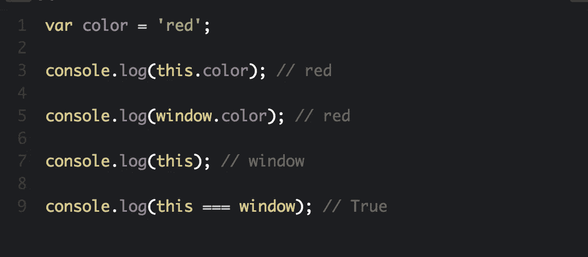
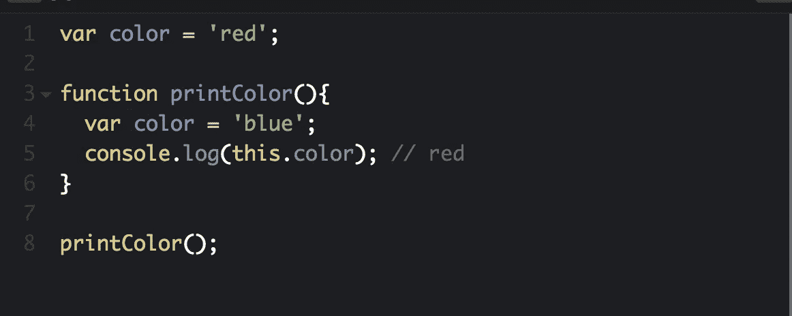
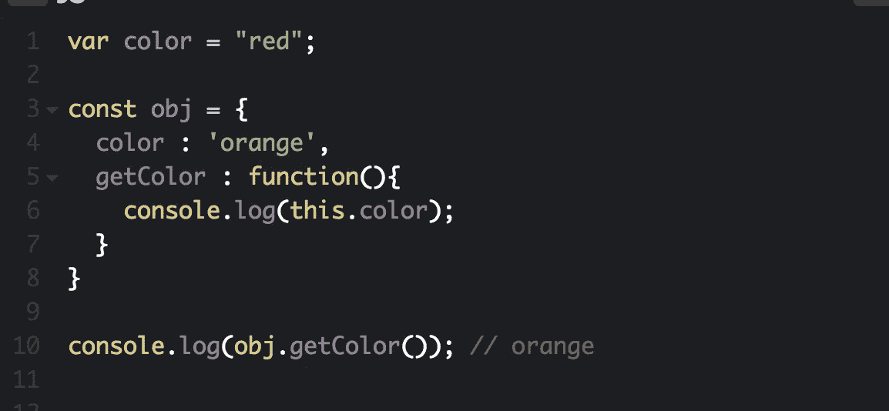
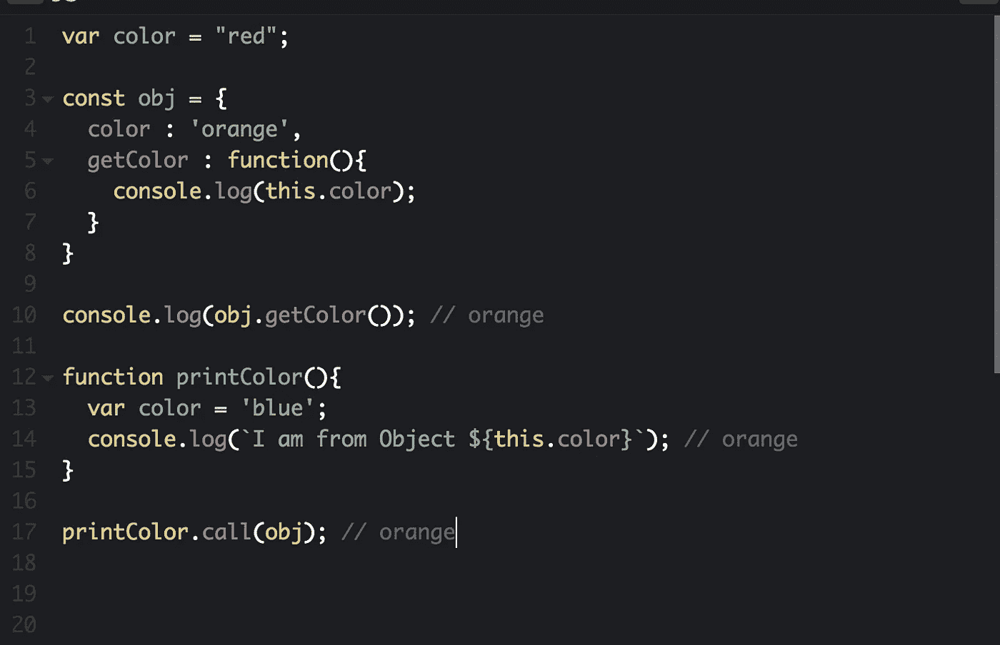
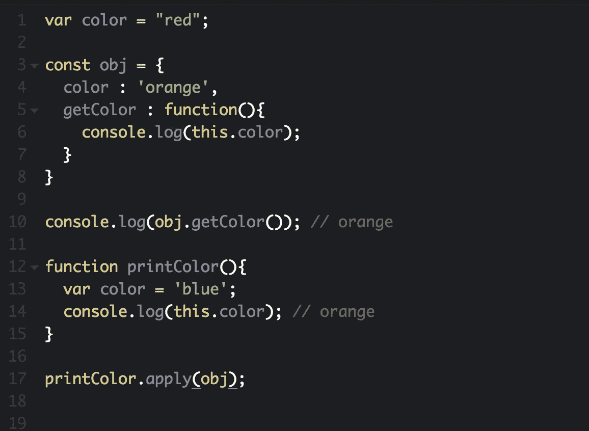
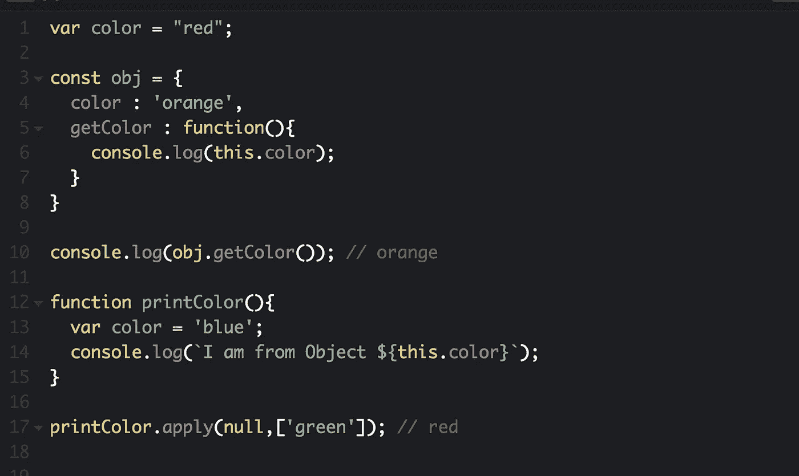
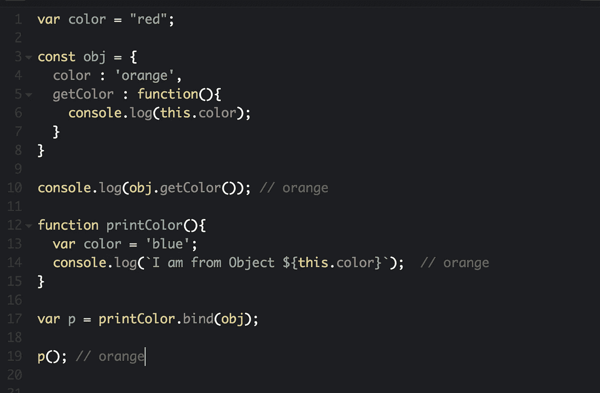
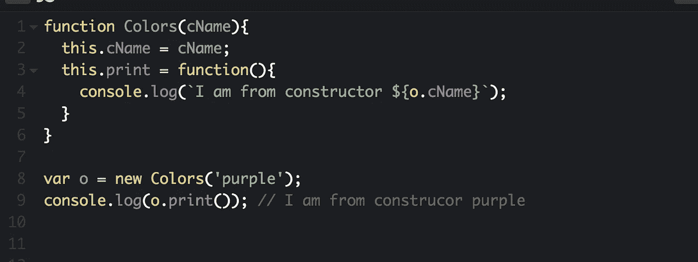

# 理解 Javascript 中的“this”

> 原文：<https://javascript.plainenglish.io/hello-javascript-this-bb97c54f0823?source=collection_archive---------2----------------------->

如果你是一名 Javascript 开发人员，你可能会在某些时候对使用' **this** '感到困惑。

大多数开发人员仍然无法掌握`**this**`的用法。原因是`**this**`的动态性质和它改变其上下文的方式。

“I can see ‘this’ in your eyes, I can see ‘this’ in your smile…”

今天，我们要看看`**this**`到底是什么，以及我们为什么需要它。其次是`**this**`的相关概念。

“`**this**`”如其所言指向 Javascript 在其上下文中的当前值。Javascript 基于作用域、函数和上下文。Javascript 是一种动态脚本语言。这种动态的行为使得它的行为也不一样，这导致了所有的混乱。

每当您想要访问函数或上下文中的值时，您可以使用`this`。`this`'在不同的上下文中表现不同:

# 1.全球背景

在全局范围内定义的任何东西都可以被`**this**`访问。默认情况下，`**this**`总是指全局对象(因此，如果您正在为浏览器编写代码，`**this**`通常会是`**window**` 对象)。

Unsure what ‘strict mode’ is? Do a quick Google search :)

# 2.功能上下文

在函数中，`**this**`将默认为全局对象，在浏览器中是`**window**`。

这里值得注意的是，如果我们尝试`**console.log(color)**`，它将返回`**blue**`

# 3.对象上下文

`**this**`在一个对象中的‘始终’指向该对象，并按照您所期望的那样工作:

对象的神奇之处在于，您可以将对象(以及它们的方法——当它在对象内部时，我们称之为函数)作为参数传递给函数。所以这里我们把`obj.getColor()`传入`console.log`。

## ***谓()***

`call()`通过将`obj`对象作为第一个参数来改变`this`的上下文。如果什么都没有传递，那么`call()`将指向窗口的范围。

## ***敷()***

`apply()`通过将`obj`对象作为第一个参数来改变上下文。如果没有传递任何东西，那么 apply()将指向窗口的范围。

## ***bind()***

`bind()`也有助于改变“`this`的上下文，但是`call()`、`apply()`和`bind()`的区别在于`bind()`只工作一次，它不执行该功能。它只是**将**与`this`绑定在一起。

`call()`和 `apply()`的区别在于`apply()`期望参数作为一个数组，而`call()`期望单个参数。

# 4.构造器

当您创建一个函数实例时，`this`的上下文移动到新创建的实例。在下面的例子中，`this`的上下文指向新创建的实例`var o`。

# summary/TL；速度三角形定位法(dead reckoning)

1.  在函数和全局作用域中,“this”总是指向窗口。尽管在严格模式或 Nodejs 下这种情况会发生变化。
2.  在 Object 中，它仅指向对象的上下文
3.  在构造函数中，它指向新创建的实例。
4.  我们可以通过使用 call()、apply()和 bind()来改变上下文
5.  如果您只是绑定上下文，而不想执行函数，那么使用 bind()。永远记住 bind()只工作一次
6.  如果您想将一个参数数组传递给它，那么您可以使用 apply()。否则，请使用 call()。
7.  它的美妙之处在于它的动态特性，它会随着您运行它的环境而变化。

我们希望您发现这很有用！如果是这样，请留下一些掌声，关注 JSIPE 并与您所有的朋友、家人和宠物分享！👫 👨‍👨‍👧‍👧 🐶