# 有用的 Visual Studio 代码扩展

> 原文：<https://javascript.plainenglish.io/helpful-visual-studio-code-extensions-aa2ba92d1d7c?source=collection_archive---------2----------------------->

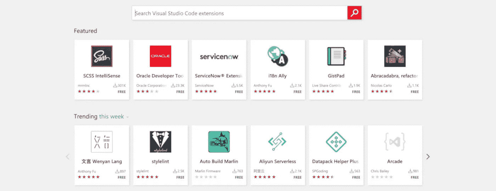

Visual Studio Marketplace

过去，我与许多代码编辑器和 IDEs 合作过。自 2016 年以来，我一直在使用 VS 代码。我相信这是一个很棒的代码编辑器，而且每天都在变得更好。[脸书采用 Visual Studio 代码作为默认开发环境](https://visualstudiomagazine.com/articles/2019/11/21/fb-vs-code.aspx)。随着 VS 代码变得越来越流行，我想分享一个扩展列表，帮助我提高工作效率。我已经将它们列入了 Visual Studio 市场类别。*我在工作中大部分时间都使用 Angular，所以一些扩展是 Angular 特有的。*

# 扩展包

[**角度扩展包**](https://marketplace.visualstudio.com/items?itemName=loiane.angular-extension-pack) :该包安装了许多在角度开发过程中非常有用的扩展。

[**Live Share 扩展包**](https://marketplace.visualstudio.com/items?itemName=MS-vsliveshare.vsliveshare-pack) :这是一个支持与 VS Live Share 实时协作开发的扩展集合。如果您在远程工作，这很有用。

# 编程语言

[**角度文件**](https://marketplace.visualstudio.com/items?itemName=alexiv.vscode-angular2-files) :我一直用这个，节省了很多时间。这将生成角度文件，而无需进入命令行(*右键单击文件夹并选择您想要生成的内容，然后弹出*)，它甚至会将其添加到您的应用程序模块中。

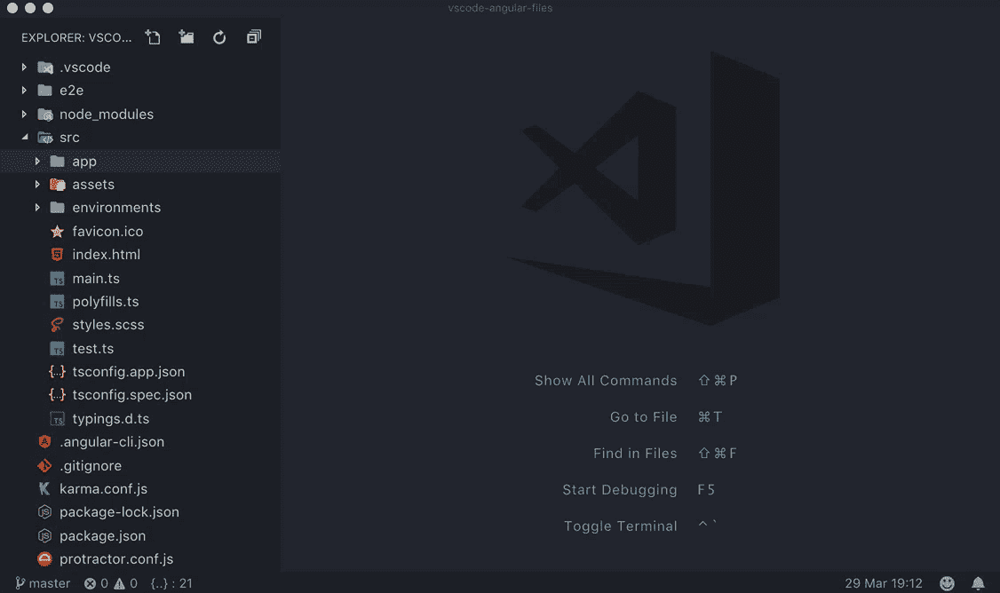

Angular Files

[**角度跟随选择器**](https://marketplace.visualstudio.com/items?itemName=sanderledegen.angular-follow-selector) :构建角度应用的另一个有用的扩展。这使得点击 HTML 文件中的角度选择器并被重定向到它们的组件定义，反之亦然，通过点击组件中的模板 Url 和样式 URL。

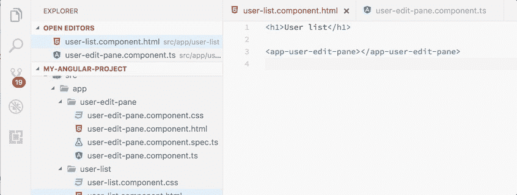

Angular Follow Selector

[**Apollo GraphQL**](https://marketplace.visualstudio.com/items?itemName=apollographql.vscode-apollo):对 graph QL 客户端和服务器开发的丰富编辑器支持，可与 Apollo 平台无缝集成。

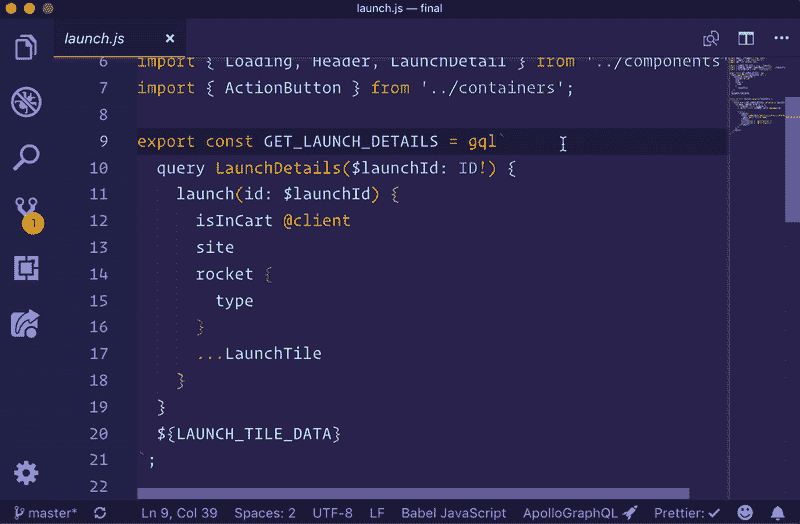

Apollo GraphQL

**:vs code 的 GraphQL 扩展为 GraphQL 项目添加了语法高亮、验证和语言特性，如转到定义、悬停信息和自动完成。这个扩展也适用于用 gql 标签注释的查询。**

****

**GraphQL**

**[**vs code 的 graph QL**](https://marketplace.visualstudio.com/items?itemName=kumar-harsh.graphql-for-vscode&ssr=false#overview):graph QL 语法高亮、林挺、自动完成等等。**

**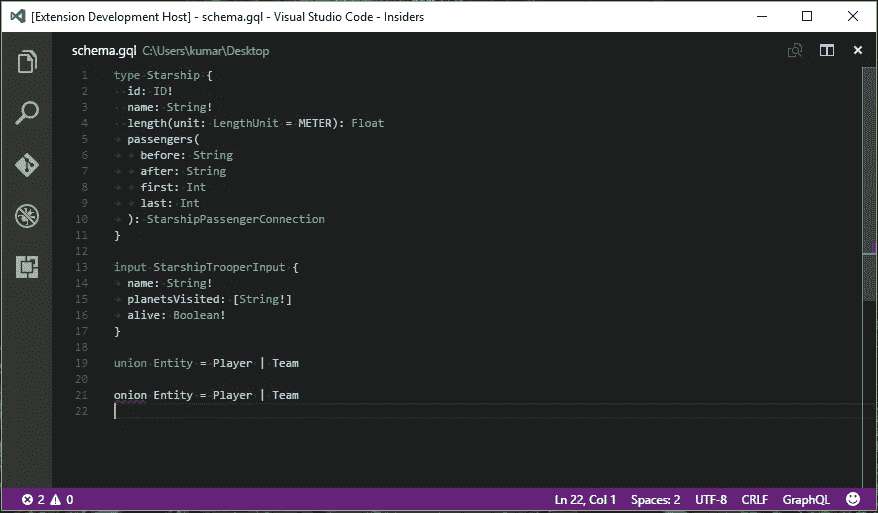**

**GraphQL for VSCode**

**[**黄瓜(小黄瓜)全支持**](https://marketplace.visualstudio.com/items?itemName=alexkrechik.cucumberautocomplete) :黄瓜(小黄瓜)全语言支持+格式化+自动完成。这在我以前写 BDD 的时候很方便。**

**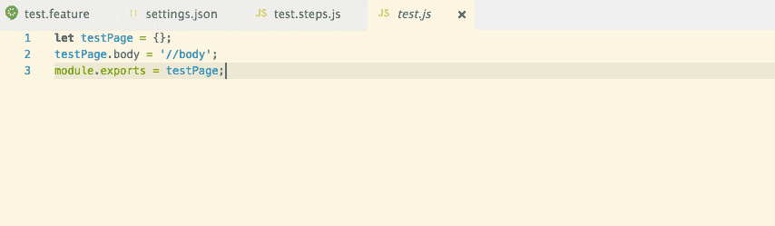**

**Cucumber (Gherkin)**

**[**HTML 中 CSS 类名的 IntelliSense**](https://marketplace.visualstudio.com/items?itemName=Zignd.html-css-class-completion):基于工作区中的定义完成 HTML class 属性的 CSS 类名。**

****

**IntelliSense for CSS class names in HTML**

**[**json2ts**](https://marketplace.visualstudio.com/items?itemName=GregorBiswanger.json2ts) :将一个 json 从剪贴板转换成 TypeScript 接口。**

**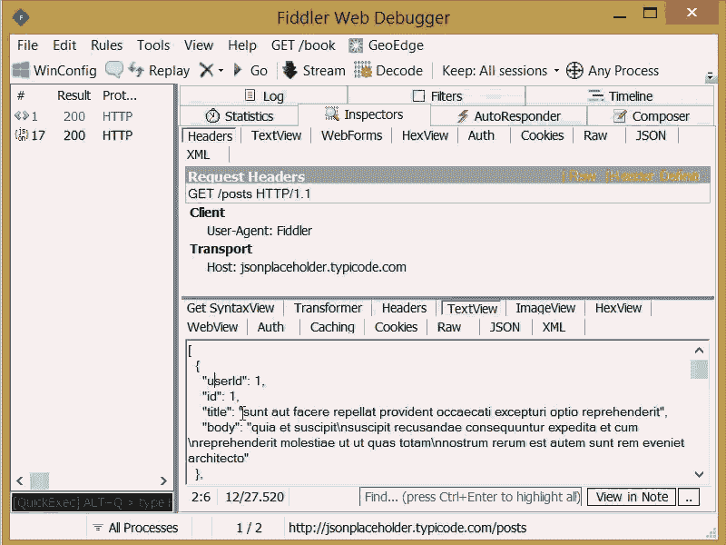**

**json2ts**

**[**YAML**](https://marketplace.visualstudio.com/items?itemName=redhat.vscode-yaml) :红帽支持的 YAML 语言，内置 Kubernetes 和 Kedge 语法支持。**

**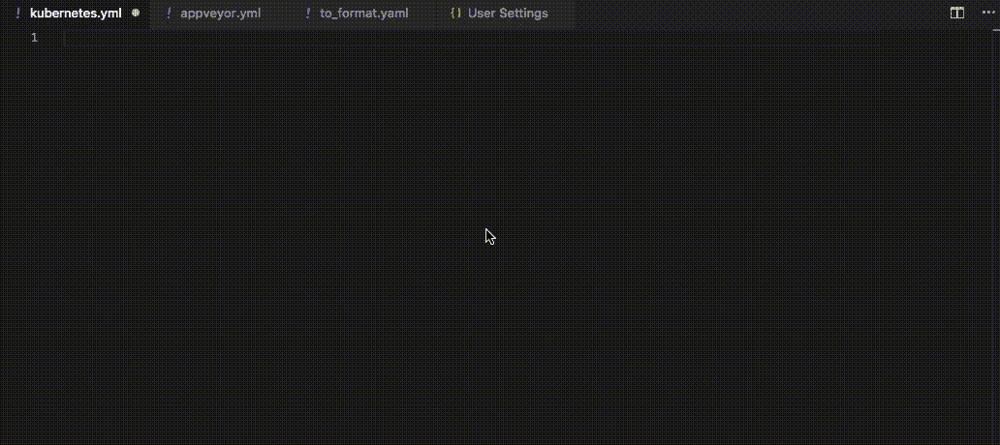**

**YAML**

**[**打字英雄**](https://marketplace.visualstudio.com/items?itemName=rbbit.typescript-hero) :打字的附加工具。**

**[**Vetur**](https://marketplace.visualstudio.com/items?itemName=octref.vetur):VS 代码的 Vue 工具。**

# **片段**

**[**角形片段(第 8 版)**](https://marketplace.visualstudio.com/items?itemName=johnpapa.Angular2) **:** 角形片段第 8 版作者[约翰爸爸](https://medium.com/u/f11db20f3d2f?source=post_page-----aa2ba92d1d7c--------------------------------)**

****

**Angular version 8 snippets**

**[**Vue vs 代码片段**](https://marketplace.visualstudio.com/items?itemName=sdras.vue-vscode-snippets) **:** 片段，将由[莎拉·德拉斯纳](https://medium.com/u/c2509fce86ff?source=post_page-----aa2ba92d1d7c--------------------------------)为你的 Vue 工作流程增压**

**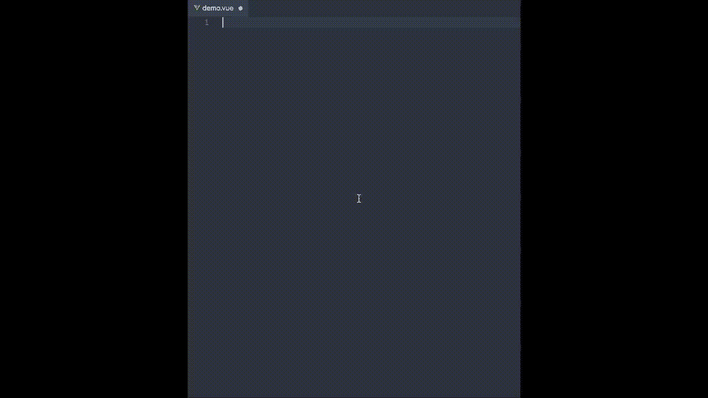**

**Vue VSCode Snippets**

# **调试器**

**[**Chrome 调试器**](https://marketplace.visualstudio.com/items?itemName=msjsdiag.debugger-for-chrome) **:** 当你想在微软的 Chrome 中调试你的应用时。**

**[**Firefox 的调试器**](https://marketplace.visualstudio.com/items?itemName=firefox-devtools.vscode-firefox-debug) **:** 我在开发过程中使用 Firefox，所以这个调试器对于使用 Firefox 的 Firefox 用户很有用。(*我默认的浏览器是* [***勇者***](https://brave.com/) *)。)***

# **棉绒和格式化器**

**[**更漂亮——代码格式化程序**](https://marketplace.visualstudio.com/items?itemName=esbenp.prettier-vscode) :代码格式化程序使用更漂亮，tt 强制执行一致的风格。**

**[**TSLint**](https://marketplace.visualstudio.com/items?itemName=ms-vscode.vscode-typescript-tslint-plugin) :微软对 Visual Studio 代码的 TSLint 支持。**

**[**代码拼写检查**](https://marketplace.visualstudio.com/items?itemName=streetsidesoftware.code-spell-checker) **:** 对源代码进行拼写检查。**

****

**Code Spell Checker**

**[**SonarLint**](https://marketplace.visualstudio.com/items?itemName=SonarSource.sonarlint-vscode)**:**这个扩展可以帮助你在用 JavaScript、TypeScript、Python 和 PHP 编写代码时检测并修复质量问题。**

**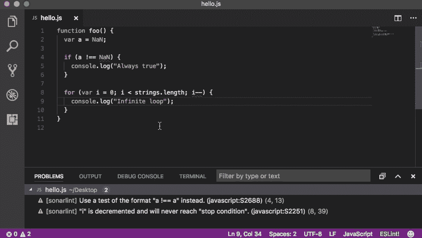**

**SonarLint**

# **其他的**

**[**吉拉与比特斗**](https://marketplace.visualstudio.com/items?itemName=Atlassian.atlascode) **:** 官方扩展由[亚特兰蒂斯](https://medium.com/u/5aa6b9976187?source=post_page-----aa2ba92d1d7c--------------------------------)。这为 VS 代码带来了吉拉和 Bitbucket 的强大功能——使用 Atlassian for VS Code，您可以创建和查看问题，开始处理问题，创建拉请求，进行代码评审，开始构建，获得构建状态等等。我最近开始使用这个扩展，我现在很少去吉拉网页了。我通过分机做几乎所有的事情。我创建积压，打开公关，审查公关的，我甚至开始通过这个扩展工作积压。这是一个强大的扩展。👍🏽**

**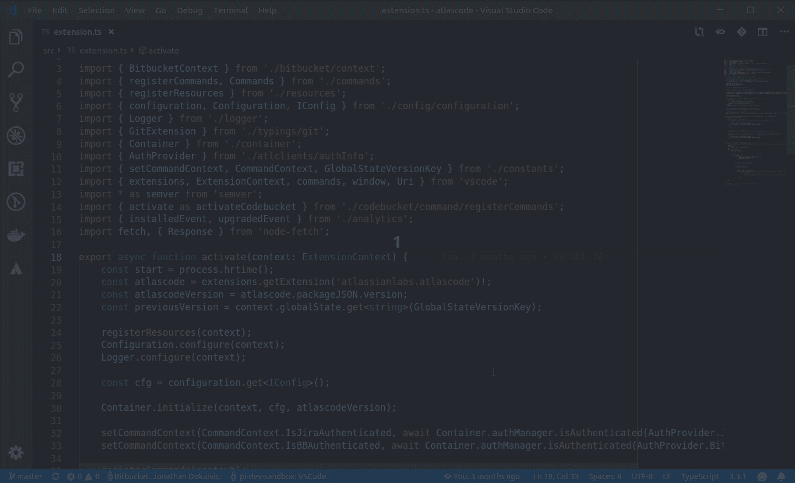**

**Jira and Bitbucket — Atlassian for VS Code**

**[**孔雀**](https://marketplace.visualstudio.com/items?itemName=johnpapa.vscode-peacock) **:** 从[约翰爸爸](https://medium.com/u/f11db20f3d2f?source=post_page-----aa2ba92d1d7c--------------------------------)的另一个延伸。当我处理多个编辑器/项目时，我发现这非常有用。它微妙地改变了你工作空间的颜色。**

**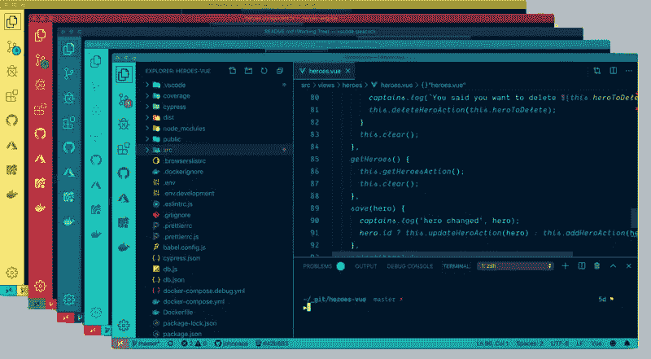**

**Peacock**

**[**自动重命名标签**](https://marketplace.visualstudio.com/items?itemName=formulahendry.auto-rename-tag) **:** 自动重命名成对的 HTML/XML 标签*(扩展可能会有性能问题，尤其是编辑大文件时。在使用这个扩展之前，请注意这个潜在的问题！)*。**

****

**Auto Rename Tag**

**[**括号对上色器**](https://marketplace.visualstudio.com/items?itemName=CoenraadS.bracket-pair-colorizer) **:** 一个可定制的扩展，用于给匹配的括号上色**

****

**Bracket Pair Colorizer**

**[**着色**](https://marketplace.visualstudio.com/items?itemName=kamikillerto.vscode-colorize) :帮助可视化文件中的 CSS 颜色。**

**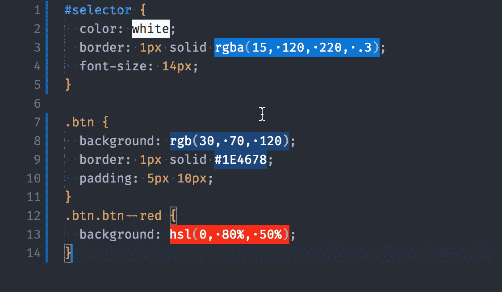**

**Colorize**

**[**CSS 窥视**](https://marketplace.visualstudio.com/items?itemName=pranaygp.vscode-css-peek) **:** 允许窥视 CSS ID 和类字符串作为从 HTML 文件到各自 CSS 的定义。允许查看和转到定义。(*可能会导致高内存使用率。)***

****

**CSS Peak**

**[**高亮匹配标记**](https://marketplace.visualstudio.com/items?itemName=vincaslt.highlight-matching-tag) **:** 高亮匹配结束或开始标记。**

****

**Highlight Matching Tag**

**[**NPM**](https://marketplace.visualstudio.com/items?itemName=eg2.vscode-npm-script)**:NPM**支持 VS 代码**

**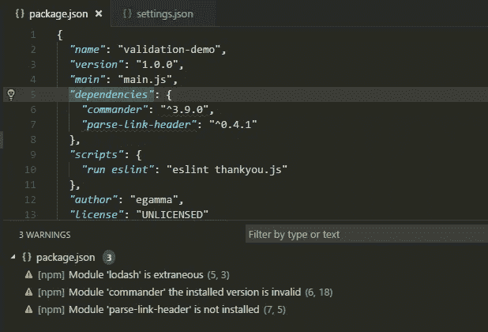**

**npm**

**[**Visual Studio IntelliCode**](https://marketplace.visualstudio.com/items?itemName=VisualStudioExptTeam.vscodeintellicode)**:**微软 AI 辅助开发。**

**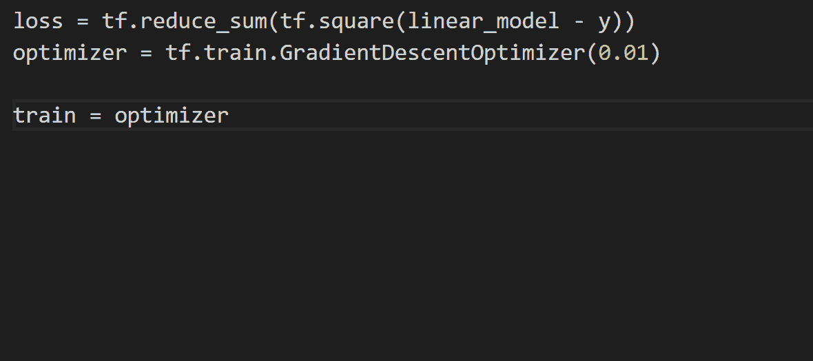**

**Visual Studio IntelliCode**

**[**GitLens** — Git 增强版](https://marketplace.visualstudio.com/items?itemName=eamodio.gitlens):增强 Visual Studio 代码中内置的 Git 功能。**

**[**自动导入**](https://marketplace.visualstudio.com/items?itemName=steoates.autoimport&ssr=false#review-details) :自动查找、解析并提供所有可用导入的代码动作和代码完成。使用打字稿和 TSX。**

# **主题**

**[**材质图标主题**](https://marketplace.visualstudio.com/items?itemName=PKief.material-icon-theme) :目前我正在使用 Visual Studio 代码的材质设计图标，这有助于我轻松识别文件。**

**[**grubbox 主题**](https://marketplace.visualstudio.com/items?itemName=jdinhlife.gruvbox) **:** 这是我目前的色彩主题(*grubbox 暗柔*)，它有多个主题可供选择。你可以在这里看到它们。**

**可能还有其他我不知道的有用的扩展，请随意分享。**

**感谢阅读🙏🏽😀。**