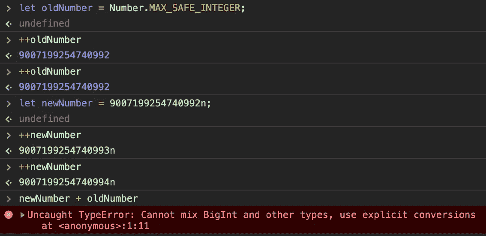
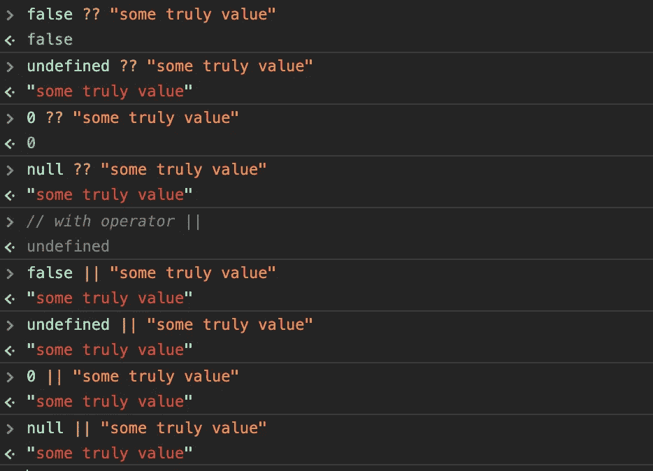
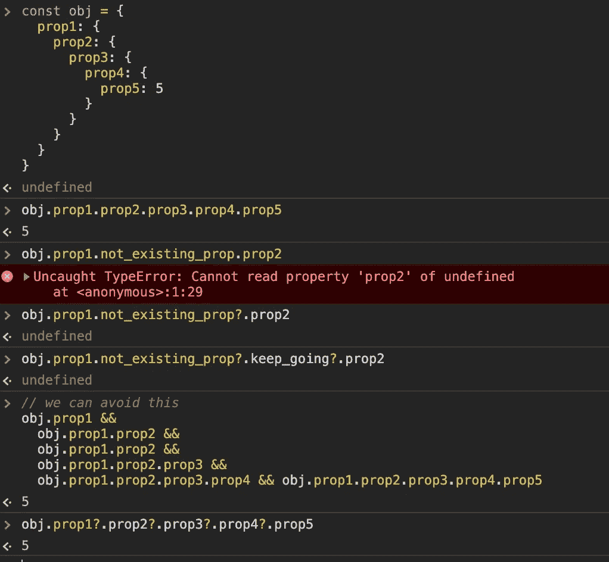
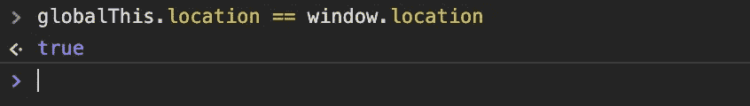

# 这里有你应该知道的 ES2020 中的 5 个新 JavaScript 特性

> 原文：<https://javascript.plainenglish.io/here-are-5-new-javascript-features-in-es2020-that-you-should-know-857ecf03a32a?source=collection_archive---------1----------------------->

## JavaScript 中最新最棒的特性


Photo by [Christopher Gower](https://unsplash.com/@cgower?utm_source=unsplash&utm_medium=referral&utm_content=creditCopyText) on [Unsplash](https://unsplash.com/s/photos/coding?utm_source=unsplash&utm_medium=referral&utm_content=creditCopyText)

JavaScript 在 ES6 版本的基础上发展了许多新特性。它彻底改变了 JavaScript 的开发过程，让我们的生活变得更加轻松。

因此，今天我将通过您应该知道的 ES2020 中的简单代码示例来回顾这些新功能。也许你已经知道了，如果你不知道，你可以用它们来改进编码。

# BigInt

新 ES2020 有七种原始类型。之前我们只是存储数据的最大数量`9007199254740992`。现在我们可以超越它。



BigInt Example

正如你在上面看到的，为了使用`BigInt`，我们必须在数字后面加上`n`符号。另外*我们不能混合 BigInt 和其他类型。*

# 无效合并

我们有`nullish coalescing`运算符，写成两个问号？？全新的 ES2020。当左侧操作数为`[null](https://developer.mozilla.org/en-US/docs/Web/JavaScript/Reference/Global_Objects/null)`或`[undefined](https://developer.mozilla.org/en-US/docs/Web/JavaScript/Reference/Global_Objects/undefined)`时，该运算符返回右侧操作数。换句话说，如果它是`null`或`undefined`，它将返回其左侧的操作数。有时，我们希望使用空字符串或假值。因此，我们可以检查它是否不是`undefined`或`null`。如果没问题，我们可以继续工作。现在，我们可以使用新的无效合并操作符`??`来避免很多情况:



Nullish Coalescing Example

# 可选链接

通过`optional chaining ?.`操作符，我们可以访问嵌套的对象属性，不管该属性是否存在。此外，我们可以避免在每个嵌套层中使用长布尔表达式来定义检查属性。如果不存在，则返回`undefined`。



Optional Chaining Example

# 模块命名空间导出

我们可以这样使用新 ES2020 的`import/export`:

```
export * as Footer from './Footer
```

这与以下代码相同:

```
import * as Footer from './Footer'
export { Footer }
```

# globalThis

如果你在 Node 上，在浏览器环境中，在 web workers 内部开发一些跨平台的 JS 项目，你会遇到全局对象的问题。因为每个环境对全局对象有不同的对象访问权限。例如，浏览器有一个用于节点的`window`、`global`和用于网络工作者的`self`。幸运的是，我们可以通过引用全局对象的`globalThis`属性来实现它，不管你的代码在哪里执行。



globalThis Example

# 结论

感谢阅读，希望这篇文章对你有用。编码快乐！

## 用简单英语写的 JavaScript 的注释

我们总是有兴趣帮助推广高质量的内容。如果你有一篇文章想用简单的英语提交给 JavaScript，用你的中级用户名发邮件到 submissions@javascriptinplainenglish.com[T5T7，我们会把你添加为作者。](mailto:submissions@javascriptinplainenglish.com)

我们还推出了三种新的出版物！请关注我们的新出版物:[**AI in Plain English**](https://medium.com/ai-in-plain-english)[**UX in Plain English**](https://medium.com/ux-in-plain-english)[**Python in Plain English**](https://medium.com/python-in-plain-english)**——谢谢，继续学习！**

# **资源**

**[](https://www.freecodecamp.org/news/javascript-new-features-es2020/) [## 您应该知道的 ES2020 中的 10 个新 JavaScript 特性

### 好消息 ES2020 新功能现已完成！这意味着我们现在对正在发生的变化有了一个完整的概念…

www.freecodecamp.org](https://www.freecodecamp.org/news/javascript-new-features-es2020/) [](https://medium.com/better-programming/javascript-es2020-features-with-simple-examples-d301dbef2c37) [## 带有简单示例的 JavaScript ES2020 特性

### JavaScript 的最新进展

medium.com](https://medium.com/better-programming/javascript-es2020-features-with-simple-examples-d301dbef2c37) [](https://levelup.gitconnected.com/new-features-of-javascript-that-we-can-use-soon-or-now-6199981bd2f) [## 您现在可以使用 ES2020 中的新 JavaScript 特性

### JavaScript 中新的强大特性:类中的私有字段、可选链接、无效合并操作符以及…

levelup.gitconnected.com](https://levelup.gitconnected.com/new-features-of-javascript-that-we-can-use-soon-or-now-6199981bd2f)**