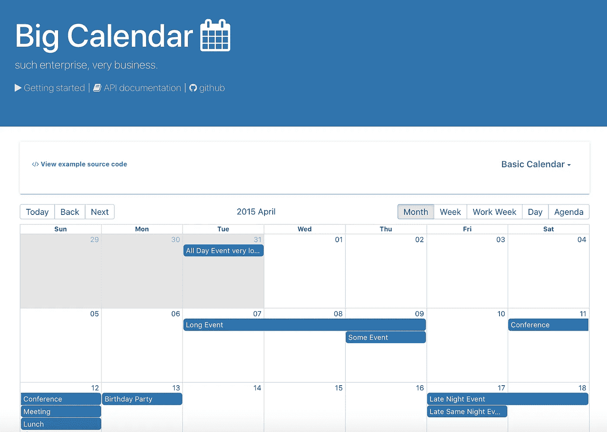
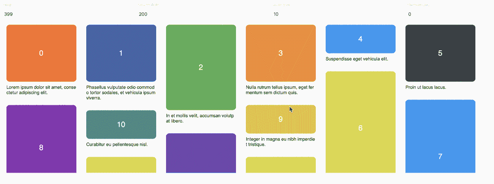
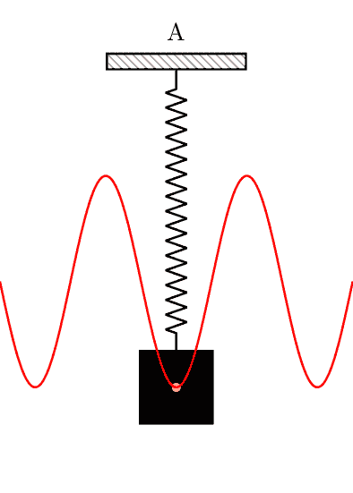

# 以下是 5 个有用的 React 组件

> 原文：<https://javascript.plainenglish.io/here-are-5-useful-react-components-fb3927e7d790?source=collection_archive---------1----------------------->

## 构建一个出色的用户界面


Photo by [Mia Baker](https://unsplash.com/@miabaker?utm_source=unsplash&utm_medium=referral&utm_content=creditCopyText) on [Unsplash](https://unsplash.com/s/photos/design?utm_source=unsplash&utm_medium=referral&utm_content=creditCopyText)

高质量的组件总是能加快开发过程，让您的生活更轻松。因此，使用一个优秀的组件是高级用户界面的原因。

如果你想节省你的时间并拥有很棒的 UI，这里有 5 个我经常使用的 React 组件:

# 反应漂亮 Dnd


react-beautiful-dnd

对于带有 React 的列表，React-beautiful-dnd 是一个漂亮且可访问的拖放工具。

**安装**

```
npm install react-beautiful-dnd --save
```

**用法**

如果感兴趣，可以阅读[文档](https://github.com/atlassian/react-beautiful-dnd/tree/master/docs)或者从[一门免费课程](https://egghead.io/courses/beautiful-and-accessible-drag-and-drop-with-react-beautiful-dnd)开始。

# Sweetalert2


sweetalert2

[Sweetalert2](https://github.com/sweetalert2/sweetalert2) 是一款漂亮、反应灵敏、高度可定制和可访问(WAI-ARIA)的 JavaScript 弹出框替代品。零依赖。

**安装**

```
npm install --save sweetalert2
```

**用途**

```
import Swal from 'sweetalert2/dist/sweetalert2.js';

import 'sweetalert2/src/sweetalert2.scss';Swal.fire('Oops...', 'Something went wrong!', 'error');
```

有兴趣可以在这里阅读更多[。](https://sweetalert2.github.io)

# 反应大日历



react-big-calendar

[React-big-calendar](https://github.com/jquense/react-big-calendar) 专为现代浏览器设计，使用 flexbox 而非传统的表格接收方法。

**安装**

```
npm install react-big-calendar
```

**用法**

```
import { Calendar, momentLocalizer } from 'react-big-calendar';
import moment from 'moment';

const localizer = momentLocalizer(moment);

const MyCalendar = props => (
  <div>
    <Calendar
      localizer={localizer}
      events={myEventsList}
      startAccessor="start"
      endAccessor="end"
      style={{ height: 500 }}
    />
  </div>
);
```

如果你有兴趣，可以在这里阅读更多[。](http://jquense.github.io/react-big-calendar/examples/index.html)

# 反应虚拟化



react-virtualized

[React-虚拟化](https://github.com/bvaughn/react-virtualized) — react 组件，用于高效呈现大型列表和表格数据。

**安装**

```
npm install react-virtualized --save
```

**用途**

```
import React from 'react';
import ReactDOM from 'react-dom';
import {List} from 'react-virtualized';// List data as an array of strings
const list = [
  'Brian Vaughn',
  // And so on...
];

function rowRenderer({
  key, // Unique key within array of rows
  index, // Index of row within collection
  isScrolling, // The List is currently being scrolled
  isVisible, // This row is visible within the List (eg it is not an overscanned row)
  style, // Style object to be applied to row (to position it)
}) {
  return (
    <div key={key} style={style}>
      {list[index]}
    </div>
  );
}

// Render your list
ReactDOM.render(
  <List
    width={300}
    height={300}
    rowCount={list.length}
    rowHeight={20}
    rowRenderer={rowRenderer}
  />,
  document.getElementById('example'),
);
```

有兴趣可以看[文档](https://github.com/bvaughn/react-virtualized/tree/master/docs#documentation)查[例题](https://bvaughn.github.io/react-virtualized/#/components/List)。

# 反作用弹簧



react-spring

[React-spring](https://github.com/react-spring/react-spring) 是一个基于 spring 物理的动画库。

**安装**

```
npm install react-spring
```

**用途**

```
import React from 'react';
import { useSpring, animated } from 'react-spring';function App() {
  const props = useSpring({ opacity: 1, from: { opacity: 0 } });
  return <animated.h1 style={props}>hello</animated.h1>;
}
```

如果有兴趣，可以在这里阅读更多[。](https://www.react-spring.io)

# 结论

感谢阅读，希望这篇文章对你有用。编码快乐！

# 资源

[](https://medium.com/better-programming/here-are-6-useful-react-components-d0865d1eefb7) [## 以下是 6 个有用的 React 组件

### 信用卡、标签、边栏等等

medium.com](https://medium.com/better-programming/here-are-6-useful-react-components-d0865d1eefb7) [](https://blog.bitsrc.io/10-useful-react-components-for-2020-35fd6af56909) [## 2020 年 10 个有用的 React 组件

### 不同场合反应成分不同。

blog.bitsrc.io](https://blog.bitsrc.io/10-useful-react-components-for-2020-35fd6af56909) [](https://github.com/enaqx/awesome-react) [## enaqx/awesome-react

### 一系列关于 React 生态系统的精彩内容。

github.com](https://github.com/enaqx/awesome-react) [](https://github.com/brillout/awesome-react-components) [## brillout/awesome-react 组件

### 这是一个令人敬畏的组件列表。不，这不是一个全面的清单，每一个反应组件在阳光下。所以…

github.com](https://github.com/brillout/awesome-react-components)