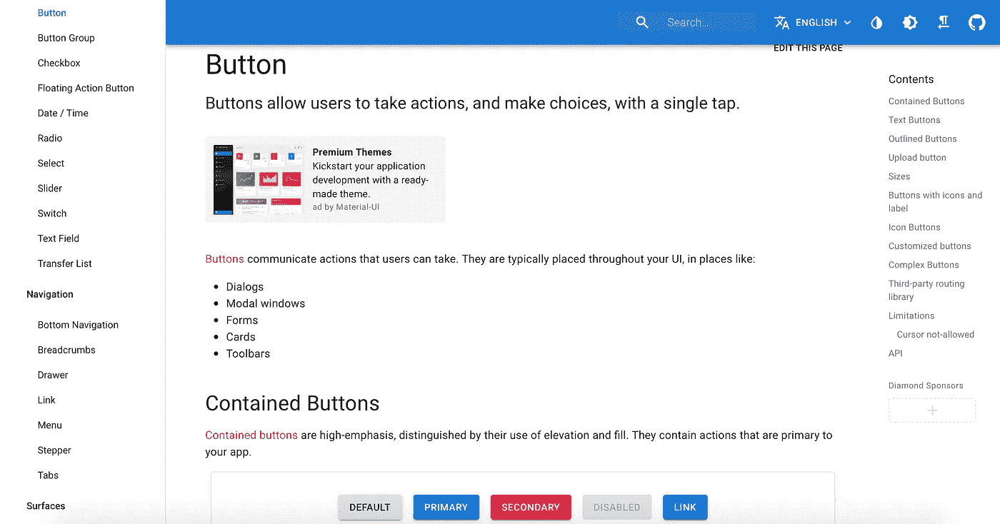
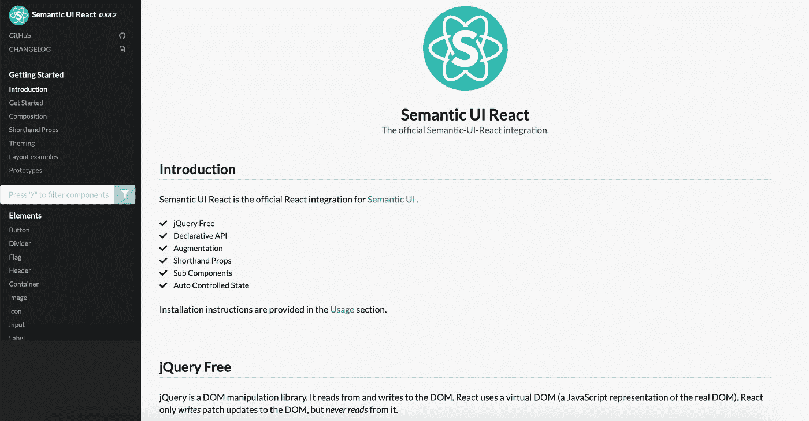
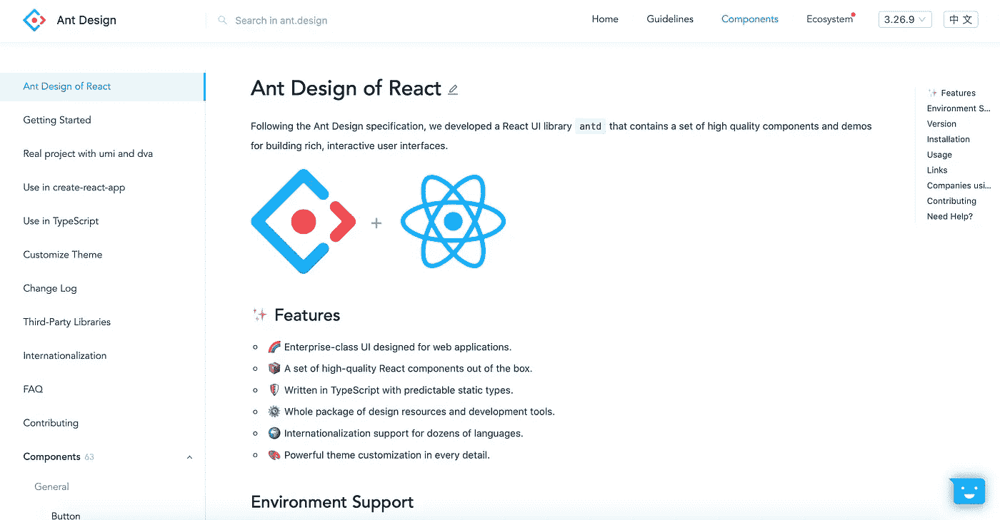
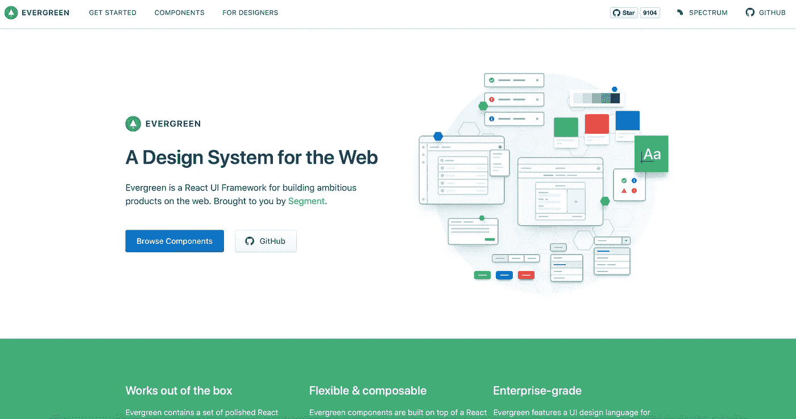
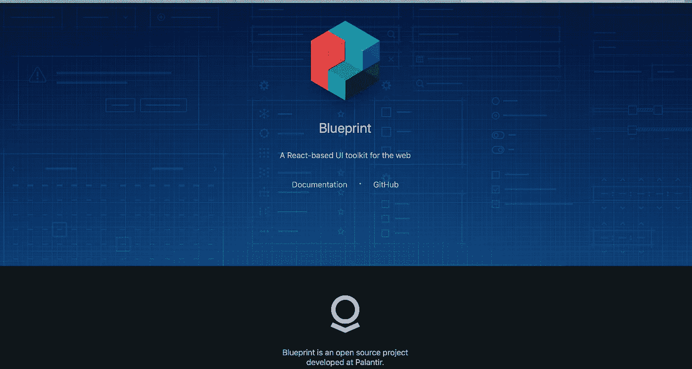

# 这里有 5 个有用的反应用户界面组件框架

> 原文：<https://javascript.plainenglish.io/here-are-5-useful-react-ui-component-frameworks-9627a955484d?source=collection_archive---------3----------------------->

## 让你的用户界面更好


Photo by [Aleks Dorohovich](https://unsplash.com/@aleksdorohovich?utm_source=unsplash&utm_medium=referral&utm_content=creditCopyText) on [Unsplash](https://unsplash.com/s/photos/web-design?utm_source=unsplash&utm_medium=referral&utm_content=creditCopyText)

非常棒的用户界面是前端开发的关键品质之一。因此，反应用户界面框架可以加快您的开发速度，让您的生活更容易。

如果你想节省时间，这里有 5 个有用的反应用户界面组件框架。

# 1.材料-用户界面



Material UI

Material-UI 是一组执行[谷歌材料设计](https://material.io)指南的反应组件。它是最受欢迎的反应用户界面库，在 [GitHub](https://github.com/mui-org/material-ui) 上有近 55000 颗星星。材料-用户界面组件在没有任何额外设置的情况下工作，并且不会污染全局范围。

您可以使用以下命令安装材料界面:

```
npm install @material-ui/core
```

如果你想看看 Material-UI 的例子，这里有由 Material-UI 的创建者策划的[模板和主题的链接。](https://themes.material-ui.com)

# 2.语义用户界面



Semantic UI

[语义用户界面](https://react.semantic-ui.com)是一个开发框架，使用人性化的超文本标记语言帮助创建美观、响应迅速的布局。它完全免费。此外，声明性 API 提供了健壮的特性和适当的验证。

语义界面在 [Github](https://github.com/Semantic-Org/Semantic-UI-React) 上有 11k 颗星。

语义界面可通过`npm`安装:

```
npm install --save semantic-ui-react
```

[语义用户界面 CSS 包](https://github.com/Semantic-Org/Semantic-UI-CSS)自动与主语义用户界面存储库同步，以提供语义用户界面的轻量级 CSS 版本。您可以使用以下命令安装它:

```
npm install --save semantic-ui-css
```

安装后，在应用程序的入口文件中导入缩小的 CSS 文件:

```
import 'semantic-ui-css/semantic.min.css'
```

# 3.蚂蚁设计



Ant Design

一个具有自然和决定性价值的设计系统，旨在为企业应用提供更好的用户体验。 [Ant Design](https://ant.design) 是 [Github](https://github.com/ant-design/ant-design/) 上与 57k 星反应最受欢迎和支持的框架之一。整个阿里巴巴前端都使用这个框架。按照 Ant 设计规范，我们开发了一个 React UI 库`antd`，其中包含了一组用于构建丰富的交互式用户界面的高质量组件和演示。

您可以使用以下命令安装它:

```
npm install antd
```

然后手动导入样式表:

```
import 'antd/dist/antd.css'; // or 'antd/dist/antd.less'
```

# 4.常绿树



[Evergreen](https://evergreen.segment.com) 是一个 React UI 框架，用于构建雄心勃勃的网络产品。它由[部门](https://segment.com/)开源构建和维护。语义 UI 在 [Github](https://github.com/segmentio/evergreen/) 上有 9.1k 星。

Evergreen 由多个组件和工具组成，您可以逐个导入它们。你需要做的就是安装`evergreen-ui`包:

```
npm install --save evergreen-ui
```

# 5.蓝图



Blueprint

蓝图是一个基于 React 的 web 用户界面工具包。这是为运行在现代浏览器和 IE11 中的桌面应用程序构建复杂的大数据量 web 界面而优化的最佳框架。该框架专为度量、数据和表格而设计。目前，blueprint 是使用 Github[上的近 16k 恒星处理大数据的最强大的框架。因此，如果您想构建一个包含指标、金融、交易和加密货币的应用程序，它正适合您。](https://github.com/palantir/blueprint)

您可以通过`npm`安装:

```
npm install @blueprintjs/core
```

安装后，导入主 css 文件:

```
// using node-style package resolution in a CSS file
@import "~normalize.css";
@import "~@blueprintjs/core/lib/css/blueprint.css";
@import "~@blueprintjs/icons/lib/css/blueprint-icons.css";
```

# 结论

感谢阅读，希望这篇文章对你有用。编码快乐！

# 资源

*   [6 个基于 ReactJS 的最佳 UI 框架](https://medium.com/@zeolearn/6-best-reactjs-based-ui-frameworks-37ea7cbd53b4)
*   [十大:ReactJS 最佳 UI 框架](https://ourcodeworld.com/articles/read/497/top-10-best-ui-frameworks-for-reactjs)
*   [2019 年排名前五的 React 框架/ React UI 组件库](https://devias.io/blog/top-5-react-ui-component-libraries-frameworks)
*   [2020 年 20+最佳 React UI 组件库/框架](https://www.codeinwp.com/blog/react-ui-component-libraries-frameworks/)