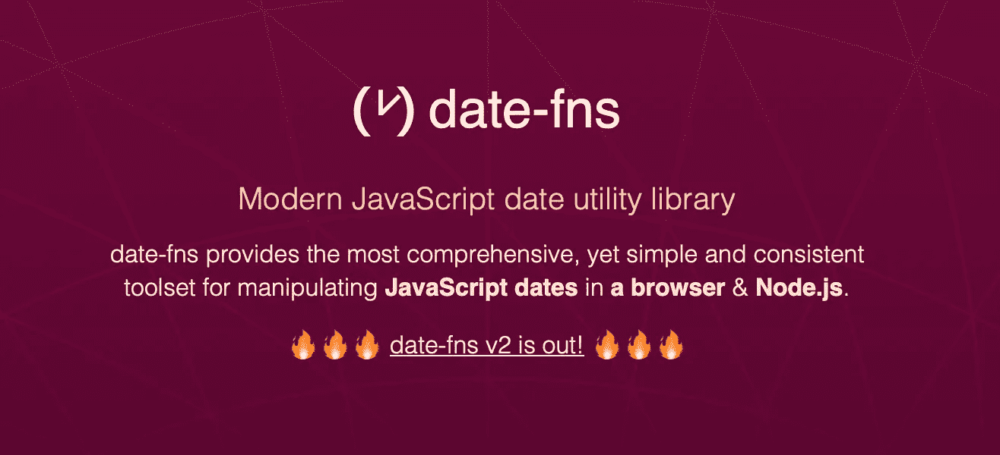
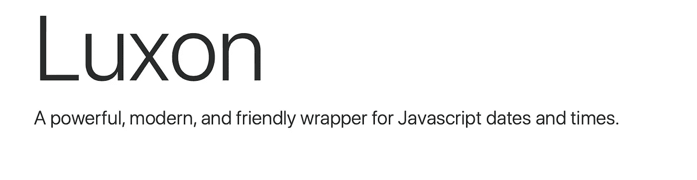

# 5 个有用的 JavaScript 时间和日期操作库

> 原文：<https://javascript.plainenglish.io/here-are-5-useful-time-and-date-manipulation-libraries-4fc6ecb8220a?source=collection_archive---------4----------------------->

## 哪个更好？


Photo by [Malvestida Magazine](https://unsplash.com/@malvestida?utm_source=unsplash&utm_medium=referral&utm_content=creditCopyText) on [Unsplash](https://unsplash.com/s/photos/clock?utm_source=unsplash&utm_medium=referral&utm_content=creditCopyText)

对于 JavaScript 项目，我们总是需要一个现代的、优秀的、轻量级的时间和日期操作库。

如果你想保存和处理你的时间，这里有 5 个有用的时间和日期库:

# Moment.js


Moment.js

js 是一个轻量级的 JavaScript 日期库，用于解析、验证、操作和格式化日期。这是最受欢迎的时间和日期操作库，在 GitHub 上有近 44k 颗星星。Moment.min.js 版有 [18.2k](https://momentjs.com/downloads/moment.min.js) gz 重量。Moment-with-locales.min.js 版有 71.4k gz 重量。

**安装**

```
npm install moment --save   # npm
yarn add moment             # yarn
```

有兴趣可以在这里阅读更多[。](https://momentjs.com)

# 天天网


Day.js

Day.js 是 Moment.js 的一个 2KB 极简、不可变的日期库替代，具有相同的现代 API，为现代浏览器解析、验证、操作和显示日期和时间。如果你用 Moment.js，你就已经知道怎么用 Day.js 了，Day.js 对国际化有很大的支持。

Day.js 在 [GitHub](https://github.com/iamkun/dayjs) 上有 27k 颗星。

**安装**

```
npm install dayjs --save
```

如果有意思，可以在这里阅读更多[。](https://day.js.org)

# 日期-fns



Date-fns

Date-fns 是一个现代的 JavaScript 日期实用程序库，它提供了最全面、最简单和最一致的工具集，用于在浏览器和 Node.js 中操作 JavaScript 日期。

Date-fns 在 [GitHub](https://github.com/date-fns/date-fns) 上有 23k 颗星。

**安装**

```
npm install date-fns --save  # npm
yarn add date-fns            # yarn
```

有兴趣可以在这里阅读更多[。](https://date-fns.org)

# 时空


Spacetime

Spacetime 是一个轻量级的 43kb JavaScript 时区库。

时空在 GitHub 上有 3k 颗恒星。

**安装**

```
npm install spacetime
```

如果你想使用时区，你可以在这里阅读更多。

# 国际光子



Luxon

Luxon 是一个在 Javascript 中处理日期和时间的库。

Luxon 在 [GitHub](https://github.com/moment/luxon) 上有 9.2k 的星星。

**安装**

```
npm install --save luxon
```

有兴趣可以在这里阅读更多[。](https://moment.github.io/luxon/)

# 结论

感谢阅读，希望这篇文章对你有用。编码快乐！

# 资源

[](https://blog.bitsrc.io/9-javascript-date-time-libraries-for-2018-12d82f37872d) [## 2019 年 9 个 Javascript 时间和日期操作库

### 9 个将在 2019 年使用的 Javascript 时间和日期操作库

blog.bitsrc.io](https://blog.bitsrc.io/9-javascript-date-time-libraries-for-2018-12d82f37872d) [](https://medium.com/datadriveninvestor/https-medium-com-sabesan96-why-you-should-choose-day-js-instead-of-moment-js-9cf7bb274bbd) [## 为什么应该选择 Day.js 而不是 Moment.js

### 目前，在 Sysco 实验室实习期间，我正在做一个需要 Javascript 框架和

medium.com](https://medium.com/datadriveninvestor/https-medium-com-sabesan96-why-you-should-choose-day-js-instead-of-moment-js-9cf7bb274bbd) 

## **用简单英语写的 JavaScript 笔记**

我们已经推出了三种新的出版物！请关注我们的新出版物:[**AI in Plain English**](https://medium.com/ai-in-plain-english)[**UX in Plain English**](https://medium.com/ux-in-plain-english)[**Python in Plain English**](https://medium.com/python-in-plain-english)**——谢谢，继续学习！**

**我们也一直有兴趣帮助推广高质量的内容。如果您有一篇文章想要提交给我们的任何出版物，请发送电子邮件至[**submissions @ plain English . io**](mailto:submissions@plainenglish.io)**，并附上您的 Medium 用户名，我们会将您添加为作者。另外，请让我们知道您想加入哪个/哪些出版物。****