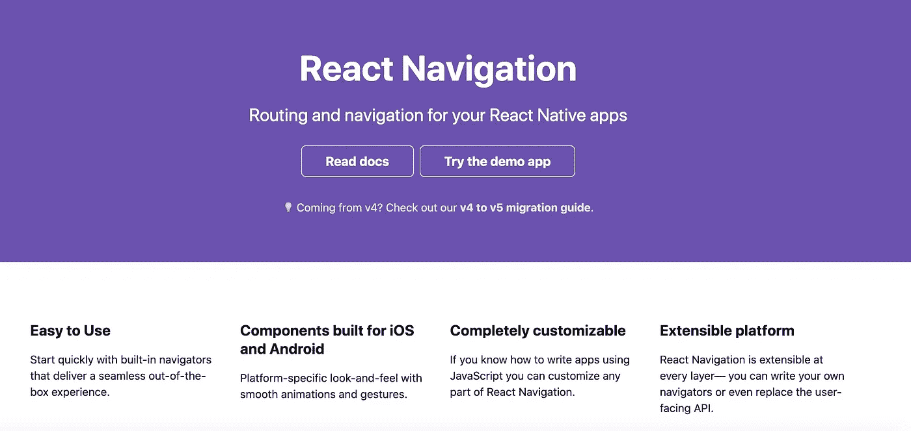
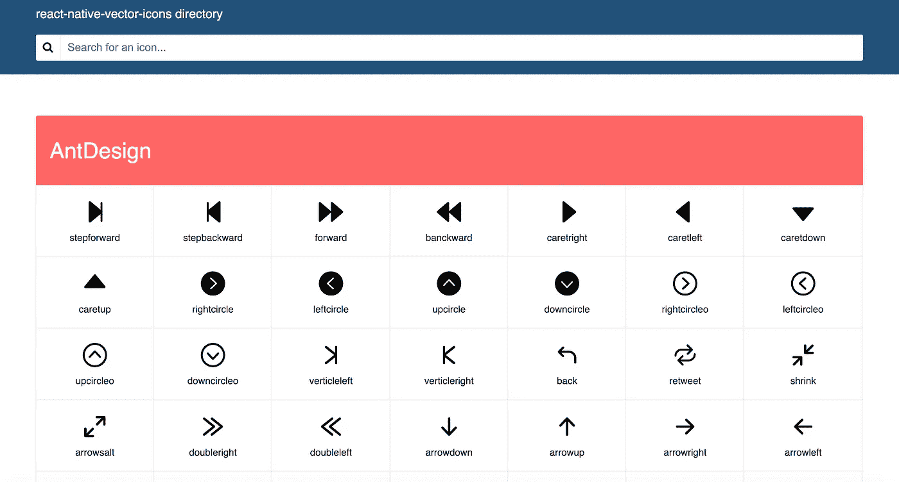
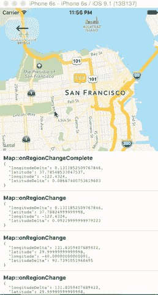
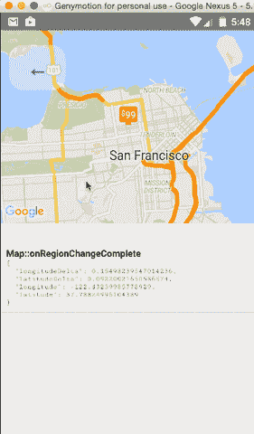
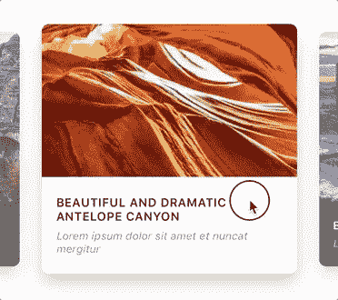
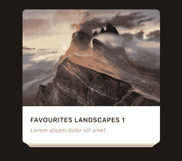
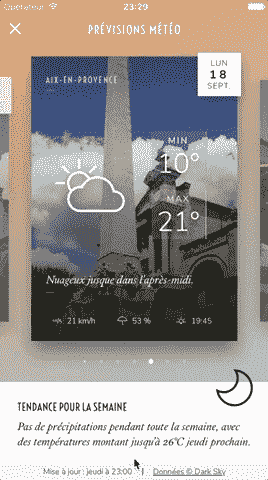

# 这里有 6 个你应该知道的有用的 React 本地库

> 原文：<https://javascript.plainenglish.io/here-are-6-useful-react-native-libraries-that-you-should-know-c067b2b62c01?source=collection_archive---------6----------------------->

## 2020 年最佳牛逼组件

Photo by [Le Buzz](https://unsplash.com/@le_buzz?utm_source=unsplash&utm_medium=referral&utm_content=creditCopyText) on [Unsplash](https://unsplash.com/collections/8381720/media-news?utm_source=unsplash&utm_medium=referral&utm_content=creditCopyText)

React Native 是当今最流行的开源移动应用框架。React Native 发展非常快，我们也必须快速开发应用程序。

因此，必须使用最好的元件。

在研究和回顾了 React Native libraries 之后，我想与您分享我的经验，这将帮助您节省时间并更快地构建您的应用程序。

# 反应导航

React-navigation

在`19k stars`的时候，React-navigation 是你的 React 原生应用最受欢迎的路由和导航库。它是完全可定制的、易于使用的库，在 iOS 和 Android 平台上都受支持。

 [## 反应导航/反应导航

### React 原生应用的路由和导航。文件可以在 reactnavigation.org 找到。如果你是…

github.com](https://github.com/react-navigation/react-navigation) 

# 反应原生矢量图标

React-native-vector-icons

在将近`14k stars`的时候，这个库是 React Native 的可定制图标，支持 NavBar/TabBar、图像源和完整样式。如果你想在应用程序中使用一些图标，这是最好的 React 本地组件库。它有超过 3000 个图标，你一定会找到一个适合你的。

 [## 扁圆形/反应原生向量图标

### 非常适合按钮、徽标和导航/标签栏。易于扩展、设计和集成到您的项目中。如果你找到了…

github.com](https://github.com/oblador/react-native-vector-icons) 

# 洛蒂的反应很自然

Lottie Example 1

Lottie Example 2

在`13.3 stars`，lottie 是一个 Android 和 iOS 的移动库，它解析用 [bodymovin](https://github.com/bodymovin/bodymovin) 导出为 JSON 的 [Adobe After Effects](http://www.adobe.com/products/aftereffects.html) 动画，并在移动设备上原生呈现它们。

 [## 反应本地社区/洛蒂反应本地

### Lottie 组件用于 React Native (iOS 和 Android) Lottie 是一个用于 Android 和 iOS 的移动库，可以解析 Adobe…

github.com](https://github.com/react-native-community/lottie-react-native) 

# 反应原生地图

Map on iOS

Map on Android

在`11.4 stars`，React Native Mapview 是 iOS + Android 的组件。它提供了一个直观的、类似 react 的 API，用于声明式地控制地图上的要素。

 [## 反应本地社区/反应本地地图

### react iOS+Android 的原生地图组件见安装说明。请参阅随附的设置说明…

github.com](https://github.com/react-native-community/react-native-maps) 

# React Native 天才聊天

Gifted Chat

在近`10k stars`，这个库是 React Native 最完整的聊天 UI。

 [## farid safi/react-native-天赋-聊天

### React Native 最完整的聊天& Web 零食 GiftedChat 游乐场编码训练营位于巴黎，由…

github.com](https://github.com/FaridSafi/react-native-gifted-chat) 

# 反应本机快照转盘

Carousel 1

Carousel 2

Carousel 3

在将近`8k stars`的时候，这个库是 React Native 的一个 swiper/carousel 组件，具有预览、多种布局、视差图像、对大量项目的高性能处理等等。兼容 Android & iOS。

 [## arch riss/react-native-snap-carousel

### 你想了解更多吗？这些是我们创建的大量使用插件的实时应用。不要害羞，分享一下…

github.com](https://github.com/archriss/react-native-snap-carousel) 

# 结论

感谢阅读，希望这篇文章对你有用。编码快乐！

# 资源

 [## 2019 年你应该知道的 11 个 React 原生组件库

### 在你的下一个应用中使用的有用的 React 原生 UI 工具包！

blog.bitsrc.io](https://blog.bitsrc.io/11-react-native-component-libraries-you-should-know-in-2018-71d2a8e33312)  [## 以下是 5 个有用的 React 组件

### 构建一个出色的用户界面

medium.com](https://medium.com/javascript-in-plain-english/here-are-5-useful-react-components-fb3927e7d790)  [## jondot/awesome-react-native

### 有属于“嗡嗡”的东西吗？给我写封短信:dotan-at-paracode.com。致力于反应的会议…

github.com](https://github.com/jondot/awesome-react-native) 

## 简单英语的 JavaScript

你知道我们有三份出版物和一个 YouTube 频道吗？在 [**寻找一切的链接 plainenglish.io**](https://plainenglish.io/) ！