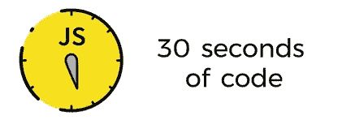

# 下面是一些有用的 JavaScript 代码片段！

> 原文：<https://javascript.plainenglish.io/here-are-some-useful-javascript-snippets-47f4fa75bdd4?source=collection_archive---------3----------------------->


因此，我列出了一些我认为对开发者有帮助的片段。请注意，这个列表并不详尽，它纯粹是基于我的经验——项目或采访。

因此，可能并不是所有的开发人员都会发现这些代码片段有用或有帮助。所以， ***平安……！！！***


*   **isLowerCase:用于确定一个字符串是否为小写。**

```
const isLowerCase = str => str === str.toLowerCase();console.log(isLowerCase('Batman'));         // false
console.log(isLowerCase('jamesbond007'));   // true
console.log(isLowerCase('FLASH'));          // false
```

*   isNullOrUndefined:检查一个值是否为空或未定义。

```
const isNullOrUndefined = val => val === undefined || val === null;console.log(isNullOrUndefined(null));        // true
console.log(isNullOrUndefined(undefined));   // true
console.log(isNullOrUndefined('Batman'));    // false
```

*   **为对象分配默认值**

```
const setDefaultObject = (obj, ...defs) => 
         Object.assign({}, obj, ...defs.reverse(), obj);setDefaultObject({ hero: 'Batman' }, { villain: 'Joker' });
```

*   **smoothScroll:可用于将被调用的元素平滑滚动到浏览器窗口的可视区域。**

```
const smoothScroll = element =>
  document.querySelector(element).scrollIntoView({
    behavior: 'smooth'
  });// scrolls smoothly to the element with the id elementID
**smoothScroll('#elementID');     ** // scrolls smoothly to the first element with class name - elementClassName
**smoothScroll('.elementClassName');**
```

*   **延迟函数执行:可以延迟函数执行，直到当前调用栈清空。**

```
const deferFunction = (fn, ...args) => setTimeout(fn, 1, ...args);
deferFunction(console.log, 'Batman arrives..!!!'), console.log('Joker is here...!!');**Output ->**
Joker is here...!!
Batman arrives..!!!
```

*   **数组交集:返回两个数组中都存在的元素。**

```
const matchingElements = (array1, array2) => 
             array1.filter(element => array2.includes(element));var heroes = ['Batman', 'Superman', 'X-Men', 'Captain America'];
var dcUniverse = ['Batman', 'Superman', 'Joker', 'Lex Luthor'];console.log(matchingElements(heroes, dcUniverse));**Output -->**
[ 'Batman', 'Superman' ]
```

*   **数组差:求两个数组的差。**

```
const arrayDiff = (array1, array2) => {
  const setArray = new Set(array2);
  return array1.filter(arr => !setArray.has(arr));
};var heroes = ['Batman','Flash','Superman','Wolverine']
var justiceLeaque = arrayDiff(heroes, ['Wolverine']);console.log(justiceLeaque);**Output -->**
[ 'Batman', 'Flash', 'Superman' ]
```

*   **从数字返回数组:返回数字组成的数组。**

```
const numberArray = number => [...`${number}`].map(num => parseInt(num));
console.log(numberArray(987));**Output ->**
[ 9, 8, 7 ]
```

*   **分割多行字符串:将一个多行字符串分割成一个行数组。**

```
const splitLines = str => str.split(/\r?\n/);
console.log(splitLines('First Line\nSecond Line\nThird Line\nFourth Line'));**Output -->** 
[ 'First Line', 'Second Line', 'Third Line', 'Fourth Line' ]
```

*   **elementContains:检查父元素中是否存在相应的子元素。**

```
const elementPresent = (parentEle, childEle) => parentEle !== childEle && parentEle.contains(childEle);elementPresent(document.querySelector('body'), document.querySelector('body'));             **// false**elementPresent(document.querySelector('head'), document.querySelector('title'));            **// true**
```

*   **删除重复:将从数组中删除重复的值。**

```
const removeDuplicates = arr => [...new Set(arr)];
console.log(removeDuplicates([11, 22, 22, 33, 44, 44, 55]));**Output -->**
[ 11, 22, 33, 44, 55 ]
```

*   返回给定函数返回真值的最后一个元素。

```
const findLast = (array, func) => array.filter(func).pop();
console.log(findLast([1, 2, 3, 4, 5], num => num % 2 === 0));**Output ->** 
4
```

*   **forEachReverse:从 ie 结尾开始对数组的每个元素执行一个函数。从数组的最后一个元素开始。**

```
const forEachReverse = (arr, callback) =>
  arr
    .slice(0)
    .reverse()
    .forEach(callback);function calculateSquare(num)
{
    return num * num;
}var array = [1, 2, 3, 4];
forEachReverse(array, val => console.log(calculateSquare(val)));**Output -->** 16
9
4
1
```



## 参考

[30 秒知识](https://30secondsofknowledge.com/)
和我的经历…！！！