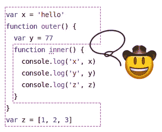

# 这是您正在寻找的关于 JavaScript 闭包的资源

> 原文：<https://javascript.plainenglish.io/heres-that-resource-on-javascript-closures-you-were-looking-for-95e82b8108f2?source=collection_archive---------1----------------------->



*观众*:任何想以实用的方式学习闭包的人，尤其是那些想尝试编码练习来证明自己已经学会的人。这并不意味着深奥的计算机科学术语。

当我还是讲师的时候，JavaScript 学习者经常问我学习某个主题的资源。我通常没有什么特别喜欢的，特别是因为我非常喜欢自己寻找这种资源的*过程*；我认为努力本身是有帮助的，特别是当你使用多种资源时，因为你可以从多个角度看到教授的主题。但是有一个话题被问得最多，那就是闭包。所以我决定创建一个资源来指引人们。

## 症结所在

闭包是一种通过传递/返回函数来提供对作用域的受控访问的方式(否则这是不可能的)。

JavaScript 中的所有函数都是闭包。如果您已经编写了一些 JavaScript，那么您可能已经编写了闭包而没有意识到这一点(见上一点)。好消息是，闭包比解释起来更容易编写/使用。如果你尝试一下，它们也更容易学习，而不仅仅是阅读它们，所以这篇文章将允许你自己尝试一下。我将给出一些闭包的实际用例，以及测试您理解的编码挑战。

# 审查:范围

要理解闭包，你必须理解作用域。谢天谢地，这很简单。范围意味着您可以访问哪些值。如果你可以访问某个值，我们说它“在范围内”，否则我们说它“在范围外”。对于任何函数，它可以访问直接在函数内部或外部创建的任何变量，但不能访问嵌套函数内部的变量。不幸的是,“在作用域内/在作用域外”的说法似乎与规则背道而驰，但事实就是如此:在嵌套函数中创建的变量在作用域外，而在函数外创建的值在函数的作用域内。(我省略了 ES6 的块范围概念，因为块不是一等公民，这意味着它们不能像函数那样被传递。)

如果你想知道，从计算机的角度来看，没有“超出范围”这种东西。对计算机来说，值要么在范围内，要么未知。换句话说，您永远不会看到“超出范围”的错误，您只会得到类似“myVariable is not defined”的错误。只有阅读源代码的人才能看到超出范围的值。

尝试在这个 repl.it 中使用 scope。在表示它们不起作用的行中添加注释，按下绿色的 run 按钮，然后观察错误。

You can play with this code to try things! Press the green Run button to run the code and see the output in the lower half.

有一个范围链的概念。作用域链只是指当你在函数自身作用域之外查看它的包含作用域，或者在*它的*包含作用域之外，等等。我不会再提到它了，只要把作用域链中所有可访问的值都看作“在作用域内”就足够了。

顺便说一句，如果你看到不在任何函数中的代码，它被认为是全局的，你仍然可以以同样的方式考虑它:就好像`function() {`在第 0 行，右括号`}`在最后一行之后。规则不会改变。

关于范围有趣的一点是，它可以在代码运行之前确定，这意味着范围在运行时不能改变。

想打个比方吗？Scope 就像一个由一系列同心墙组成的城堡，每一层都被提升了一个级别。从每一层你都可以看到外面，但是从外面你看不到里面。


See how you can see out from the inner sections, but you can’t see in? — Photo by [Ashwini Chaudhary](https://unsplash.com/@suicide_chewbacca?utm_source=medium&utm_medium=referral) on [Unsplash](https://unsplash.com?utm_source=medium&utm_medium=referral)

思考:当然，你必须能够访问函数外部的值，否则任何函数怎么能引用其他函数呢？在下面的场景中，`b`因为规则可以调用`a`，否则`b`连`a`都调用不了，那我们会在哪里？！

```
function a() {
  // stuff
}function b() {
  a()
}
```

# 让我们违反范围规则！我们第一次结案

首先，仔细检查您是否理解了这一点:在 JavaScript 中，函数可以传递，就像数字或字符串一样。我们可以将它们作为参数传递，也可以从函数中返回。

明白了吗？很好。因为这就是闭包让我们访问我们不应该被允许访问的变量的方式。

看看这个。我们第一次结案。它不应该与我们的范围规则一起工作，但是它完全工作。

Don’t forget you can run this code with the green Run button

大家讨论一下。我们调用`outer`，它声明了一个局部变量`x`。然后我们声明一个函数`inner`，它可以访问自身外部的值，即`x`。然后，我们将`inner`传递给函数`other`(此时，`fn`和`inner`是对同一个函数的引用)。接下来`other`调用`fn`。由于`fn` *是* `inner`，它可以访问`x`，并且能够`console.log`它。

需要说明的是，`inner` *是*的闭包。它是一个闭包，因为 1)它是一个函数，2)它被传递并从其他地方调用。这个“其他地方”通常不会访问`x`。它仍然没有完全的访问权限，唯一的访问权限是调用我们的函数`inner`，在函数内部我们可以对`x`做任何我们想做的事情。在这种情况下，我们控制台记录它，但我们可以做任何我们想做的事情。我们创造了它，我们控制着它，这就是闭包的力量。

令人惊讶的是，我们实际上根本没有违反我们的范围规则。函数`other`不访问`x`，它只是调用名为`inner`(通过`fn`)的函数，而*可以访问`x`。我们得到了一个教训:函数在它们被创建的范围内运行，而不是在它们被调用的地方运行。*

*所以，你可能听说过不同方式的闭包。我听过的一种方法是“从其他函数返回的函数”，这不一定是真的(例如，如果闭包是通过函数参数传递的)，也不能解释它们在编程中的价值。*

**尝试更多:*在上面的 repl.it 演示区域中，我们创建了一个名为`inner`的独立函数，然后在下面一行将其传递给`other`函数。我们不必这样做，可以传递一个匿名函数。看看你能不能做到，还有[点击这里查看答案](https://repl.it/@tylercollier/first-closure-anonymous)。*

# *它还活着！*

*通常，当`outer`函数结束时(意味着它的最后一行被运行)，在它内部创建的所有局部值都不再可访问。但是现在我们有一个特殊的情况。我们有一个使用本地值`x`的函数`inner`，这个函数正在其他地方使用(`other`)。即使在调用了`fn`之后，我们也可以再次调用它，并且仍然可以访问`x`。让我们看看下面的实际情况。在这个场景中，我们不仅要记录`x`，还要修改它。*

*如果你理解引用的概念，你就会知道如果你创建一个局部引用，比如一个数组，并把它传递给另一个函数，那么这个值本身就可以继续存在。但是，局部变量还是“死”了。*

*在`inner`函数中，我们现在有了`x++`。每次调用我们的函数，x 都会递增，然后被记录。因为这里调用了一次，所以 x 会从 5 变成 6。*

**试一下:*在上面的 repl.it 中，试着从`other`多打几个电话给`fn()`，看看 x 的值变化。*

# *闭包为什么有用？*

*前面我说过闭包提供了对作用域的受控访问。但是我们关心的范围是什么呢？变量。描述闭包价值的另一种方式是:闭包允许我们有效地创建*私有*变量。JavaScript 中没有关键字 *private* ，但是如果我们有局部变量，由于作用域的规则，它们不能从外部改变，所以它们实际上是私有的。*

*私有变量为什么好？*

*私有变量允许我们做事情，没有人能决定我们怎么做。假设我们没有这个能力去做私有变量。假设我写了一个函数，在中间，我计算了一些值，我把它放在一个变量里，因为它不能是私有的，所以它是公共的。你决定这个值因为某种原因对你有用，你开始写代码调用我的函数，然后使用这个值。后来，我改变了我的函数，我不再计算/创造那个值。嘣，你的代码坏了！但是如果我允许私有变量，你的代码将不能使用我的代码值(除非我选择公开它们)。因此，您的代码将不会依赖于我的代码；没有引入依赖性。我们称之为封装。*

*当它们是私有的时，这意味着在声明它们的函数内部是唯一可以修改它们的地方，这意味着我们必须检查可能存在的错误的源代码数量大大减少。让我们考虑私有变量的反面，在 JavaScript 中是对象属性。如果你传递一个对象，任何接收到该对象的代码都可能改变这些属性，这意味着如果有更多地方的属性发生改变，你的程序可能更难调试。冻结对象或禁止属性被更改的情况很少见，但在技术上是可能的。现在你知道为什么这样做了:更少的错误。*

*我忽略了全局变量，[它们是坏的](https://stackoverflow.com/a/485020/135101)，原因完全相同，只是问题被放大了，因为任何代码都可以修改全局变量。*

*如果你来自面向对象的编程背景，这个解释[闭包和对象是等价的](http://people.csail.mit.edu/gregs/ll1-discuss-archive-html/msg03277.html)的故事可能会有帮助。*

## *实际例子*

*如果您熟悉 React，您可能一直在使用闭包，但并没有意识到这一点。如果你不熟悉 React，目前你需要知道的是我们可以分别构建两个网页(组件),它们不应该知道彼此内部发生了什么。每个组件都可以有自己的状态，一个组件不能直接改变另一个组件的状态。*

*在下面的代码中，我们有自己的组件 App，它使用了一个按钮组件。我们的应用程序中有一些状态，叫做 counter。按钮组件不能直接改变 App 的状态。但是如果你点击按钮，计数器就会增加。不知何故，一个组件变异了另一个。为什么允许这样做？*

*答案是按钮组件没有直接改变 App 的状态。我们给按钮组件一个闭包(通过 onClick prop 传递的匿名函数)，当按钮被单击时，它调用闭包。换句话说，应用程序组件在按钮的请求下改变了自己的状态。*

*在下一节中，有几个更实际的闭包用例。*

# *我们来谈谈封闭这个词*

*人们经常将闭包描述为“封闭”一些变量的代码。我觉得这个描述对没有更深背景的程序员没什么用，所以对大多数人来说，我会说忽略这个定义。但是另一种说法是，如果一个函数不使用在它自身之外定义的变量，它就不是闭包，因为没有什么需要封闭的。*

*如果你回头看看前面的“我们的第一次闭包”代码，不幸的是，许多人会说`outer`“封闭”了在其中创建的变量，他们甚至会在函数周围画一些虚线，试图直观地表示它。但问题是，`outer`不是闭包，`inner`才是，而且，它不封闭在 `outer`内创建的变量*，而是封闭在* `inner`外的变量*。为了更好地理解和形象化它，继续阅读。**

# *闭包是“快照”吗？*

*我还听说闭包被描述为“它们环境的快照”，宝丽来相机的照片打印被描述为`outer`功能的每次使用。我认为宝丽来图片的想法令人困惑，因为就像照相机捕捉某个时间点的事物一样，它暗示了变量当前*值*的快照。但是闭包与值无关，而是与范围有关。*

*但是为什么要用“环境”这个词呢？因为每次我们调用`outer`函数时，都会创建一个有自己变量的新环境。(需要明确的是，环境这个词是描述性的，而不是技术术语。)如果你想要一个环境的视觉图像，那就是图中虚线所示的东西:*

**

*The inner function has closed over these other values. Each call to outer creates a new environment of the variables inside outer.*

*如果我们调用`outer`两次，每个都有自己的`y`，每个`y`都有自己的值。在下面的例子中，我们将展示如何返回一个闭包，我们将调用这个闭包来显示不同的值。*

*我们来分解一下上面的。我们调用了两次`outer`函数。因为它返回一个函数，所以每个对`outer`的调用都建立了自己的环境，每个环境都有一个变量`x`。那个`x`变量每次从 5 开始，但是因为我们调用了`inner1` 3 次，所以它最终是 8。因为我们只调用了一次`inner2`，所以它的`x`是 6。*

## *挑战:初始化价值观*

*在上面的例子中，`x`总是从 5 开始。如果我们想动态地设置它，有时是 5，有时是 99，等等，会怎么样呢？看你能不能想出来[在这里查答案](https://repl.it/@tylercollier/initializing-values)。*

# *模块模式*

*如果我们的闭包做了`x++`，这意味着无论谁使用它，每次都只能增加 x。没别的了。但是如果我们也想让他们做其他事情呢？比如，如果我们想让他们增加 x，或者重置它，就这样？好吧，我们只需要再来一次闭合复位。这就是模块模式:多重闭包。在 JavaScript 中，我们不是传递或返回单个函数，而是使用一个对象，其中多个属性都是函数。让我们来看看它的实际应用:*

*你可以看到我不再使用名字`outer`作为外部函数，因为我们不再有单一的`inner`函数。我们返回一个对象，其中每个值都是一个闭包的函数。*

*为什么叫模块？模块(在生活中)是自己做一些事情，然后与它们插入的一些系统交互的东西。例如，你可以在你的公寓里安装一台窗式空调。它自己冷却空气，然后将空气送入室内。我们的模块的值是孤立存在的，唯一可以与之交互的方式是通过它公开的函数(也称为“公共”函数)。如果我们记录由`makeModule`返回的值，我们会看到`increment`和`reset`，但是我们不会看到`x`。*

## *挑战:制作自己的模块*

*尝试从头开始制作和使用自己的模块。您可以[使用这个链接创建一个新的 repl.it](https://repl.it/languages/javascript) 。你的目标是创建一个计数器，类似于我们一直在做的。允许动态设置起始值。该模块应该公开两个函数:`reset` 将值设置为初始值，以及`decrement`将值减少 5。[看到这里的回答](https://repl.it/@tylercollier/make-your-own-module-answer)。*

# *闭包的实际用途*

## *排名第一的私人价值*

*正如前面 React 例子中所描述的，当您需要私有变量时，闭包是非常有用的。考虑一下，我们没有使用闭包，而是使用了一个类。它只是创建了一个所有值都可以公开更改的对象。*

*Class version of Employee*

*这里我们创建了一个雇员类。我们在`setJobType`方法中编写了代码，只允许两个值，“worker”和“manager”。但是对象上的所有值都是公共的，可以被任何代码更改。未显示:我们甚至可以从对象中删除`jobType`键！*

*现在比较一下使用模块模式的多个闭包:*

*Closure version of Employee*

*为了能够获取值，我们必须使用 getter，为了设置作业类型，我们必须使用它的 setter，因为所有的数据都是私有的。我们不能将作业类型设置为任意值。这是好事。*

## *#2 获取价值*

*您一直都在这么做，但是可能没有意识到您正在使用闭包。每当你创建一个函数，并在函数内部使用外部的值时，你已经捕获了那个值并创建了一个“适当的闭包”。这个术语，恰当的结束，不是任何人都有的定义，但是它很有用。我认为它就像术语“真子集”，它区别于术语子集，后者可能是真子集，也可能不是。如果一个函数不使用在它外部定义的值，那么你不会称它为闭包。*

*获取值的一些常见示例如下:*

*`setTimeout`*

```
*const message = 'hello from a closure'setTimeout(() => {
  console.log(message)
}, 1000)// or, same thing on one line
setTimeout(() => console.log(message), 1000)*
```

*我们传递给`setTimeout`的函数是一个闭包。它关闭变量`message`。*

*试图在没有闭包的情况下有意义地使用 setTimeout 是困难的！您可以在控制台记录一个字符串文字，如“计时器命中”。但除此之外，您可能会在回调中引用一个变量，该变量存在于 setTimeout 通常无法访问的范围内。请记住，内置的 setTimeout 函数本身是在某个外部作用域(在某个其他文件中)中声明的，无法“进入”您赋予它的函数。*

*`(array).map`*

```
*const colors = [
  { name: 'Pink', hex: '#ffc0cb'},
  { name: 'Red', hex: '#ff0000' }
]const date = Date.now()const colorsWithDate = colors.map(color => {
  return { ...color, createdAt: date }
})*
```

*在这里，我们通过向`.map`传递闭包来关闭`date`。*

*`(array).filter`*

```
*const regex = /^T/
const names = ['Timothy', 'Alicia', 'Tre']
const namesStartingWithT = names.filter(name => regex.test(name))*
```

*琐事:我们在上面关闭了什么变量？*

## *#3 构建其他函数的函数*

*这里真正的术语是“高阶函数”，意思是接受一个函数和/或返回一个函数的函数。我们已经讨论过将其他函数作为参数的函数，比如接受闭包的`setTimeout`、`(array).map`、`(array).filter`，所以我想专门讨论返回函数的函数(这会创建一个闭包)。我们可以把这些函数构造器叫做函数包装器，或者，如果它们接受一个函数并做一些除了调用原始函数之外的事情。*

***示例 A:日志包装器***

*这里有一个我经常遇到的恼人的情况。你设置一个按钮点击处理程序来做一些简单的事情，它是一个不需要花括号的箭头函数。*

```
*let x = 0
button.addEventListener('click', () => x++)*
```

*你运行你的程序，但你的应用程序似乎不工作。您想知道您的处理程序是否正在运行。也许有什么东西拦截了你的鼠标点击？谁知道呢。所以您添加了这样一条日志消息:*

```
*let x = 0
button.addEventListener('click', () => {
  console.log('incrementing x')
  x++
})*
```

*嗯，这有点烦人！我们必须加上花括号，因为我们需要运行两条语句。但是如果我们有这个功能呢:*

```
*function logWrap(fn) {
  return function(...args) {
    console.log('Got here')
    return fn(...args)
  }
}*
```

*然后，我们可以这样做:*

```
*let x = 0
button.addEventListener('click', logWrap(() => x++))*
```

*清爽！当我们发现我们正在处理的任何问题并且不再需要日志记录时，添加和删除就简单多了。*

*缺点是，如果我们用它来包装多个函数，它总是说`Got here`，所以很难判断哪个函数导致了日志。但是如果我们这样做呢:*

```
*function logWrap(message, fn) {
  return function(...args) {
    console.log(message)
    return fn(...args)
  }
}*
```

*我们可以这样使用它:*

```
*let x = 0
plus.addEventListener('click', logWrap('incrementing', () => x++))
minus.addEventListener('click', logWrap('decrementing', () => x--))*
```

*现在我们有了自定义消息，不需要花括号了。*

*但实际上最好像下面这样构建它:*

```
*function logWrap(message) {
  return function(fn) {
    return function (...args) {
      console.log(message)
      return fn(...args)
    }
  }
}// Use like this
plus.addEventListener('click', logWrap('incrementing')(() => x++))*
```

*你看出区别了吗？现在`logWrap`只接受一条消息，我们必须调用它，将函数传递给 wrap。这种方式可以说更复杂，那么有什么好处呢？如果我们只做`logWrap(‘decrementing’, someFunction)`一次，但是我们发现自己需要`logWrap(‘incrementing’, someFunction)`很多次呢？写出来会变老。我们可以利用稍微复杂一点的 logWrap 函数来构建一个新的自定义函数，专门用于记录“增量”，如下所示:*

```
*const logIncrementing = logWrap('incrementing')*
```

*然后我们会这样使用它:*

```
*plus.addEventListener('click', logIncrementing(() => x++)))*
```

*多棒啊。*

***示例 B:去抖***

*去抖一个函数就是暂停这个函数运行一段时间，通常是为了让它不会在应该运行之前运行。一个很好的例子是在谷歌文档中，当你写东西时，它不会在每次击键后自动保存，因为那样会很浪费。它会等待一两秒钟，直到你暂停输入，然后保存。*

*假设我们有一个文本框，我们想保存使用现有的`save`函数输入的内容，但是只有在用户停止输入一秒钟之后。下面是我们如何在不使用单独的去抖功能的情况下实现这一点。*

*这里我们已经使用了两个闭包，对`addEventListener`的回调和对`setTimeout`的回调。但是这里需要注意的是，我们有一个额外的变量(`timeoutId1`和`timeoutId2`)用于我们需要做的每个去抖。*

*这是一个独立的去抖功能。*

*(由于 CodeSandbox 的自动格式化，格式看起来有些不同)*

*注意，我们用`debounce`函数包装了对`addEventListener`的回调，该函数返回一个闭包。这意味着每一个都有自己的环境或局部变量。结果是更干净的代码，因为我们没有像在上面的代码中那样让局部变量“弄乱”我们的范围。*

## *#4 立即调用函数表达式(IIFEs)*

*您不能执行以下操作(注意后面的括号)，但假设您可以:*

```
*const someButton = document.getElementById('someButton')
function() {
  const a = 1
  const b = -3
  const c = -10
  const divisor = 2 * a const ans1 = (-b + ) / divisor
  const ans2 = (-b - Math.sqrt(Math.pow(b, 2) - 4*a*c)) / divisor
  someButton.onclick = () => alert(`Answer is ${ans1} or ${ans2}`)
}()*
```

*这样做的好处是什么？*

*事实证明，如果我们先用 parens 包装函数，我们就能做到。所以这个作品:`(function() { console.log('hi') })()`。这种技术被称为立即调用函数表达式(IIFE)。好处是，我们可以创建尽可能多的变量，它们只存在于生命(这是一个闭包)内部，不会“泄漏”到闭包存在的范围内。甚至功能本身也只是暂时存在！如果我们有多个生命，这意味着每个生命都可以创建具有相同变量名的变量，它们不会冲突。得心应手！*

*为什么这是一个终结？这和运行任何一个命名函数没什么区别。我们不能从外部看到函数的内部，但是当我们运行它时，函数本身可以访问它的值。该函数可以访问在其外部创建的值，比如`someButton`。*

*由于 Webpack、Browserify 等打包工具的出现，IIFEs 在客户端 JavaScript 中已经不像以前那么流行了。我们曾经在一个页面上包含多个`<script>`标签，每个标签都在全局范围内工作。如果一个脚本声明了一个名为`someValue`的`var`，那么后面的任何脚本都可以使用这个值。很容易创建难以理解变量从何而来或为什么要创建变量的意大利面条式代码，但这通常与其他脚本的集成有关。像 Webpack 这样的 Bundler 工具允许你将代码包装到不同的文件中，每个文件成为它自己的模块。它是怎么做到的？它所做的只是将代码包装在生活中。当你写道:*

```
*const message = 'hello'
export default () => console.log(message)*
```

*Webpack 有效地将其转化为:*

```
*(function() {
  const message = 'hello'
  return () => console.log(message)
})()*
```

*所以当我们写下:*

```
*import myModule from './MyModule'
// Now use myModule here...*
```

*…就好像我们写道:*

```
*const myModule = (function() {
  const message = 'hello'
  return () => console.log(message)
})()
// Now use myModule here...*
```

*您可以看到在`MyModule`文件中声明的任何变量都不会影响它们被导入的位置。我们不能用`message`，比如；它是模块私有的。*

*我说生活没有以前那么普遍了。但是生活仍然有它的位置:*

***反应中的生命***

*你可能听说过不能在 React 的`render`方法中使用`if`语句。但是你可以，如果你用生命！看看这个:*

***生命可以干净地重新定义，例如 setTimeout***

*假设您想要覆盖 setTimeout 函数，以便所有超时控制台在运行之前记录一些消息。出于我们已经讨论过的原因，利用生命是件好事。其他代码仍然一如既往地使用`setTimeout`，但是我们的闭包现在是唯一可以访问原始`setTimeout`的代码！*

*有趣的事实:如果你使用块作用域，那么在 ES6 中不需要生命。你基本上可以做和这样的生活一样的事情，使用一个匿名块:*

```
*const someButton = document.getElementById('someButton')
{
  const a = 1
  const b = -3
  const c = -10
  const divisor = 2 * a const ans1 = (-b + ) / divisor
  const ans2 = (-b - Math.sqrt(Math.pow(b, 2) - 4*a*c)) / divisor
  someButton.onclick = () => alert(`Answer is ${ans1} or ${ans2}`)
}
// Could not access a, b, c, etc here*
```

*虽然我从没见过这样做的。我不确定为什么。*

# *自我测试*

*你现在理解闭包了吗？试试这些练习。*

## *测试 1:通过一个闭包*

*请参见本回复中的说明:*

*下面是答案:[链接](https://repl.it/@tylercollier/test-yourself-set-timeout-answer)*

## *测试 2:进行切换*

*请参见此 codesandbox 中的说明:*

*下面是答案:[链接](https://codesandbox.io/s/z21rqw4vm4)*

## *测试 3:模块模式*

*记住模块模式仅仅意味着通过一个对象返回多个闭包。该对象有多个属性，每个属性都是一个访问函数局部变量的函数。*

*挑战:创建一个`makePlayer`函数，它采用一个`name`和一个起始`points`值。它应该有名字、点数和“级别”的私有变量，这是一个字符串，用于让人们根据他们的点数来了解一个玩家有多好。你应该可以调用`getName`、`getPoints`、`getLevel`，以及一个加 10 分的`levelUp`函数。如果玩家的积分低于 10，他们就是“菜鸟”，低于 20 就是“中级”，20 以上就是“大师”。*

*下面是答案:[链接](https://repl.it/@tylercollier/test-yourself-module-answer)*

## *测试 4:快速路由处理器*

*你熟悉快递吗？如果是这样，你知道你写的每个路由处理器都是闭包吗？试试这个。在下面的 repl.it 中，为返回数字的根路由(`/`)编写一个 GET 处理程序。此外，为`/`编写一个 POST 处理程序，允许某人发布一个新号码。新的数字应该是一个 JSON 对象，键为`number`，数字为值。*

*这里回答:[链接](https://repl.it/@tylercollier/test-yourself-express-route-handler-answer)*

***想提交测试？很难想出好的、清晰的、简洁的、包含的例子，所以如果你有一些分享在评论中，我希望看到它们！***

# *承认*

*在我的研究中，埃内科·阿朗索第一个用一句简洁的话解释了什么是*和*闭包为什么有价值。你可以在这里阅读他的 [Quora 回答](https://www.quora.com/What-is-a-closure/answer/Eneko-Alonso)。我把他的措辞变成了我的定义，开始了这篇文章。*