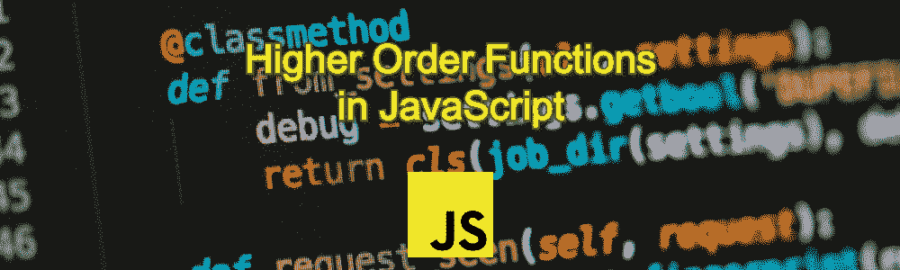
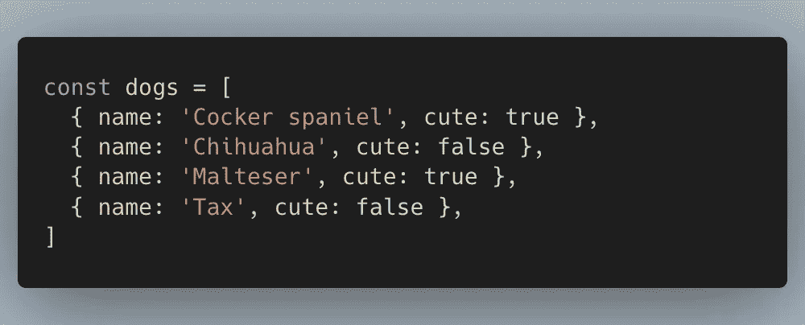
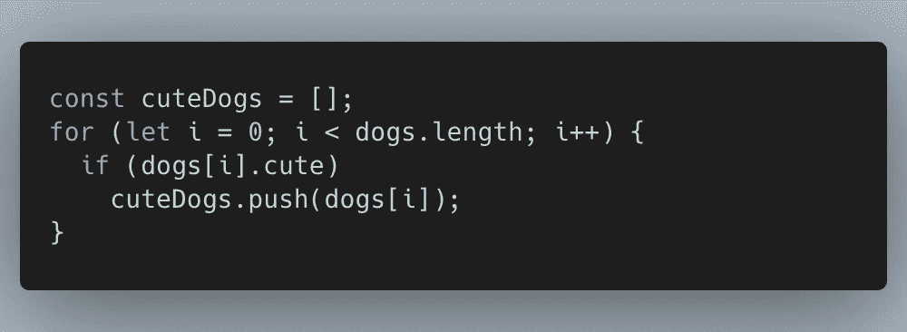
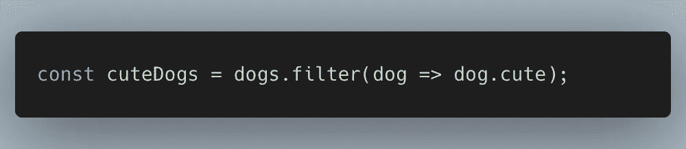
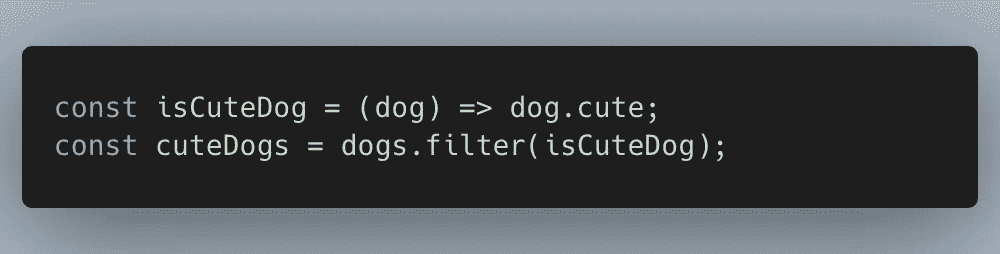
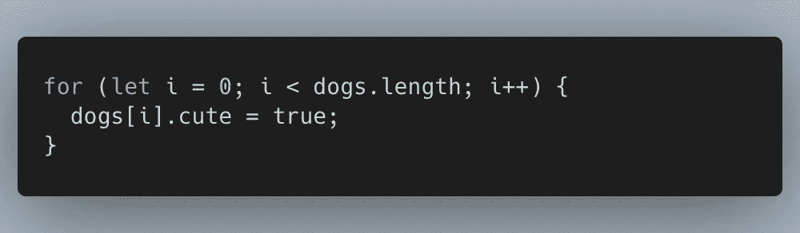
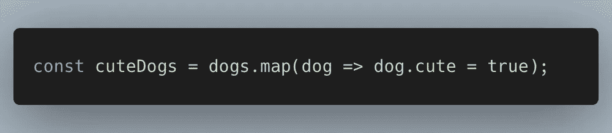
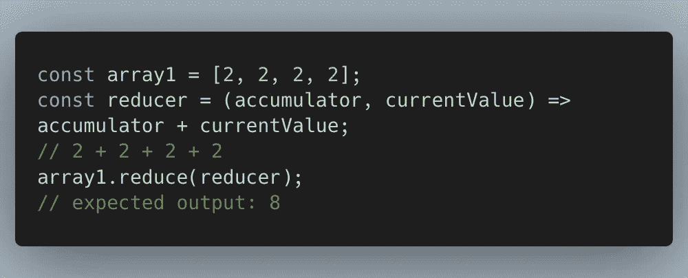
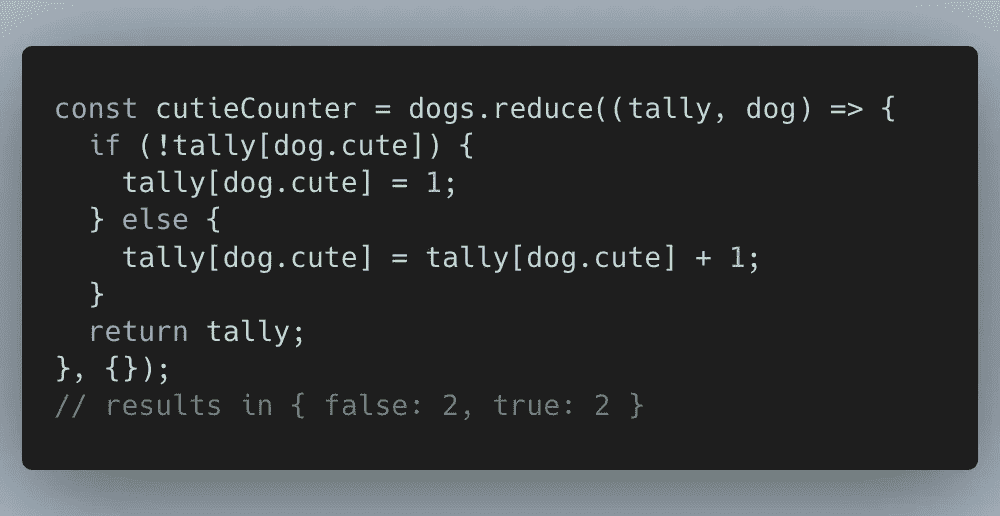

# JavaScript 中的高阶函数

> 原文：<https://javascript.plainenglish.io/higher-order-functions-in-javascript-8d7b3f6a261e?source=collection_archive---------6----------------------->

函数式编程是一种范式，它可以产生更干净、更简洁的代码，更易于维护，并减少难以发现的错误。函数式编程的一个中心概念是高阶函数。在 JavaScript 中，有多个内置的高阶函数。

根据[维基百科](https://en.wikipedia.org/wiki/Higher-order_function)的说法，高阶函数会执行以下操作之一:

*   以一个或多个函数作为自变量(即[程序参数](https://en.wikipedia.org/wiki/Procedural_parameter))，
*   返回一个函数作为结果。

# 过滤器

让我们开始吧。在企业级软件中，我们有时想要过滤可爱的狗。

我们可以为此使用 for 循环。我们将迭代每只狗，并根据可爱的布尔值进行过滤。

然而，有一个更简单、更优雅的解决方案，那就是使用**过滤器**功能。

注意这段代码有多简单。这是因为我们使用了称为滤波器的内置高阶函数。它接受一个函数作为其参数，用于过滤 dogs 数组中的项目。所以高阶函数就是一个在参数中包含另一个函数的函数。我们甚至可以在上面的例子中更进一步，将参数分离到它自己的函数中。

通过这种方式，我们以后可以在任何我们想要的地方重用 **isCuteDog** 。

# 地图

假设我们想通过让所有的狗都变得可爱来改进我们的企业软件。

我们可以通过迭代每只狗来做到这一点，并使狗变得可爱。

或者我们可以通过使用名为 **map 的高阶函数来改进我们的代码。**

再次注意这段代码有多优雅。

# 减少

比方说，我们希望有许多可爱的狗和不可爱的狗。我们可以迭代每只狗，并把多少只狗可爱和不可爱放入一个对象中。或者我们可以利用 reduce 函数。

但是首先让我们简单介绍一下 **reduce** 函数，它是一个对数组的每个元素执行 **reducer** 函数的方法，返回一个输出。假设我们有一个想要累加的数字列表。

reduce 函数接受一个参数，一个函数，即 **reducer** ，它有一个累加器(我们正在添加的值)和一个 **currentValue** (数组中正在处理的当前值)。最后，我们以值 8 结束。[这里](https://www.freecodecamp.org/news/reduce-f47a7da511a9/)是一篇很棒的文章，如果你正在纠结这个概念的话。

让我们回到我们的柜台。在这个例子中，我们提供了一个 reducer 函数，它累加一个我们称之为 **tally** 的对象，这是一个你可以在最后一行看到的对象，`{}`是初始值。当我们迭代每一项时，我们检查我们之前是否见过可爱或不可爱的狗，然后我们或者用 1 初始化该值，或者我们继续向上计数该值。最终我们会得到一个包含`{ false: 2, true: 2 }`的对象

# 结论

*   高阶函数要么是接受一个函数作为其参数，要么是返回一个函数作为其结果。
*   它使你的代码更干净，更容易重用。

如果你正在使用 React 这样的框架，你可能会遇到[高阶组件](https://reactjs.org/docs/higher-order-components.html)，它们遵循相同的模式。