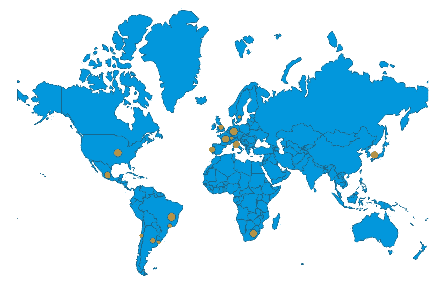
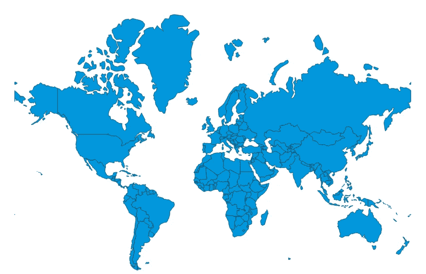

# 历史 FIFA 世界杯地理地图与 React 和 D3。

> 原文：<https://javascript.plainenglish.io/historical-fifa-world-cup-geo-map-with-react-and-d3-4b0a107476f6?source=collection_archive---------3----------------------->



数据驱动文档(Data Driven Documents)或确切地说是 D3 是由 Mike Bostock 开发的 JavaScript 库，其想法是在 web 应用程序中为数据的呈现方式添加动画和交互性。如果你让许多 D3 专家总结一下这个库能做什么，类似于“*用来操纵基于数据的 DOM*的东西会在你得到的所有答案中产生共鸣。

基于 JavaScript、SVG、CSS 和 HTML 构建，D3 是一个非常强大的库，有多种用例。在这篇精心策划的博客文章中，我将带您了解一个特别激动人心的用例:地图制作:)是的，我们将使用可能是目前最固执己见的开源数据可视化工具来可视化世界杯地理数据。

在本教程中，我们要做的事情非常简单:在世界地图上为曾经举办过这项著名赛事的国家添加圆圈。圆圈的大小与特定世界杯赛事的出席人数成正比。举办过不止一次锦标赛的国家会有不止一个圈子，我们会以不同的方式添加这些圈子。

我们正在构建的地图可视化的现场演示可以在[这里](https://www.asabahebwa.com/visualizations)找到

# D3 中的地图

D3 的用例不仅仅局限于 DOM 操作。它也是一个非常强大的处理地理信息的 JavaScript 库。常见地理位置已经有 GeoJSON 数据文件，最常见的是整个世界和美国。假设您想要绘制一幅世界地图，您将需要从包含所有国家轮廓的 GeoJSON 文件中提供 JSON 数据。

说够了，让我们把手弄脏吧！

就像我在我的[上一篇关于 React 和 D3 入门的教程](https://medium.com/@ahebwa49/getting-started-with-react-and-d3-interactive-bar-chart-3ed8c933beb3?source=friends_link&sk=e23db8c93f470553a17bfd60106c12d3)中解释的那样，使用这些工具进行定制数据可视化主要有两种方法。在本教程中，我们将对 DOM 使用 *React，对数学使用 D3*，这意味着 D3 将完成所有繁重的工作，React 将只呈现 DOM 元素。

重要的事情先来！我们需要用 create-react-app 引导 React 项目。Create-react-app 是一种简单的方法，只需一个命令就可以创建一个现代化的 web 应用程序。假设你的电脑上有一个项目目录，使用你的终端导航到它并运行`npx create-react-app nameofapp`在安装过程完成后，导航到你的应用程序文件夹并运行`yarn add d3`或`npm i d3`为 npm 用户添加 D3。前者是针对纱线用户的。

`**App.js**`

```
import React from "react";
import WorldMap from "./WorldMap";class App extends React.Component {
  constructor(props) {
    super(props);
    this.state = {
      data: {
        geoData: null,
        cupData: null
      }
    };
  } componentDidMount() {
 Promise.all([fetch("https://raw.githubusercontent.com/ahebwa49/geo_mapping/master/src/world_countries.json"),fetch("https://raw.githubusercontent.com/ahebwa49/geo_mapping/master/src/world_cup_geo.json")]
.then(responses => Promise.all(responses.map(resp => resp.json())))
.then(([geoData, cupData]) => {
   this.setState({
     data: {
       geoData: geoData,
       cupData: cupData
     }
   });
  }).catch(error => console.log(error));
}render() {
  const { data } = this.state;
  return <div>{data.geoData && <WorldMap data={data} />}</div>;
   }
 }export default App;
```

上面的代码片段显示了我的项目文件夹中 App.js 文件的内容。相当简单的代码，对吧:)这里真正发生的是，我们在 [JavaScript Promises](https://developer.mozilla.org/en-US/docs/Web/JavaScript/Reference/Global_Objects/Promise) 的帮助下，从外部资源获取显示所有国家概况的世界杯数据和地理数据。该数据存储在 state 中，并传递给`WorldMap.js`子组件，以便用 D3 进一步处理。

`**WorldMap.js**`

```
import React from "react";
import * as d3 from "d3";const margin = 75;
const width = 1200 - margin;
const height = 650 - margin;class WorldMap extends React.Component {
  componentDidMount() {
    const { data } = this.props; const svg = d3
      .select(this.refs.chart)
      .append("svg")
      .attr("width", width)
      .attr("height", height)
      .append("g"); const projection = d3
      .geoMercator()
      .scale(130)
      .translate([width / 2, height / 1.4]); const path = d3.geoPath().projection(projection); const map = svg
      .selectAll("path")
      .data(data.geoData.features)
      .enter()
      .append("path")
      .attr("d", path)
      .style("fill", "rgb(9, 157, 217)")
      .style("stroke", "black")
      .style("stroke-width", 0.5); const nested = d3
      .nest()
      .key(d => d.year)
      .rollup(leaves => {

         const total = d3.sum(leaves, d => d.attendance); const coords = leaves.map(d => projection([+d.long, +d.lat])); const center_x = d3.mean(coords, d => d[0]); const center_y = d3.mean(coords, d => d[1]); return {
           attendance: total,
           x: center_x,
           y: center_y
         };
       })
     .entries(data.cupData); const attendance_extent = d3.extent(nested, d => d.value["attendance"]);

    const rScale = d3
      .scaleSqrt()
      .domain(attendance_extent)
      .range([0, 8]); svg
      .append("g")
      .attr("class", "bubble")
      .selectAll("circle")
      .data(nested.sort(function(a, b) {
return b.value["attendance"] - a.value["attendance"];
        })
       )
      .enter()
      .append("circle")
      .attr("fill", "rgb(247, 148, 42)")
      .attr("cx", d => d.value["x"])
      .attr("cy", d => d.value["y"])
      .attr("r", d => rScale(d.value["attendance"]))
      .attr("stroke", "black")
      .attr("stroke-width", 0.7)
      .attr("opacity", 0.7);
    } render() { const { data } = this.props; const styles = {
        container: {
          display: "grid",
          justifyItems: "center"
        }
     };return (
         <div ref="chart" style={styles.container}>
           <p style={{ textAlign: "center" }}>Historical FIFA world cup geo map with React and D3.
           </p>
         </div>
        );
      }
     }export default WorldMap;
```

好吧，我同意目前可能有太多的代码需要处理，请耐心等待。我将带你经历所有的魔法:)一步一步来。

# 步骤 1 —添加 React 和 D3

```
import React from "react";
import * as d3 from "d3";const margin = 75;
const width = 1200 - margin;
const height = 650 - margin;
```

到目前为止，这是这项任务中最简单的一步，可以肯定的是，你们大多数人对此都很满意。它只是将 React 和 D3 添加到文件中，并初始化*边距*、*宽度*和*高度*变量。

# **步骤 2——添加一个容器来渲染地图**

```
render() {const { data } = this.props;const styles = {
        container: {
          display: "grid",
          justifyItems: "center"
        }
     };return (
         <div ref="chart" style={styles.container}>
           <p style={{ textAlign: "center" }}>Historical FIFA world cup geo map with React and D3.
           </p>
         </div>
        );
      }
```

在 *render* 方法中，我们从 props 中获取数据，然后为被渲染的 div 定义样式。我们添加一个图表引用到同一个容器。

# 步骤 3 —将一个 svg 附加到容器中

```
const svg = d3
      .select(this.refs.chart)
      .append("svg")
      .attr("width", width)
      .attr("height", height)
      .append("g")
```

在*componentdimount*生命周期方法中突出显示的代码片段的开始，我们在帮助 D3 的`select()`方法中选择 render 方法中的根元素，React refs 并向其附加一个 svg 元素。D3 有`attr()`方法来添加任何 HTML 属性到元素中，包括类名。在上面的代码片段中，我们向 *svg* 添加了宽度、高度和一个组元素。

# 步骤 4-创建路径对象

```
const projection = d3
      .geoMercator()
      .scale(130)
      .translate([width / 2, height / 1.4]);const path = d3.geoPath().projection(projection);
```

要在 D3 中绘制我们的世界地图，首先，我们需要建立墨卡托投影。给定经度和纬度坐标，墨卡托投影将返回一个 x 和 y 像素。为了创建表示地图多边形的 svg 对象，我们使用 D3 的 *geoPath* 方法。接下来，我们需要绘制 svg 路径来实际可视化地图。

# 步骤 5-绘制 svg 路径

```
const map = svg
      .selectAll("path")
      .data(data.geoData.features)
      .enter()
      .append("path")
      .attr("d", path)
      .style("fill", "rgb(9, 157, 217)")
      .style("stroke", "black")
      .style("stroke-width", 0.5);
```

在突出显示的代码片段的开头，我们选择了 svg 中的所有路径元素，并将我们的 GeoJSON 数据绑定到这个空选择。`.features`键对应于国家坐标数组。然后，我们选择 enter，并将一个 path 元素附加到上面创建的 path 对象中，该元素的 d 属性被设置为。

在这个时间点上，我们应该能够看到一个包含所有国家的世界地图。为了更好地定位地图，我们利用投影上的缩放和平移功能。为了让地图更易读，我把国家的填充从黑色改为蓝色。我还将每个国家的轮廓改为黑色，并减小了笔画宽度。

在您的浏览器中，您应该会看到类似这样的内容；



你应该为你目前所取得的成就感到骄傲！

# 步骤 6 —添加上下文

```
const nested = d3
      .nest()
      .key(d => d.year)
      .rollup(leaves => {

         const total = d3.sum(leaves, d => d.attendance); const coords = leaves.map(d => projection([+d.long, +d.lat])); const center_x = d3.mean(coords, d => d[0]); const center_y = d3.mean(coords, d => d[1]); return {
           attendance: total,
           x: center_x,
           y: center_y
           };
        })
     .entries(data.cupData);
```

在这一步中，我们将在每个举办过世界杯的国家画出圆圈，其半径与当年的总出席人数成正比。这通常被称为专题制图。首先，我们需要根据比赛开始的年份对比赛进行分组。这将有助于我们比较世界杯举办的不同年份的上座率。

为此，我们将使用 d3 函数`nest`。它将对我们的数据进行分组，并对其执行一些聚合。正如您在上面的代码片段中看到的，嵌套函数有两个主要部分。`.key`函数和`.rollup`函数都在嵌套对象上被调用。为了指定如何对我们的数据进行分组，我们在本例中使用了`.key`函数，告诉它按照世界杯的年份对我们的数据进行分组。`.rollup`函数传递了一个变量，在这里我们称之为树叶。这是由我们之前指定的组组织的一组数据。嵌套对象上的最后一个函数(`.entries`)将通过嵌套管道传递我们的数据。

回到我们的 rollup 函数，我们需要来自这些组的 3 样东西:

*   特定年份的出席总数
*   在地图上画圆的位置的经度
*   在我们的地图上画圆的纬度

为了获得所有出席人数的总和，我们使用 D3 的 sum 方法，该方法接受 leaves 变量和一个访问函数，该函数定义了实际要求和的内容。

为了获得坐标，我们映射叶子分组的每个元素，我们返回的所有内容都存储在一个名为 *coords 的数组中。*注意，这是我们从投影中得到的坐标的像素版本。

由于我们在一个数组中有所有游戏的坐标，我们可以使用 D3 的 mean 函数来计算平均值。这个函数遵循相同的模式，我们传递给它一个数组和一个回调函数来定义我们想要执行的操作。我们使用这个函数来获得特定年份的 x 和 y 像素坐标。

最后，我们返回一个对象，该对象将存储在 rollup 函数返回的最终结果中。

# 步骤 7-在地图上画一个圆

如果你读到这里，请耐心等待。我在最后冲刺:)

```
const attendance_extent = d3.extent(nested, d => d.value["attendance"]);

    const rScale = d3
      .scaleSqrt()
      .domain(attendance_extent)
      .range([0, 8]);svg
      .append("g")
      .attr("class", "bubble")
      .selectAll("circle")
      .data(nested.sort(function(a, b) {
return b.value["attendance"] - a.value["attendance"];
        })
       )
      .enter()
      .append("circle")
      .attr("fill", "rgb(247, 148, 42)")
      .attr("cx", d => d.value["x"])
      .attr("cy", d => d.value["y"])
      .attr("r", d => rScale(d.value["attendance"]))
      .attr("stroke", "black")
      .attr("stroke-width", 0.7)
      .attr("opacity", 0.7);
```

在地图上画圆之前，我们用 D3 的`scaleSqrt`方法创建一个半径刻度。这个方法有两个主要部分，`.domain`接受从 D3 的*范围*方法计算的最小和最大出席值数组。`.range`它也接受一个以像素为单位的最小和最大圆形尺寸的数组。

在地图上叠加圆圈的过程与我们添加路径的过程相同。这里唯一的区别是我们将使用嵌套数据。我们首先添加一个组，然后用类 *bubble 标记它。我们选择该组中目前为止为空的所有圆圈，将数据绑定到这些圆圈，从而产生空占位符，然后我们选择一个与所有绑定了数据的空占位符相对应的输入选项，并在我们的地图上附加一个圆圈。数据绑定按降序排序，这样，对于多次举办世界杯的国家，小圆圈不会出现在大圆圈下方。如代码片段所示，添加了其他熟悉的圆形属性，以添加样式并改进可视化的外观。*

是的。我们完成了…不太难，嗯！…

# 结论

这只是关于如何用 React 和 D3 创建地图可视化的 2 个系列的第 1 部分。你应该留意本教程的第二部分，在那里我们将添加动画和互动。

我还希望您对如何使用 React 和 D3 可视化地图数据有了深入的了解。如果您了解这些类型的分组和聚合，它将允许您创建非常强大的交互式图形。

如果你喜欢读这篇文章，你可能也会喜欢我的其他博客:

*   【React 和 D3 —交互式条形图入门。
*   [用 React 和 D3 做一个巧妙的比特币价格图。](https://medium.com/analytics-vidhya/make-a-clever-bitcoin-price-chart-with-react-and-d3-e6359d604b54)
*   [每个 JavaScript 后端开发者都需要知道的基本 Node.js 设置。](https://medium.com/@ahebwa49/basic-node-js-setup-every-javascript-backend-developer-needs-to-know-f157dad834e6)