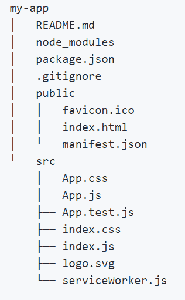
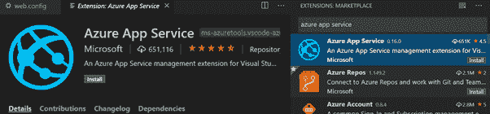
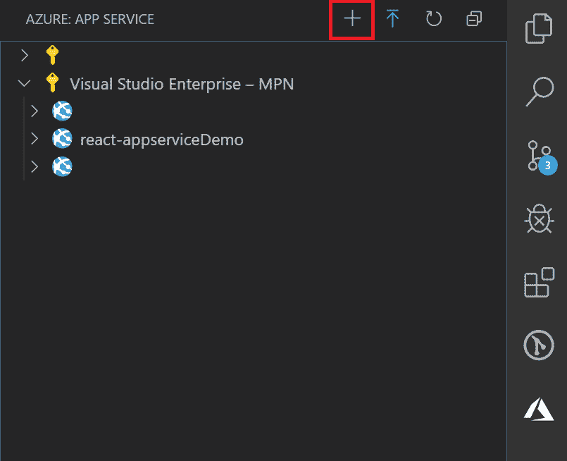
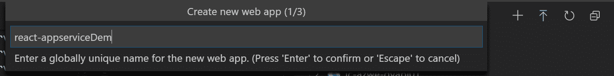
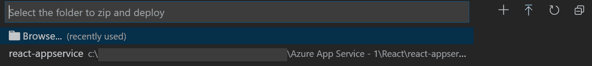
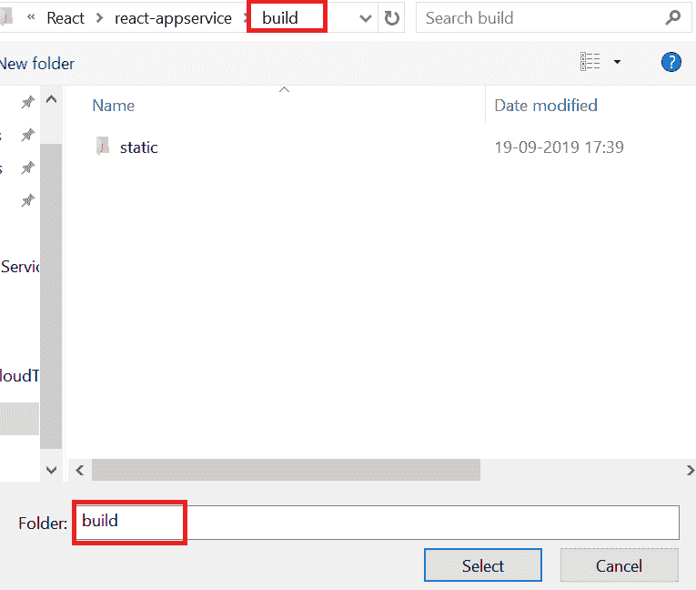
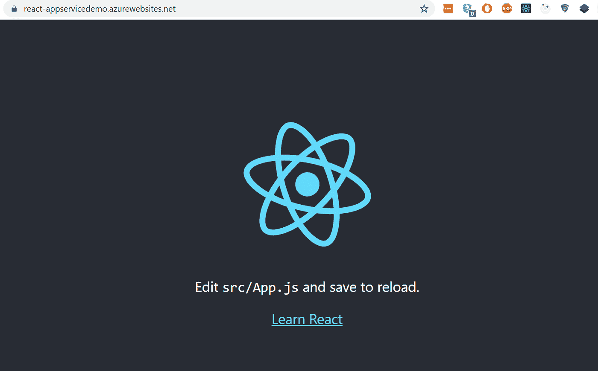

# 如何在 Azure 上托管 React 应用程序

> 原文：<https://javascript.plainenglish.io/hosting-a-react-app-on-azure-app-service-ccc5b3291b86?source=collection_archive---------1----------------------->


Hosting React application on azure app service.

Azure App Service 是一个 PaaS，允许您托管 web、移动应用、web API 和逻辑应用。这篇文章解释了如何在 azure app service 上托管 react 应用。假设你已经在你的机器上安装了 [npm](https://www.npmjs.com/) 和 [VS 代码](https://code.visualstudio.com/)，按顺序执行以下步骤。

1.  开放 VS 代码终端。

2.通过运行**‘npx create-react-app my-app’**命令创建一个 react app。

3.应用程序的文件夹结构应该是这样的。



React app Folder Structure.

4.将 **web.config** 添加到公共文件夹中，内容如下。

```
<?xml version="1.0"?>
<configuration>
 <system.webServer>
   <rewrite>
     <rules>
       <rule name="React Routes" stopProcessing="true">
         <match url=".*" />
         <conditions logicalGrouping="MatchAll">
          <add input="{REQUEST_FILENAME}" matchType="IsFile" negate="true" />
          <add input="{REQUEST_FILENAME}" matchType="IsDirectory" negate="true" />
          <add input="{REQUEST_URI}" pattern="^/(api)" negate="true" />
         </conditions>
         <action type="Rewrite" url="/" />
       </rule>
     </rules>
   </rewrite>
 </system.webServer>
</configuration>
```

5.通过运行**‘CD my-app’**命令在项目内移动。

6.运行**‘NPM 运行构建’**命令。现在，这会将生产应用程序构建到构建文件夹中。它正确地捆绑了生产模式中的 React，并优化了构建以获得最佳性能。构建被缩小，并且文件名包括散列。您的应用程序已准备好进行部署。

7.运行**‘NPM start’**在本地启动。访问 [http://localhost:3000](http://localhost:3000/) 在浏览器中启动并查看。

8.切换到 VS 代码，安装**‘Azure App Services’**扩展。



Azure App Service Extension for VS Code

9.选择 Azure 应用服务选项卡，然后**单击“+”图标**创建一个新的 web 应用。



Selecting Azure App Service tab and Creating new web app

10.出现提示时，**用您的 **azure 凭据**登录**，或者如果您没有凭据，请在此注册[创建一个免费帐户。](https://azure.microsoft.com/en-in/free/search/?&ef_id=EAIaIQobChMI_s7Nravd5AIVw4RwCh3X5Ap1EAAYASAAEgIhNPD_BwE:G:s&OCID=AID2000081_SEM_viCfsIhe&MarinID=viCfsIhe_326091507018_%2Bazure%20%2Bcredits_b_c__67435384710_aud-395027706889:kwd-212642124328&lnkd=Google_Azure_Brand&dclid=CM2TgK-r3eQCFdCDcAod3TcDZg)

11.**选择合适的订阅**，选择一个**全局唯一名称**(在我的例子中是 react-appserviceDemo)，选择 **Windows** 作为环境并继续。



Creating a new web-app with unique name

12.当提示部署或取消时，**选择了部署**选项。

13.出现文件夹浏览选项提示时，选择 **my-app/build 文件夹**进行部署。



Browse Folder option



Select Build Folder

14.一旦部署完成，浏览到应用服务 url(在我的例子中是[https://react-appservicedemo.azurewebsites.net](https://react-appservicedemo.azurewebsites.net/))然后哇！！我们的 react 现已部署到 Azure 应用服务中。

