# 用 Firebase 和 Github 操作托管您自己的 React 站点

> 原文：<https://javascript.plainenglish.io/hosting-your-own-react-site-using-firebase-and-github-actions-8a518255cc64?source=collection_archive---------4----------------------->

作为学习 UI/UX 设计的一部分，我决定重新设计我的网站并在上面工作。一旦我完成了设计和开发，我想知道是否有一种比当前的方法更简单的方法来进行部署，这种方法是将代码合并到 master 中，然后手动键入 Firebase CLI 命令来进行部署。

今天，我将向您展示如何在 Firebase 上托管您的网站，并将其与 Github Actions CI/CD 集成，以便您可以无缝地将代码部署到您的站点。

# 我们开始吧

假设您的代码托管在 GitHub 中，并且使用 Firebase deploy 部署您的站点，我将展示这些步骤。然而，其他供应商的步骤可能也是类似的。

# 设置代码

出于本文的目的，我在 GitHub 上创建了一个新的回购协议。我使用 create react app 设置了一些样板代码。由于实际的 UI 代码不在本文的讨论范围内，所以我只做了一个简单的页面。这里有一个页面截图。

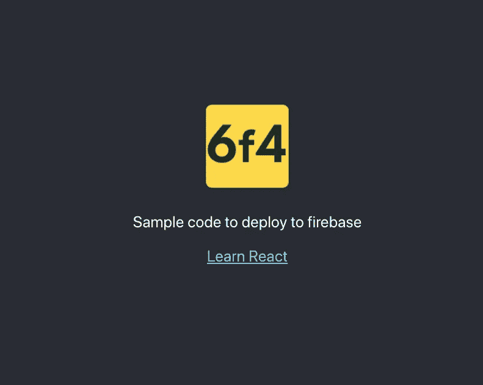

Custom logo in the default App.js page

现在，我提交代码的当前状态，并将其合并到 master。接下来，我们集成 Firebase。

# 集成燃烧基

Firebase 是我真正喜欢使用的平台之一，因为它很容易集成。我以前曾使用 Firebase 连接多个移动应用程序和网站。

现在，我们只需要连接我们的网站。让我们继续到 Firebase 并创建一个新项目。

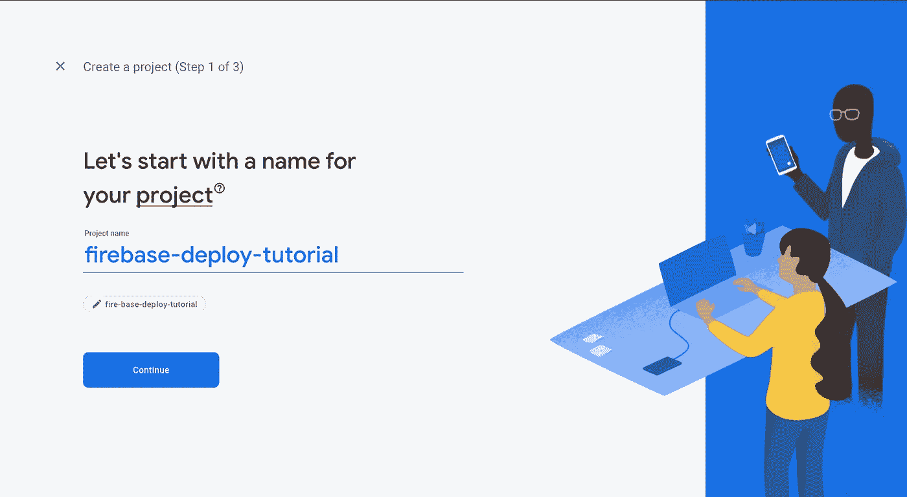

Firebase screen to create a new project.

我在 Firebase 中创建了一个新项目，并输入了初始细节。我没有启用 Firebase analytics，因为这个小项目不需要它。现在，我提交创建我的项目。

创建项目后，主页会要求我向项目添加一个应用程序。我单击将 web 应用程序添加到我的项目中。

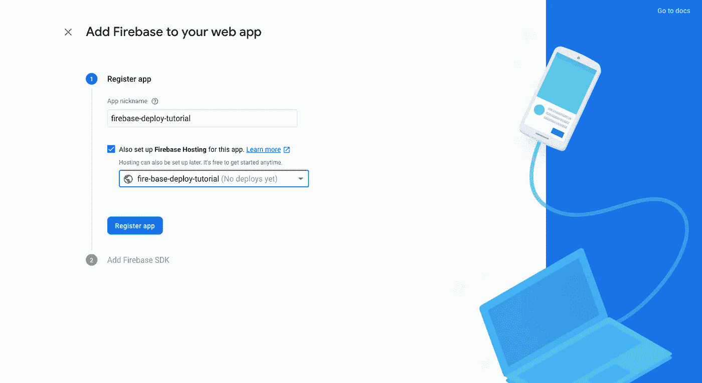

Setting up hosting

我提供了一个应用程序昵称，并为站点设置了 Firebase 主机。接下来，Firebase 要求我将一些代码粘贴到我的 index.html 中。

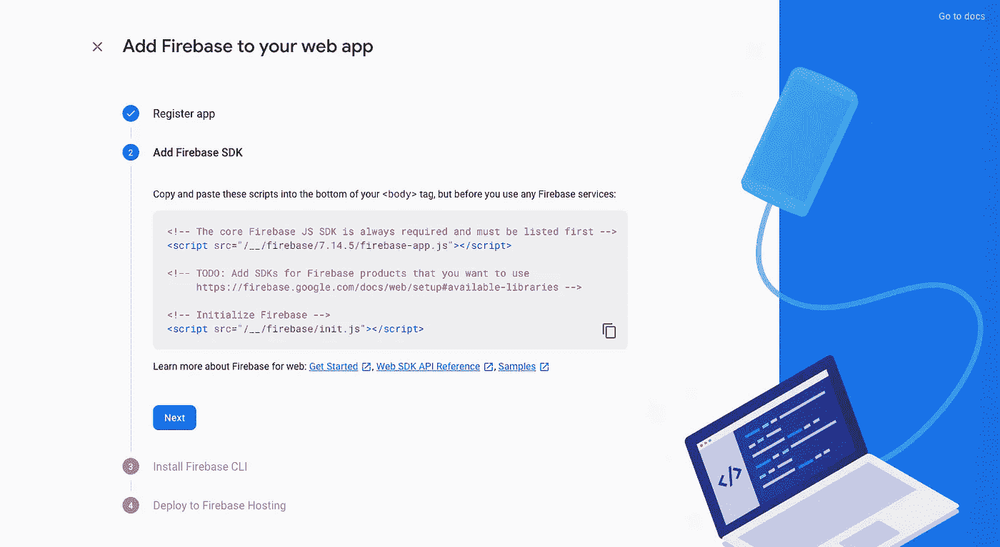

Boilerplate code to paste into index.html

我将它添加到我的 index.html，在 body 标签的底部。

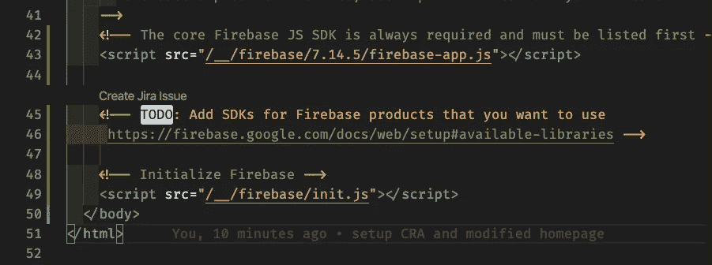

public/index.html

接下来，我使用 npm 安装 Firebase 工具，这样我就可以通过 CLI 访问它。

```
npm install -g firebase-tools
```

接下来，我使用 Firebase CLI 从我的项目文件夹登录到我的 Firebase 项目。我通过这些步骤，将主机添加到我的项目中。

```
firebase init
```

一旦我完成了，我的项目将有两个额外的文件， **firebase.json** 和**。firebaserc**

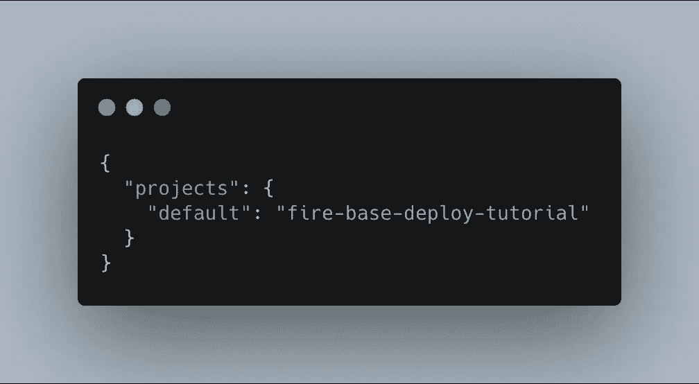

.firebaserc

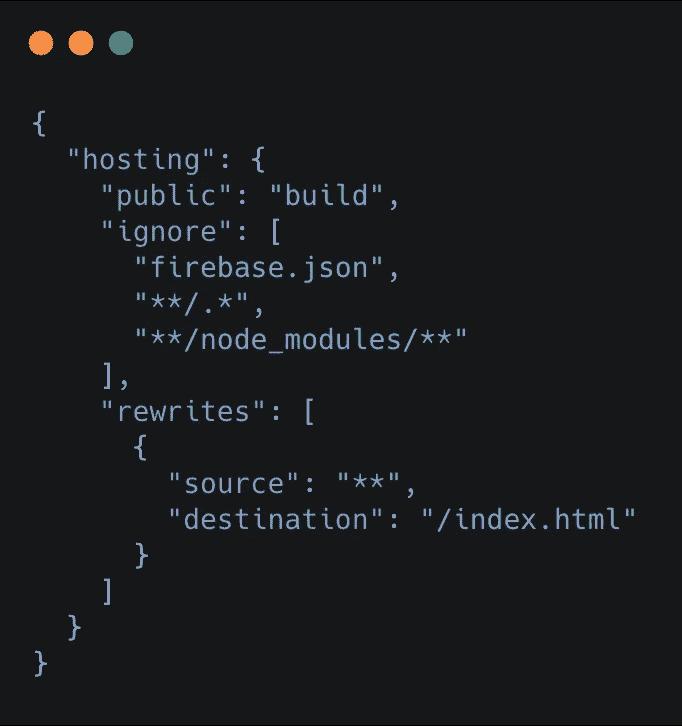

firebase.json

现在我们已经设置好了，我们总是可以使用以下命令从 CLI 部署到 Firebase:

```
firebase deploy --only-hosting
```

# 设置管道

现在我们已经设置了代码和 Firebase，让我们看看如何使用 GitHub 动作自动部署它。

## 火基令牌

在此之前，我们需要生成一个令牌，GitHub 可以用它来访问我们的 Firebase 项目，并进行部署。为此，打开一个新的终端并键入:

```
firebase login:ci
```

这将在你的浏览器中打开一个新标签，显示你的谷歌账户。选择正确的一个并接受请求，以生成令牌。

完成后，您可以返回终端窗口，找到令牌。复制这个文件，在你的 Github 库设置中，转到 secrets，并把它添加到一个新的密匙名 **FIREBASE_TOKEN 下。**

现在已经完成了，我们可以设置管道了。

## YAML 文件

从管道开始，在我的根文件夹中，我创建了一个. github/workflows 文件夹。
这是我可以放所有 YAML 文件的地方。

在工作流中，我添加了一个新的文件 main.yml，如下所示。

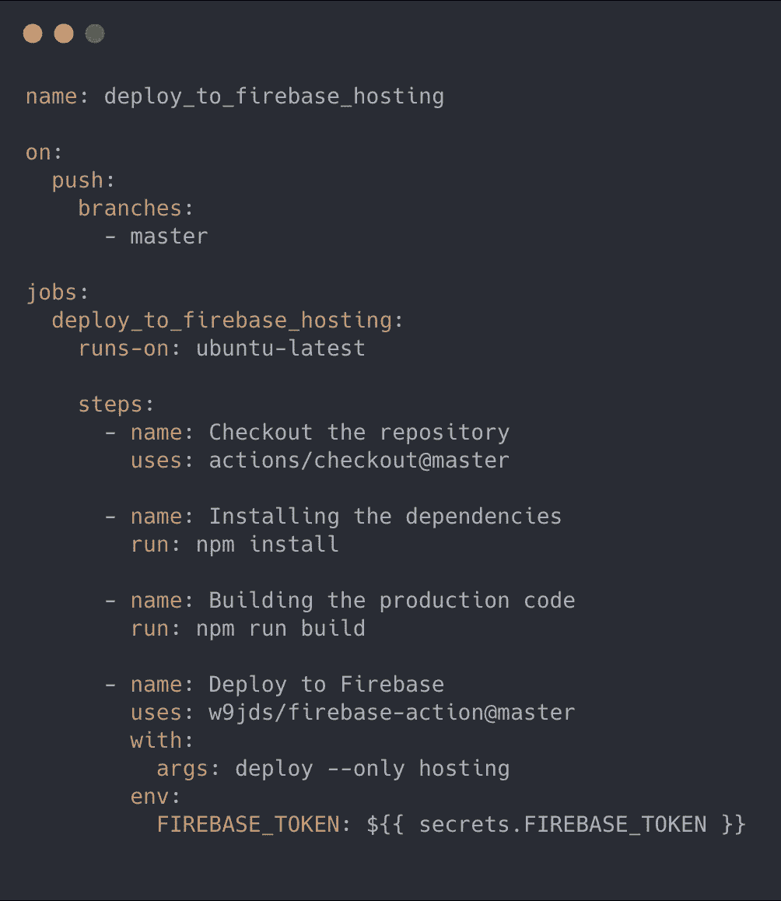

main.yml

正如您可以看到我在这个文件中定义的步骤，当您按下 master 时，管道被触发。然后，它运行以下步骤:

1.  签出主分支。
2.  使用 npm 安装依赖项。
3.  使用 npm build 构建代码的生产版本。
4.  最后，使用 secrets 中我们预定义的 FIREBASE_TOKEN 部署到 Firebase。如果需要，您可以选择不同的名称。

在实际场景中，我们会添加更多的林挺和测试步骤，以保持代码质量，并检查问题。

# 部署

现在我们已经设置好了，让我们来测试一下吧！

我所有的 YAML 代码都在“功能/部署”分支中。一旦我完成了上面的工作，我就提交它并推送代码。现在，我打开 Github 并创建一个 pull 请求，并将其合并到 master 中。

一旦成功合并，我们就可以打开回购中的 actions 选项卡，查看发生了什么。

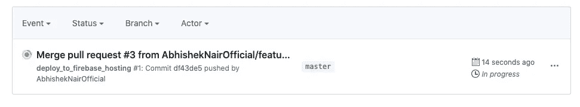

New action

我可以看到一个行动正在进行中。我点击它了解更多详情。

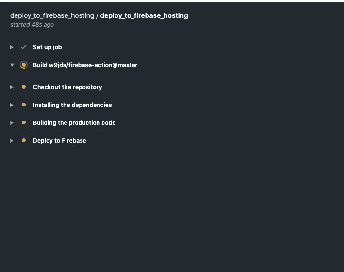

Steps

点击它了解更多细节，我可以看到步骤和目前的进展。在这里，我还将看到部署的状态，并发现潜在的故障。

一旦完成，我会在这里看到绿色，这总是一件好事。

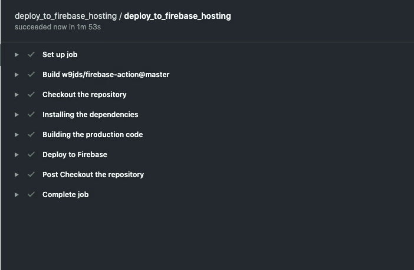

Completed successfully!

现在，我转到我的 Firebase 控制台，在那里我看到下面的横幅:

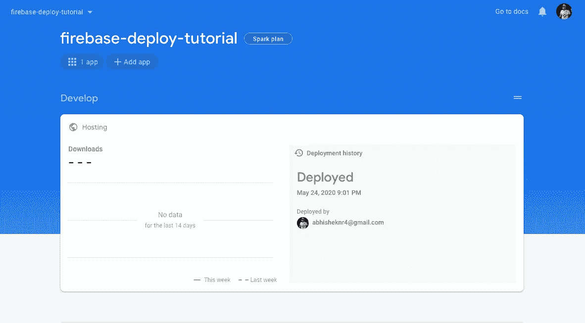

这表明它已经成功部署，我可以在这里看到网站。

接下来，每当我们需要部署到网站时，我可以在本地开发更改，一旦准备就绪，我需要做的就是将它推送到 master，Github 会处理剩下的事情！

*更多内容请看*[***plain English . io***](https://plainenglish.io/)