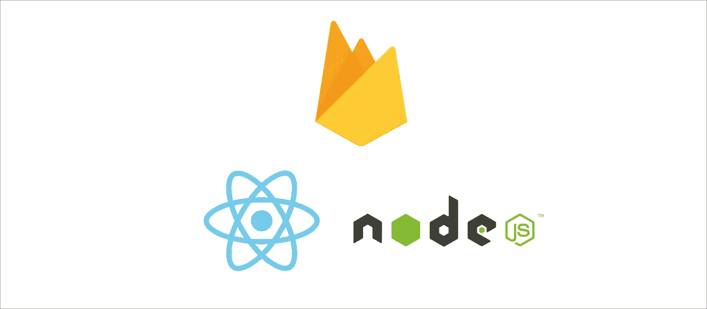

# 使用 Firebase 免费托管 React.js 和 Node.js 应用程序

> 原文：<https://javascript.plainenglish.io/hosting-your-react-js-and-node-js-apps-for-free-with-firebase-6dc670564aca?source=collection_archive---------0----------------------->

## 使用 Node.js 作为后端，通过 Firebase 托管和云功能托管静态和动态应用——免费！



# 什么是 Firebase？

Google 的服务器平台 Firebase 提供了很多东西——不仅用 Node.js 托管自定义后端，还提供了 fullstack 项目所需的所有部分，如数据库、文件托管、认证等等。

但无论我们是想用 **Firebase 托管**的静态网站，还是用**云功能**后端 a Node.js，Firebase 都依赖于灵活的定价模式。在任何情况下，您都不必为免费计划指定支付方式，这非常方便，同时也令人放心。比如他们只要存你的信用卡，只有你真的用它的免费资源超过了免费额度才会被收费。

此外，必须指出的是，免费并不能得到最好的，这一点应该很清楚——免费团队是小型项目的理想选择，可以尝试 rum 或平台。然而，你不应该用免费计划来托管你公司的专业网站——这会导致性能问题。

让我们来看看我们是如何用 Firebase 托管静态网站和 Node.js 后端的。

# 使用 Firebase 的静态网站托管— Firebase 托管

对于托管静态网站，例如，当我们以/build 文件夹的形式接收它们时，当我们在 create-react-app 项目中执行构建过程时，Firebase 提供 Firebase 托管服务。在带有 CMD 或 Bash 的终端中使用官方的 Firebase CLI，您可以简单地部署您完成的静态网站的文件夹，这样它将被上传并在 Firebase 服务器上可用。

## **功能:**

*   免费 SSL
*   全球 CDN 始终快速提供静态内容
*   高达 10 GB 的托管内容
*   每月 10 GB 免费带宽
*   多个项目/网站
*   连接你自己的现有顶级域名，就像我用 wieals.de 做的那样
*   每个项目都有免费的可选. firebaseapp.com 和. web.app 域名
*   使用 CLI 轻松部署

## **下面是一个简单的例子，说明如何用 Firebase 托管 React.js 应用程序:**

1.  转到[火焰基座控制台](https://console.firebase.google.com)
2.  在那里创建一个新项目，当它被创建时，你可以离开控制台
3.  用`create-react-app`创建一个新的 React.js 应用
4.  编写您的 React 代码。我把它放在起始模板中
5.  用`npm run build`创建 React 应用程序的构建版本。您现在应该有一个/build 目录。
6.  用`npm install -g firebase-tools`安装 Firebase CLI
7.  在 React.js 应用程序目录的根目录下运行`firebase init`
8.  选择“托管”，使用您在步骤 2 中创建的现有项目。，否则创建一个新项目。在公共目录中输入“build”，因为那里有我们的生产就绪的 React 应用程序。
    选择“是”配置为单页应用。(所以我们可以用 react-router 举例)【不要覆盖现有的 index.html 
9.  运行`firebase deploy`

当在浏览器中查找 Firebase CLI 输出的托管 URL 时，您应该看到 React.js 应用程序正在运行。

# 使用 Firebase 托管 Node.js 应用程序— Firebase 云功能

为了用 JavaScript 操作后端，Firebase 提供了所谓的**云功能**，它遵循无服务器方法。

如果没有很好的预配置或管理知识，我们可以为我们的后端提供 JavaScript，其中幕后的云函数使用 Node.js。
因此我们可以使用 Express.js 这样的节点框架，但也可以使用 handlebars 这样的模板引擎和其他可用于服务器端 node . js 或 JavaScript 的库。

## **功能:**

*   使用 JavaScript 或 TypeScript 托管 Node.js 应用程序
*   访问其他 Firebase 服务，如 Firestore 数据库
*   功能的本地测试
*   日志，使用和你的功能的状态数据，可在 Firebase 控制台查看
*   易于部署

## 在这种情况下使用 Firebase 的好处

*   它是免费的
*   没有配置的困扰
*   可扩展，如果你想使用付费计划。您只需为您在 Firebase 中使用的内容付费
*   安全性，因为您不需要自己进行配置，这降低了产生问题或潜在安全漏洞的风险

因为我们必须遵守 Firebase 的“游戏规则”，所以让我们来看一个使用 Express 的小型“hello world”示例:

## 在 Firebase 云函数中使用 Node.js & Express 的 Hello World 示例

1.  转到[火焰基座控制台](https://console.firebase.google.com)
2.  创建一个新的项目，当你完成后，控制台中就没有什么可做的了
3.  为项目创建一个新的文件夹，到目前为止保持它为空
4.  安装官方 CLI: `npm install -g firebase-tools`
5.  在你的项目文件夹中运行 **firebase init**
6.  选择“功能”(您可以选择带有空格的内容，然后按回车键)
7.  选择选取一个现有项目，并选择您在步骤 2 中创建的项目的名称。
8.  对于使用 JavaScript，你应该说“是”，自动安装依赖项，ESLint 由你决定
9.  移动到/functions 文件夹，安装 express，用`npm install express`

现在您已经完成了项目设置，在/functions 文件夹中是我们后端函数的 JavaScript 文件。现在可以用以下内容填充 **index.js** :

```
const functions = require(‘firebase-functions’)
const express = require(‘express’)const app = express()app.get(‘/’, (req, res) => {
  res.send(‘hello world!’)
})exports.app = functions.https.onRequest(app)
```

现在您可以运行`firebase deploy`了，您的函数应该已经成功部署了。CLI 应该将您运行的后端的 URL 作为**函数 URL** 输出，所以当您在浏览器中打开它时，您应该会看到“hello world”。
否则，您可以在 Firebase 控制台的 *functions* 选项卡中找到该函数的 URL。

**重要** ***exports . app***表示函数的名称在 Firebase 注册为“app”。由于您可以在一个项目中运行多个函数，这也意味着每个函数都有一个唯一的路径，就是它的名字。

比如 **index.js** 函数会是这样的:
[https://us-central1-fullstack-4b168.cloudfunctions.net/app](https://us-central1-fullstack-4b168.cloudfunctions.net/app)。
因此，如果我们想通过 **app.get()** 函数在不同的路径上监听 index.js，那么考虑 index . js 中的行为是很重要的。

# 结合两者

让我们在一个项目中部署一个静态 React 应用程序和一个 Express.js 云函数，并使它们在同一个域下可达

1.  在 [Firebase 控制台](https://console.firebase.google.com)中创建一个新项目
2.  在您的机器上创建一个新目录
3.  创建一个新的反应应用程序，CRA 在你的应用程序的根目录下。我把这个应用程序叫做客户端
4.  在目录中运行`firebase init`。如果您还没有这样做，安装 Firebase CLI 之前:`npm install -g firebase-tools`
5.  这一次，用空格选择主机**和**功能，然后回车
6.  主机和功能的设置和以前一样，但是这次主机的公共目录是 React 应用程序中的构建目录。在我的例子中，它是*客户端/构建*
7.  在*函数*目录下安装 express，如果你想使用一些 React.js 库，那么就把它们安装在*客户端*下

这应该是目前为止的结构。在我们的项目文件夹中有两个主目录:React 应用程序的*客户端*，以及包含函数代码的 Node.js 文件的*函数*。

```
├── /client
│ ├── README.md
│ ├── package.json
│ ├── /public
│ ├── /src
│ └── yarn.lock
├── firebase.json
└── /functions
 ├── index.js
 ├── package-lock.json
 └── package.json
```

如果您部署此功能，默认情况下该功能将驻留在不同的域中。为了避免这种情况，我们需要对 URL 进行重写。在这之后，我们编写函数的代码。

重写可以用于我们的主机 URL 的某些路由，转发到其他 Firebase 服务，或者简单地为其他目录提供路由，以便它们可以从外部到达。

我们使用重写来确保我们的主机和函数可以通过同一个域到达，但是函数有它自己的路由。这当然都是整容，不用做这一步。

如前所述，默认情况下，主机和函数具有完全不同的 URL，如果您想在使用主机的 React 应用程序中对云函数进行 API 调用，即使该函数具有完全不同的 URL，您也可以这样做。

此外，当然，通过重写，我们不仅可以用于 API，还可以用于我们完成的网站的子页面，这些子页面将从 Express 提供，因此通过同一个域，用户甚至不会注意到他已经从 React.js 应用程序导航到我们的功能。

这是我们在 Firebase 中创建重写的方式:

1.  打开 firebase.json，它应该位于项目目录的根目录下
2.  顶层对象应该是“hosting ”,这是使用 Firebase 托管项目时的正常情况

默认情况下，应该已经有一个重写，对于每一个 (**)传入的**路由，指向**客户端/构建**目录中的 index.html。**

这意味着无论用户在我们的托管域下选择什么路线，他都将被定向到 index.html，我们的 React 单页应用。

我们必须改变这种行为。用户不必再为每条路线都去 React 应用程序，只在“/”被调用时。此外，我们将为路由“/api”创建一个重写，它引用我们名为“api”的函数，我们将在 functions 目录下的 index.js 中创建该函数。记住函数的名字不是文件名，而是由
定义的*导出。<姓名>* 。

重写完成的 firebase.json :

```
“rewrites”: [
  {
    “source”: “/”,
    “destination”: “/index.html”
  },
  {
    “source”: “/api”,
    “function”: “api”
  }
]
```

我们的 **index.js** 函数代码:

```
const functions = require('firebase-functions')
const express = require('express')const app = express()app.get('*', (req, res) => {
  res.send("Hello from the API")
})exports.api = functions.https.onRequest(app)
```

现在我们可以运行`firebase deploy`。
如果您查找部署后 CLI 提供的托管 URL，在根页面“/”上，应该有 React 应用程序在运行，但如果您现在输入“/api”作为路由，您应该会看到 api 响应。

## 但是如果我们想要有多条路线，由 Express 处理呢？

我们只是用 app.get("* ")使它变得简单，但是如果我们有多个需要它们自己的 app.get()函数的路由，我们不能告诉它们都监听它们自己的所有路由—那将是不明确的。

这么说吧，除了可以访问 API 的 API 路径之外，我们还希望有一个由 Express 管理的管理区域。当然，我们必须首先创建一个重写。

只需在我们的 firebase.json 中为它添加这一个，在其他两个重写的下面，这两个重写已经存在:

```
{
  “source”: “/admin”,
  “function”: “api”
}
```

现在，我们必须对 index.js 进行更改，以确保路由是唯一的:

```
app.get(‘/api’, (req, res) => {
  res.send(‘API output’)
})app.get(‘/admin’, (req, res) => {
  res.send(‘This is the admin page’)
})
```

现在可以再次运行`firebase deploy`，应该可以访问“/”下的 React app，以及“/api”和“/admin”两个 Express.js 路由。

## 我们做到了！

**感谢您的阅读！有兴趣订阅 Medium.com，同时支持我吗？如果您的回答是肯定的，请确保查看:**

[https://louispetrik.medium.com/membership](https://louispetrik.medium.com/membership)

如果您注册，通过此链接，我将收到您每月付款的一部分。然而，您无需支付额外费用。因此:

**提前谢谢您！:)**

# **简单明了的注释**

你知道我们有四个出版物和一个 YouTube 频道吗？你可以在我们的主页 [**上找到所有这些。io**](https://plainenglish.io/)——关注我们的出版物并 [**订阅我们的 YouTube 频道**](https://www.youtube.com/channel/UCtipWUghju290NWcn8jhyAw) **来表达爱意吧！**