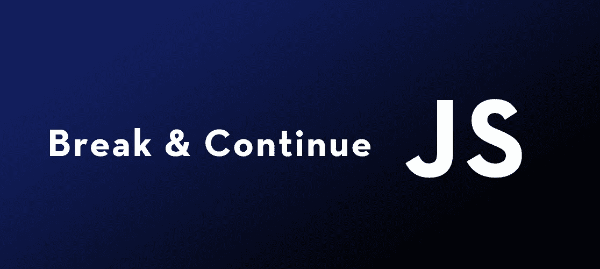

# 如何在 JavaScript 中使用 Break & Continue 语句

> 原文：<https://javascript.plainenglish.io/hot-to-use-break-continue-statements-in-javascript-9b6d30e56deb?source=collection_archive---------3----------------------->

如果您正在使用 JavaScript 中的循环，您可能会发现在某些时候当满足特定条件时中断循环或者您可能想要跳过循环的一次或多次迭代是很有用的。这就是`break`和`continue`语句的用途，今天我们将讨论它们各自的功能以及如何使用它们。



# 中断语句

我们将从讨论 Break 语句开始。Break 语句用于在满足特定条件时停止循环，只要在需要的地方编写`break`就可以使用。

您也可以在 switch 语句中使用`break`,但是，今天我将重点介绍它在循环中的用法。如果你想知道更多关于`break`是如何被用来停止 switch 语句的，你可以看下面的视频。

既然我们已经确定了这一点，让我们来看一个在 for 循环中使用 Break 语句的例子。如果你还没有学习 JavaScript 中的循环，你可以点击这里阅读所有关于它们的内容[。](https://levelup.gitconnected.com/the-difference-between-for-loops-and-while-loops-in-javascript-6029f45faeba)

在这个 for 循环中，变量`i`从 1 开始，将继续递增，直到大于或等于 5。

通常，控制台会打印以下内容:

```
1
2
3
4
5
```

但是如果你看一下我们插入的 Break 语句，当`i`等于 4 时循环停止。

现在，控制台将打印:

```
1
2
3
```

您会注意到数字 4 没有打印到控制台上。这是因为当条件满足时，Break 语句立即终止了循环。如果您在理解这一点上有困难，下面的步骤按顺序展示了代码正在做什么。

1.  查看`i`的值，确保它不大于或等于 5。
2.  将`i`的值增加 1。
3.  检查`i`是否等于 4。
4.  如果`i`不等于 4，则运行`console.log(i);`语句。
5.  循环重复，直到`i`等于 4。在这一点之后，循环中断(停止)。


# 继续语句

像 Break 语句一样，Continue 语句也在循环中使用，但用途略有不同。与 break 语句不同，一旦满足条件，循环就结束，Continue 语句用于跳过循环的迭代。

我们可以像使用`break`一样使用`continue`，所以让我们看看之前的代码，这次我们将把`break`换成`continue`。

同样，除了用`continue`切换`break`之外，这段代码与我们之前使用的例子完全相同。不同之处在于，这次控制台将打印以下内容，而不是打印 1 2 3:

```
1
2
3
5
```

如果你还没弄明白，当`i`等于 4 时，它跳过那次迭代，并且`console.log(i);`不会再次运行，直到下一次代码循环。


# 附加信息

虽然这些只是 Break 语句和 Continue 语句的基础，但是通过观看下面的视频，您可以更详细地了解它们。希望这有所帮助，感谢阅读！

*来源:*

[https://www.w3schools.com/jsref/jsref_break.asp](https://www.w3schools.com/jsref/jsref_break.asp)

[https://www.w3schools.com/js/js_break.asp](https://www.w3schools.com/js/js_break.asp)