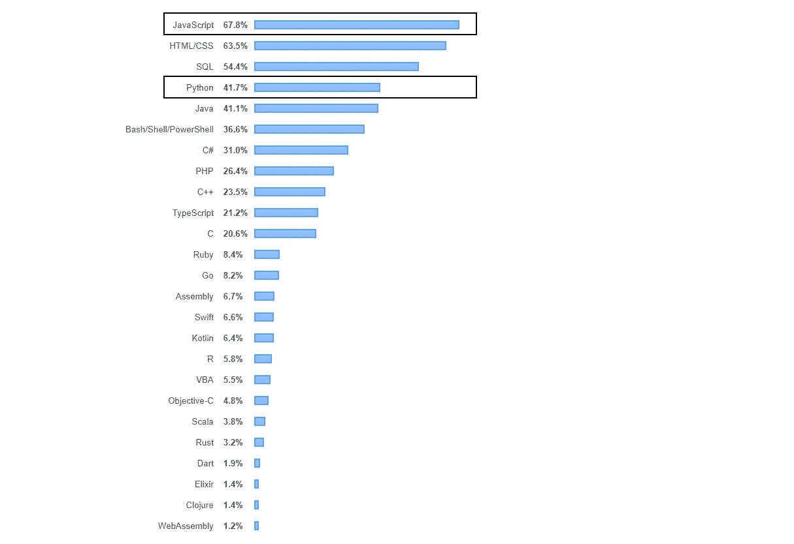

# 数据科学可以用 JavaScript 吗？

> 原文：<https://javascript.plainenglish.io/how-about-data-science-and-javascript-lets-take-a-look-c123c6981afa?source=collection_archive---------0----------------------->

## 让我们找出答案

在过去的几年里，在计算机科学领域有很多关于这两个术语的炒作。在 NodeJS 允许 JavaScript 开发人员编写服务器端代码之后，JavaScript 第一次成为流行语言。其次是数据科学领域，尤其是机器学习。理论的最新进展，尤其是深度学习的引入。

我想给出两种语言之间一个简单明了的观点。让我们看看下面的内容，然后马上得出我们的结论。

# **JavaScript**

我喜欢 JavaScript，因为它是一种多功能的语言，不断地快速发展和成长。通过引入 NodeJS，JavaScript 现在可以在客户机和服务器上运行。最重要的是，它是平台独立的，这意味着任何基于 JavaScript 构建的应用程序都可以在任何操作系统中独立运行。许多初学者将此作为第一编程语言来学习。我不明白为什么它不能用于任何与数据相关的工作，如探索性数据分析、数据管理、数据可视化等。

> 它是一种美丽的语言，值得编程社区的称赞。

# 计算机编程语言

它有很多好的图书馆，有优秀的社区支持。像 Skit-learn，Matplotlib，Numpy，Keras，SciPy，TensorFlow 等包。在数据科学项目中很受欢迎。在做数据科学项目时，它速度很快，让生活更轻松。

> Python 是最受初学者和数据科学工作者欢迎的语言。

由 *Stackoverflow* 调查的 2019 年 JavaScript 和 Python 编程语言流行指数。

Source: [https://insights.stackoverflow.com/survey/2019#technology](https://insights.stackoverflow.com/survey/2019#technology)

从功能、多线程、生产力、成本、可视化和集成等方面对它们进行观察和比较。

## **功能**

JavaScript 是一种不断发展的语言。最近有许多数据科学库被引入 JavaScript arena，以支持人工智能的各个领域。像 TensorFlow.js，Brain.js，KerasJS，DeepLearn.js 这样的库已经被引入 Javascript 中的机器学习。

谈到 Python，我在上面已经提到过一些包，它们在最近的努力中被证明可以处理数据科学的工作。支持它的社区也在帮忙，人数也在增加。

## **多线程**

Javascript 对于处理大型数据集并行同时运行非常有帮助。Node.js 不适合计算任务，或者说它不擅长处理 CPU 密集型任务，而 Python、Java 或 Scala 远比 JavaScript 更适合。您可以查看来自微软的 Napa.js 项目，该项目帮助多线程 JavaScript 运行时，可以补充 Node.js。

CPython 实现有一个全局解释器锁(GLI ),允许一个线程同时在解释器中活动，这意味着线程不能用于 Python 代码的并行执行。然而，并行 IO 操作使用线程是可能的，这是因为 IP 操作释放了 GIL。想了解更多关于 GIL 的信息，请看这里。

## **生产力**

JavaScript 擅长计算任务，Python 擅长 CPU 密集型任务。答案取决于。如果你很了解 JavaScript，并且项目看起来很小，那么 JavaScript 可能是很好的选择，但是如果工作很麻烦而且很大，你可能更喜欢 Python，因为它有很好的内置功能来完成这种密集的任务。与使用 Python 或 R 相比，使用 JavaScript 解决问题可能需要更长的时间，因为 Python 和 R 拥有广泛的生态系统，内容丰富，几乎可以用于任何数据科学项目。

## **成本**

当 JavaScript 开发人员和 Python 开发人员并行工作时，他们的观点是一致的。这两种语言都很受欢迎，制作成本也差不多。Python 已经有了很多库，而 JavaScript 库还需要很长时间才能与 Python 竞争。任何数据科学项目的生产成本都会下降，因为 Python 中有可用的包，而且他们有数据科学方面的资源，而 JS 有更多的东西要赶上。

## **可视化**

JavaScript 丰富了漂亮的数据可视化库，如 D3.js、HighChart.js、Chart.js 和许多其他解除 Python 链接的库。提取、转换和加载(ETL) — ETL 是将数据从一个源系统复制到另一个目标系统的过程，该目标系统在两个源系统中以不同的方式表示数据。需要 3 个步骤从源提取(选择数据并导出它们)数据，转换源中数据的表示方式以满足目标的期望，并将转换后的数据加载(读取和导入)到目标系统中。这个过程通常用于数据仓库。节点文件系统' fs '提供了一个很好的 API，可以让您同步或异步地执行文件系统任务。

Python 一直是数据分析工作的英雄。可视化方面，有 matplotlib、seaborn、ggplot、bokeh、pygal、geoplotlib、plotly、gleam、missingno 等库。与 JavaScript 数据可视化库相比，python 库似乎很乏味，需要更多的改进。

## 综合

Node.js 正成为越来越流行的 web 技术。公司正在用 Node.js 构建他们的核心产品。如果你是一名需要密切合作的数据科学家，这并不奇怪，你也需要了解他们的核心技术。JavaScript ML 库介绍，Tensorflow.js——Google 在 2018 年初宣布 tensor flow . js 做 ML 的东西。这给 JavaScript 开发人员带来了机器学习。

Python 一直是科学家及其数据相关工作的前沿。它有更成熟的库，并且由于它的包和文档，可以很容易地与任何项目集成。

# Javascript 中的数据科学是个好主意吗？

它们都是非常棒的编程语言。这两种语言都以自己的方式变得更加宽泛，都是值得学习的优秀语言。当涉及到数据科学时，你没有明确的界限来决定是选择这个还是那个。所以如果你问我你应该用什么语言来研究数据科学，我会坚持用 Python，因为它的软件包非常丰富，不像 JavaScript。但这并不意味着你必须止步于此。JavaScript 可能会在未来给我们带来惊喜，但现在，Python 是我们的选择，而且我们肯定会看到每天都在发布的 JavaScript 趋势和库。

*如果你有兴趣这里有一些在****JavaScript****人工智能领域的先进技术供你探索* [*点击这里*](https://github.com/josephmisiti/awesome-machine-learning#javascript) *和探索上****Python****[*点击这里*](https://github.com/josephmisiti/awesome-machine-learning#python)*