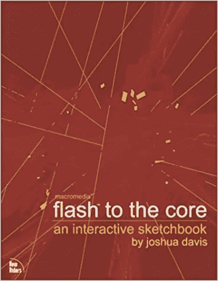

# ActionScript 如何预示 TypeScript

> 原文：<https://javascript.plainenglish.io/how-actionscript-foreshadowed-typescript-149cdb764de9?source=collection_archive---------9----------------------->

## Macromedia Flash 总是有很强的阶级意识



Joshua Davis’ 2002 Book

对我来说，当前围绕从 JavaScript 迁移到 TypeScript 的好处的争论唤起了一种强烈的似曾相识的感觉。我以前真的全听过。

我进入编程和 JavaScript 世界的道路与大多数人有些不同。世纪之交，我在一家大型数据分析公司担任售前顾问，希望找到一种更好的方式来展示我们的数据收集能力。我们为在线调查制作软件，当时，基于网络的表格非常无聊，完全没有风格。令人惊讶的是，考虑到这是 2000 年，软件工程师们已经有了实现 API 的远见。

从 Flash 诞生的第一天起，我就是一个 Flash 爱好者。尽管在网络发展的历史上，把 Flash 视为令人厌恶的东西已经成为一种时尚，但我仍然深情地看待它。虽然很容易把它写为可怕的横幅广告和毫无意义和令人沮丧的用户界面/UX；互联网上相当于 30 分钟的吉他独奏，应该记得当时 Flash ***是*** 的网页可视化。浏览器局限于排版页面的单调近似。Flash 使网页变得生动，并为艺术和数据可视化提供了第一个平台。我会花几个小时盯着约书亚·戴维斯(对我来说，是网页可视化的教父)和他的网站的分形空间图。

但是，您可能会想，这与 TypeScript 有什么关系呢？嗯，虽然 Flash 一开始是一个基于时间轴的动画工具，有一个几乎无限的画布，但它很快添加了一种脚本语言。在早期，脚本语言是非常基础的，但事实证明它非常受用户群的欢迎，他们开始破解它并将其推向极限。这促使 Macromedia(后来被 Adobe 收购)添加更多功能，然后随着 Flash Player 5 的发布，ActionScript 1.0 基于 ECMAScript 标准(如 JavaScript 和 TypeScript)。

ActionScript 允许我与调查软件的 Web API 进行交互。它允许我将一个调查 web 表单呈现为一个交互式游戏，其中可能的响应被表示为太空入侵者类型的外星人，拍摄他们将注册为一个单选按钮单击，可以被发送回服务器。再说一遍，尽管这听起来很有噱头(确实如此)，但你应该记得这发生在 2000 年末。这对大多数人来说是全新的。

```
**function** addNumbers(originalNumber:Number, anyNumber:Number):Number{
    **return** (originalNumber + anyNumber);
}
```

看看上面，不是打字稿。现在是 2004 年，是 ActionScript 2.0。ActionScript 2.0 引入了变量类型和更强大的 ECMA 标准实现。现在围绕 JavaScript vs. TypeScript 的争论与围绕 action script 1.0 vs . action script 2.0 的争论非常接近。花时间学习 ActionScript 1.0 的人认为强键入会降低他们的速度；他们不喜欢将他们的代码放在单独的*中。作为文件或必须导入它们。最终，这场辩论变得毫无意义。ActionScipt 2.0 演变成了 ActionScript 3.0(与 TypeScript 几乎没有区别)。良好的实践、可读性、协作和编译的好处最终会胜出。顺便说一句，我怀疑 JavaScript 最终会变成强类型。

感谢您的阅读，当您在未来想到 Flash 时，想想它对可视化网络发展的贡献，想想它的遗产，最重要的是，想想它的类别。