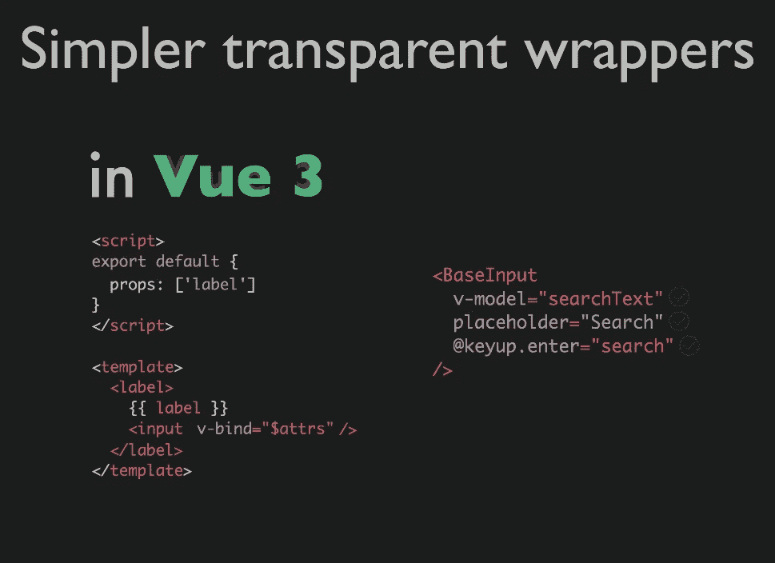

# 如何以及为什么在 Vue3 中使用包装组件

> 原文：<https://javascript.plainenglish.io/how-and-why-to-use-wrapper-components-in-vue3-fe35058dc405?source=collection_archive---------2----------------------->


Photo by [Tianyi Ma](https://unsplash.com/@tma?utm_source=medium&utm_medium=referral) on [Unsplash](https://unsplash.com?utm_source=medium&utm_medium=referral)

**包装组件对于让你的代码库更有条理、更专业非常有用**。

一般来说，包装组件是一个定制组件，它通过添加一些定制功能、样式或其他任何东西来修改本地元素或第三方库。

本教程结束时，您将…

*   理解使用包装组件的价值
*   知道何时使用它们
*   构建一个示例输入包装组件

说够了！我们开始吧。

# 我们为什么要使用包装组件呢？

正如我们所说的，包装组件对于组织代码和扩展本地/外部元素都很有用。

*好吧……但这对我们的组织有什么帮助呢？？*

对于我们的例子，假设我们正在为默认的[文本输入](https://learnvue.co/2020/01/9-vue-input-libraries-to-power-up-your-forms)构建一个包装器组件。使用包装器组件创建了一个自然的继承— `Parent Element` > `TextInputWrapper` > `Input`。

在`TextInputWrapper`中，我们可以添加自定义样式、过渡，并扩展 input 元素的默认用法。如果我们没有包装器，我们将不得不在每个使用更好的输入的组件中直接对输入元素进行编辑。

包装器组件给了我们一个可重用的组件，我们可以直接导入并使用它。现在，如果我们想改变功能，我们只需要编辑一个文件，而不是几十个。

因此，包装组件不仅帮助我们尽可能地保持代码干爽，而且还构建了一个更加模块化和可伸缩的项目。例如，如果我们想要多种类型的自定义文本输入。

# 好吧…让我们真的开始吧！

好了，现在我们实际上知道了什么是包装组件，以及它们是如何有用的，让我们实际上构建我们正在谈论的例子。

对于我们之前讨论的文本输入示例，让我们为原生文本输入制作一个包装器组件。

这是我们正在构建的组件。

```
<template>
  <div>
    {{ label }}
    <input/>
  </div>
</template>
<script>
export default {
  props: ['label']
}
</script>
<style scoped>

</style>
```

**在 Vue3 中制作一个包装器非常简单**。我们只需要理解一个 Vue 实例的属性:`$attrs`。

`$attrs`包含传递给组件的所有非属性和非发射事件。

在 Vue2 中，如果我们没有在组件中明确定义一个 prop，它会被添加到组件的子组件的根中。但是，如果我们将`inheritAttrs`实例属性设置为 false，我们可以覆盖该属性，并使用$attrs 属性通过包装组件传递数据。

然而，现在在 Vue3 中，组件子组件的默认绑定不再发生，所以没有什么可以覆盖的。另外，以前通过$listeners 属性访问的组件的非发出事件侦听器现在也包含在$attrs 中。

```
<template>
  <div>
    {{ label }}
    <input v-bind='$attrs'/>
  </div>
</template>
<script>
export default {
  props: ['label']
}
</script>
<style scoped>

</style>
```

有了基本的文本输入，我们可以向包装器组件添加一些定制。扩展它的一些方法是添加定制的事件监听器，不同的样式，或者标签属性来标记我们的输入。

太好了。我们的包装组件已经设置好了！现在，这里有一个例子，我们如何将它包含到一个组件中。

```
<text-input 
      label='hello'
      v-model='state.textVal'
      placeholder='Hello World'
/>
```

如果你真的想更深入地了解 v-model、$attrs 和 v-bind 在 Vue3 中是如何工作的，这里有一个由 Chris Fritz 制作的[幻灯片](https://github.com/chrisvfritz/vue-3-trends/blob/master/slides-2019-03-vueconfus.pdf)



# 还有什么可能？

我们刚刚讨论的例子是包装器组件的一个非常简单的用法，但是它展示了一个主要的用例:包装本地元素以添加更多的功能。

这也是将第三方库或插件整合到你的 Vue 项目中的一个非常好的技术。它允许您对某些元素的操作进行更可预测的控制。

总之，包装组件，尤其是在大型项目中，是开发更可重用、更有组织性和更可预测的代码库的好方法。

在这篇快速的文章之后，您应该知道为什么包装器组件是有用的，以及如何在 Vue3 中使用`v-model`、传递`$attrs`和传递`$listeners`来构造它们。希望你学到了一两件事，并且一如既往，如果你有任何问题，让我知道！！

编码快乐！

如果你有兴趣了解更多关于 Vue 3 的知识，请下载我的免费 Vue 3 备忘单，里面有一些基本知识，比如组合 API、Vue 3 模板语法和事件处理。

*原载于 2020 年 2 月 18 日 https://learnvue.co**的* [*。*](https://learnvue.co/2020/02/how-and-why-to-use-wrapper-components-in-vue3)