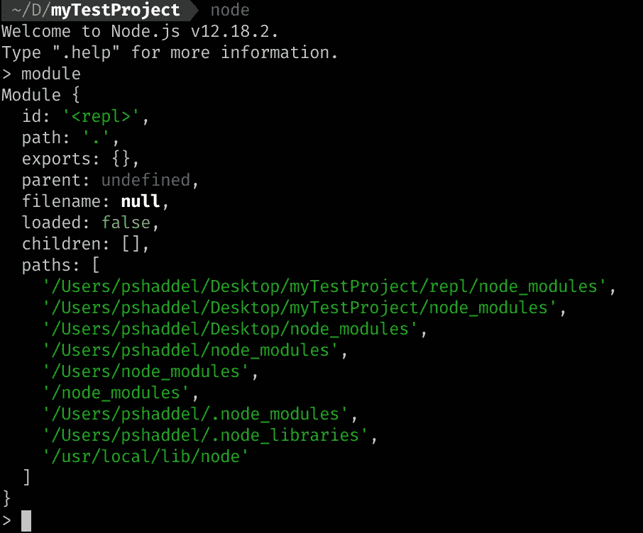
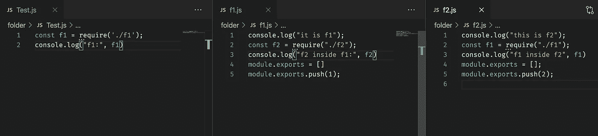
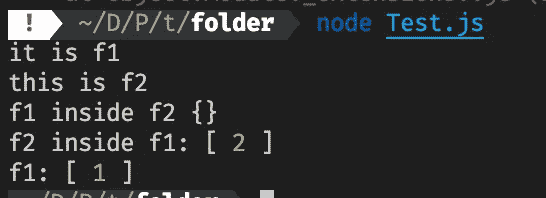

# Node.js 中的‘Require’和‘Module’是如何工作的？

> 原文：<https://javascript.plainenglish.io/how-do-nodejs-require-and-module-work-545ab4fe5423?source=collection_archive---------5----------------------->

我们使用`require("someModule")`在另一个文件中导入一个模块，但是是在幕后使`require`工作吗？

## 步骤的顺序

1.  ***解析*** :获取模块的绝对路径。
2.  ***加载*** :加载模块
3.  ***包装*** :给你的变量一个单独的范围。
4.  ***评估*** :是 VM(通常是 V8)最终对代码做的事情
5.  ***缓存*** :缓存模块，以备再次使用。

## 当我们需要一个模块时会发生什么？

为了弄清楚需求模块是如何工作的，我们可以使用或者在 REPL 模式下输入`module`。`module`在全局对象中可用。



paths inside the `module`

如果我使用这一行代码:`const test = require("tetsModule")` Node.js 将查看路径数组中的位置来找到这个模块。

*   第一步，它在当前文件夹的 node_modules 中查找，如果找不到该模块，它将逐步查找父文件夹。
*   之后，Node.js 会查看你的 home 文件夹中的`.node_modules`文件夹，如果你用的是 Linux 或者 Mac。
*   最后，查看 Node.js 所在的文件夹

这些是找到 ***非核心模块* s.** 核心模块是异常，Node.js 立即找到它们。

## 有没有可能只解析一个模块而不执行？

答案是肯定的，为此我们需要使用`require.resolve`。

`const m = require.resolve("myModuleName");`

**有什么用法？** 帮助你检查模块是否存在。

## 需要具有相对和绝对路径的模块

要使用相对路径，我们需要从`.`或`..`开始。
一个例子:`const test = require("./testFolder/myFile.js")`

要使用绝对路径我们需要从`/`
开始一个例子:`const test = require('/home/poorshad/Desktop/myfile.js')`

## 如果我们需要两个模块在彼此内部，会发生什么？

在 Node.js 中允许循环引用，我们可以引用如下代码所示的模块:



Circular reference

如果我们用 Node.js 运行`Test.js`,终端中的结果将是这样的:



我们在`Test.js`中导入了`f1.js`，所以它是第一个需要加载的模块，控制台中的第一个日志是`it is f1`。

在`f1.js`内部，我们导入了`f2.js`，因此，我们可以在控制台中看到`this is f2`。

当我们在`f2.js` f1 模块中记录`f1`时，模块还没有导出它的变量，我们在控制台上得到一个空对象。在这个控制台日志`f2`模块导出后，它的变量出现在它代码的第 4 行和第 5 行。现在，模块`f2`已完全加载。

Node.js 从`f1.js`的第 3 行继续，由于`f2.js`已加载，它在控制台中将`[2]`显示为该模块的值。

最后，我们可以在控制台的最后一行看到`Test.js`的控制台日志。

## 当我们需要一个没有扩展名的文件时`*requires`*如何处理文件扩展名？

例如，我们有这样一行代码:

```
const myFile = require("./myFile");
```

Node.js 将按以下顺序执行:

```
myFile.js
myFile.json
myFile.node
```