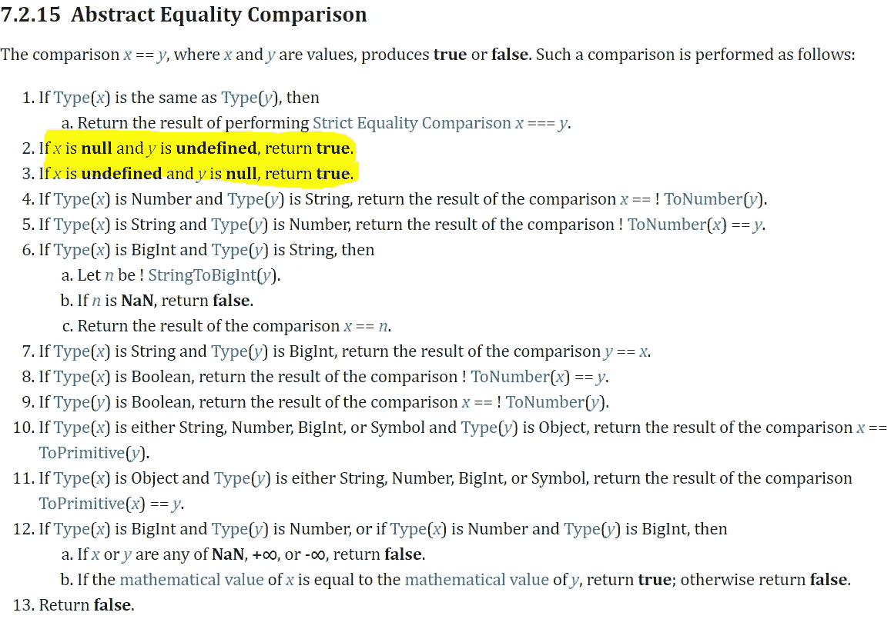
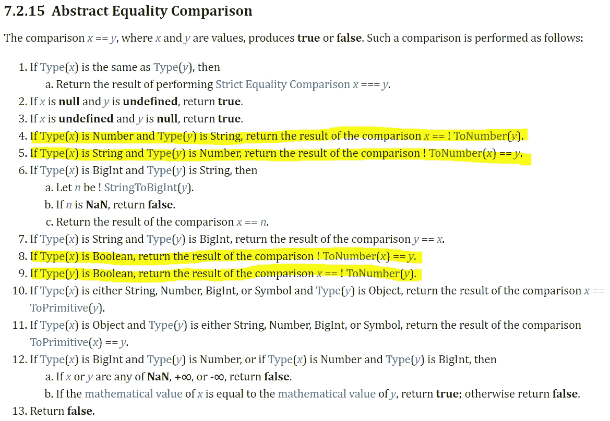

# 抽象相等比较是如何工作的？

> 原文：<https://javascript.plainenglish.io/how-does-abstract-equality-comparison-work-591eed983666?source=collection_archive---------4----------------------->

## JavaScript 没有不好的部分！

## 双倍等于比较不是一件神奇的事情——它是一种算法

Photo by [Alexandru Acea](https://unsplash.com/@alexacea?utm_source=unsplash&utm_medium=referral&utm_content=creditCopyText) on [Unsplash](https://unsplash.com/s/photos/coding?utm_source=unsplash&utm_medium=referral&utm_content=creditCopyText)

> 学习如何写代码的最好方法是写代码。
> 
> — *凯尔·辛普森*

在我作为 JavaScript 开发人员的职业生涯之初，**我认为避免学习该技术如何在幕后工作并不是一件坏事**。这似乎行得通，但最终，我的代码是错误的。

你必须明白的一件重要事情是强制。我听说过的关于强制的一切都是在博客和书籍中，很少提及[文档](https://www.ecma-international.org/ecma-262)。

今天，我知道唯一有效的来源是文档。最后，这是一个逻辑问题，因为**谁比创造语言的人更了解编程语言**？

# 严格的平等和抽象的平等有共同之处

我总是喜欢想象事物，所以我举一个简单的例子:

我有一个字符串`"Jonny"`连接到一个变量`name1`。我可以创建一个`name1`的副本，并将其附加到`name2`。所以当我检查严格等式和抽象等式时，两者都返回相同的结果- *true* 。

**事实证明，当类型匹配时，系统会调用 triple equals。** [严格](https://www.ecma-international.org/ecma-262/#sec-strict-equality-comparison)和[宽松](https://www.ecma-international.org/ecma-262/#sec-abstract-equality-comparison)等于当类型相同时两者相等。在这种情况下绝对没有区别！

# Null 和 undefined 有很多共同点

在给出参考之前，我不会给你任何信息。正如我之前所说，唯一合法的来源是 docs:

Abstract Equality Comparison (source: [ECMAScript Standard](https://www.ecma-international.org/ecma-262/#sec-abstract-equality-comparison))

如果我们决定将空值和未定义的值与松散相等的值进行比较，我们将得到 true，因为空值和未定义的值只强制相等:

如您所见，该特性非常有益，因为您不必担心两个空值。使用一个值要容易得多。在抽象等式中，JavaScript 并没有区分这两种类型——它只是遵循了一种算法。

当然，你可以选择威胁 *null* 和 *undefined* 为两种不同的类型(**严格相等**)。也许你想知道这个值是空的还是未定义的，但是我不确定你必须做出这样的区分。

我不喜欢这种方法。这可能是一个浪费时间的过程，尤其是当您使用第三方库时。我不喜欢浏览那种文档，寻找输出是未定义的还是空的。我用 loose equals 用 *null* (或者 *undefined* )检查空，就是这样。

无论该属性是否曾经被创建并被重置回空值，或者它从未被创建，这些都是相同的条件。我认为在上面的例子中使用三重等于没有任何好处，因为你不需要为两个空值的差而伤透脑筋。

你可能想用棉绒，但那不是一个选项。Linters 帮助我们决定我们的代码是否结构良好，这样我们就可以避免错误。这不是为了检查程序是否正确。

# 双等于算法

最广为人知的强制是从*字符串*到*数字*，反之亦然。布尔型强制是常见的，我们将讨论这三种类型及其关系。

有趣的是，当比较类型之一是数字时，算法总是调用 *ToNumber()* 。**我们可以得出结论，当我们把数与某物相比较时，它总会试图把那某物要挟给数。**

正如我们所看到的，四个不同的地方调用了 *ToNumber()* 。算法更喜欢把一切都还原成一个数字，然后进行比较。这可能很奇怪，但是**算法就是这样工作的**。知道这一点有助于你理解它，并预测双重相等比较的行为。

我一直认为比较`1`和`"1"`可以归结为字符串比较。这不是真的，所以不是比较两个字符串，而是比较两个数字。

结论:**双等号比较喜欢数字比较。**

你知道字符串和数字如何比较吗？一会儿我会给你看:

条件语句将返回*假*。这一次不会发生强制，引擎会直接返回 *false* 。有一种方法可以解决这个问题，但是使用三重等于:

使用[基本对象](https://developer.mozilla.org/en-US/docs/Web/JavaScript/Reference/Global_Objects)(又名原生函数) *Number()* 可以很好地处理这个问题。如果你想变得超级清晰，这是一个不错的功能。我不喜欢这种方法，因为需要写更多的东西。

有时候明确是有用的。例如，如果您试图阻止 JS 引擎处理数字:

最后，如果你想和数字打交道，并且**被比较的值中有一个是数字**，那么你可以自由地使用 double equals。在这种情况下，你不必显式，因为**抽象是自明的**。

结论:**如果其中一个比较值是数字，那么它检查第二个比较值是否也是数字。那只代表抽象的平等。**

那是我们处理数字的时候，但是字符串是怎么回事呢？当一个或两个值都是字符串时，它会强制转换为数字吗？**没有！** **看看文档就知道了。**如果它们都是相同的类型(在我们的例子中是字符串)，**它将调用三重等于**。

例如，可以有一个包含空格的字符串。在这种情况下，你可以使用`.trim()`,因为这是一种修剪所有空白的方法。请记住，这种方法不是一种强迫。

结论:**如果字符串是相同的，那么你将得到 true(它永远不会调用强制)，否则它们不会。**

## **客体也是强制的主体**

我没有忘记对象，因为它们也参与了强制。看一下文档。**规则№10 和№11 是我们寻求的规则。**如果我们在对象上应用 double equals 这不是一个基本类型，我们将调用抽象操作[*ToPrimitive()*](https://www.ecma-international.org/ecma-262/#sec-toprimitive)*。*

请记住，double equals 只比较基本类型，因此将对象转换为基本类型是必要的。如果我们应用严格等于，我们不会调用 *ToPrimitive()* ，因为**使用严格等于不允许强制**。

它唯一一次对非原语做一些事情是在它们是相同类型的时候(调用严格相等比较)。

注意:***是一个固有的递归函数，这意味着它将一直调用，直到返回一个原始类型。***

*我在网上找到了一个有趣的例子，我花了一些时间寻找一个解释，说明当你的功能设计得不好时**事情会变得多么严重**:*

*使用 double 等于 it 这种情况下**可以给我们意外的好结果**。这只是为了演示，所以我不支持你在你的项目中这样做。让我们来看一下算法:*

*首先，它尝试比较这两个值。由于`array`不是一个基本类型(它是 object 类型的一个子类型)，它将调用*top primitive()*抽象操作。*

*让我们看一下文档，这样我们就可以理解我们期望抽象操作的返回值是什么。*

*在我们熟悉这个操作之后，我们知道数组字符串化将会排除括号，并且这个操作的结果将会是 *"42 "。如果数组中有多个值，事情不会以这种方式结束。*所以，结果发生在一次事故中。*

*结论:**避免做没有任何意义的比较。你不应该用三重相等来解决这个问题。***

*看到人们如何抱怨双重平等总是很有趣的。在大多数情况下，这不是一个真正的问题。实际问题是做无意义的比较。如果你比较两个不同的东西，而它偶然有效，那是不明智的。*

*你不能说 JS 的设计不好。你能够在这种强制中使用 *ToPrimitive()* 有很多历史原因。我不确定这是否是一个理想的解决方案，因为它可能会产生不良问题。我相信，说到非原始比较，同一性比较就足够了。*

***我们之所以能够要挟对象，是有很强的历史原因的。**在过去，字符串被表示为对象，而不是原始类型。正因为如此，他们让我们使用 *ToPrimitive()，*这样我们就可以拆成一个等价的原语:*

# *澄清*

*最后，我想总结一下我们的讨论，并将其分为 4 条有用的规则:*

1.  *如果被比较的类型相同，它将使用三重等于。*
2.  *如果它们中的一个或两个都没有定义或为空，则意味着它们相等。*
3.  *如果强制涉及非基本类型，它们将首先成为基本类型。*

## ***简明英语 JavaScript***

*你知道我们有三份出版物和一个 YouTube 频道吗？在[**plain English . io**](https://plainenglish.io/)找到一切的链接！*