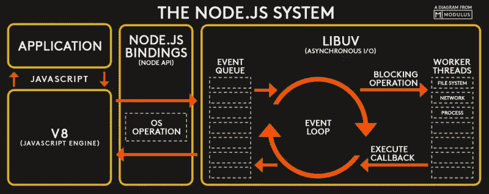
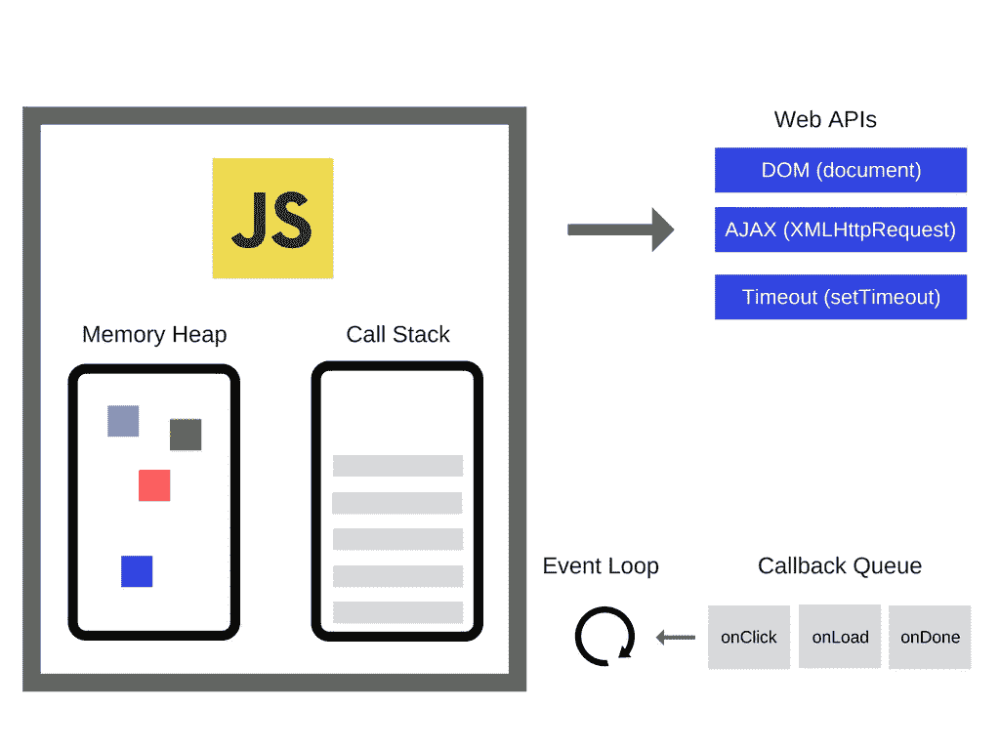

# 事件循环在 Node.js 中是如何工作的？

> 原文：<https://javascript.plainenglish.io/how-does-event-loop-work-in-node-js-d96729ae4a95?source=collection_archive---------8----------------------->

## 事件循环是什么，它是如何工作的，以及它为什么重要

## 什么是输入/输出操作？

**I/O** 代表输入/输出。I/O 用于标记 CPU 计算机中的进程与该 CPU 外部的任何东西(内存、磁盘、网络，甚至另一个进程)之间的通信，该进程通过信号与这些外部的东西进行通信。它们被流程接收时是输入，被流程发送时是输出。
节点内。Js 的操作术语 I/O 指的是最耗时的网络和磁盘操作。Node 的*事件循环*是围绕这样一个事实设计的，即计算机编程中最大的浪费来自于等待这样的 I/O 操作。

## 处理缓慢的输入/输出操作

*   ***同步*** :通过逐个执行操作来处理慢速 I/O 的最简单方法。这是我们处理 I/O 的有价值的方式，因为当我们执行一个 I/O 操作时，我们不能处理任何其他操作。
*   ***Fork()*** *:从操作系统中分叉另一个进程来处理每个请求。但问题是，这样我们就不能同时处理大量的请求。*
*   ***线程*** :我们可以为每个请求启动一个新的线程，但是线程编程不是在公园里散步！Apache 是多线程的，它为每个请求创建一个线程。
*   ***事件循环*** :通过使用事件循环，我们可以处理大量的请求，而不会阻塞主执行运行时。

## 事件循环

第一个定义:处理外部事件并将它们转换成回调调用的实体。

第二个定义:从事件队列中挑选事件并将它们的回调推送到调用堆栈的循环。

为了理解事件循环，我们需要了解几个概念:

**调用堆栈** 一种先进先出的简单数据结构。每次我们调用一个函数，它都会被推至堆栈，每次我们从一个函数返回时，它都会从堆栈中弹出。

**节点事件队列** 有时又称为消息队列或回调队列。事件循环将回调从事件队列推送到调用堆栈。

## 事件循环中最重要的工作

当堆栈为空但事件队列不为空时，它将使一个事件从事件队列中出列，并将其回调推送到堆栈。这就是为什么我们称之为事件循环！事件循环一直做这个简单的事情，直到事件队列变空。

Nodejs schema

正如我们在这张图片中看到的，当调用堆栈为空时，nodejs 事件循环的工作是推送事件的回调函数。

Simple diagram of the event loop

在这张图片中，左边的框是 V8 引擎，它有调用堆栈和堆。它使用堆来存储对象。当我们调用一个异步函数时，它会将数据推送到回调队列(如果是时候的话！)并且如果调用栈为空，事件循环将调用推回到 V8 的调用栈。

我们对节点的了解。Js 和它的事件循环的区别在于它是一个无限循环，它的任务是当调用栈为空时将回调从事件队列推送到调用栈。