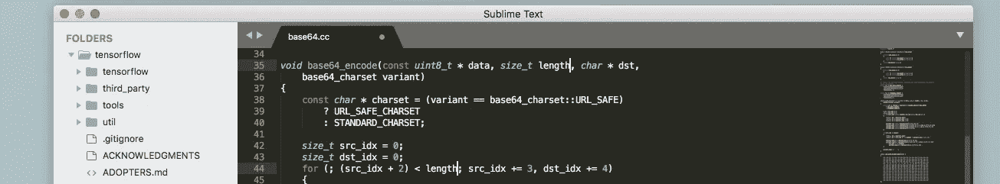
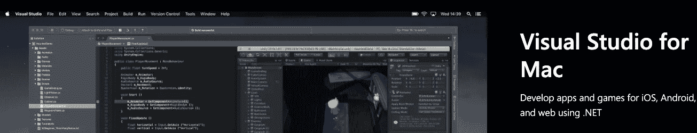

# F#如何让我欣赏 JavaScript

> 原文：<https://javascript.plainenglish.io/how-f-made-me-appreciate-javascript-227260796b70?source=collection_archive---------2----------------------->

## 编辑器支持是如何产生影响的，以及我为什么放弃了 Elixir


Photo by [cottonbro](https://www.pexels.com/@cottonbro?utm_content=attributionCopyText&utm_medium=referral&utm_source=pexels) from [Pexels](https://www.pexels.com/photo/man-in-yellow-protective-suit-3951373/?utm_content=attributionCopyText&utm_medium=referral&utm_source=pexels)

在我职业生涯的早期，我接触过微软的语言，比如 Visual Basic 和 T2 的 C#。我被惯坏了，还不知道。

我太习惯 IDE 支持了，以至于用 PHP 或 JavaScript 之类的 web 语言编写代码是一件非常痛苦的事情，这些语言在当时有着糟糕的 IDE 支持，它们是在一张纸上编写的，甚至在记事本上教授 JavaScript 也很常见。



## 崇高的文本

过了一段时间，情况有所改善，轻型编辑器开始流行。

崇高的文本是国王，每个人都在使用它，因为它的启动速度快，简单，我最喜欢的是:多光标👌。多光标是一见钟情，我无法表达我有多喜欢这个功能，我觉得如此富有成效，它如此适应我的思维和打字方式，我无法想象自己没有它。

但是过了一段时间，Sublime 开始不适合我，我需要更多的功能，但是不知道有没有更好的免费编辑器，我知道的唯一一个可以提供像样支持的是 DreamWeaver👀。

我暂停了 web 开发，去了视频游戏，在那里我用 C#编写了 Unity3d，Unity 还是相当新的，他们与 C#的集成非常初级，然而，C#是爱，如此复杂，还有那该死的 IntelliSense，那些完美的重构器，嗯，一个好的 IDE 支持的感觉，就像每天吃巧克力蛋糕一样。

## 好的 IDE 支持是什么感觉？

对我来说，微软生态系统中编码的亮点是语言感觉像是具体的，几乎是物理的。IDE 对它们的理解感觉不像是手写，我可以在那里输入错误，它感觉它应该如何，一种正式的语言，输入感觉像是定义良好的部分(方法、函数、类)的高度复杂的配置。

用一种有良好 IDE 支持的语言编写感觉就像用额外的双手编程，IDE 为你做了这么多，你只需要在一个非常高的水平上配置/键入，不需要记住字符串或数组的所有方法，只需要几个笔画，自动完成功能每次都会弹出正确的答案。

此外，IntelliSense 是我滥用的杰作，直到我开始全职从事 web 开发。


## VSCode 如何改变一切

我回到 web 开发的时候到了，但是这一次， [VSCode](https://code.visualstudio.com/) 存在了，很受欢迎，很稳定，而且功能丰富，是这些功能中的一个吗？多光标，漂亮，快速，强大，爱，我感受到了爱。

在当时，VSCode 在所有意义上都超越了 Sublime 一步，现在它已经进入了它的联盟，对 JavaScript 的理解，以及与“隐式”类型脚本的结合在当时是不可想象的。

今天，我在前端和后端使用 JavaScript 的体验再好不过了，在 VSCode 和 TypeScript 的帮助下，我完全控制了代码中发生的事情，感觉像在一张纸上写东西的时代已经过去了，现在我一天之内自信地重构了数千行代码，没有第二个想法，所有测试都通过了。

我已经使用 VSCode 好几年了，在没有注意到的情况下，我…又一次被宠坏了。

# 更进一步

我对编程和软件了解得越多，一般来说，我越来越倾向于函数式编程，起初我试图在前端采用它，例如 [Elm](https://elm-lang.org/) ，但整个想法对前端来说还不成熟，由于 JavaScript 的唯一优势，需要大量的翻译，也许我在后端运气更好。

无论如何，我对我的 nodejs 工作流有点不满意，所以我决定冒险放弃 Nodejs。

我考虑是否应该试试[二郎](https://www.erlang.org/)、[仙丹](https://elixir-lang.org/)或[哈斯克尔](https://www.haskell.org/)。过了一段时间，我决定避开 Haskell，因为几乎所有人都认为独自尝试是一条陡峭的曲线，而 Erlang 似乎已经过时了，随着 Elixir 的到来，新的优秀库已经出现，所以我决定尝试一下 Elixir。


## 尝试仙丹

许多事情让我认为 Elixir(整个 BEAM 生态系统)是正确的一步，作为一名架构师，它在世界上是有意义的，这个生态系统是为 web 开发和软件而生的。

从体系结构的角度来看，能够使用具有分布式系统这种内在人机工程学的语言是非常有吸引力的。此外，该语言完全被设计成功能性的，有两个特性引起了我的兴趣:

*   管道操作员
*   演员

没什么可等的了，我决定试试长生不老药，看看它是否像看起来那么酷。

## 宏指令

多亏了宏，Elixir 中的所有东西都像魔术一样工作，如果你将一个具有特定名称模式的文件放在特定的文件夹中，它就会工作，非常像 Ruby。我不喜欢魔术，但这没关系，因为框架是有文档的，而且也有“标准”，对吗？

在使用 Elixir 几个月之后，最吸引我注意力的两个语言特性却是让我放弃了 Elixir，这真是太…讽刺了。

是的，我抛弃了仙丹，不是因为动力不足，而是缺乏编辑支持。

让我解释一下，Elixir 是一种解释型语言，非常像 JavaScript(但更像 Ruby，tho)，然而，由于有了宏，自动完成几乎是不可能的，也许自动完成 String 的方法是一项简单的任务，但这就是编辑器提供的。

## 部分应用

部分应用是这样工作的:如果一个函数需要 3 个参数，而你传递了 2 个，它会返回一个只需要 1 个参数的新函数，最后一个。

我停止在 JavaScript 中使用部分应用程序，因为它让 linter 疯狂，在应用 curry 后立即执行函数类型非常复杂，尤其是如果你不止一次地这样做。

我认为在 Elixir 中可能会有所不同，因为管道操作符是语言中的核心概念。

这就引出了我的下一个观点。

## 管道操作符/功能组成

仙丹中的功能成分看起来是这样的:

```
"hello, world!"
|> String.split(" ")
|> Enum.map(&String.capitalize/1)
|> Enum.join
```

什么是`&String.capitalize/1`？这是使用函数字符串的一种方式。大写 arity 1，arity(参数的数量)是在 Erlang/Elixir 中进行重载的方式，所以这是区分函数的一种方式，这样可以避免错误的函数重载。

现在看这个:`Enum.reduce([1,2,3]), &(&1 + &2))`。那些`&`都是什么？

这是引用参数的灵丹妙药，所以有一种说法是使用匿名函数，它接受第一个参数并对第二个参数求和。

管道操作符不像其他函数式语言那样工作，因为函数参数的顺序是错误的，这使得部分应用程序看起来很奇怪；事实上，它们根本写不出来！看到管道是如何包含在语法中的，会让你以为默认应用了 curry，其实不是！什么长生不老药有它不同的烟斗风味，并且不使用咖喱来完成部分应用，你只能在烟斗表达式内做长生不老药的部分应用风味，在其他地方没有。

这就是为什么我更喜欢使用[拉姆达](https://ramdajs.com/)而不是[洛达什](https://lodash.com/)(回到[FP-洛达什](https://github.com/lodash/lodash/wiki/FP-Guide)不存在的时候)，洛达什的写作方式让写作变得复杂。

## 有什么意义？

我的观点是什么？它不仅看起来很奇怪，每种语言都有它自己的东西，很难对这种结构提供很好的支持，感觉太脚本化了，就像 10 年前的 JavaScript 一样，不可能被编辑理解。

我发现自己在一张神奇的纸上写作，在 2019 年。对不起，我不会再忍受代码中出现无数愚蠢错别字的折磨了，这就是我当初放弃 Node 的原因。

谢谢，下一位。


# 如果微软有解决方案会怎样？

回到决定试用一种函数式语言，我发现微软又一次有了一个解决方案。

我研究了一下 [F#](https://fsharp.org/) ，然后决定也全面尝试一下，长话短说: ***它是 gooooood，yooooo***。

天啊，这么多年来，我从未像尝试一种新的编程语言那样开心过，F#是爱，如此简洁，如此优雅，而且是最好的？它是打字的，那些打字的人会上当，那些该死的打字的人😍。

其他好消息？函数参数的顺序是正确的，允许编译器在默认情况下使所有的函数 curry，并使局部应用无处不在，因此管道操作符应该工作。

这是一种由微软支持的类型化、编译的函数式语言，没有比这更好的地方来投资了，于是我立即投入了这一行列。

## 编辑器支持

在尝试编写更复杂的示例甚至一个成熟的应用程序时，我意识到 VSCode 并没有削减它，对 F#的编辑器支持是…有限的，我正在使用 [Ionide 项目](https://ionide.io/)(vs code 中 F#的最佳插件)。

VSCode 缺乏良好的支持是可以理解的，它被设计成最好的 web 开发编辑器。F#有什么好的编辑器？当然是 Visual Studio。

嗯，碰巧 Visual Studio 不支持 macOS🙃不过有个叫 Visual Studio for Mac 的东西，我们试试那个。



## Mac 版 Visual Studio

恰好 Visual Studio for Mac 是 Visual Studio (for windows？)，因此不具备 Visual Studio 的所有功能或威力。

一个非常重要的缺失特性是多光标…我打赌你能听到我在这一点上的心碎，他们怎么能优先考虑多光标之上的东西呢？


## 文件格式

他们的文件格式比 VSCode 更稳定，也更容易预测，但是，格式化一个文件需要几秒钟，拜托。

在 VSCode 中，文件格式化经常对 F#不起作用，它只是在一些文件中停止工作，但是如果你重新加载，它可能…工作，有时，在这一点上我的文件没有被格式化，尽管。

到目前为止，格式化也做得不好。

## 智能感知

Visual Studio for Mac 中的 IntelliSense 支持更好，但是在 VSCode 中并没有那么差，它在大多数时候都工作得很好，但是对 core 或 libs 的引用不能像在 Visual Studio 中那样打开。

## Visual Studio for Mac 的整体感觉

一般来说，Visual Studio for Mac 提供的编辑器功能比 VSCode 少(比如没有多光标和许多其他编辑功能)，但它提供的功能是一致的，不需要刷新编辑器。

然而感觉很慢，感觉像是在编辑器支持上后退了一步。

# 欣赏 JavaScript 的艺术编辑器支持

今天，我对我在 VSCode 中的 JavaScript/TypeScript 工作流没有任何抱怨，一切都比我预想的要好。

*   文件格式化速度极快。
*   重构立竿见影。
*   参考资料 100%的时间都在工作，分秒必争。
*   ESlinter 是一种祝福，今天是如此先进，这是我唯一羡慕的功能，而我以前使用 C#时没有这个功能，仅此一项就使得大多数时候使用 TypeScript 比使用 C#更好，也可以在编辑器中工作，同时输入提供即时反馈。
*   测试框架是成熟的，并且被编辑们所理解。
*   调试已经相当成熟和完整了。
*   框架是成熟的，随着先进的概念和结构的出现而蓬勃发展，这使得开始一个项目变得容易，并且还有对最流行的文件格式如 jsx、tsx 的编辑器支持。
*   ECMAScript 每隔几个月就会推出新的特性来扼杀它，编辑器会立即利用这些特性，比如 [nullish 合并运算符](https://developer.mozilla.org/en-US/docs/Web/JavaScript/Reference/Operators/Nullish_coalescing_operator)。
*   [管道工在角落](https://github.com/tc39/proposal-pipeline-operator)。
*   等等。

所以今天，我将编辑器支持与曾经很难使用的语言 JavaScript 进行比较，很有趣吧？恭喜 JavaScript，你救赎了自己，或者说社区和生态系统已经救赎了。

# 不良编辑支持感觉如何喜欢

此时，我正在用 VSCode 全职编写 F#程序，没有格式化，有些自动完成，有些智能感知，几乎没有重构功能，尽管如此，我仍然喜欢 F#，这就是它的好处。

糟糕的编辑器支持让人感觉没有生产力，这可能是因为:

*   您必须手动记住需要替换符号名称的位置。
*   或者当您按 enter 键时，运行并等待控制台在编辑器中没有警告时向您抛出错误。
*   当你不得不手动链接文件，因为编辑没有足够的了解生态系统。
*   因为没有格式化功能，你的文件都不一样，你必须“维护”你的格式，这对我来说是一个生产力杀手。
*   当样式无法强制或配置时(此时，除了 JavaScript 之外，我还不知道有什么工具能像 ESLing 一样好)

微软宠坏了我，首先是 C#编辑器支持，然后是 VSCode 编辑器，它为我改进了这么多 JavaScript，也许对使用 [Vim](https://www.vim.org/) 的人来说这听起来像是胡说八道，但对我来说，拥有一个好的编辑器集成可以带来的额外帮助是我每天的安慰。

## 公众向我推荐什么

我一直在 Twitter 和阅读论坛上询问，以获得更好的 F#编辑器支持体验，一般来说，人们推荐我尝试 [JetBrains Rider](https://www.jetbrains.com/rider/) ，甚至微软官方也这么做。


## JetBrains 骑手

过去几天我一直在测试 Rider，到目前为止对 F#的支持已经完成，我遇到的唯一问题是重新学习使用它的所有快捷方式，我会在另一篇文章中告诉你我对 Rider 的体验。

## 放弃

我希望微软付钱给我，让我对他们的产品给予如此多的赞扬，但事实并非如此，我真的觉得用他们的工具工作很开心，他们做了一些正确的事情，给 [oss](https://en.wikipedia.org/wiki/Open-source_software) 带来了很好的开发者体验，谢谢你们所有人，在那里工作，做了很好的事情。

# 我写了更多

我有[一份你可能会喜欢的时事通讯](http://eepurl.com/hg7AeP)，并且写了其他可能对你有帮助的文章，比如[为什么要基于模型的测试](https://medium.com/better-programming/why-model-based-testing-fbb14b3621ae?source=---------2------------------)？、[为我改变 JavaScript 的 6 个工具](https://medium.com/javascript-in-plain-english/the-6tools-that-changed-javascript-for-me-3ee1faf40585)、[永远不要用箭头函数的两种情况](https://medium.com/javascript-in-plain-english/you-should-never-use-an-arrow-function-in-any-of-these-two-situations-8bc2fbbc39b8)和[管理如何限制你作为开发者的潜力](https://medium.com/better-programming/how-management-is-limiting-your-potential-as-a-developer-abb46f18e097)，希望我的故事能给你带来一些价值。

谢谢你这么牛逼！